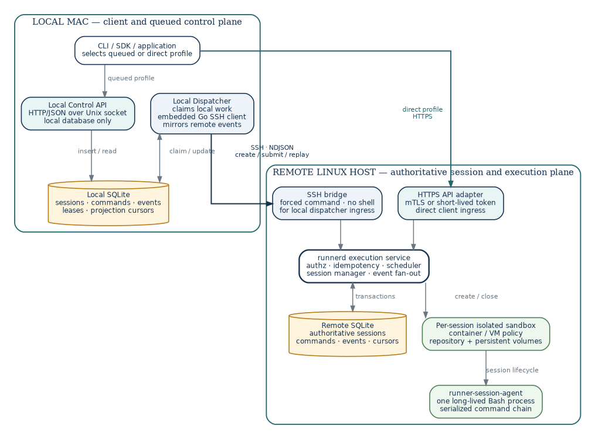
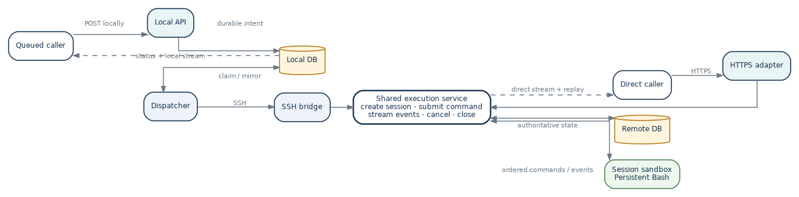
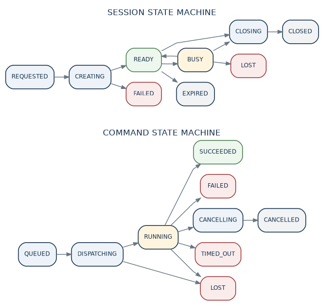
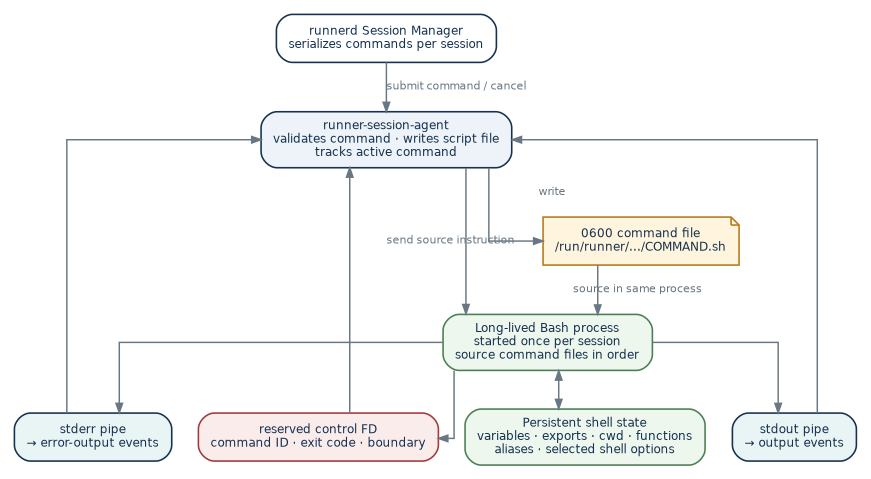

# Runner

## Dual-Ingress Stateful Remote Execution System

**TECHNICAL DESIGN · IMPLEMENTATION BASELINE**

Detailed design for a macOS-local queue, direct remote HTTPS API, persistent remote session service, embedded Go SSH client, and isolated Linux sandboxes.

**Core invariant**  
Queued and direct requests converge on one authoritative remote execution service. The local API never communicates remotely; the local dispatcher is the only local component that does. A session owns one isolated sandbox and one ordered shell state.

| **Attribute** | **Value** |
| --- | --- |
| **Document version** | 2.0 |
| **Design date** | 22 September 2026 |
| **Supersedes** | Version 1.0 local-queue job design |
| **Implementation scope** | Queued and direct execution, durable sessions, stateful command chains, replayable output |
| **Local platform** | macOS |
| **Remote platform** | Linux with OpenSSH, HTTPS, SQLite, and a container runtime |
| **Primary language** | Go |

**BASELINE TECHNOLOGY CHOICES**

| **Area** | **Choice** |
| --- | --- |
| **Local queued API** | HTTP/JSON over a Unix-domain socket |
| **Local persistence** | SQLite in WAL mode |
| **Direct remote API** | HTTPS with mTLS or a short-lived bearer token |
| **Remote persistence** | SQLite in WAL mode |
| **SSH transport** | golang.org/x/crypto/ssh to a restricted bridge command |
| **Event streaming** | NDJSON with durable sequence numbers and replay |
| **Session isolation** | One container or equivalent sandbox per active session |
| **Stateful shell** | One long-lived Bash process per shell session |
| **Service management** | launchd on macOS; systemd on Linux |

## Design Snapshot

This document defines the implementation baseline for version 2. Normative statements use **MUST**, **SHOULD**, and **MAY** in their usual engineering sense. The design keeps the local queue workflow while adding a direct remote API and first-class stateful sessions.

### System intent

Runner makes a remote isolated environment usable as though it were a local sandbox. A caller may either submit commands locally for asynchronous dispatch or call the remote API directly for low-latency execution. Both paths create durable command resources, expose the same event model, and execute through the same session manager.

### Architecture decisions

| **Decision** | **Baseline** | **Why** |
| --- | --- | --- |
| **Dual ingress** | Local queued API and direct remote HTTPS API | Supports offline/local automation and immediate programmatic use without duplicating execution logic. |
| **Session-first domain** | Environment → session → command → event | Makes ordered, stateful command chains explicit. |
| **Shared remote core** | Both HTTPS and SSH bridge call one ExecutionService | Prevents divergence between queued and direct behavior. |
| **Authoritative remote state** | runnerd persists sessions, commands, and events | Allows replay and command continuation after a client or dispatcher disconnects. |
| **Local projection** | Local SQLite stores desired work and mirrored results | Preserves the original local-only API contract. |
| **Persistent shell** | One Bash process per stateful session | Variables, exports, cwd, functions, and activation state survive between commands. |
| **Serialized session commands** | At most one running command per session | Avoids races over shell and filesystem state. |
| **SSH bridge** | Forced-command bridge to runnerd, not a one-shot worker | Keeps the embedded SSH client and restricted key while enabling durable remote sessions. |
| **Direct API security** | HTTPS plus mTLS by default on a private network | The API is a privileged code-execution interface. |
| **Conservative interruption** | Timeout or cancellation may close the session | Avoids reusing a shell whose process tree or state may be inconsistent. |
| **Controller ownership** | A session is controlled by one ingress identity | Prevents direct commands from changing state unknown to the local projection. |
| **Git synchronization** | Exact remote commit; no bidirectional file sync | Keeps source provenance deterministic and scope small. |

### Version 2 boundaries

- Supported: local queued submission, direct HTTPS submission, persistent sessions, ordered stateful shell commands, live output, replay, detached execution, cancellation, timeouts, exact Git revisions, and persistent environment storage.

- Supported state: shell variables, exported variables, current directory, functions, aliases, virtual-environment activation, umask, and selected shell options while the session shell remains alive.

- Not supported initially: PTYs, full-screen editors, terminal resize, arbitrary background daemons, mixed queued/direct control of one session, port forwarding, or bidirectional filesystem synchronization.

- Cancellation or timeout of a stateful command is allowed to terminate the whole session. A later version may preserve the session using PTY and foreground-process-group control.

- A remote service restart cannot reconstruct in-memory Bash state. Surviving session records become lost; filesystem and environment volumes follow their separate persistence policies.

- Scale target: one Mac user, one remote host, tens of active sessions, one command at a time per session, and bounded global concurrency.

**Compatibility principle**  
The existing POST /v1/jobs behavior remains as a convenience operation: create an ephemeral session, run one command, persist events, and close the session.

## Contents

| **Section** | **Title** |
| --- | --- |
| **1** | Purpose, scope, and requirements |
| **2** | Architecture |
| **3** | Domain model and state machines |
| **4** | Component design |
| **5** | Local queued control plane |
| **6** | Direct remote API |
| **7** | Persistence and consistency |
| **8** | Local dispatcher and synchronization |
| **9** | Remote runner service |
| **10** | Session runtime and persistent shell |
| **11** | SSH bridge and protocol |
| **12** | Security design |
| **13** | Reliability and failure handling |
| **14** | Observability and operations |
| **15** | Testing strategy |
| **16** | Implementation and migration plan |
| **17** | Future extensions and decision gates |
| **A** | Configuration reference |
| **B** | Local database DDL |
| **C** | Remote database DDL |
| **D** | API and protocol examples |
| **E** | Go interfaces and repository layout |
| **F** | Deployment snippets |
| **G** | Implementation checklist and decision records |

All numbered headings use Word heading styles and are available through the document navigation pane.

## 1. Purpose, Scope, and Requirements

### 1.1. Purpose

Runner executes commands inside isolated remote Linux environments while presenting a local-sandbox experience. Version 2 preserves the durable Mac-local queue and adds a direct remote API. It also introduces long-lived sessions so a sequence of commands can share shell state and workspace state.

The implementation should be small enough for a single developer to operate, but its boundaries must support later evolution to PTYs, multiple worker hosts, stronger isolation, and larger scale without replacing the public resource model.

### 1.2. Functional requirements

| **ID** | **Capability** | **Requirement** |
| --- | --- | --- |
| **FR-001** | Local submission | A client can create sessions and commands by calling the Mac-local API over a Unix-domain socket. |
| **FR-002** | Direct submission | A client can create sessions and commands by calling the remote HTTPS API. |
| **FR-003** | Shared semantics | Queued and direct modes expose equivalent session, command, event, cancel, and close semantics. |
| **FR-004** | Stateful chain | Commands in one shell session execute in order and share supported Bash state. |
| **FR-005** | Detached execution | A caller may disconnect after acceptance and inspect or reattach later. |
| **FR-006** | Live streaming | A caller may replay persisted events and follow new stdout, stderr, status, and completion events. |
| **FR-007** | Idempotent submit | Repeating a create or submit request with the same idempotency key does not create duplicate work. |
| **FR-008** | Cancellation | A caller may request command cancellation and session closure through the same ingress that owns the session. |
| **FR-009** | Exact source | A session may be prepared at an exact Git commit available to the remote host. |
| **FR-010** | Persistent tools | Named environments may retain installed tools and declared volumes across sessions. |
| **FR-011** | Ephemeral job | A one-command job API remains available as an ephemeral-session convenience. |
| **FR-012** | Local projection | The local database contains locally readable status and mirrored events for queued sessions. |
| **FR-013** | Remote authority | The remote service persists authoritative direct-session and execution state. |
| **FR-014** | Reconnect | A dispatcher or direct client can resume event consumption after a known sequence. |
| **FR-015** | Session ownership | Only the controlling principal or dispatcher may mutate a session. |
| **FR-016** | Programmatic clients | The APIs are documented, versioned, and usable without the CLI. |
| **FR-017** | Ordered audit trail | Every state change and output event is ordered and durable within its command. |
| **FR-018** | Resource limits | The runtime enforces configured CPU, memory, process, disk, output, timeout, and lifetime limits. |

### 1.3. Non-functional requirements

| **ID** | **Quality** | **Requirement** |
| --- | --- | --- |
| **NFR-001** | Security | Strict host verification for SSH; TLS server verification and client authentication for the direct API; no insecure fallback. |
| **NFR-002** | Isolation | Commands execute inside a sandbox with no container-runtime socket, no privileged mode, and explicit mounts. |
| **NFR-003** | Durability | Accepted commands and events survive client disconnects and process restarts according to the failure rules in this document. |
| **NFR-004** | Consistency | State transitions and their corresponding durable events are committed atomically. |
| **NFR-005** | Recoverability | Clients and dispatcher resume from sequence cursors; ambiguous execution is never silently duplicated. |
| **NFR-006** | Latency | Under normal local load, persisted output becomes visible within 500 ms; direct streams should normally be lower latency. |
| **NFR-007** | Maintainability | Transport, API, store, scheduler, and runtime implementations are behind interfaces with package-level dependency rules. |
| **NFR-008** | Operability | Both machines expose health, structured logs, bounded retention, and a doctor command. |
| **NFR-009** | Compatibility | One source tree builds macOS clients and Linux services. |
| **NFR-010** | Backpressure | Slow consumers do not block command execution; durable storage and bounded buffers mediate streams. |
| **NFR-011** | Auditability | The system records principal, ingress, environment, session, command, timestamps, outcome, and security-relevant events. |

### 1.4. Assumptions

- One trusted macOS user owns the local Unix socket, local database, local configuration, and dispatcher SSH credential.

- The remote Linux host runs OpenSSH sshd, runnerd, a reverse proxy or native TLS listener, SQLite, and a supported sandbox runtime.

- The direct API is reachable only through a trusted private network or VPN unless a separate threat assessment approves public exposure.

- Repositories are fetched remotely using remote-side read-only credentials. Local uncommitted files are intentionally absent.

- Session commands are trusted within their own sandbox. They may intentionally destroy their own shell state but must not escape the isolation boundary.

- Strong hostile-code isolation requires a VM or microVM adapter and is a deployment choice outside the container baseline.

### 1.5. Initial operating envelope

| **Dimension** | **Default baseline** |
| --- | --- |
| **Active sessions** | Up to 20 remote sessions; configurable |
| **Concurrent running commands** | Global maximum 4; one per session |
| **Session idle timeout** | 30 minutes |
| **Session maximum lifetime** | 4 hours |
| **Command timeout** | 30 minutes unless overridden; hard upper bound configurable |
| **Output cap** | 100 MiB per command, combined stdout and stderr |
| **Output chunk** | Up to 16 KiB or 50 ms, whichever occurs first |
| **Event replay** | Sequence-based from local or remote durable store |
| **Local polling** | 100–250 ms for event following; adaptive backoff when idle |
| **Retention** | Command metadata 90 days; output 30 days; configurable |

## 2. Architecture

### 2.1. System context

The system has two control paths and one execution plane. Queued mode treats the Mac-local database as the handoff boundary. Direct mode bypasses that local control plane and calls the remote HTTPS adapter. Both adapters invoke the same remote ExecutionService, which persists authoritative session and command state before scheduling work.



*Dual-ingress architecture and ownership boundaries*

**Architectural rule**  
The Local Control API package MUST NOT import the SSH transport or any remote HTTP client. The local dispatcher is the sole local component allowed to contact the remote host.

### 2.2. Shared remote execution core

The HTTPS adapter and SSH bridge are thin ingress adapters. Authentication and request framing differ, but authorization, idempotency, persistence, scheduling, session ownership, sandbox lifecycle, command execution, event ordering, and cancellation are implemented once in runnerd.

| **Layer** | **Responsibility** | **Must not contain** |
| --- | --- | --- |
| **Ingress adapters** | Authenticate, decode, validate transport limits, construct Principal, call ExecutionService | Sandbox or database business logic |
| **ExecutionService** | Resource authorization, idempotency, state transitions, scheduling, event subscription | HTTP or SSH-specific details |
| **Session manager** | Create, observe, serialize, expire, and close sessions | Client transport details |
| **Runtime adapter** | Create sandbox, launch agent, enforce resources, destroy sandbox | API authorization decisions |
| **Session agent** | Own Bash process, execute ordered command scripts, capture streams and boundaries | Global scheduling or user authentication |

### 2.3. Trust boundaries

| **Boundary** | **Crossing** | **Primary controls** |
| --- | --- | --- |
| **Local user** | CLI/SDK to Unix socket | Filesystem owner, 0700 directory, 0600 socket, request validation |
| **SSH network** | Dispatcher to sshd | Encryption, public-key auth, known-host verification, restricted key |
| **Direct API network** | Client to HTTPS adapter | TLS, mTLS/token, private network, request limits |
| **Remote adapter** | SSH/HTTPS to ExecutionService | Mapped principal, authorization, idempotency, audit |
| **Runtime** | runnerd to session sandbox | Unprivileged container/VM, namespaces, limits, controlled mounts |
| **Repository** | Remote fetch to workspace | Read-only credential outside command environment, exact commit verification |
| **Persistence** | Services to SQLite | Owner-only path, transactions, WAL, schema checks, bounded retention |

### 2.4. Queued-mode flow

- A local client creates a session or job through the Unix-socket API. The API commits desired state and a queued event to local SQLite.

- The dispatcher claims the request under a lease and connects to the restricted SSH bridge with golang.org/x/crypto/ssh.

- The bridge authenticates the dispatcher identity and calls runnerd to create or resume the corresponding remote session.

- For each local command, the dispatcher submits the same command ID as the remote idempotency identity.

- runnerd commits the command before scheduling it. The session manager executes commands in ordinal order.

- The dispatcher replays remote events after its stored cursor and mirrors each event into local SQLite.

- Local clients read only the local projection. If the Mac disconnects, accepted remote commands may continue and are reconciled later.

### 2.5. Direct-mode flow

- A direct client creates a session over HTTPS using an authenticated principal.

- runnerd authorizes the requested environment, commits the session, and prepares its sandbox and shell.

- The client submits a command. runnerd commits and sequences it before returning acceptance.

- The caller may attach immediately to an NDJSON stream or disconnect and reconnect by command ID and sequence.

- The session manager runs the command in the persistent shell, stores events, and broadcasts them to attached consumers.

- The client closes the session explicitly, or the service closes it after idle or maximum-lifetime expiration.



*Queued and direct data paths converge on one execution service*

### 2.6. Streaming and detached execution

Every command is durable before execution. “Streaming” means a caller attaches to the command event stream immediately. “Detached” means the caller stops after acceptance. Reattachment uses the same command resource and an after-sequence cursor. The server never relies on a live HTTP or SSH stream as the only record of output.

| **User action** | **Canonical operations** | **Execution effect** |
| --- | --- | --- |
| **Run and follow** | Create command, then follow events | Command is durable; caller receives live and replayed events |
| **Submit and detach** | Create command only | Same command path; caller returns after acceptance |
| **Attach later** | GET events after sequence | Replays stored events then follows live events |
| **Synchronous convenience** | POST command with attach=true | Server still creates durable command before streaming |
| **One-off job** | POST /jobs | Creates ephemeral session, executes one command, closes session |

### 2.7. Architectural invariants

- No command is executed before its remote command record is committed.

- A session has one controlling principal and one running command at a time.

- The local queue is authoritative for local intent; the remote store is authoritative for remote execution and shell state.

- Event sequence is monotonic per command. Local mirroring preserves the remote sequence and is idempotent.

- Command exit codes are domain data. Transport, bridge, service, and runtime failures are represented separately.

- The same external command ID with a different canonical request is always a conflict.

## 3. Domain Model and State Machines

### 3.1. Resource hierarchy

| **Resource** | **Lifetime** | **Primary state** |
| --- | --- | --- |
| **Environment** | Administrative; long-lived | Runtime template, repository, persistent volumes, limits, authorization policy |
| **Session** | Minutes to hours | Live sandbox, shell process, controller, working directory, expiry |
| **Command** | Seconds to hours | Ordered script, execution state, exit code, timeout, cancellation |
| **Event** | Retention-bound | Append-only status, output, heartbeat, audit, and terminal records |
| **Job** | One command | Compatibility wrapper around an ephemeral session |

### 3.2. Environment

An environment is configuration, not a live shell. It defines the base image or VM template, repository source, workspace mount, persistent volumes, permitted secrets, resource limits, network policy, and default shell. Multiple sessions may be created from one environment subject to concurrency and mutability rules.

### 3.3. Session

| **Field** | **Type** | **Rule** |
| --- | --- | --- |
| **session_id** | Opaque ID | Created by caller or server; globally unique within deployment |
| **environment** | String | Must name an authorized environment |
| **controller_type** | Enum | local_dispatcher or direct_api |
| **controller_id** | String | Principal or device identity that may mutate the session |
| **mode** | Enum | shell in version 2; future values may include exec or pty |
| **working_directory** | Absolute sandbox path | Must be inside an allowed workspace root |
| **repository_revision** | Commit SHA | Optional exact commit; branch names are resolved before persistence |
| **idle_timeout_seconds** | Integer | Bounded by server policy |
| **maximum_lifetime_seconds** | Integer | Hard upper bound independent of activity |
| **state** | Enum | Current session state |
| **generation** | Integer | Increments when runtime process is recreated; shell state never crosses generations |

### 3.4. Command

| **Field** | **Type** | **Rule** |
| --- | --- | --- |
| **command_id** | Opaque ID | Idempotency identity; immutable request |
| **session_id** | Opaque ID | Owning session |
| **ordinal** | Integer | Assigned atomically and unique within session |
| **execution_type** | Enum | shell for stateful session commands |
| **script** | UTF-8 string | Maximum size configured; stored under owner-only permissions |
| **timeout_seconds** | Integer | Cannot exceed environment or global maximum |
| **cancel_on_disconnect** | Boolean | False by default; direct convenience streams may opt in |
| **state** | Enum | Current command state |
| **exit_code** | Nullable integer | Set only for command-level completion |
| **error_code** | Nullable string | Set for system-level failure |

### 3.5. Event

Events are append-only. Each command has a strictly increasing remote sequence beginning at 1. Output bytes are base64-encoded in JSON. Status transitions and their corresponding summary-state changes are committed in one transaction.

| **Class** | **Examples** | **Payload** |
| --- | --- | --- |
| **Lifecycle** | command_queued, started, cancelling, completed | State, timestamps, optional exit code or system error |
| **Output** | stdout, stderr | Encoding, byte count, base64 data |
| **Session** | session_ready, expired, lost, closed | Session generation and reason |
| **Operational** | heartbeat, output_truncated | Cursor/liveness and limit details |
| **Audit** | controller_attached, cancel_requested | Principal and request metadata; never raw credentials |

### 3.6. State machines



*Session and command state machines*

A non-zero shell exit code moves the command to failed but normally returns the session to ready. Cancellation, timeout, lost control channel, shell death, or runtime corruption may close or lose the session because the service cannot prove that the process tree and shell state remain coherent.

### 3.7. Session state definitions

| **State** | **Meaning** | **Terminal** |
| --- | --- | --- |
| **requested** | Durable request exists but creation has not started | No |
| **creating** | Sandbox, repository, agent, or shell is being prepared | No |
| **ready** | Shell is alive and no command is running | No |
| **busy** | Exactly one command is running | No |
| **closing** | No new commands accepted; resources are being terminated | No |
| **closed** | Normal explicit or policy-driven closure | Yes |
| **expired** | Idle or maximum-lifetime policy closed the session | Yes |
| **failed** | Creation failed before a usable shell existed | Yes |
| **lost** | Shell or runtime disappeared unexpectedly; state cannot be reconstructed | Yes |

### 3.8. Command state definitions

| **State** | **Meaning** | **Terminal** |
| --- | --- | --- |
| **queued** | Persisted and waiting for its session turn | No |
| **dispatching** | Controller or scheduler is handing it to the remote/session agent | No |
| **running** | The session shell is executing the script | No |
| **cancelling** | Cancellation requested and cleanup is in progress | No |
| **succeeded** | Shell completed with exit code 0 | Yes |
| **failed** | Shell completed with non-zero exit code | Yes |
| **cancelled** | Execution terminated by user or controller request | Yes |
| **timed_out** | Execution exceeded its limit | Yes |
| **lost** | Outcome cannot be established due to shell or runtime loss | Yes |

### 3.9. Ordering and ownership

- The server assigns ordinal under a transaction that locks the session command sequence.

- Commands may be accepted while another command is running, but execution follows ordinal order.

- Closing a session rejects new commands and cancels or drains queued commands according to the close policy.

- A controller_type and controller_id pair owns mutation rights. Observers may be granted read-only event access.

- Queued and direct control MUST NOT be mixed in one session in version 2.

### 3.10. Idempotency

| **Case** | **Required result** |
| --- | --- |
| **Unknown ID or key** | Create the resource and store the canonical request hash |
| **Known ID or key; identical canonical request** | Return existing resource and current state |
| **Known ID or key; different request** | Return 409 conflict; never mutate or execute |
| **Client times out before acceptance response** | Client retries with the same ID or key and receives the existing resource if committed |
| **Dispatcher reconnects** | Submit-or-resume with the same local command ID and replay events after the stored cursor |

## 4. Component Design

### 4.1. Component inventory

| **Component** | **Placement** | **Responsibility** | **Allowed I/O** |
| --- | --- | --- | --- |
| **Runner CLI / SDK** | Mac or other client | Profiles, local/direct API calls, stream rendering, exit-code mapping | Unix socket or HTTPS only |
| **Local Control API** | Mac | Validate and persist local sessions/commands; read local projection | Local SQLite only |
| **Local Dispatcher** | Mac | Claim local work, SSH to bridge, synchronize remote state and events | Local SQLite and SSH |
| **SSH Bridge** | Remote | Authenticate dispatcher ingress and proxy protocol to runnerd | SSH stdio and runnerd Unix socket |
| **HTTPS Adapter** | Remote | Authenticate direct clients; REST and NDJSON API | TLS and ExecutionService |
| **runnerd** | Remote | Authoritative service, store, scheduler, sessions, subscriptions | Remote SQLite and runtime adapter |
| **Runtime Adapter** | Remote | Sandbox lifecycle, mounts, resource and network policy | Container or VM runtime |
| **Session Agent** | Sandbox | Persistent Bash, command boundaries, output, process cleanup | Agent control channel and shell pipes |

### 4.2. Binaries and service modes

| **Binary** | **Modes** | **Target** |
| --- | --- | --- |
| **runner** | CLI commands and optional SDK package | macOS and other clients |
| **runner-local** | api, dispatcher, doctor, migrate | macOS |
| **runnerd** | serve, migrate, doctor | Remote Linux host |
| **runner-ssh-bridge** | Stdio bridge only | Remote Linux host under sshd forced command |
| **runner-session-agent** | Session runtime and shell control | Inside remote sandbox |

A single Go module may produce these binaries. Separate executables keep OS permissions, attack surfaces, and operational ownership clear. Shared packages contain domain types, protocol schemas, validation, and interfaces.

### 4.3. Dependency direction

- Domain and protocol packages MUST NOT depend on HTTP, SSH, SQLite, or a sandbox runtime.

- localapi depends on domain, validation, and LocalStore interfaces only.

- dispatcher depends on LocalStore and RemoteTransport interfaces, not HTTP handlers.

- httpsapi and sshbridge depend on ExecutionService, authentication, and protocol packages.

- execution depends on RemoteStore, Scheduler, SessionRuntime, and EventBus interfaces.

- sessionagent contains no global database, authentication, or scheduling logic.

- Runtime implementations do not authorize principals; they receive already-authorized specifications.

**Architecture test**  
Add a package-dependency test that fails when internal/localapi imports internal/transport, or when internal/domain imports infrastructure packages.

### 4.4. Configuration ownership

Local and remote configuration are separate. Local configuration contains only local paths, remote endpoints, SSH material, and synchronization settings. Remote configuration owns environments, authorization, TLS, sandbox policy, retention, and session limits. A local request stores the expected environment revision or fingerprint, and runnerd returns the effective revision in the created session.

### 4.5. Public service interfaces

```text
type ExecutionService interface {  
    CreateSession(context.Context, Principal, CreateSessionRequest) (Session, error)  
    GetSession(context.Context, Principal, SessionID) (Session, error)  
    SubmitCommand(context.Context, Principal, SubmitCommandRequest) (Command, error)  
    GetCommand(context.Context, Principal, CommandID) (Command, error)  
    StreamCommandEvents(context.Context, Principal, CommandID, int64, EventSink) error  
    CancelCommand(context.Context, Principal, CommandID, CancelReason) error  
    CloseSession(context.Context, Principal, SessionID, ClosePolicy) error  
}  
  
type RemoteTransport interface {  
    CreateOrResumeSession(context.Context, RemoteSessionRequest) (RemoteSession, error)  
    SubmitOrResumeCommand(context.Context, RemoteCommandRequest) (RemoteCommand, error)  
    StreamEvents(context.Context, CommandID, int64, EventSink) error  
    CancelCommand(context.Context, CommandID) error  
    CloseSession(context.Context, SessionID) error  
}
```

## 5. Local Queued Control Plane

### 5.1. Transport and permissions

The local API listens only on a Unix-domain socket, by default ~/.runner/run/api.sock. The parent directory MUST be mode 0700. The socket SHOULD be mode 0600 and owned by the logged-in user. Version 2 does not add a local TCP listener.

The API is a durable local command register. It performs validation and local transactions, but it does not open SSH, call the direct API, prepare repositories, or execute commands.

### 5.2. Local API resources

| **Method and path** | **Meaning** |
| --- | --- |
| **POST /v1/sessions** | Insert a local session request |
| **GET /v1/sessions/{id}** | Read local session projection |
| **DELETE /v1/sessions/{id}** | Record requested closure |
| **POST /v1/sessions/{id}/commands** | Insert an ordered local command request |
| **GET /v1/sessions/{id}/commands** | List local commands |
| **GET /v1/commands/{id}** | Read local command summary |
| **GET /v1/commands/{id}/events** | Replay and optionally follow local mirrored events |
| **POST /v1/commands/{id}/cancel** | Record requested cancellation |
| **POST /v1/jobs** | Create a one-command ephemeral session request |
| **GET /v1/health** | Read local API, database, and dispatcher projection health |

### 5.3. Create a queued session

```text
curl --unix-socket "$HOME/.runner/run/api.sock" \  
-X POST http://localhost/v1/sessions \  
-H 'Content-Type: application/json' \  
-H 'Idempotency-Key: 41f638c4-7ee0-4abd-aea8-61bca966a83e' \  
-d '{  
    "session_id": "ses_01JQ...",  
    "environment": "project-dev",  
    "mode": "shell",  
    "working_directory": "/workspace",  
    "repository_revision": "94bc441ef07e510d3f42f235f7219ac52e6404fc",  
    "idle_timeout_seconds": 1800,  
    "maximum_lifetime_seconds": 14400  
  }'
```

The transaction inserts the session request, controller_type=local_dispatcher, a controller ID for the local installation, and a session_requested event. No network communication occurs in the request path.

### 5.4. Submit a queued command

```text
curl --unix-socket "$HOME/.runner/run/api.sock" \  
-X POST http://localhost/v1/sessions/ses_01JQ.../commands \  
-H 'Content-Type: application/json' \  
-H 'Idempotency-Key: 205ade7a-2e86-4f1a-bbee-047e22e64cec' \  
-d '{  
    "command_id": "cmd_01JQ...",  
    "execution_type": "shell",  
    "script": "export APP_ENV=test\ncd /workspace/project",  
    "timeout_seconds": 60  
  }'
```

The local API atomically assigns a local ordinal, inserts the command in queued state, and inserts command_queued. The dispatcher later preserves the same command ID when creating or resuming the remote command.

### 5.5. Follow local events

GET /v1/commands/{id}/events?after=17&follow=true replays rows after local event ID 17 and polls for new committed rows. The response is application/x-ndjson. A local event contains both a local event ID and, when mirrored, the original remote sequence.

```text
{"id":18,"remote_sequence":4,"type":"stdout","encoding":"base64","data":"dGVzdHMgcGFzc2VkCg=="}  
{"id":19,"remote_sequence":5,"type":"command_completed","state":"succeeded","exit_code":0}
```

### 5.6. Local cancellation and closure

Cancellation and session closure are desired-state writes. The API sets requested-at fields and inserts audit events. The dispatcher observes those fields and calls the remote bridge. A request racing with terminal completion returns the established terminal state.

### 5.7. Local API error model

| **HTTP** | **Code examples** | **Use** |
| --- | --- | --- |
| **400** | invalid_request, invalid_script | Syntactic or field validation |
| **404** | session_not_found, command_not_found | Unknown local resource |
| **409** | idempotency_conflict, session_closing | Valid request conflicts with existing immutable state |
| **413** | request_too_large | Script or payload exceeds configured limit |
| **422** | invalid_transition | Resource exists but requested transition is not allowed |
| **503** | database_unavailable | Local storage unavailable or schema incompatible |

### 5.8. CLI mapping

| **CLI** | **Local API behavior** | **Exit behavior** |
| --- | --- | --- |
| **runner session create** | POST session and wait until ready unless --detach | 0 on ready/accepted; 125 on local/system failure |
| **runner exec SESSION -- SCRIPT** | POST command then follow events | Remote command exit code when known |
| **runner submit SESSION -- SCRIPT** | POST command only | 0 when accepted locally |
| **runner attach COMMAND** | Follow local events from cursor | Command exit code when terminal |
| **runner cancel COMMAND** | Write cancellation request | 0 when recorded or already terminal |
| **runner session close SESSION** | Write close request | 0 when recorded |
| **runner job -- ARGV** | POST one-command ephemeral job | Remote exit code when attached |

## 6. Direct Remote API

### 6.1. Transport and authentication

The direct API is HTTPS only. The recommended deployment uses mTLS and a private network or VPN. A short-lived bearer token issued by an external identity provider is an acceptable alternative when certificate lifecycle is not desired. Static long-lived tokens are not the preferred baseline.

The TLS or proxy layer authenticates the client and passes a verified identity to runnerd. runnerd maps that identity to an internal Principal with permitted environments, maximum resources, and read/write scopes.

### 6.2. Create a direct session

```text
POST /v1/sessions HTTP/1.1  
Host: runner.example.internal  
Authorization: Bearer <short-lived-token>  
Idempotency-Key: 41f638c4-7ee0-4abd-aea8-61bca966a83e  
Content-Type: application/json  
  
{  
  "environment": "project-dev",  
  "mode": "shell",  
  "shell": {"program": "/bin/bash", "arguments": ["--noprofile", "--norc"]},  
  "working_directory": "/workspace",  
  "repository_revision": "94bc441ef07e510d3f42f235f7219ac52e6404fc",  
  "idle_timeout_seconds": 1800,  
  "maximum_lifetime_seconds": 14400  
}
```

```text
HTTP/1.1 201 Created  
Location: /v1/sessions/ses_01JQ...  
Content-Type: application/json  
  
{  
  "session_id": "ses_01JQ...",  
  "state": "ready",  
  "environment": "project-dev",  
  "generation": 1,  
  "created_at": "2026-09-22T11:30:00Z",  
  "expires_at": "2026-09-22T15:30:00Z"  
}
```

When preparation is not immediate, the API may return 202 Accepted with state creating. The caller follows the session event stream or polls the session resource until ready or terminal.

### 6.3. Submit a direct command

```text
POST /v1/sessions/ses_01JQ.../commands HTTP/1.1  
Idempotency-Key: 205ade7a-2e86-4f1a-bbee-047e22e64cec  
Content-Type: application/json  
  
{  
  "command_id": "cmd_01JQ...",  
  "execution_type": "shell",  
  "script": "export APP_ENV=test\ncd /workspace/project\nsource .venv/bin/activate",  
  "timeout_seconds": 60  
}
```

The response is 202 Accepted with a command resource. The command may be queued behind an active command in the same session. Its ordinal is assigned by runnerd, not trusted from the client.

### 6.4. Reuse shell state

```text
POST /v1/sessions/ses_01JQ.../commands HTTP/1.1  
Idempotency-Key: 46da7886-37c6-4e39-87c3-c2b2195b383e  
Content-Type: application/json  
  
{  
  "execution_type": "shell",  
  "script": "printf 'env=%s\\n' \"$APP_ENV\"\nprintf 'cwd=%s\\n' \"$PWD\"\npython --version",  
  "timeout_seconds": 60  
}
```

Because the first command was sourced into the same Bash process, the second command observes APP_ENV, the changed working directory, and the activated virtual environment. These values remain remote-session state; they do not modify the caller’s local shell.

### 6.5. Streaming and replay

GET /v1/commands/{id}/events?after=0&follow=true returns application/x-ndjson. The server first replays durable events, then subscribes the connection to new committed events. A slow or disconnected consumer never blocks the session agent.

```text
{"sequence":1,"type":"command_queued"}  
{"sequence":2,"type":"command_started"}  
{"sequence":3,"type":"stdout","encoding":"base64","data":"ZW52PXRlc3QK"}  
{"sequence":4,"type":"stdout","encoding":"base64","data":"Y3dkPS93b3Jrc3BhY2UvcHJvamVjdAo="}  
{"sequence":5,"type":"command_completed","state":"succeeded","exit_code":0}
```

### 6.6. One-call attach convenience

POST /v1/sessions/{id}/commands?attach=true creates the durable command and then streams its events in the same response. The first event includes the command ID. If the connection breaks, the caller reconnects to the canonical event endpoint. The command continues unless cancel_on_disconnect=true was explicitly requested and permitted.

### 6.7. Read, cancel, and close operations

| **Method and path** | **Meaning** |
| --- | --- |
| **GET /v1/sessions/{id}** | Read authoritative session state |
| **GET /v1/sessions/{id}/commands** | List commands in ordinal order |
| **GET /v1/commands/{id}** | Read authoritative command state |
| **GET /v1/commands/{id}/events** | Replay or follow durable events |
| **POST /v1/commands/{id}/cancel** | Request command cancellation |
| **DELETE /v1/sessions/{id}** | Close session according to requested close policy |
| **POST /v1/jobs** | Create ephemeral session and one command |

### 6.8. Direct API error model

| **HTTP** | **Code** | **Meaning** |
| --- | --- | --- |
| **401** | unauthenticated | No acceptable client identity |
| **403** | environment_forbidden | Principal is authenticated but not authorized |
| **404** | resource_not_found | Unknown or invisible resource |
| **409** | idempotency_conflict | Same key or ID with a different canonical request |
| **409** | controller_mismatch | Principal is not the session controller |
| **409** | session_not_ready | Command cannot be accepted in current state |
| **422** | invalid_transition | Requested state transition is not allowed |
| **429** | quota_exceeded | Session, queue, rate, or resource quota reached |
| **503** | runtime_unavailable | Execution service or sandbox runtime unavailable |

### 6.9. Controller isolation

**Version 2 restriction**  
A session created through direct HTTPS is not mutable through the local dispatcher, and a queued session is not mutable through direct HTTPS. Read-only observability may be added separately, but mutation has one controller.

## 7. Persistence and Consistency

### 7.1. Two databases, two roles

| **Store** | **Authority** | **Contains** |
| --- | --- | --- |
| **Local SQLite** | Local request intent and locally observable projection | Local sessions, commands, mirrored events, leases, dispatcher heartbeat, remote cursors |
| **Remote SQLite** | Remote execution and session authority | Sessions, commands, events, idempotency, controller ownership, runtime generation, subscriptions |

The local store is not a distributed copy of the entire remote database. It contains only resources created through queued mode and the remote information required to present those resources locally. Direct sessions are absent unless a future read-only synchronization feature is added.

### 7.2. SQLite settings

```text
PRAGMA journal_mode = WAL;  
PRAGMA foreign_keys = ON;  
PRAGMA busy_timeout = 5000;  
PRAGMA synchronous = FULL;
```

Transactions are short. Output is buffered into chunks before insertion. Only one process on each host applies migrations. A schema version and checksum are verified by every service before normal operation.

### 7.3. Local logical schema

| **Table** | **Role** | **Mutation pattern** |
| --- | --- | --- |
| **local_sessions** | Desired session and local projection | API creates/requests close; dispatcher updates mapping and state |
| **local_commands** | Ordered local command queue and projection | API creates/requests cancel; dispatcher claims and updates |
| **local_events** | Append-only local and mirrored history | API and dispatcher insert; readers only consume |
| **dispatcher_leases** | Claim ownership and expiry | Dispatcher renews; reconciliation expires |
| **remote_cursors** | Last mirrored remote sequence per command | Dispatcher advances transactionally with event insert |
| **service_heartbeats** | Local API/dispatcher liveness | Each service upserts its own record |
| **idempotency_keys** | Local request deduplication | API inserts immutable canonical hash |

### 7.4. Remote logical schema

| **Table** | **Role** | **Mutation pattern** |
| --- | --- | --- |
| **sessions** | Authoritative session state and ownership | ExecutionService creates; manager transitions |
| **commands** | Authoritative ordered command records | ExecutionService creates; scheduler and agent transition |
| **command_events** | Append-only durable event stream | runnerd inserts; clients read |
| **session_events** | Session creation, readiness, closure, loss | runnerd inserts |
| **idempotency_keys** | Request deduplication | Ingress transaction inserts immutable hash |
| **runtime_instances** | Sandbox and generation metadata | Runtime manager updates |
| **principals** | Optional local authorization mapping | Administrative only |
| **service_heartbeats** | runnerd and cleanup-task liveness | Services upsert |

### 7.5. Atomic operations

| **Operation** | **Transaction contents** |
| --- | --- |
| **Create session** | Idempotency row, session row, session_requested event |
| **Assign command ordinal** | Lock/read session sequence, insert command, increment next ordinal, insert command_queued |
| **Start command** | Validate session ready, set session busy, set command running, insert lifecycle events |
| **Append output** | Insert event and update output-byte counter; no summary-state change |
| **Complete command** | Insert terminal event, set command terminal, set session ready or closing/lost |
| **Mirror remote event** | Insert local event if absent, advance remote cursor, update local summary |
| **Request cancel** | Set requested timestamp and insert cancel_requested audit event |
| **Close session** | Transition closing, reject later commands, insert close_requested |

### 7.6. Event ordering and fan-out

- Remote command sequence is assigned in the same process that commits the event.

- Event persistence occurs before publication to in-memory subscribers.

- A reconnecting subscriber reads persisted events through the current maximum sequence, then joins live publication without a gap.

- Local mirroring uses UNIQUE(local_command_id, remote_sequence) and advances the cursor only in the same transaction as the event insert.

- Cross-stream stdout/stderr order is arrival order at the session agent, not a guarantee of kernel write chronology.

### 7.7. Retention and backup

- Delete output events in bounded batches before deleting terminal command metadata.

- Never delete events for active commands or sessions.

- Use the SQLite backup API or a checkpoint-aware online backup; do not copy only the main database while WAL is active.

- Persistent workspace and environment volumes require a separate backup policy and are not covered by database backup.

- A cleanup job expires sessions whose idle or maximum lifetime has passed and reconciles orphaned runtime instances.

## 8. Local Dispatcher and Synchronization

### 8.1. Responsibilities

- Maintain a local service heartbeat and unique dispatcher instance ID.

- Claim local session and command work under expiring leases.

- Create embedded SSH connections with strict host-key verification.

- Create or resume remote sessions using the local session ID as the remote idempotency identity.

- Submit or resume remote commands using the local command ID.

- Mirror remote session and command state and append remote events to local SQLite.

- Observe local cancellation and closure requests and propagate them remotely.

- Reconcile after Mac sleep, network failure, dispatcher restart, or remote restart.

### 8.2. Work loops

| **Loop** | **Default cadence** | **Function** |
| --- | --- | --- |
| **Session creator** | Event-driven plus 250 ms poll | Claim requested sessions and create or resume remotely |
| **Command dispatcher** | Event-driven plus 100 ms poll | Claim queued commands whose remote session is ready |
| **Event synchronizer** | One goroutine per active remote command | Replay from cursor and follow new events |
| **Cancellation watcher** | 250 ms | Propagate local cancel/close desired state |
| **Lease renewer** | Every 5 seconds | Renew claims and service heartbeat |
| **Reconciler** | Startup and every 30 seconds | Resolve expired leases and compare remote state |

### 8.3. Session creation algorithm

- Claim a local session in requested or retryable creating state and record a dispatcher lease.

- Resolve the remote target and open an SSH bridge connection.

- Send create_or_resume_session with local session ID, immutable request hash, controller identity, and expected environment revision.

- If the remote session already exists with the same request, accept its current state; if different, mark a local conflict.

- Persist remote session ID, generation, state, and last-synchronized time locally.

- If remote state is creating, follow session events until ready or terminal.

- Release the creation lease but retain normal reconciliation ownership through local records.

### 8.4. Command submission and replay

- Claim the lowest local ordinal whose session is remotely ready and has no other active command.

- Open or reuse an SSH client connection according to the connection-pool policy; create a bridge channel.

- Send submit_or_resume_command with the local command ID and canonical request hash.

- Persist remote command mapping and remote state before following output.

- Request events after the locally stored remote sequence cursor.

- For each remote event, insert it and advance the cursor in one local transaction.

- On a terminal event, release the local command lease and update the session projection.

### 8.5. Reconciliation after disconnect

| **Observed local condition** | **Required action** |
| --- | --- |
| **Session requested; no remote mapping** | Call create-or-resume using the same session ID |
| **Session mapped; stale last update** | Query remote session and mirror state and events |
| **Command dispatching; no acknowledgement** | Call submit-or-resume using the same command ID; never create a new ID |
| **Command running; stream disconnected** | Reconnect and replay after the stored remote sequence |
| **Remote says command unknown** | If local proof shows no accepted acknowledgement, resubmit the same ID; otherwise mark inconsistency and stop |
| **Remote session lost** | Mark local session and active command lost; cancel queued commands unless policy explicitly retains them for a new session |
| **Remote generation changed unexpectedly** | Do not assume shell state; mark the session lost or require explicit recreate |

### 8.6. SSH connection policy

Version 2 may use a small connection pool per remote host because runnerd, not the SSH process, owns command lifetime. Each bridge operation still uses a separate SSH session channel. The pool MUST discard a connection after any protocol or host-key error. A simpler one-TCP-connection-per-operation implementation is acceptable for the first milestone.

### 8.7. Concurrency

Global dispatcher concurrency limits network and remote pressure. Session creation and command submission have separate limits. The remote scheduler remains authoritative for one-command-per-session ordering. Local selection is fair by creation time while skipping sessions already at an active-command limit.

## 9. Remote Runner Service

### 9.1. runnerd responsibilities

- Expose HTTPS and internal Unix-socket service endpoints.

- Authenticate ingress adapters and map them to Principal values.

- Authorize environments and resources and enforce controller ownership.

- Implement idempotent session and command creation.

- Persist authoritative state and append-only events.

- Schedule commands in ordinal order with one active command per session.

- Create, observe, expire, close, and reconcile sandbox sessions.

- Publish committed events to attached HTTPS and SSH consumers.

- Run retention, orphan cleanup, health checks, and startup recovery.

### 9.2. Ingress adapters

| **Adapter** | **Authentication** | **Transport behavior** |
| --- | --- | --- |
| **HTTPS** | mTLS subject/SAN or verified bearer-token claims | REST resources, NDJSON streams, request/body/rate limits |
| **SSH bridge** | Restricted authorized key and sshd-provided identity | NDJSON request/response over stdio; no arbitrary remote command |
| **Internal Unix socket** | Filesystem ownership and peer credentials where supported | Bridge-to-runnerd calls and administrative operations |

### 9.3. Scheduler

The scheduler scans for sessions in ready state with queued commands. It atomically transitions the next ordinal command to running and the session to busy, then invokes the runtime session handle. A bounded worker pool controls total concurrent commands; the session state prevents per-session concurrency.

```text
for capacityAvailable() {  
    candidate := store.FindReadySessionWithNextQueuedCommand()  
if candidate == nil {  
break  
}  
  
    lease, err := store.StartCommandAtomically(candidate.SessionID, candidate.CommandID)  
if err == ErrConcurrentChange {  
continue  
}  
go superviseCommand(lease)  
}
```

### 9.4. Session registry

The in-memory registry maps active session IDs to runtime handles and event channels. It is a cache of live process handles, not the source of truth. Remote SQLite records the durable session generation and state. After runnerd restarts, previously live shell sessions cannot be assumed recoverable and are reconciled according to section 13.

### 9.5. Event publication

runnerd persists an event, commits the transaction, and then publishes the committed event to subscribers. Each subscriber has a bounded queue. When a subscriber falls behind, its stream is closed with a resumable error; the command continues and the client reconnects using its last sequence.

### 9.6. Session expiration

| **Condition** | **Action** |
| --- | --- |
| **Idle timeout reached while**** ****ready** | Transition closing and close normally |
| **Maximum lifetime reached while**** ****ready** | Close immediately |
| **Maximum lifetime reached while**** ****busy** | Request cancellation; close session after grace period |
| **Controller explicitly closes** | Reject new commands; apply drain or cancel policy |
| **Controller credential revoked** | Deny new mutations; optionally close active sessions by policy |
| **Sandbox missing or agent channel lost** | Transition session and active command to lost |

### 9.7. Startup recovery

- Open and migrate remote SQLite before accepting traffic.

- Mark any creating or busy in-memory-only sessions as reconciliation required.

- List runtime instances labeled with Runner session IDs and compare them with database records.

- If an agent control socket can be proven live and generation matches, a future implementation may reattach. The version 2 baseline marks prior live shells lost.

- Clean orphaned sandboxes after a quarantine interval and record audit events.

- Resume scheduling for durable queued commands only in sessions confirmed ready in the current generation.

## 10. Session Runtime and Persistent Shell

### 10.1. Sandbox lifecycle

- Resolve the environment definition and create an isolated sandbox with labels for session ID and generation.

- Mount or prepare the exact repository revision and declared persistent volumes.

- Apply CPU, memory, process, disk, network, and filesystem policy.

- Start runner-session-agent as the sandbox entry process or a supervised child.

- The agent starts one Bash process for the session and reports ready.

- runnerd stores the runtime instance and generation before exposing the session as ready.

- On close, terminate the shell and descendants, collect final events, unmount resources, and remove the sandbox according to policy.

### 10.2. Persistent Bash model

The agent starts Bash once. Each submitted command is stored as a mode-0600 script file and sourced by the existing shell. Sourcing is required: executing a new Bash process would lose non-exported variables, functions, aliases, current directory, and activation state.



*Session-agent and persistent-shell control channels*

### 10.3. Bootstrap loop

```text
# Conceptual agent-owned Bash bootstrap. Exact quoting and framing are implementation details.  
set +m  
umask 077  
  
while IFS=$'\t' read -r command_id script_path; do  
__runner_active_command="$command_id"  
# The file is sourced in this shell, so supported state persists.  
source "$script_path"  
__runner_exit_code=$?  
printf '%s\t%d\n' "$command_id" "$__runner_exit_code" >&9  
unset __runner_active_command __runner_exit_code  
done
```

**Reserved shell contract**  
File descriptor 9, runner-prefixed variables and functions, the command input channel, and the agent process are reserved. Closing or overwriting them, calling exit, replacing the shell with exec, or killing the shell makes the session lost.

### 10.4. Supported persistent state

| **State** | **Support** | **Notes** |
| --- | --- | --- |
| **Shell variables** | Yes | Non-exported and exported variables persist while the shell lives |
| **Current directory** | Yes | cd in one command affects later commands |
| **Functions** | Yes | Function definitions remain in the shell |
| **Aliases** | Yes | Agent enables alias expansion or uses an interactive-compatible shell mode |
| **Virtual environments** | Yes | Activation scripts that update shell variables persist |
| **umask** | Yes | Persists unless reset by policy |
| **Shell options** | Selected subset | Agent-reserved options may be reset for protocol safety |
| **Traps** | Restricted | Overriding reserved traps is unsupported |
| **Open file descriptors** | No contract | Only normal command I/O and documented session services are supported |
| **Background jobs** | Not in v2 baseline | Must not outlive the command boundary; agent terminates descendants |

### 10.5. Command boundary and output capture

The agent reads shell stdout and stderr concurrently and tags bytes to the active command. A separate control file descriptor carries command ID and exit code; completion is never inferred from a sentinel printed to normal output. Events are chunked at 16 KiB or 50 ms by default and sent to runnerd with monotonically increasing per-command sequence numbers.

The control channel must use length-delimited or newline-delimited records with strict maximum size and command-ID validation. If an output reader, control reader, or shell wait path fails, the supervisor cancels all peers and reports one coherent terminal result.

### 10.6. Repository preparation

- Fetch objects into a host-side mirror using a read-only credential.

- Resolve and verify revision^{commit} before session creation is accepted as ready.

- Create a session-specific worktree or copy-on-write workspace at the exact commit.

- Mount the workspace at the configured sandbox path, normally /workspace.

- Apply clean and cache policies. Uncommitted local files are never inferred or synchronized.

- Record the effective commit SHA in the session resource and audit log.

### 10.7. Cancellation and timeout

The runtime tracks the shell and all descendant processes in an isolated process group, cgroup, or sandbox-specific unit. On cancellation or timeout it requests graceful termination, waits for the configured grace period, and then kills remaining descendants.

**Baseline interruption policy**  
After cancelling or timing out a stateful command, version 2 closes the session unless the runtime can prove that the shell and all descendants are intact and the agent reports a clean command boundary. The default is safety over shell reuse.

### 10.8. Background process policy

Arbitrary background processes are unsupported in stateful shell commands. The agent terminates command descendants at the boundary or closes the session when it cannot establish a clean boundary. A future explicit session-service API should model long-running servers with their own lifecycle and output stream.

### 10.9. Shell death and generation

If Bash exits through exit, exec, signal, control-channel corruption, or runtime failure, the current command becomes lost unless a valid terminal boundary was already committed. The session becomes lost. runnerd never silently starts a replacement shell under the same generation because that would falsely imply preserved state.

## 11. SSH Bridge and Transport Protocol

### 11.1. Purpose and topology

The SSH transport remains the private control path used by the Mac dispatcher. It no longer launches a one-shot command worker. Instead, a restricted SSH forced command starts runner-ssh-bridge, which authenticates the dispatcher identity and forwards structured requests to the persistent runnerd service over a remote Unix-domain socket.

```text
local dispatcher  
    |  golang.org/x/crypto/ssh  
    v  
remote OpenSSH sshd  
    |  forced command; no shell or forwarding  
    v  
runner-ssh-bridge --stdio  
    |  HTTP or framed RPC over /run/runner/runnerd.sock  
    v  
runnerd execution service
```

This topology preserves the original outbound-only SSH security property while allowing commands and sessions to survive a bridge or dispatcher connection loss after they have been durably accepted by runnerd.

### 11.2. Authentication and host verification

The dispatcher uses a dedicated Ed25519 client key and strict server host-key verification through golang.org/x/crypto/ssh/knownhosts. ssh.InsecureIgnoreHostKey is prohibited in every environment, including development. Unknown and changed server keys are fatal configuration errors and must not trigger trust-on-first-use inside the daemon.

A representative remote authorized_keys entry is:

```text
restrict,command="/usr/local/bin/runner ssh-bridge --stdio" ssh-ed25519 AAAA... runner-dispatcher@macbook
```

The remote SSH account has no interactive login role. The forced command and restrict option disable the general shell, PTY allocation, agent forwarding, X11 forwarding, port forwarding, and user startup files. File permissions and account ownership must prevent the SSH principal from replacing the bridge binary or its configuration.

### 11.3. Connection lifecycle

For the version 2 baseline, the dispatcher opens one SSH client connection for each synchronization stream it needs. A practical implementation may retain one connection per active queued session and open multiple SSH channels on that connection, but connection sharing is an optimization rather than a protocol requirement.

The connection sequence is:

- Create a net.Dialer and call DialContext with the dispatcher operation context.

- Apply an explicit TCP connect timeout.

- Set a temporary deadline that covers SSH version exchange, key exchange, host verification, and user authentication.

- Call ssh.NewClientConn, then clear the temporary connection deadline after the handshake succeeds.

- Create an SSH session and acquire stdin, stdout, and stderr pipes before starting the bridge.

- Start one constant requested command such as runner. The forced command ignores the requested command and starts the bridge.

- Drain stdout and stderr concurrently. A blocked stderr reader must never stall protocol output.

- Perform a hello exchange before sending mutations.

- Close the SSH session after the requested watch or mutation completes; close the client connection when no channel remains.

SSH keepalives may be added as transport liveness hints, but they do not replace application-level event sequence and reconciliation.

### 11.4. Protocol framing

The bridge protocol uses UTF-8 NDJSON: one JSON object per line. Each object is limited to 1 MiB before decoding. Binary process output is base64 encoded and output chunks are limited to 16 KiB before encoding. Protocol records are versioned and carry a request or stream correlation identifier.

SSH channel usage is fixed:

| **Channel** | **Purpose** | **Constraint** |
| --- | --- | --- |
| **stdin** | Dispatcher-to-bridge control requests | NDJSON protocol records only |
| **stdout** | Bridge-to-dispatcher replies and event records | NDJSON protocol records only |
| **stderr** | Bridge diagnostics for operators | Must never contain command stdout or stderr |
| **SSH exit status** | Bridge process success or internal failure | Never represents the user command’s exit code |

The bridge must reject unknown fields only where they violate security or semantics. Otherwise, it should ignore additive fields from a compatible minor protocol version. It must reject unsupported major versions before performing any mutation.

### 11.5. Operation set

| **Operation** | **Purpose** | **Mutating** |
| --- | --- | --- |
| **hello** | Negotiate protocol and authenticate mapped principal | No |
| **create_or_resume_session** | Idempotently create a queued-mode session or return its current representation | Yes |
| **get_session** | Read authoritative remote session state | No |
| **submit_or_resume_command** | Idempotently create a command or return the existing command | Yes |
| **get_command** | Read authoritative remote command state | No |
| **stream_command_events** | Replay from a sequence and follow new events | No |
| **cancel_command** | Request command cancellation | Yes |
| **close_session** | Reject new commands and close the session | Yes |
| **ping** | Confirm bridge and runnerd path liveness | No |

The bridge is an adapter only. It must not implement session scheduling, shell management, event persistence, or idempotency independently from runnerd.

### 11.6. Example exchange

Dispatcher request:

```text
{"protocol_version":2,"request_id":"req-1","operation":"hello","client":{"name":"runner-dispatcher","version":"2.0.0"}}
```

Bridge reply:

```text
{"protocol_version":2,"request_id":"req-1","type":"response","status":"ok","server":{"version":"2.0.0"},"principal":{"id":"device:macbook-a"}}
```

Idempotent command submission:

```text
{"protocol_version":2,"request_id":"req-2","operation":"submit_or_resume_command","session_id":"ses_01J...","command":{"id":"cmd_01J...","ordinal":2,"script":"echo \"$APP_ENV\"\n","timeout_seconds":60,"request_hash":"sha256:..."}}
```

Initial reply and subsequent event records:

```text
{"protocol_version":2,"request_id":"req-2","type":"response","status":"accepted","command_id":"cmd_01J...","state":"queued"}  
{"protocol_version":2,"stream_id":"str_01J...","type":"event","command_id":"cmd_01J...","sequence":1,"event_type":"command_queued","created_at":"2026-09-22T10:00:00.000Z"}  
{"protocol_version":2,"stream_id":"str_01J...","type":"event","command_id":"cmd_01J...","sequence":2,"event_type":"command_started","created_at":"2026-09-22T10:00:00.140Z"}  
{"protocol_version":2,"stream_id":"str_01J...","type":"event","command_id":"cmd_01J...","sequence":3,"event_type":"stdout","data_base64":"dGVzdAo="}  
{"protocol_version":2,"stream_id":"str_01J...","type":"event","command_id":"cmd_01J...","sequence":4,"event_type":"command_completed","state":"succeeded","exit_code":0}
```

### 11.7. Error representation

Every failed request returns a stable machine-readable code:

```text
{  
"protocol_version": 2,  
"request_id": "req-2",  
"type": "error",  
"code": "command_conflict",  
"message": "command ID already exists with a different request hash",  
"retryable": false,  
"details": {  
"command_id": "cmd_01J..."  
}  
}
```

Transport closure before a response does not prove that a mutation failed. The dispatcher must reconcile using the original resource ID and request hash before deciding whether to retry.

### 11.8. Exit semantics

| **Outcome** | **Command resource** | **Bridge exit** | **Dispatcher interpretation** |
| --- | --- | --- | --- |
| **User command exits**** ****0** | succeeded, exit code 0 | 0 | Successful execution |
| **User command exits non-zero** | failed, command exit code set | 0 | Transport succeeded; command failed |
| **Command times out** | timed_out | 0 | Authoritative command terminal state |
| **Command is cancelled** | cancelled | 0 | Authoritative command terminal state |
| **Bridge cannot reach**** ****runnerd**** ****before mutation** | No new resource | Non-zero or protocol error | Safe to retry after backoff |
| **Connection drops after mutation may have committed** | Unknown locally | Connection error | Reconcile by resource ID; do not create a new ID |
| **Bridge process panics** | Resource may or may not exist | Non-zero | Reconcile before further action |

### 11.9. Go transport interface

```text
type QueuedRemote interface {  
    CreateOrResumeSession(  
        ctx context.Context,  
        req CreateSessionRequest,  
) (RemoteSession, error)  
  
    SubmitOrResumeCommand(  
        ctx context.Context,  
        req SubmitCommandRequest,  
) (RemoteCommand, error)  
  
    StreamCommandEvents(  
        ctx context.Context,  
        commandID string,  
        afterSequence int64,  
        sink func(context.Context, CommandEvent) error,  
) error  
  
    GetSession(ctx context.Context, sessionID string) (RemoteSession, error)  
    GetCommand(ctx context.Context, commandID string) (RemoteCommand, error)  
    CancelCommand(ctx context.Context, commandID string) error  
    CloseSession(ctx context.Context, sessionID string) error  
}
```

The dispatcher depends on this interface, not directly on the SSH package. Unit tests use an in-memory implementation, while production uses internal/transport/sshbridge.

## 12. Security Design

### 12.1. Security objectives

The system exposes controlled arbitrary code execution. Security must therefore be designed as a remote-shell security problem rather than as an ordinary CRUD API. The principal objectives are:

- Authenticate every local, SSH, and HTTPS caller.

- Authorize every environment, session, command, and event operation.

- Prevent a sandboxed command from gaining host or cross-session privileges.

- Preserve server identity verification and transport confidentiality.

- Prevent user input from being interpolated into host shell commands.

- Constrain resource consumption and output volume.

- Protect credentials and secrets from payloads, logs, databases, and command output where feasible.

- Produce a complete audit trail of security-relevant actions.

- Fail closed when identity, policy, or runtime isolation cannot be established.

### 12.2. Trust zones

| **Zone** | **Contents** | **Trust assumption** |
| --- | --- | --- |
| **Mac user account** | CLI, SDK, local API, dispatcher, local SQLite, key material | Trusted operator boundary; other local users are untrusted |
| **Network** | SSH and HTTPS traffic | Untrusted; confidentiality and integrity require SSH/TLS |
| **Remote host control plane** | sshd, bridge, runnerd, remote DB, runtime manager | Trusted computing base; hardened and patched |
| **Session sandbox** | User commands, repository contents, installed project tools | Potentially hostile to host and other sessions |
| **Repository and package sources** | Git remotes and package registries | Authenticated where possible; content may still be malicious |

### 12.3. Threats and controls

| **Threat** | **Primary controls** | **Residual consideration** |
| --- | --- | --- |
| **Remote host impersonation** | Strict SSH known_hosts; TLS server verification; pinned internal CA | Key rotation requires explicit operational procedure |
| **Unauthorized direct API caller** | mTLS client certificate; private network; principal authorization | Certificate revocation propagation must be timely |
| **Stolen dispatcher key** | Dedicated restricted key; forced command; no forwarding; environment ACLs | Attacker may submit allowed commands until key is revoked |
| **Shell or argument injection** | Structured JSON; constant bridge command; no host-shell concatenation; scripts passed as data | Submitted script intentionally has shell semantics inside its sandbox |
| **Sandbox escape** | Rootless or hardened runtime; seccomp; namespaces; capabilities dropped; patched kernel/runtime | Containers are not an absolute boundary for hostile multitenancy |
| **Host filesystem exposure** | Allowlisted mounts; read-only where possible; no runtime socket; no host root mount | Persistent project volumes remain visible to commands in that environment |
| **Cross-session access** | Per-session sandbox identity; ownership checks; separate workspaces and control sockets | Shared caches must not contain secrets or writable executable hooks |
| **Secret leakage** | Secret references; short-lived injection; log redaction; no plaintext config or DB storage | A command that can read a secret can deliberately print it |
| **Output or disk exhaustion** | Per-command and per-session output caps; disk quotas; retention; backpressure | Terminal truncation must be explicit in events and status |
| **CPU, memory, or process exhaustion** | cgroup/runtime quotas; maximum sessions; queue quotas; timeouts | Capacity planning is still required |
| **Replay or duplicate execution** | Caller-generated IDs; request hashes; idempotent remote creates | Exactly-once external side effects cannot be guaranteed |
| **Session hijacking** | Session controller and owner enforcement; unguessable IDs; authorization on every request | IDs are identifiers, not credentials |
| **Path traversal** | Canonicalized server-side paths; environment-owned roots; reject escaping workdirs | Symlink handling must be tested against mount policy |
| **Malicious Git content** | Exact commit; isolated checkout; no host execution of repository hooks | Code executes inside the sandbox by design |
| **Compromised local API socket** | Directory 0700; socket 0600; peer credential verification where available | Same-user malware remains in the local trust boundary |

### 12.4. Direct API authentication

The baseline direct API uses HTTPS with mutual TLS on a private network or VPN. The server certificate chains to an internal CA trusted by the client. Client certificates map to internal principals and device identifiers. The TLS terminator must preserve verified client identity to runnerd; unauthenticated forwarded headers are forbidden.

A deployment may later add short-lived OAuth or workload-identity tokens, but static long-lived bearer tokens should not be the default for an arbitrary-command interface. When bearer tokens are enabled, they must be scoped, revocable, stored in the macOS Keychain or equivalent, and never accepted over plaintext transport.

### 12.5. Authorization model

Authorization is evaluated inside the shared execution service, not only at ingress adapters. A Principal contains at least:

```text
principal ID  
principal type: user, device, or service  
identity provider and authentication method  
authorized environment IDs  
maximum sessions and commands  
allowed network policy classes  
audit attributes
```

Every operation checks:

- The principal may access the requested environment.

- The principal owns or is explicitly delegated the session.

- The caller is the session’s controller for mutation operations.

- Requested limits do not exceed policy ceilings.

- The target resource is in a state that permits the operation.

Read access to events is not implied merely by knowledge of a command ID.

### 12.6. Sandbox policy

| **Control** | **Baseline policy** |
| --- | --- |
| **Runtime user** | Non-root UID with no host-equivalent privileged identity |
| **Linux capabilities** | Drop all; add only explicitly approved capabilities |
| **Privileged mode** | Prohibited |
| **Runtime socket** | Never mounted into a sandbox |
| **Host PID/IPC namespace** | Prohibited |
| **Host network** | Prohibited by default |
| **Filesystem** | Read-only root where practical; allowlisted writable workspace and cache mounts |
| **Device access** | Denied except explicit non-sensitive devices |
| **Process count** | Limited per session |
| **CPU and memory** | Bounded per environment and principal |
| **Disk** | Workspace and output quotas |
| **Network egress** | Environment-specific allowlist or isolated by default |
| **Inbound listeners** | Not exposed in version 2; future service API required |
| **Seccomp/AppArmor/SELinux** | Runtime-default or stricter profile; never unconfined by default |

For genuinely untrusted or multitenant code, use a VM or microVM boundary rather than relying solely on a shared-host container.

### 12.7. Secrets

Command requests should reference secrets by logical name rather than include plaintext values:

```text
{  
"secret_refs": [  
{"name":"package_registry_token","expose_as":"env","target":"REGISTRY_TOKEN"}  
]  
}
```

runnerd resolves authorized secrets immediately before command execution and injects them through the runtime. Secret values are not stored in command JSON, event payloads, audit messages, or normal structured logs. Temporary files use mode 0600 and are deleted after use. Environment variables remain visible to the command and may be printed deliberately; this limitation must be documented.

### 12.8. Audit log

The remote audit stream records at least:

- successful and failed authentication;

- principal-to-environment authorization decisions;

- session create, ready, close, expire, fail, and lose transitions;

- command submission hash, start, cancellation, timeout, and terminal state;

- source ingress, controller ID, remote address, and client version;

- policy overrides and administrative actions;

- key or certificate changes;

- output truncation and cleanup failures.

Audit records must not include command output or secret values. Full script bodies may be sensitive; the baseline records a cryptographic hash and optional redacted preview, while the durable command resource remains subject to normal access controls and retention.

### 12.9. Security-sensitive implementation rules

- Never interpolate a submitted script into an SSH command string, host shell, container identifier, SQL statement, or filesystem path.

- Use parameterized SQL everywhere.

- Validate resource IDs against a strict format before using them in labels or paths.

- Resolve and canonicalize working directories below the environment workspace root.

- Require an exact repository commit before a session reaches ready.

- Treat all decoded protocol lengths as untrusted and enforce limits before allocation.

- Zero or release in-memory credential buffers where practical; never include them in %v error formatting.

- Keep bridge stderr operator-facing and bounded.

- Run dependency and container-image vulnerability scanning in CI and release pipelines.

- Pin and deliberately update golang.org/x/crypto and the SQLite driver.

## 13. Reliability, Recovery, and Failure Semantics

### 13.1. Delivery and durability guarantees

The system makes precise, limited guarantees:

| **Property** | **Guarantee** |
| --- | --- |
| **Resource creation** | Idempotent by caller-generated ID and canonical request hash |
| **Command acceptance** | A command is acknowledged only after the remote command row and initial event commit |
| **Execution start** | Scheduler durably transitions the command before handing it to the session runtime |
| **Event delivery** | At least once across reconnects; de-duplicated by (command_id, sequence) |
| **Event order** | Strictly increasing sequence within one command |
| **Session command order** | Strict ordinal order; one running command per session |
| **Terminal state** | At most one terminal command state is committed |
| **Output visibility** | Committed events are replayable until retention removes them |
| **External side effects** | No exactly-once guarantee; command code must be designed for ambiguity where needed |
| **Shell memory state** | Durable only while the same session shell process remains alive |
| **Filesystem state** | Depends on the declared environment and volume persistence policy |

The architecture separates *request durability* from *shell-state durability*. Remote SQLite can prove that a command was accepted and report its events, but it cannot reconstruct arbitrary in-memory Bash state after the shell process dies.

### 13.2. Persist-before-execute invariant

runnerd must never start a command that has no durable command resource. The minimum sequence is:

- Validate identity, ownership, request shape, limits, and request hash.

- Insert or find the idempotent command row.

- Insert command_queued as sequence 1 in the same transaction.

- Commit.

- Return acceptance to the caller.

- Later, atomically transition the next eligible command to running and insert command_started.

- Only then instruct the session agent to source the command script.

This ordering allows clients to reconnect and determine whether the command was accepted even if the network fails immediately after submission.

### 13.3. Ambiguous mutation outcomes

A caller may lose its connection after sending a mutation but before receiving the reply. It must not create a replacement command with a new ID. It retries or queries using the original ID:

```text
submit command cmd-123  
    |  
    +-- reply received: continue normally  
    |  
    +-- connection lost:  
            GET cmd-123 or submit_or_resume cmd-123  
                |  
                +-- found, same request hash: resume  
                +-- not found: retry original request  
                +-- found, different hash: conflict; operator/client bug
```

This prevents transport retries from becoming duplicate execution. It does not make the command’s own external side effects exactly once.

### 13.4. Failure matrix

| **Failure** | **Remote execution effect** | **Required recovery behavior** |
| --- | --- | --- |
| **Local API restarts** | None after local commit | Reopen SQLite and resume serving local state |
| **Local dispatcher restarts before remote acceptance** | Command remains locally queued or dispatching with expired lease | Reclaim lease and call idempotent create/submit |
| **Dispatcher restarts after remote acceptance** | Remote session or command continues | Reconcile remote resources and replay events after last local sequence |
| **Mac sleeps or network fails** | Accepted remote work continues | Reconnect, inspect session/command state, replay gaps |
| **Direct client disconnects** | Accepted command continues by default | Client reconnects with command ID and event sequence |
| **SSH bridge crashes** | runnerd resources continue | Dispatcher opens a new bridge and reconciles |
| **HTTPS adapter restarts** | runnerd core and DB remain authoritative if same process survives; otherwise see runnerd restart | Clients retry idempotently |
| **runnerd**** ****restarts** | In-memory session handles are lost | Mark non-reattachable live sessions and commands lost; never claim shell state survived |
| **Remote SQLite unavailable before acceptance** | Command is not accepted | Return retryable service error; execute nothing |
| **Remote SQLite fails after command starts** | Safe event persistence is unavailable | Stop accepting work; attempt bounded shutdown; mark/reconcile conservatively |
| **Container runtime unavailable** | New sessions fail or remain creating within deadline | Return stable runtime-unavailable error; existing sessions handled independently |
| **Session agent dies** | Active command and session lose trustworthy state | Mark active command lost, session lost, terminate sandbox descendants |
| **Shell executes**** ****exit**** ****or**** ****exec** | Persistent shell disappears | Mark session lost or closed according to observed boundary; do not replace silently |
| **Command exceeds output cap** | Continued output is discarded or command terminated by policy | Emit one output_truncated event and preserve final state semantics |
| **Command exceeds timeout** | Runtime cancellation begins | Mark timed_out; close session unless clean recovery is proven |
| **Cancellation cleanup is incomplete** | Descendants may remain | Kill sandbox; mark session lost/closed; record audit event |
| **Local disk full** | Local event projection cannot advance | Stop acknowledging local synchronization; remote remains authoritative |
| **Remote disk full** | Durable acceptance/events unavailable | Stop accepting mutations; health becomes not ready; preserve existing DB integrity |
| **TLS/SSH credential revoked** | New connections fail | Active sessions follow revocation policy; audit and operator notification |

### 13.5. Runner restart semantics

A normal process restart cannot restore Bash variables, functions, current directory, aliases, traps, or open descriptors. Therefore:

A session that was ready or busy in a previous runnerd generation is not automatically ready after restart.

On startup, runnerd increments or generates a service generation, then reconciles:

- sessions known to be closed remain closed;

- sessions in creating may be cleaned up or retried only when no command has run;

- sessions previously ready or busy become lost unless an explicit future reattachment protocol proves the same agent and shell generation are alive;

- active commands become lost unless a valid terminal event was already committed;

- queued commands behind a lost session become rejected, cancelled, or remain blocked according to policy, but they must not execute in a replacement shell under the same session ID.

A new session must be created to continue after state loss.

### 13.6. Local projection reconciliation

The dispatcher maintains high-water marks per remote command. Reconciliation proceeds in this order:

- Re-authenticate and fetch the remote session representation.

- Compare local and remote controller, generation, state, and closure timestamps.

- For each nonterminal command, fetch the remote command representation.

- Stream events from last_remote_sequence + 1.

- Insert events with INSERT ... ON CONFLICT DO NOTHING or equivalent uniqueness handling.

- Recompute the local command projection from authoritative remote data.

- Update last_synced_at and clear the local reconciliation flag.

- Only then dispatch the next local command for that session.

Local status endpoints should expose last_remote_update_at and a stale/reconciling indicator so callers can distinguish authoritative terminal data from an old projection.

### 13.7. Leases and duplicate dispatchers

Although the baseline runs one dispatcher, local work is claimed using expiring leases so crash recovery is explicit. The lease does not provide execution uniqueness; remote idempotency does.

A typical local claim is:

```text
BEGIN IMMEDIATE;  
  
UPDATE commands  
SET dispatcher_id = :dispatcher_id,  
    lease_until = :lease_until,  
    state = CASE WHEN state = 'queued' THEN 'dispatching' ELSE state END,  
    dispatch_attempts = dispatch_attempts + 1  
WHERE id = (  
SELECT c.id  
FROM commands c  
JOIN sessions s ON s.id = c.session_id  
WHERE c.state IN ('queued', 'dispatching')  
AND (c.lease_until IS NULL OR c.lease_until < :now)  
AND s.controller_type = 'local_dispatcher'  
ORDER BY c.created_at, c.ordinal  
LIMIT 1  
)  
RETURNING *;  
  
COMMIT;
```

If two dispatchers race or a lease expires during a slow call, both may submit the same command ID. The remote service returns the same resource rather than executing twice.

### 13.8. Backpressure

Output and event delivery use bounded queues at every hop:

```text
process pipes  
    -> session agent chunker  
    -> runnerd persistence queue  
    -> remote subscriber queue  
    -> SSH/HTTPS stream  
    -> dispatcher local DB writer  
    -> local API subscriber queue
```

The process must not be allowed to fill unbounded memory when a client stops reading. The remote event store is the decoupling boundary. Slow subscribers are disconnected with a resumable error after their bounded buffer fills. The command continues unless the configured output limit or storage policy requires termination.

The persistence writer may batch output chunks for a short interval, but terminal state and status transitions must maintain ordering. If remote event persistence cannot keep up within the configured safety window, the runtime terminates the command rather than losing an unbounded amount of output silently.

### 13.9. Output limits and truncation

Limits are applied separately to stdout, stderr, combined event bytes, and stored log bytes. When a limit is reached:

- Commit a single output_truncated event with the affected stream and byte counters.

- Stop storing further output for that scope.

- Continue the command by default, or terminate it when the environment policy is fail_on_output_limit.

- Preserve the actual command exit result when execution continues.

- Surface truncation in command metadata and CLI output.

Truncation must never look like a clean, complete log.

### 13.10. Shutdown

Graceful runnerd shutdown:

- Mark readiness false and reject new sessions and commands.

- Stop the scheduler from starting queued commands.

- Allow active commands a configurable drain interval.

- After the interval, cancel remaining commands and close affected sessions using normal runtime policy.

- Flush terminal events and audit records.

- Close subscriber streams with resumable shutdown metadata.

- Close the database and runtime clients.

The local dispatcher similarly stops claiming work, completes or releases current leases, persists its high-water marks, and closes SSH channels.

## 14. Observability and Operations

### 14.1. Logging

All services emit structured JSON logs with a stable event name rather than relying on free-form text. Common fields include:

```text
timestamp  
level  
service  
version  
instance_id  
request_id or operation_id  
principal_id  
controller_id  
environment_id  
session_id  
command_id  
ingress  
state_from / state_to  
duration_ms  
error_code  
retryable
```

Service-specific events include:

| **Service** | **Important log events** |
| --- | --- |
| **Local API** | socket startup, validation failure, DB error, request accepted, stream disconnected |
| **Dispatcher** | lease claimed, SSH connected, resource reconciled, event gap filled, remote unavailable |
| **SSH bridge** | principal mapped, protocol rejected, runnerd unavailable, stream closed |
| **HTTPS adapter** | TLS identity, authorization decision, request result, client disconnect |
| **runnerd** | session transition, command transition, scheduler decision, retention, recovery |
| **Session agent** | shell ready, command boundary, pipe failure, shell death, descendant cleanup |
| **Runtime adapter** | sandbox create/start/stop/remove, quota application, runtime error |

Command stdout and stderr are not copied into ordinary service logs. Scripts are logged only as hashes and limited redacted metadata.

### 14.2. Metrics

| **Metric** | **Type** | **Purpose** |
| --- | --- | --- |
| **runner_sessions_total{state,ingress,environment}** | Gauge | Current session population |
| **runner_commands_total{state,ingress,environment}** | Gauge | Current command population |
| **runner_command_duration_seconds{status,environment}** | Histogram | Execution latency |
| **runner_queue_wait_seconds{ingress,environment}** | Histogram | Scheduling delay |
| **runner_session_create_seconds{environment}** | Histogram | Runtime preparation latency |
| **runner_command_output_bytes_total{stream}** | Counter | Output volume |
| **runner_events_persisted_total{type}** | Counter | Event throughput |
| **runner_event_subscriber_disconnects_total{reason}** | Counter | Backpressure and network visibility |
| **runner_dispatch_retries_total{operation,reason}** | Counter | Queued-mode reliability |
| **runner_reconciliation_total{outcome}** | Counter | Projection repair activity |
| **runner_ssh_connect_seconds** | Histogram | SSH transport performance |
| **runner_http_requests_total{route,status}** | Counter | Direct and internal API traffic |
| **runner_db_busy_total{database}** | Counter | SQLite contention |
| **runner_output_truncations_total{environment}** | Counter | Log-limit pressure |
| **runner_sessions_lost_total{reason}** | Counter | Shell/runtime reliability |
| **runner_runtime_operations_total{operation,outcome}** | Counter | Container/VM health |

Avoid using unbounded resource IDs as metric labels.

### 14.3. Tracing

OpenTelemetry tracing is optional for the first implementation but the code should propagate correlation identifiers across:

```text
client request  
    -> local API insertion  
    -> dispatcher operation  
    -> SSH bridge or HTTPS adapter  
    -> runnerd mutation  
    -> runtime action
```

Long-lived event streams should create a short setup span and periodic measurements rather than one span that remains open for hours. Command execution itself can be represented by a span linked to the submission span.

### 14.4. Health endpoints

runnerd exposes health endpoints only on an operator interface or protected network:

| **Endpoint** | **Success condition** |
| --- | --- |
| **/health/live** | Process event loop responds |
| **/health/ready** | Remote DB is writable, runtime adapter is usable, migrations are complete, service is accepting work |
| **/health/details** | Authenticated operator view of dependencies, generation, queue depth, and capacity |

The SSH bridge has no separate network listener. Its ping operation verifies bridge-to-runnerd connectivity and authenticated principal mapping.

The local API provides a local-only health response including database access, socket path, dispatcher heartbeat age, and schema version. A stale dispatcher heartbeat should not make local reads unavailable, but must make remote status freshness explicit.

### 14.5. Operational paths

Recommended defaults:

```text
Mac:  
  ~/.runner/config.yaml  
  ~/.runner/runner.db  
  ~/.runner/api.sock  
  ~/.runner/known_hosts  
  ~/.runner/keys/dispatcher_ed25519  
  ~/Library/Logs/Runner/  
  
Remote:  
  /etc/runner/runnerd.yaml  
  /var/lib/runner/runner.db  
  /var/lib/runner/repositories/  
  /var/lib/runner/workspaces/  
  /run/runner/runnerd.sock  
  /var/log/runner/ or system journal
```

Permissions:

| **Path** | **Owner/mode** |
| --- | --- |
| **~/.runner** | Mac user, 0700 |
| **Local API socket** | Mac user, 0600 |
| **Dispatcher private key** | Mac user, 0600 |
| **Remote configuration** | root or runner administrator, 0640 |
| **Remote DB directory** | dedicated runner service account, 0700 |
| **Remote Unix socket** | runner group, 0660 or stricter |
| **Command script directory** | session agent identity, 0700; scripts 0600 |

### 14.6. Service management

On macOS, use per-user launchd agents for the local API and dispatcher. They use the same installed binary with different subcommands and separate log destinations. The API agent creates the Unix socket; the dispatcher agent has access to the SSH key and remote configuration. The local API should not require access to the private SSH key.

On Linux, use systemd for runnerd. Apply service hardening compatible with the selected runtime adapter, including a dedicated user, restricted writable paths, NoNewPrivileges, bounded file descriptors, and explicit restart policy. The SSH bridge may be executed by sshd under a dedicated account and connect to runnerd through group-controlled Unix-socket permissions.

### 14.7. Retention and maintenance

Default retention policy should distinguish:

- command metadata;

- event payloads;

- audit records;

- repository mirrors;

- workspaces and persistent environment volumes.

A typical development deployment may retain command metadata for 30 days, event payloads for 7 days, audit records for 90 days, and closed ephemeral workspaces for zero days. Policies are configurable by environment and organization.

Retention deletes only terminal resources and uses bounded batches. It records high-level deletion audit events without enumerating secret content. VACUUM is scheduled during maintenance windows rather than executed after each deletion. Repository mirror maintenance uses git gc with capacity monitoring.

### 14.8. Backup and restore

The local SQLite database is useful history and intent but is not the authority for accepted remote execution. It can be backed up using SQLite’s online backup mechanism while services remain active.

The remote database should be backed up according to required recovery objectives. A restored database cannot restore live shell state. After restore:

- runnerd starts in a new generation.

- Previously live sessions become lost.

- Historical terminal commands and events remain readable.

- Orphaned runtime objects are quarantined and cleaned.

- Controllers reconcile and create new sessions as needed.

Repository mirrors and reproducible environment definitions can normally be rebuilt. Persistent project volumes require their own backup policy.

### 14.9. Upgrade compatibility

- Database migrations are forward-only in production and tested against representative data volumes.

- A binary refuses to start against a database schema newer than it supports.

- API and bridge protocols use a major/minor version. Incompatible major versions fail before mutation.

- During rolling or staged upgrades, adapters and runnerd must share a documented compatibility window.

- Session agents are versioned. runnerd records the agent and shell protocol version for each session.

- An upgrade never silently reuses a session whose agent protocol is outside the supported range.

### 14.10. Operator alerts

Alert conditions include:

- remote service not ready;

- database write failures or sustained busy rate;

- no dispatcher heartbeat while local queue is non-empty;

- repeated authentication or authorization failures;

- rising lost-session rate;

- output truncation spike;

- runtime create failures;

- remote disk nearing capacity;

- event persistence lag above threshold;

- cleanup failures leaving orphaned sandboxes;

- certificate or SSH key expiration approaching.

## 15. Testing Strategy

### 15.1. Test layers

| **Layer** | **Scope** | **Representative checks** |
| --- | --- | --- |
| **Unit** | State transitions, validators, hashes, path policy, SQL helpers | Invalid transition rejection, canonical request hashing, ownership checks |
| **Store integration** | Local and remote SQLite behavior | Migrations, WAL concurrency, atomic claims, unique events, crash reopening |
| **Protocol** | HTTPS and SSH bridge contracts | Version negotiation, limits, malformed JSON, replay, disconnects |
| **Session-agent integration** | Persistent Bash process | Variables, cd, functions, aliases, virtualenv, output separation, shell death |
| **Runtime integration** | Container or VM adapter | Quotas, mounts, UID, exact revision, cleanup, process-group termination |
| **End-to-end queued** | Local API through SSH to sandbox and back | Submission, streaming, detach/attach, dispatcher restart, cancellation |
| **End-to-end direct** | HTTPS through runnerd to sandbox | mTLS identity, session chaining, replay, client disconnect |
| **Security** | Authentication, authorization, isolation, fuzzing | Cross-owner access, host-key mismatch, traversal, oversized frames |
| **Performance** | Queue, events, streams, many sessions | Latency, event throughput, SQLite contention, memory bounds |
| **Soak and chaos** | Long-running and fault-injected deployment | Restarts, network loss, disk pressure, runtime faults, retention |

Tests must verify externally visible state and durable records, not merely that internal functions were called.

### 15.2. Stateful-session acceptance cases

| **ID** | **Scenario** | **Expected result** |
| --- | --- | --- |
| **AS-01** | Command 1 executes X=alpha; command 2 executes printf '%s' "$X" | alpha is returned in the same session |
| **AS-02** | Command 1 runs export X=alpha; command 2 starts an external process reading X | Child process receives X=alpha |
| **AS-03** | Command 1 runs cd /workspace/project; command 2 runs pwd | Second command reports /workspace/project |
| **AS-04** | Command 1 defines a function; command 2 calls it | Function remains available |
| **AS-05** | Command 1 sources a virtual-environment activation; command 2 runs python | Activated interpreter and PATH are used |
| **AS-06** | Command 1 exits non-zero without killing Bash; command 2 runs normally | First is failed; session returns ready; second executes |
| **AS-07** | Command executes exit | Command and session receive documented terminal/lost states; no replacement shell under same generation |
| **AS-08** | Two commands are submitted concurrently to one session | Stable ordinal order; only one reaches running at a time |
| **AS-09** | Two different sessions execute simultaneously | Both may run concurrently within capacity limits |
| **AS-10** | Command stdout contains strings resembling protocol markers | Output remains ordinary output; command completion uses control FD |
| **AS-11** | Command closes reserved control FD or kills shell | Session becomes lost; later queued commands do not run in a new shell |
| **AS-12** | Cancel or timeout an active stateful command | Command reaches correct terminal state and session closes/loss policy is applied |
| **AS-13** | Direct and queued callers attempt to mutate one session | Non-controller mutation is rejected |
| **AS-14** | runnerd restarts between commands | Old session becomes lost; second command requires a new session |

### 15.3. Idempotency and replay tests

- Repeat CreateSession with the same ID and identical canonical request; receive the existing resource.

- Repeat it with the same ID and a different request hash; receive 409 Conflict or protocol session_conflict.

- Disconnect after request bytes are sent but before a reply; reconcile by the original ID.

- Submit the same command ID through two concurrent bridge connections; execute it no more than once.

- Replay events from sequence zero and from arbitrary valid high-water marks.

- Deliver duplicate remote events to the dispatcher; local uniqueness constraints prevent duplicates.

- Simulate a missing local sequence and verify reconciliation fills the gap before dispatching the next session command.

- Verify that a terminal event cannot be superseded by a second terminal state.

### 15.4. Fault injection

Fault-injection scenarios include:

- Drop the SSH TCP connection immediately before and after remote commit.

- Restart the local dispatcher while a command runs.

- Stop the Mac network while a remote command continues.

- Disconnect a direct HTTPS stream without cancelling the command.

- Kill runner-ssh-bridge while runnerd continues.

- Kill runnerd during ready and busy sessions.

- Kill the session agent, Bash process, command process group, and container runtime independently.

- Return transient SQLite busy responses and permanent disk-full errors.

- Block event subscribers until their bounded queues overflow.

- Exceed stdout, stderr, command-duration, process-count, and disk quotas.

- Fail cleanup after timeout and verify the sandbox is forcibly removed or quarantined.

- Restore the remote database on a new service generation and verify no live state is falsely recovered.

Every test must assert the final local projection, remote authoritative state, event sequence, audit signal, and absence of leaked processes or sandboxes.

### 15.5. Security tests

- Reject unknown or changed SSH host keys.

- Reject expired, revoked, or untrusted mTLS client certificates.

- Verify one principal cannot read or mutate another principal’s session, command, or events.

- Verify a queued controller cannot mutate a direct-owned session and vice versa.

- Attempt path traversal through working directory, repository name, environment ID, session ID, and command ID.

- Fuzz NDJSON decoders, base64 payloads, content lengths, numeric bounds, and protocol version fields.

- Confirm the forced SSH key cannot request a shell, PTY, forwarding, or arbitrary command.

- Confirm sandbox commands cannot access the runtime socket, host root, another session workspace, or control-plane Unix sockets.

- Verify host-side Git hooks are not executed from repository content.

- Confirm secrets do not appear in normal logs, database payloads, or audit entries.

- Validate output redaction behavior where configured, while documenting that deliberate secret printing cannot be fully prevented.

- Run container-escape and kernel/runtime hardening checks appropriate to the selected isolation technology.

### 15.6. API contract tests

Contract tests run against both UnixSocketClient and HTTPSClient implementations using the same request/response fixtures. The local queued API may have additional synchronization metadata, but common resources and state names must remain compatible.

Generated or hand-maintained OpenAPI documentation is checked in CI for unintended breaking changes. Error codes, HTTP statuses, JSON field names, event types, and idempotency behavior are treated as public contract.

### 15.7. Performance tests

Initial performance targets are not service-level guarantees, but provide regression thresholds:

| **Test** | **Initial target** |
| --- | --- |
| **Local API insert response** | p95 under 50 ms on normal developer hardware |
| **Direct command acceptance** | p95 under 200 ms excluding session creation |
| **Event visibility after remote persistence** | p95 under 250 ms queued mode; under 100 ms direct mode on LAN |
| **Session create with warm image and cached repository** | p95 under 5 s |
| **Concurrent active sessions** | At least 10 on reference worker within configured resources |
| **Sustained aggregate output** | At least 10 MiB/s without unbounded memory growth |
| **Event replay** | At least 50,000 small events/s from local storage under test conditions |
| **Dispatcher reconciliation** | 1,000 terminal commands reconciled within 30 s on reference data |

Capacity tests must include SQLite write contention and realistic output chunk sizes. Benchmarks should report hardware, runtime, filesystem, and database settings.

### 15.8. Release qualification

A release candidate passes when:

- all state-transition and migration tests pass;

- all acceptance cases pass in queued and direct modes where applicable;

- fault injection produces only documented states;

- no command or sandbox process leaks after test teardown;

- the security test suite passes with strict host and certificate verification;

- upgrade and rollback procedures are exercised in a staging environment;

- rendered CLI output clearly distinguishes command failure, transport failure, lost session, truncation, and stale local projection;

- performance remains within agreed regression bounds.

## 16. Implementation and Migration Plan

### 16.1. Delivery principles

Implementation should preserve executable vertical slices. Each phase should produce a testable behavior rather than build all storage, transport, and runtime layers in isolation. The shared domain and remote execution service are implemented before adding the second ingress, ensuring that queued and direct modes cannot drift into separate engines.

### 16.2. Phase 0 — Domain and contract refactor

Deliverables:

- Introduce Environment, Session, Command, CommandEvent, Principal, and Controller domain types.

- Retain Job as a compatibility facade that creates an ephemeral session and one command.

- Define state-transition functions and terminal-state predicates.

- Define canonical request encoding and SHA-256 request hashing.

- Define stable error codes and protocol/event names.

- Define Go interfaces for stores, execution service, runtime, clients, and queued transport.

- Add state-machine, idempotency, and serialization unit tests.

Exit criterion: no component uses ad hoc string state changes outside the domain package.

### 16.3. Phase 1 — Persistent runnerd core

Deliverables:

- Remote SQLite migrations and store implementation.

- ExecutionService with session and command persistence, ownership, idempotency, scheduling, and event replay.

- Internal HTTP or framed RPC service on /run/runner/runnerd.sock.

- Event broker backed by persisted high-water marks and bounded subscriber queues.

- Readiness/liveness endpoints and structured logging.

- In-memory fake runtime to exercise complete state transitions.

Exit criterion: integration tests can create sessions, submit serialized commands, stream events, and reconcile through the internal API without SSH or real containers.

### 16.4. Phase 2 — Session agent and runtime

Deliverables:

- Container runtime adapter with environment definitions, quotas, labels, and cleanup.

- Repository mirror and exact-commit workspace preparation.

- runner-session-agent and one long-lived Bash process per session.

- Separate stdout, stderr, and completion-control channels.

- Command script lifecycle and reserved shell contract.

- Cancellation, timeout, descendant cleanup, shell-death handling, and output limits.

- Stateful acceptance suite AS-01 through AS-12.

Exit criterion: two API-submitted commands demonstrate preserved variables, directory, functions, and activation state inside one isolated session.

### 16.5. Phase 3 — SSH bridge and embedded client

Deliverables:

- runner ssh-bridge --stdio forced-command adapter.

- Protocol v2 NDJSON framing, version negotiation, limits, and stable errors.

- golang.org/x/crypto/ssh production transport with strict known_hosts validation.

- Dedicated-key provisioning and restricted authorized_keys examples.

- Reconnection and event replay from sequence high-water marks.

- Fault tests around ambiguous submission and bridge termination.

Exit criterion: a local integration client can idempotently create a remote session, execute two stateful commands, disconnect, reconnect, and replay results over SSH.

### 16.6. Phase 4 — Local queued-mode migration

Deliverables:

- Local SQLite v2 schema and migration from legacy jobs where applicable.

- Local API resources for sessions, commands, events, cancellation, and closure.

- Dispatcher loops for session creation, command submission, event mirroring, and reconciliation.

- Per-session ordinal scheduling and remote-controller mapping.

- Updated CLI commands: session create, exec, submit, attach, logs, status, cancel, and session close.

- runner run compatibility behavior through an ephemeral session.

Exit criterion: the local API performs no remote I/O, the dispatcher is the only holder of SSH credentials, and queued commands continue remotely across CLI disconnects.

### 16.7. Phase 5 — Direct HTTPS API

Deliverables:

- HTTPS adapter over the shared ExecutionService.

- mTLS authentication and principal mapping.

- Environment authorization and controller enforcement.

- REST resources and NDJSON stream endpoints.

- HTTPSClient SDK implementation and direct CLI profile.

- One-call attach=true convenience implemented as persisted command plus stream.

- API contract, cross-owner, and disconnect tests.

Exit criterion: direct and queued clients pass the common contract suite while operating separate sessions through the same execution core.

### 16.8. Phase 6 — Reliability and operations

Deliverables:

- Startup reconciliation and service-generation semantics.

- Retention, cleanup, repository maintenance, and backup procedures.

- Metrics, health endpoints, alerts, and dashboards.

- Output backpressure, truncation, and disk-pressure behavior.

- launchd and systemd definitions with hardening.

- Upgrade compatibility checks and migration tooling.

- Chaos, soak, and capacity qualification.

Exit criterion: all failure-matrix scenarios produce documented outcomes without duplicate execution or false shell-state recovery.

### 16.9. Phase 7 — Production release

Deliverables:

- Threat-model review and security sign-off.

- Runbooks for installation, key/certificate rotation, recovery, backup, and incident response.

- Versioned API and protocol documentation.

- Compatibility release notes and deprecation plan for v1 behavior.

- Signed binaries and reproducible build metadata.

- Staged rollout to development, internal pilot, and normal use.

### 16.10. Migration from the original one-shot design

The original design started one remote worker for each SSH job. Migration proceeds without pretending those workers are stateful sessions:

- Introduce v2 domain types and keep the v1 job API mapped to ephemeral sessions.

- Deploy runnerd and its internal Unix socket while the old worker remains available.

- Deploy the SSH bridge under a new restricted key or forced-command entry.

- Update the dispatcher to use protocol v2 and remote resources.

- Migrate only terminal historical jobs into compatibility views; do not attempt to transform running v1 jobs into v2 sessions.

- Route new queued work to runnerd after end-to-end qualification.

- Add the direct HTTPS adapter after the shared core is stable.

- Retire the one-shot worker and old key after all clients upgrade.

Existing job IDs may remain readable in a legacy table or be represented as command IDs with generated ephemeral-session IDs. Migration must retain final exit code, timestamps, and event history where available.

### 16.11. Compatibility rules

| **Existing behavior** | **Version 2 treatment** |
| --- | --- |
| **runner run -- command** | Create ephemeral session, execute one command, stream, close, return command exit code |
| **runner submit -- command** | Create ephemeral queued session and command; return command ID |
| **runner status JOB_ID** | Resolve compatibility job/command view |
| **runner logs JOB_ID** | Read command events through compatibility view |
| **runner cancel JOB_ID** | Cancel command; ephemeral session closes according to policy |
| **Old local API**** ****/v1/jobs** | Retained for a deprecation window and implemented over session resources |
| **One SSH connection per job** | Replaced by bridge operations and replayable remote resources |
| **Worker exit code equals command result** | Replaced: terminal event/resource holds command exit code; bridge exit describes bridge health |
| **Dispatcher disconnect terminates work** | Replaced after remote acceptance: command may continue in runnerd |

### 16.12. Repository layout

```text
runner/  
├── cmd/runner/  
│   └── main.go  
├── internal/  
│   ├── domain/  
│   ├── localapi/  
│   ├── directapi/  
│   ├── dispatcher/  
│   ├── execution/  
│   ├── store/  
│   │   ├── localsqlite/  
│   │   └── remotesqlite/  
│   ├── protocol/  
│   │   ├── bridgev2/  
│   │   └── events/  
│   ├── transport/  
│   │   └── sshbridge/  
│   ├── bridge/  
│   ├── runnerd/  
│   ├── runtime/  
│   │   ├── container/  
│   │   └── fake/  
│   ├── sessionagent/  
│   ├── repository/  
│   ├── authn/  
│   ├── authz/  
│   ├── audit/  
│   └── telemetry/  
├── migrations/  
│   ├── local/  
│   └── remote/  
├── api/  
│   └── openapi.yaml  
├── deploy/  
│   ├── launchd/  
│   ├── systemd/  
│   └── ssh/  
├── test/  
│   ├── integration/  
│   ├── acceptance/  
│   ├── security/  
│   └── chaos/  
└── go.mod
```

The system may build one multi-call binary or several binaries. Separate packages and least-privilege service configurations matter more than executable count.

### 16.13. Definition of done

The version 2 baseline is complete when:

- both ingress paths use the same remote ExecutionService;

- the local API performs local database operations only;

- only the dispatcher has queued-mode SSH credentials;

- the direct API requires verified TLS identity and authorization;

- commands within a session execute serially in one persistent Bash process;

- shell variables, current directory, functions, and activation state persist across successful commands;

- command and event creation are idempotent and replayable;

- client or dispatcher disconnect does not cancel accepted remote work by default;

- service restart never falsely reports preserved shell state;

- cancellation, timeout, output limit, and shell death have tested terminal semantics;

- session controller isolation is enforced;

- runtime resource and filesystem isolation pass security tests;

- schemas, APIs, protocol, deployment, and operational runbooks are versioned and reviewed.

### 16.14. Review checkpoints

Formal review is recommended after:

- Domain and state-machine contract approval.

- Session-agent shell protocol prototype.

- Threat model and sandbox technology decision.

- Remote persistence and idempotency implementation.

- SSH bridge protocol and key restrictions.

- Direct API authentication and authorization design.

- Fault-injection qualification.

- Migration rehearsal and production-readiness review.

## 17. Future Extensions

### 17.1. Interactive PTY sessions

A future terminal endpoint can allocate a PTY and support stdin, output, terminal resize, signals, and foreground process groups. It should be a distinct session mode because PTY byte streams, terminal state, and full-screen applications differ from command/event semantics. Durable replay may be limited to recorded terminal bytes or snapshots rather than structured stdout/stderr events.

### 17.2. Explicit session services

Instead of allowing uncontrolled background jobs, add a first-class service resource:

```text
POST /v1/sessions/{session_id}/services  
GET  /v1/services/{service_id}/events  
POST /v1/services/{service_id}/stop
```

A service has its own lifecycle, logs, health check, process group, and optional declared port. This supports test servers without corrupting command-boundary assumptions.

### 17.3. Shared or transferred control

Version 2 assigns one controller to a session. Future collaboration can support explicit grants, transfer, or observe-only access. Remote history must remain authoritative, and every mutation requires a total order. Local databases would be read projections rather than partial histories when multiple controllers are allowed.

### 17.4. Durable agent reattachment

A future agent may expose a generation-bound control socket and persist enough protocol state for runnerd to reattach after restart. Reattachment is valid only if the same sandbox, agent instance, Bash PID, session token, and command boundary can be cryptographically or operationally proven. It must never be inferred only from a surviving container name.

### 17.5. Additional runtime backends

The Runtime interface can support:

- rootless Docker or Podman;

- systemd-nspawn;

- Firecracker or other microVMs;

- dedicated VMs;

- remote macOS workers for macOS-specific tests;

- Kubernetes jobs or pods where operationally justified.

Each backend must document isolation, persistence, process control, network policy, startup latency, and reattachment behavior. Runtime-specific capabilities must not leak into the common API without an explicit extension.

### 17.6. Artifact and cache APIs

Commands may later declare outputs and caches:

```text
{  
"artifacts": ["reports/**/*.xml", "coverage/**"],  
"caches": [  
{"name":"go-build","path":"/home/runner/.cache/go-build"}  
]  
}
```

Artifacts become immutable resources with checksums and retention. Caches remain environment-scoped and untrusted, with protections against cross-principal poisoning.

### 17.7. Environment reproducibility

Mutable persistent environments are convenient but can drift. Future releases should support declarative environment definitions, image digests, lock files, rebuilds, snapshots, and provenance. A session response should expose the effective image or VM identity, repository commit, toolchain definition, and policy version.

### 17.8. Policy engine

Authorization and runtime constraints may evolve into a policy engine that evaluates principal, environment, repository, network, secret, time, and resource attributes. Policy decisions must remain explainable, versioned, auditable, and testable. A policy engine must not replace basic hard-coded safety invariants such as prohibition of privileged sandboxes.

### 17.9. Multi-worker scheduling

When one remote host is insufficient, separate the logical control plane from runtime workers. runnerd can schedule sessions onto registered workers while preserving the public session/command API. This requires remote worker identity, capacity reporting, placement, network reachability, durable ownership leases, and explicit behavior when a worker disappears.

### 17.10. Web console and integrations

A web console can show sessions, command timelines, logs, retention, and environment health. CI systems and editors can use the same public API and SDK. The console must not introduce a second authorization model or bypass controller ownership. Browser streaming may use Server-Sent Events while the underlying event resources remain unchanged.

### 17.11. Capability roadmap

| **Capability** | **Baseline v2** | **Future direction** |
| --- | --- | --- |
| **Stateful sequential commands** | Supported | Richer shell/session policies |
| **Queued local control** | Supported | Offline batching and richer scheduling |
| **Direct HTTPS API** | Supported | Federated identity and service accounts |
| **PTY/full-screen tools** | Not supported | Dedicated terminal session mode |
| **Background servers** | Not supported | Explicit service resources |
| **Multiple controllers** | Not supported | Grants and ownership transfer |
| **Runner restart reattachment** | Not supported | Generation-proven agent reattachment |
| **Multiple remote workers** | Not supported | Scheduler and worker registry |
| **Artifacts** | Minimal/manual | First-class immutable artifact service |
| **Declarative environments** | Partial | Rebuildable signed definitions |
| **Port exposure** | Not supported | Declared service ports and secure tunnels |

## Appendix A. Configuration Reference

### A.1. Local configuration

Example ~/.runner/config.yaml:

```text
version: 2  
  
local_api:  
socket_path: /Users/alice/.runner/api.sock  
database_path: /Users/alice/.runner/runner.db  
socket_mode: "0600"  
stream_poll_interval: 150ms  
maximum_request_bytes: 1048576  
  
profiles:  
queued:  
type: unix  
socket_path: /Users/alice/.runner/api.sock  
  
direct:  
type: https  
base_url: https://runner.internal.example  
authentication:  
type: mtls  
certificate_path: /Users/alice/.runner/certs/client.crt  
private_key_path: /Users/alice/.runner/certs/client.key  
ca_path: /Users/alice/.runner/certs/runner-ca.crt  
request_timeout: 30s  
  
remote_dispatch:  
address: runner-host.internal.example:22  
user: runner-dispatch  
private_key_path: /Users/alice/.runner/keys/dispatcher_ed25519  
known_hosts_path: /Users/alice/.runner/known_hosts  
connect_timeout: 10s  
handshake_timeout: 15s  
operation_timeout: 30s  
reconnect:  
minimum_backoff: 250ms  
maximum_backoff: 30s  
jitter: 0.20  
  
limits:  
local_stream_buffer_events: 256  
dispatcher_concurrent_sessions: 8  
local_event_retention: 30d  
  
logging:  
level: info  
format: json  
directory: /Users/alice/Library/Logs/Runner
```

Sensitive configuration values should be references to the macOS Keychain where practical. The local API process does not need access to SSH or direct-API private keys unless the CLI is intentionally combined with it; the preferred deployment keeps credentials in the dispatcher or caller process only.

### A.2. Remote configuration

Example /etc/runner/runnerd.yaml:

```text
version: 2  
  
server:  
instance_id: runner-host-01  
internal_socket: /run/runner/runnerd.sock  
internal_socket_mode: "0660"  
public_listen: 10.20.0.15:8443  
public_base_url: https://runner.internal.example  
shutdown_grace: 30s  
  
https:  
enabled: true  
certificate_path: /etc/runner/tls/server.crt  
private_key_path: /etc/runner/tls/server.key  
client_ca_path: /etc/runner/tls/client-ca.crt  
require_client_certificate: true  
minimum_tls_version: "1.3"  
maximum_request_bytes: 1048576  
  
storage:  
database_path: /var/lib/runner/runner.db  
busy_timeout: 5s  
event_retention: 7d  
command_retention: 30d  
audit_retention: 90d  
cleanup_batch_size: 500  
  
runtime:  
type: podman  
binary: /usr/bin/podman  
default_network_policy: isolated  
create_timeout: 2m  
stop_grace: 10s  
cleanup_timeout: 1m  
maximum_active_sessions: 20  
  
repositories:  
mirror_root: /var/lib/runner/repositories  
workspace_root: /var/lib/runner/workspaces  
fetch_timeout: 2m  
credential_ref: secret://runner/git-readonly  
  
sessions:  
default_idle_timeout: 30m  
maximum_idle_timeout: 8h  
default_maximum_lifetime: 4h  
maximum_lifetime: 24h  
command_queue_limit: 100  
close_session_on_cancel: true  
close_session_on_timeout: true  
allow_background_processes: false  
  
commands:  
default_timeout: 30m  
maximum_timeout: 8h  
maximum_script_bytes: 262144  
output_chunk_bytes: 16384  
output_flush_interval: 50ms  
stdout_limit_bytes: 104857600  
stderr_limit_bytes: 104857600  
combined_event_limit_bytes: 220200960  
fail_on_output_limit: false  
  
security:  
principal_mapping_file: /etc/runner/principals.yaml  
environment_policy_file: /etc/runner/environments.yaml  
secret_provider: file  
secret_root: /var/lib/runner/secrets  
audit_script_bodies: false  
  
telemetry:  
log_level: info  
log_format: json  
metrics_listen: 127.0.0.1:9091  
tracing_enabled: false
```

### A.3. Environment definition

Example /etc/runner/environments.yaml:

```text
version: 1  
  
environments:  
project-dev:  
image: registry.internal.example/runner/project-dev@sha256:0123456789abcdef  
repository:  
url: ssh://git@github.com/example/project.git  
default_ref: main  
workspace_path: /workspace/project  
shell:  
program: /bin/bash  
arguments: ["--noprofile", "--norc"]  
resources:  
cpus: 4  
memory_bytes: 8589934592  
pids: 512  
workspace_bytes: 21474836480  
filesystem:  
root_read_only: true  
tmpfs:  
- path: /tmp  
size_bytes: 1073741824  
persistent_volumes:  
- name: tool-cache  
target: /home/runner/.cache  
network:  
policy: allowlist  
destinations:  
- git.example.com:22  
- packages.example.com:443  
secrets:  
allowed:  
- package_registry_token  
concurrency:  
maximum_sessions: 4
```

Environment definitions are operator-managed. Callers choose an environment ID but cannot override image, privilege, host mounts, capabilities, or policy ceilings in individual requests.

### A.4. Principal mapping

```text
version: 1  
  
principals:  
- id: device:macbook-a  
ssh_public_key_fingerprint: SHA256:abc123...  
environments: [project-dev]  
maximum_active_sessions: 4  
controller_types: [local_dispatcher]  
  
- id: user:alice  
mtls_subject: "CN=alice-runner-client,O=Example"  
environments: [project-dev]  
maximum_active_sessions: 4  
controller_types: [direct_api]
```

The bridge obtains the SSH key fingerprint or mapped account identity from a trusted sshd integration. It must not trust an arbitrary principal string sent in the NDJSON request.

## Appendix B. Local Database DDL

### B.1. Database initialization

```text
PRAGMA journal_mode = WAL;  
PRAGMA foreign_keys = ON;  
PRAGMA busy_timeout = 5000;  
PRAGMA synchronous = NORMAL;
```

The application opens separate read and write-capable connection pools with conservative limits. Long event streams must not hold a read transaction open while waiting for new events.

### B.2. Schema metadata

```text
CREATE TABLE schema_migrations (  
    version       INTEGER PRIMARY KEY,  
    applied_at    TEXT NOT NULL,  
    checksum      TEXT NOT NULL  
);  
  
CREATE TABLE local_instances (  
id            TEXT PRIMARY KEY,  
role          TEXT NOT NULL,  
    heartbeat_at  TEXT NOT NULL,  
    version       TEXT NOT NULL,  
    metadata_json TEXT NOT NULL DEFAULT '{}'  
);
```

### B.3. Local sessions

```text
CREATE TABLE sessions (  
id                       TEXT PRIMARY KEY,  
    environment_id           TEXT NOT NULL,  
    controller_type          TEXT NOT NULL  
CHECK (controller_type IN ('local_dispatcher', 'direct_api')),  
    controller_id            TEXT NOT NULL,  
    state                    TEXT NOT NULL  
CHECK (state IN (  
'pending', 'creating', 'ready', 'busy', 'closing',  
'closed', 'expired', 'failed', 'lost'  
        )),  
    request_json             TEXT NOT NULL,  
    request_hash             TEXT NOT NULL,  
    remote_session_id        TEXT,  
    remote_generation        TEXT,  
    working_directory        TEXT NOT NULL,  
    effective_revision       TEXT,  
    created_at               TEXT NOT NULL,  
    ready_at                 TEXT,  
    closing_at               TEXT,  
    closed_at                TEXT,  
    last_remote_update_at    TEXT,  
    last_synced_at            TEXT,  
    reconcile_required       INTEGER NOT NULL DEFAULT 0,  
    close_requested          INTEGER NOT NULL DEFAULT 0,  
    error_code               TEXT,  
    error_message            TEXT,  
    dispatcher_id            TEXT,  
    lease_until              TEXT,  
    dispatch_attempts        INTEGER NOT NULL DEFAULT 0,  
UNIQUE (remote_session_id)  
);  
  
CREATE INDEX idx_sessions_dispatch  
ON sessions(state, reconcile_required, created_at);  
  
CREATE INDEX idx_sessions_lease  
ON sessions(lease_until);
```

Only local_dispatcher sessions are normally present in this database. controller_type is retained to make imported or future synchronized records explicit and prevent accidental cross-controller mutation.

### B.4. Local commands

```text
CREATE TABLE commands (  
id                       TEXT PRIMARY KEY,  
    session_id               TEXT NOT NULL,  
    ordinal                  INTEGER NOT NULL,  
    state                    TEXT NOT NULL  
CHECK (state IN (  
'queued', 'dispatching', 'running', 'succeeded', 'failed',  
'cancel_requested', 'cancelling', 'cancelled', 'timed_out',  
'rejected', 'lost'  
        )),  
    request_json             TEXT NOT NULL,  
    request_hash             TEXT NOT NULL,  
    script                   TEXT NOT NULL,  
    timeout_seconds          INTEGER,  
    remote_command_id        TEXT,  
    created_at               TEXT NOT NULL,  
    dispatched_at            TEXT,  
    started_at               TEXT,  
    finished_at              TEXT,  
    last_remote_update_at    TEXT,  
    exit_code                INTEGER,  
    output_truncated         INTEGER NOT NULL DEFAULT 0,  
    cancel_requested         INTEGER NOT NULL DEFAULT 0,  
    error_code               TEXT,  
    error_message            TEXT,  
    dispatcher_id            TEXT,  
    lease_until              TEXT,  
    dispatch_attempts        INTEGER NOT NULL DEFAULT 0,  
FOREIGN KEY (session_id) REFERENCES sessions(id) ON DELETE CASCADE,  
UNIQUE (session_id, ordinal),  
UNIQUE (remote_command_id)  
);  
  
CREATE INDEX idx_commands_queue  
ON commands(state, created_at);  
  
CREATE INDEX idx_commands_session  
ON commands(session_id, ordinal);  
  
CREATE INDEX idx_commands_lease  
ON commands(lease_until);
```

The local API assigns the next ordinal in the same BEGIN IMMEDIATE transaction that inserts the command.

### B.5. Local command events

```text
CREATE TABLE command_events (  
idINTEGER PRIMARY KEY AUTOINCREMENT,  
    command_id               TEXT NOT NULL,  
    remote_sequence          INTEGER NOT NULL,  
    event_type               TEXT NOT NULL,  
    stream                   TEXT,  
dataBLOB,  
    payload_json             TEXT NOT NULL DEFAULT '{}',  
    remote_created_at        TEXT NOT NULL,  
    received_at              TEXT NOT NULL,  
FOREIGN KEY (command_id) REFERENCES commands(id) ON DELETE CASCADE,  
UNIQUE (command_id, remote_sequence)  
);  
  
CREATE INDEX idx_command_events_read  
ON command_events(command_id, remote_sequence);
```

The local autoincrement ID is useful for local streaming but must not replace remote_sequence as the reconciliation cursor.

### B.6. Local audit and compatibility view

```text
CREATE TABLE local_audit_events (  
idINTEGER PRIMARY KEY AUTOINCREMENT,  
    created_at     TEXT NOT NULL,  
    event_type     TEXT NOT NULL,  
    resource_type  TEXT,  
    resource_id    TEXT,  
    payload_json   TEXT NOT NULL DEFAULT '{}'  
);  
  
CREATE VIEW jobs AS  
SELECT  
    c.id AS id,  
    c.session_id,  
    s.environment_id,  
    c.state,  
    c.script,  
    c.created_at,  
    c.started_at,  
    c.finished_at,  
    c.exit_code,  
    c.error_code,  
    c.error_message  
FROM commands c  
JOIN sessions s ON s.id = c.session_id  
WHERE json_extract(s.request_json, '$.ephemeral') = 1;
```

The compatibility view is illustrative; production migration may use explicit legacy identifiers to avoid depending on JSON predicates.

## Appendix C. Remote Database DDL

### C.1. Database initialization

```text
PRAGMA journal_mode = WAL;  
PRAGMA foreign_keys = ON;  
PRAGMA busy_timeout = 5000;  
PRAGMA synchronous = FULL;
```

Remote durability is more important than local projection throughput. The selected synchronous mode must be verified against the filesystem and recovery requirements.

### C.2. Remote sessions

```text
CREATE TABLE sessions (  
id                         TEXT PRIMARY KEY,  
    owner_principal_id         TEXT NOT NULL,  
    controller_type            TEXT NOT NULL  
CHECK (controller_type IN ('local_dispatcher', 'direct_api')),  
    controller_id              TEXT NOT NULL,  
    ingress                    TEXT NOT NULL  
CHECK (ingress IN ('ssh_bridge', 'https')),  
    environment_id             TEXT NOT NULL,  
    state                      TEXT NOT NULL  
CHECK (state IN (  
'creating', 'ready', 'busy', 'closing', 'closed',  
'expired', 'failed', 'lost'  
        )),  
    service_generation         TEXT NOT NULL,  
    session_generation         TEXT NOT NULL,  
    request_json               TEXT NOT NULL,  
    request_hash               TEXT NOT NULL,  
    working_directory          TEXT NOT NULL,  
    requested_revision         TEXT,  
    effective_revision         TEXT,  
    runtime_type               TEXT,  
    runtime_instance_id        TEXT,  
    agent_version              TEXT,  
    shell_pid                  INTEGER,  
    idle_timeout_seconds       INTEGER NOT NULL,  
    maximum_lifetime_seconds   INTEGER NOT NULL,  
    created_at                 TEXT NOT NULL,  
    ready_at                   TEXT,  
    last_activity_at           TEXT NOT NULL,  
    closing_at                 TEXT,  
    closed_at                  TEXT,  
    error_code                 TEXT,  
    error_message              TEXT,  
UNIQUE (controller_type, controller_id, id)  
);  
  
CREATE INDEX idx_remote_sessions_state  
ON sessions(state, created_at);  
  
CREATE INDEX idx_remote_sessions_expiry  
ON sessions(state, last_activity_at);
```

### C.3. Remote commands

```text
CREATE TABLE commands (  
id                         TEXT PRIMARY KEY,  
    session_id                 TEXT NOT NULL,  
    ordinal                    INTEGER NOT NULL,  
    owner_principal_id         TEXT NOT NULL,  
    state                      TEXT NOT NULL  
CHECK (state IN (  
'queued', 'running', 'succeeded', 'failed', 'cancelling',  
'cancelled', 'timed_out', 'rejected', 'lost'  
        )),  
    request_json               TEXT NOT NULL,  
    request_hash               TEXT NOT NULL,  
    script                     TEXT NOT NULL,  
    timeout_seconds            INTEGER,  
    created_at                 TEXT NOT NULL,  
    started_at                 TEXT,  
    finished_at                TEXT,  
    exit_code                  INTEGER,  
    output_truncated           INTEGER NOT NULL DEFAULT 0,  
    cancel_requested_at        TEXT,  
    error_code                 TEXT,  
    error_message              TEXT,  
FOREIGN KEY (session_id) REFERENCES sessions(id) ON DELETE CASCADE,  
UNIQUE (session_id, ordinal)  
);  
  
CREATE INDEX idx_remote_commands_schedule  
ON commands(session_id, ordinal, state);  
  
CREATE INDEX idx_remote_commands_state  
ON commands(state, created_at);
```

### C.4. Remote events

```text
CREATE TABLE command_events (  
    command_id                 TEXT NOT NULL,  
sequenceINTEGER NOT NULL,  
    event_type                 TEXT NOT NULL,  
    stream                     TEXT,  
dataBLOB,  
    payload_json               TEXT NOT NULL DEFAULT '{}',  
    created_at                 TEXT NOT NULL,  
PRIMARY KEY (command_id, sequence),  
FOREIGN KEY (command_id) REFERENCES commands(id) ON DELETE CASCADE  
) WITHOUT ROWID;  
  
CREATE INDEX idx_remote_events_created  
ON command_events(created_at);
```

Sequence assignment is performed by the command supervisor, which serializes event persistence for one command. A future high-throughput implementation may reserve sequence ranges, but must preserve externally observed order.

### C.5. Idempotency records

```text
CREATE TABLE idempotency_records (  
    principal_id               TEXT NOT NULL,  
scope                      TEXT NOT NULL,  
    idempotency_key            TEXT NOT NULL,  
    request_hash               TEXT NOT NULL,  
    resource_type              TEXT NOT NULL,  
    resource_id                TEXT NOT NULL,  
    created_at                 TEXT NOT NULL,  
    expires_at                 TEXT NOT NULL,  
PRIMARY KEY (principal_id, scope, idempotency_key)  
) WITHOUT ROWID;
```

Caller-generated resource IDs remain the primary idempotency mechanism for bridge operations. HTTP idempotency keys provide an additional client-friendly lookup and response-replay mechanism.

### C.6. Principals, controller sessions, and audit

```text
CREATE TABLE controller_connections (  
id                         TEXT PRIMARY KEY,  
    principal_id               TEXT NOT NULL,  
    controller_type            TEXT NOT NULL,  
    controller_id              TEXT NOT NULL,  
    ingress                    TEXT NOT NULL,  
    connected_at               TEXT NOT NULL,  
    disconnected_at            TEXT,  
    client_version             TEXT,  
    remote_address             TEXT,  
    metadata_json              TEXT NOT NULL DEFAULT '{}'  
);  
  
CREATE TABLE audit_events (  
idINTEGER PRIMARY KEY AUTOINCREMENT,  
    created_at                 TEXT NOT NULL,  
    principal_id               TEXT,  
    controller_id              TEXT,  
    ingress                    TEXT,  
    action                     TEXT NOT NULL,  
    outcome                    TEXT NOT NULL,  
    resource_type              TEXT,  
    resource_id                TEXT,  
    request_hash               TEXT,  
    source_address             TEXT,  
    payload_json               TEXT NOT NULL DEFAULT '{}'  
);  
  
CREATE INDEX idx_audit_time  
ON audit_events(created_at);  
  
CREATE INDEX idx_audit_resource  
ON audit_events(resource_type, resource_id, created_at);
```

### C.7. Representative atomic transition

Start the next command only when the session is ready and the command is the lowest queued ordinal:

```text
BEGIN IMMEDIATE;  
  
UPDATE sessions  
SET state = 'busy',  
    last_activity_at = :now  
WHERE id = :session_id  
AND state = 'ready';  
  
-- Verify exactly one row changed before continuing.  
  
UPDATE commands  
SET state = 'running',  
    started_at = :now  
WHERE id = :command_id  
AND session_id = :session_id  
AND state = 'queued'  
AND ordinal = (  
SELECT MIN(ordinal)  
FROM commands  
WHERE session_id = :session_id  
AND state = 'queued'  
  );  
  
INSERT INTO command_events (  
    command_id, sequence, event_type, payload_json, created_at  
) VALUES (  
:command_id, :next_sequence, 'command_started', '{}', :now  
);  
  
COMMIT;
```

The implementation must verify affected-row counts and roll back when any precondition fails. Runtime execution begins only after this transaction commits.

## Appendix D. API and Protocol Examples

### D.1. Create a direct session

```text
POST /v1/sessions HTTP/1.1  
Host: runner.internal.example  
Content-Type: application/json  
Accept: application/json  
Idempotency-Key: 8ce63e17-dab5-4c4f-8dc3-6bc08760b8d7
```

```text
{  
"id": "ses_01K5S2C1G7B6BFTS4HAX52M0HN",  
"environment_id": "project-dev",  
"controller": {  
"type": "direct_api",  
"id": "device:macbook-a"  
},  
"working_directory": "/workspace/project",  
"repository": {  
"revision": "94bc441ef07e510d3f42f235f7219ac52e6404fc"  
},  
"shell": {  
"program": "/bin/bash",  
"arguments": ["--noprofile", "--norc"]  
},  
"idle_timeout_seconds": 1800,  
"maximum_lifetime_seconds": 14400  
}
```

Response while environment preparation is in progress:

```text
HTTP/1.1 202 Accepted  
Location: /v1/sessions/ses_01K5S2C1G7B6BFTS4HAX52M0HN  
Content-Type: application/json
```

```text
{  
"id": "ses_01K5S2C1G7B6BFTS4HAX52M0HN",  
"state": "creating",  
"environment_id": "project-dev",  
"controller": {  
"type": "direct_api",  
"id": "device:macbook-a"  
},  
"created_at": "2026-09-22T10:00:00.000Z",  
"links": {  
"self": "/v1/sessions/ses_01K5S2C1G7B6BFTS4HAX52M0HN",  
"commands": "/v1/sessions/ses_01K5S2C1G7B6BFTS4HAX52M0HN/commands"  
}  
}
```

### D.2. Read session state

```text
GET /v1/sessions/ses_01K5S2C1G7B6BFTS4HAX52M0HN HTTP/1.1  
Accept: application/json
```

```text
{  
"id": "ses_01K5S2C1G7B6BFTS4HAX52M0HN",  
"state": "ready",  
"environment_id": "project-dev",  
"controller": {  
"type": "direct_api",  
"id": "device:macbook-a"  
},  
"working_directory": "/workspace/project",  
"repository": {  
"requested_revision": "94bc441ef07e510d3f42f235f7219ac52e6404fc",  
"effective_revision": "94bc441ef07e510d3f42f235f7219ac52e6404fc"  
},  
"generation": "gen_01K5S2C2CAY7XT9K17AJTQHY2W",  
"created_at": "2026-09-22T10:00:00.000Z",  
"ready_at": "2026-09-22T10:00:02.731Z",  
"last_activity_at": "2026-09-22T10:00:02.731Z",  
"expires_at": "2026-09-22T14:00:00.000Z"  
}
```

### D.3. Submit sequential stateful commands

First command:

```text
POST /v1/sessions/ses_01K5S2C1G7B6BFTS4HAX52M0HN/commands HTTP/1.1  
Content-Type: application/json  
Idempotency-Key: 30d5d152-b4e7-4f5f-b2e3-7cafb067e8db
```

```text
{  
"id": "cmd_01K5S2FW96ZPD2VYYTRQYS24E6",  
"script": "export APP_ENV=test\nexport API_PORT=8090\ncd /workspace/project\nsource .venv/bin/activate",  
"timeout_seconds": 60  
}
```

Second command, submitted after or even before the first completes:

```text
{  
"id": "cmd_01K5S2G0A7Q6FET23Y64XQNK0C",  
"script": "printf 'environment=%s\\n' \"$APP_ENV\"\nprintf 'port=%s\\n' \"$API_PORT\"\nprintf 'directory=%s\\n' \"$PWD\"\npython --version",  
"timeout_seconds": 60  
}
```

The server assigns ordinals 1 and 2. It does not run command 2 until command 1 is terminal and the session is still reusable.

### D.4. Follow command events

```text
GET /v1/commands/cmd_01K5S2G0A7Q6FET23Y64XQNK0C/events?after=0&follow=true HTTP/1.1  
Accept: application/x-ndjson
```

```text
{"sequence":1,"type":"command_queued","created_at":"2026-09-22T10:01:00.000Z"}  
{"sequence":2,"type":"command_started","created_at":"2026-09-22T10:01:00.151Z"}  
{"sequence":3,"type":"stdout","data_base64":"ZW52aXJvbm1lbnQ9dGVzdAo=","created_at":"2026-09-22T10:01:00.155Z"}  
{"sequence":4,"type":"stdout","data_base64":"cG9ydD04MDkwCg==","created_at":"2026-09-22T10:01:00.155Z"}  
{"sequence":5,"type":"stdout","data_base64":"ZGlyZWN0b3J5PS93b3Jrc3BhY2UvcHJvamVjdAo=","created_at":"2026-09-22T10:01:00.156Z"}  
{"sequence":6,"type":"stdout","data_base64":"UHl0aG9uIDMuMTQuMAo=","created_at":"2026-09-22T10:01:00.180Z"}  
{"sequence":7,"type":"command_completed","state":"succeeded","exit_code":0,"created_at":"2026-09-22T10:01:00.182Z"}
```

A reconnect after sequence 4 uses after=4; events 5 onward are replayed before the endpoint follows new events.

### D.5. One-call create and attach

```text
POST /v1/sessions/ses_01K5S2C1G7B6BFTS4HAX52M0HN/commands?attach=true HTTP/1.1  
Content-Type: application/json  
Accept: application/x-ndjson  
Idempotency-Key: e4b6032d-1a61-455d-aafb-041597d079d5
```

```text
{  
"id": "cmd_01K5S2QDJWN1QE5FTQTE31E4TR",  
"script": "pytest -q",  
"timeout_seconds": 1800  
}
```

Response body:

```text
{"sequence":0,"type":"command_accepted","command_id":"cmd_01K5S2QDJWN1QE5FTQTE31E4TR","state":"queued"}  
{"sequence":1,"type":"command_queued"}  
{"sequence":2,"type":"command_started"}  
{"sequence":3,"type":"stdout","data_base64":"Y29sbGVjdGluZyB0ZXN0cy4uLgo="}  
{"sequence":4,"type":"stdout","data_base64":"NDIgcGFzc2VkIGluIDguMTRzCg=="}  
{"sequence":5,"type":"command_completed","state":"succeeded","exit_code":0}
```

Sequence 0 is an HTTP convenience envelope and is not stored as a command event. Durable event sequence starts at 1.

### D.6. Cancel a command

```text
POST /v1/commands/cmd_01K5S2QDJWN1QE5FTQTE31E4TR/cancel HTTP/1.1  
Content-Type: application/json  
Idempotency-Key: cancel-cmd-01K5S2QDJWN1QE5FTQTE31E4TR
```

```text
{  
"reason": "user_requested"  
}
```

```text
HTTP/1.1 202 Accepted
```

```text
{  
"id": "cmd_01K5S2QDJWN1QE5FTQTE31E4TR",  
"state": "cancelling",  
"session_disposition": "close_after_cancellation"  
}
```

Repeated cancellation is idempotent. Cancelling a terminal command returns its current representation without changing it.

### D.7. Close a session

```text
DELETE /v1/sessions/ses_01K5S2C1G7B6BFTS4HAX52M0HN?mode=cancel HTTP/1.1  
Idempotency-Key: close-ses-01K5S2C1G7B6BFTS4HAX52M0HN
```

Modes:

| **Mode** | **Behavior** |
| --- | --- |
| **drain** | Reject new commands and close after queued/running work completes |
| **cancel** | Reject new commands, cancel active work, reject queued commands, then close |
| **force** | Administrative operation; terminate sandbox immediately and mark unresolved work lost |

The default baseline for user-initiated close is cancel.

### D.8. Local Unix-socket calls

Create a queued session locally:

```text
curl --unix-socket "$HOME/.runner/api.sock" \  
--request POST \  
--url http://runner.local/v1/sessions \  
--header 'Content-Type: application/json' \  
--data '{  
    "id":"ses_01K5S3A7P0DQQ8MX91CTQEF4JR",  
    "environment_id":"project-dev",  
    "working_directory":"/workspace/project",  
    "repository":{"revision":"94bc441ef07e510d3f42f235f7219ac52e6404fc"}  
  }'
```

Submit a command locally:

```text
curl --unix-socket "$HOME/.runner/api.sock" \  
--request POST \  
--url http://runner.local/v1/sessions/ses_01K5S3A7P0DQQ8MX91CTQEF4JR/commands \  
--header 'Content-Type: application/json' \  
--data '{  
    "id":"cmd_01K5S3B43S1AEGVMGF59S64J3C",  
    "script":"export TARGET=test; cd /workspace/project"  
  }'
```

The local responses show local projection state and may include:

```text
{  
"state": "pending",  
"synchronization": {  
"state": "awaiting_dispatch",  
"last_remote_update_at": null,  
"stale": true  
}  
}
```

No local API handler opens a network connection.

### D.9. Error format

```text
{  
"error": {  
"code": "session_controller_mismatch",  
"message": "the authenticated controller cannot mutate this session",  
"retryable": false,  
"request_id": "req_01K5S3E0FC13X9N6R2T5BN9J60",  
"details": {  
"session_id": "ses_01K5S2C1G7B6BFTS4HAX52M0HN",  
"expected_controller_type": "direct_api"  
}  
}  
}
```

Representative HTTP mapping:

| **Code** | **HTTP status** |
| --- | --- |
| **invalid_request** | 400 |
| **unauthenticated** | 401 |
| **forbidden** | 403 |
| **resource_not_found** | 404 |
| **session_not_ready** | 409 |
| **session_controller_mismatch** | 409 or 403 according to disclosure policy |
| **idempotency_conflict** | 409 |
| **limit_exceeded** | 413 or 429 |
| **runtime_unavailable** | 503 |
| **storage_unavailable** | 503 |
| **internal_error** | 500 |

## Appendix E. Go Interfaces and Package Contracts

### E.1. Core domain types

```text
type SessionState string  
  
const (  
    SessionCreating SessionState = "creating"  
    SessionReady    SessionState = "ready"  
    SessionBusy     SessionState = "busy"  
    SessionClosing  SessionState = "closing"  
    SessionClosed   SessionState = "closed"  
    SessionExpired  SessionState = "expired"  
    SessionFailed   SessionState = "failed"  
    SessionLost     SessionState = "lost"  
)  
  
type CommandState string  
  
const (  
    CommandQueued    CommandState = "queued"  
    CommandRunning   CommandState = "running"  
    CommandSucceeded CommandState = "succeeded"  
    CommandFailed    CommandState = "failed"  
    CommandCancelling CommandState = "cancelling"  
    CommandCancelled CommandState = "cancelled"  
    CommandTimedOut  CommandState = "timed_out"  
    CommandRejected  CommandState = "rejected"  
    CommandLost      CommandState = "lost"  
)  
  
type Principal struct {  
    ID                 string  
    Type               string  
    AuthenticationKind string  
    EnvironmentIDs     map[string]struct{}  
    Attributes         map[string]string  
}  
  
type Controller struct {  
    Type string  
    ID   string  
}
```

### E.2. Execution service

```text
type ExecutionService interface {  
    CreateSession(  
        ctx context.Context,  
        principal Principal,  
        request CreateSessionRequest,  
) (Session, error)  
  
    GetSession(  
        ctx context.Context,  
        principal Principal,  
        sessionID string,  
) (Session, error)  
  
    CloseSession(  
        ctx context.Context,  
        principal Principal,  
        sessionID string,  
        mode CloseMode,  
) (Session, error)  
  
    SubmitCommand(  
        ctx context.Context,  
        principal Principal,  
        request SubmitCommandRequest,  
) (Command, error)  
  
    GetCommand(  
        ctx context.Context,  
        principal Principal,  
        commandID string,  
) (Command, error)  
  
    StreamCommandEvents(  
        ctx context.Context,  
        principal Principal,  
        commandID string,  
        afterSequence int64,  
        sink EventSink,  
) error  
  
    CancelCommand(  
        ctx context.Context,  
        principal Principal,  
        commandID string,  
        reason string,  
) (Command, error)  
}
```

Adapters authenticate and create Principal; authorization remains in the execution service or a service-owned policy dependency.

### E.3. Store interfaces

```text
type RemoteStore interface {  
    CreateOrGetSession(  
        ctx context.Context,  
        session Session,  
        requestHash string,  
) (Session, CreateDisposition, error)  
  
    CreateOrGetCommand(  
        ctx context.Context,  
        command Command,  
        requestHash string,  
) (Command, CreateDisposition, error)  
  
    StartNextCommand(  
        ctx context.Context,  
        sessionID string,  
        now time.Time,  
) (CommandLease, error)  
  
    AppendEvents(  
        ctx context.Context,  
        commandID string,  
        events []CommandEvent,  
) error  
  
    FinishCommandAndUpdateSession(  
        ctx context.Context,  
        result CommandResult,  
        nextSessionState SessionState,  
) error  
  
    GetSession(ctx context.Context, id string) (Session, error)  
    GetCommand(ctx context.Context, id string) (Command, error)  
    ListEvents(ctx context.Context, commandID string, after int64, limit int) ([]CommandEvent, error)  
}  
  
type LocalStore interface {  
    InsertSessionIntent(ctx context.Context, request LocalSessionRequest) (LocalSession, error)  
    InsertCommandIntent(ctx context.Context, request LocalCommandRequest) (LocalCommand, error)  
    ClaimDispatchWork(ctx context.Context, dispatcherID string, leaseUntil time.Time) (DispatchWork, error)  
    UpsertRemoteSessionProjection(ctx context.Context, remote Session) error  
    UpsertRemoteCommandProjection(ctx context.Context, remote Command) error  
    InsertRemoteEvents(ctx context.Context, events []CommandEvent) error  
    MarkReconcileRequired(ctx context.Context, resourceType, resourceID string) error  
}
```

### E.4. Runtime and session agent

```text
type Runtime interface {  
    CreateSession(  
        ctx context.Context,  
        spec RuntimeSessionSpec,  
) (RuntimeSession, error)  
  
    AttachAgent(  
        ctx context.Context,  
        session RuntimeSession,  
) (AgentClient, error)  
  
    TerminateSession(  
        ctx context.Context,  
        session RuntimeSession,  
        reason TerminationReason,  
) error  
  
    InspectSession(  
        ctx context.Context,  
        runtimeInstanceID string,  
) (RuntimeInspection, error)  
}  
  
type AgentClient interface {  
    Execute(  
        ctx context.Context,  
        command AgentCommand,  
        sink AgentEventSink,  
) (AgentResult, error)  
  
    Cancel(ctx context.Context, commandID string) error  
    Health(ctx context.Context) (AgentHealth, error)  
    Close() error  
}
```

Execute returns only after the agent reports a valid command boundary or the session is known lost. User command non-zero exit is an AgentResult, not a Go transport error.

### E.5. Client abstraction

```text
type Client interface {  
    CreateSession(ctx context.Context, req CreateSessionRequest) (Session, error)  
    GetSession(ctx context.Context, sessionID string) (Session, error)  
    SubmitCommand(ctx context.Context, req SubmitCommandRequest) (Command, error)  
    GetCommand(ctx context.Context, commandID string) (Command, error)  
    FollowCommand(ctx context.Context, commandID string, after int64, sink EventSink) error  
    CancelCommand(ctx context.Context, commandID, reason string) (Command, error)  
    CloseSession(ctx context.Context, sessionID string, mode CloseMode) (Session, error)  
}
```

Implementations:

```text
client/unixsocket  -> Mac-local queued API  
client/https       -> direct remote API
```

The CLI depends only on Client, except for profile-specific authentication setup.

### E.6. Canonical request hashing

Request hashes are calculated over a canonical internal representation, not raw JSON bytes. The canonicalization:

- includes every execution-affecting field;

- excludes server-generated timestamps and links;

- normalizes absent optional values to documented defaults;

- preserves script bytes exactly after UTF-8 validation;

- sorts map keys;

- uses a versioned schema prefix;

- calculates SHA-256 and stores sha256:<hex>.

```text
func HashSubmitCommand(req SubmitCommandRequest) (string, error) {  
    canonical := commandHashV1{  
        Schema:"runner.command.v1",  
        ID:             req.ID,  
        SessionID:      req.SessionID,  
        Script:         req.Script,  
        TimeoutSeconds: normalizedTimeout(req.TimeoutSeconds),  
        SecretRefs:     normalizedSecrets(req.SecretRefs),  
}  
    b, err := canonicaljson.Marshal(canonical)  
if err != nil {  
return "", fmt.Errorf("canonicalize command: %w", err)  
}  
    sum := sha256.Sum256(b)  
return "sha256:" + hex.EncodeToString(sum[:]), nil  
}
```

Hash-schema changes require a new prefix/version so old resources remain comparable.

### E.7. Error taxonomy

```text
type Error struct {  
    Code      string  
    Message   string  
    Retryable bool  
    Details   map[string]any  
    Cause     error  
}
```

Expected domain and dependency errors are mapped explicitly. Unknown errors become internal_error and preserve details only in protected service logs. Do not expose SQL, filesystem, container runtime, certificate, or SSH internals to untrusted clients.

### E.8. Primary dependencies

The dependency set should remain small and pinned:

```text
Go standard library  
  net/http, net, context, encoding/json, database/sql,  
  os/exec, crypto/tls, crypto/x509, log/slog, embed  
  
golang.org/x/crypto/ssh  
golang.org/x/crypto/ssh/knownhosts  
modernc.org/sqlite
```

Optional dependencies may include a UUID/ULID implementation, OpenTelemetry, Prometheus client, and an OpenAPI router/generator. Each addition should have a clear operational or correctness benefit.

## Appendix F. Deployment Snippets

### F.1. macOS local API launch agent

```text
<?xml version="1.0" encoding="UTF-8"?>  
<!DOCTYPE plist PUBLIC "-//Apple//DTD PLIST 1.0//EN"  
  "http://www.apple.com/DTDs/PropertyList-1.0.dtd">  
<plist version="1.0">  
<dict>  
  <key>Label</key>  
  <string>com.example.runner.api</string>  
  <key>ProgramArguments</key>  
  <array>  
    <string>/usr/local/bin/runner</string>  
    <string>local-api</string>  
    <string>--config</string>  
    <string>/Users/alice/.runner/config.yaml</string>  
  </array>  
  <key>RunAtLoad</key><true/>  
  <key>KeepAlive</key><true/>  
  <key>ProcessType</key><string>Background</string>  
  <key>StandardOutPath</key>  
  <string>/Users/alice/Library/Logs/Runner/local-api.log</string>  
  <key>StandardErrorPath</key>  
  <string>/Users/alice/Library/Logs/Runner/local-api.err.log</string>  
</dict>  
</plist>
```

### F.2. macOS dispatcher launch agent

```text
<?xml version="1.0" encoding="UTF-8"?>  
<!DOCTYPE plist PUBLIC "-//Apple//DTD PLIST 1.0//EN"  
  "http://www.apple.com/DTDs/PropertyList-1.0.dtd">  
<plist version="1.0">  
<dict>  
  <key>Label</key>  
  <string>com.example.runner.dispatcher</string>  
  <key>ProgramArguments</key>  
  <array>  
    <string>/usr/local/bin/runner</string>  
    <string>dispatcher</string>  
    <string>--config</string>  
    <string>/Users/alice/.runner/config.yaml</string>  
  </array>  
  <key>RunAtLoad</key><true/>  
  <key>KeepAlive</key><true/>  
  <key>ProcessType</key><string>Background</string>  
  <key>StandardOutPath</key>  
  <string>/Users/alice/Library/Logs/Runner/dispatcher.log</string>  
  <key>StandardErrorPath</key>  
  <string>/Users/alice/Library/Logs/Runner/dispatcher.err.log</string>  
</dict>  
</plist>
```

In a production plist, prefer environment-independent paths, protect logs, and use the user’s actual home resolved during installation. Do not place private-key contents in the plist.

### F.3. systemd service for runnerd

```text
[Unit]  
Description=Runner remote execution service  
After=network-online.target  
Wants=network-online.target  
  
[Service]  
Type=simple  
User=runnerd  
Group=runnerd  
ExecStart=/usr/local/bin/runner runnerd --config /etc/runner/runnerd.yaml  
Restart=on-failure  
RestartSec=2s  
TimeoutStopSec=45s  
RuntimeDirectory=runner  
RuntimeDirectoryMode=0750  
StateDirectory=runner  
StateDirectoryMode=0700  
NoNewPrivileges=true  
PrivateTmp=true  
ProtectSystem=strict  
ProtectHome=true  
ReadWritePaths=/var/lib/runner /run/runner  
RestrictSUIDSGID=true  
LockPersonality=true  
RestrictRealtime=true  
SystemCallArchitectures=native  
LimitNOFILE=65536  
  
[Install]  
WantedBy=multi-user.target
```

Runtime hardening must be tested with the selected container or VM adapter; some namespace or device restrictions may require carefully scoped exceptions.

### F.4. SSH forced command

Remote authorized_keys:

```text
restrict,command="/usr/local/bin/runner ssh-bridge --stdio --socket /run/runner/runnerd.sock" ssh-ed25519 AAAAC3NzaC1lZDI1NTE5AAAA... runner-dispatcher@macbook-a
```

A separate key and line should be used per dispatcher device when practical. This improves revocation and audit attribution.

### F.5. Installation permissions

```text
install -d -o runnerd -g runnerd -m 0700 /var/lib/runner  
install -d -o runnerd -g runnerd -m 0750 /var/lib/runner/repositories  
install -d -o runnerd -g runnerd -m 0750 /var/lib/runner/workspaces  
install -d -o root -g runnerd -m 0750 /etc/runner  
install -o root -g runnerd -m 0640 runnerd.yaml /etc/runner/runnerd.yaml  
install -o root -g root -m 0755 runner /usr/local/bin/runner
```

The exact ownership of the bridge account and runnerd socket depends on whether they share a group. The bridge account should have only the ability to connect to the internal socket and execute the fixed bridge binary.

### F.6. Certificate deployment

The remote server certificate should contain the actual DNS name used by clients. The client CA is separate from public web PKI when the API is private. Client certificates include a device or user identity that maps unambiguously to a Runner principal.

Certificate rotation procedure:

- Add the new CA or certificate while the old one remains accepted.

- Deploy new client and server credentials.

- Verify direct API authentication and authorization.

- Remove the old trust anchor after the overlap window.

- Record fingerprints and completion in the audit/change system.

Private keys use least-privilege filesystem modes and are never embedded in images or source repositories.

### F.7. Smoke test

```text
# Queued profile  
SESSION_ID="$(runner --profile queued session create \  
--environment project-dev \  
--revision 94bc441ef07e510d3f42f235f7219ac52e6404fc \  
--output id)"  
  
runner --profile queued exec "$SESSION_ID" \  
'export APP_ENV=test; cd /workspace/project'  
  
runner --profile queued exec "$SESSION_ID" \  
'printf "%s %s\\n" "$APP_ENV" "$PWD"'  
  
runner --profile queued session close "$SESSION_ID"  
  
# Direct profile  
SESSION_ID="$(runner --profile direct session create \  
--environment project-dev \  
--revision 94bc441ef07e510d3f42f235f7219ac52e6404fc \  
--output id)"  
  
runner --profile direct exec "$SESSION_ID" 'X=alpha'  
runner --profile direct exec "$SESSION_ID" 'printf "%s\\n" "$X"'  
runner --profile direct session close "$SESSION_ID"
```

The smoke test succeeds only if both second commands observe the state created by their first command and both sessions close cleanly.

## Appendix G. Implementation Checklist and Decision Records

### G.1. Implementation checklist

#### Domain and API

- ☐ Session, command, event, controller, principal, and environment types are defined centrally.

- ☐ State transitions are validated by domain functions.

- ☐ Request canonicalization and versioned hashes are implemented.

- ☐ HTTP and bridge error codes are stable and documented.

- ☐ Job compatibility endpoints map to ephemeral sessions.

#### Local control plane

- ☐ Local API listens only on a protected Unix-domain socket.

- ☐ Local API code has no network or SSH dependency.

- ☐ Local SQLite uses WAL, foreign keys, busy timeout, and migrations.

- ☐ Dispatcher is the only local service with queued-mode SSH credentials.

- ☐ Dispatcher claims work with leases and reconciles by remote IDs.

- ☐ Local events de-duplicate on remote sequence.

- ☐ Local responses expose freshness and reconciliation state.

#### Remote service

- ☐ runnerd persists sessions, commands, and events before execution.

- ☐ One scheduler serializes commands per session.

- ☐ Direct and SSH adapters call the same execution service.

- ☐ Controller ownership is checked on every mutation.

- ☐ Startup generation and lost-session reconciliation are implemented.

- ☐ Event subscribers are bounded and resumable.

- ☐ Retention and cleanup are bounded and observable.

#### Session runtime

- ☐ One Bash process is started per shell session.

- ☐ Commands are sourced in the existing shell.

- ☐ Completion uses a dedicated control channel.

- ☐ Stdout and stderr are read concurrently and tagged correctly.

- ☐ Reserved shell state is documented and protected where possible.

- ☐ Cancellation and timeout terminate descendants and apply session-close policy.

- ☐ Background descendants are rejected or terminated in the baseline.

- ☐ Exact Git revision and effective commit are recorded.

- ☐ Runtime limits and mount policies are applied before shell start.

#### Transport and security

- ☐ Embedded x/crypto/ssh client performs strict host-key verification.

- ☐ SSH key is dedicated and remotely restricted to the bridge.

- ☐ Bridge protocol has limits, versioning, and request correlation.

- ☐ Direct HTTPS requires verified client identity.

- ☐ Principals are mapped from trusted transport identity, not caller JSON.

- ☐ Environment and session authorization are enforced centrally.

- ☐ No privileged sandbox or runtime-socket mount is possible through caller input.

- ☐ Secrets use references and are excluded from normal logs and audit payloads.

- ☐ Audit events cover authentication, authorization, lifecycle, and policy changes.

#### Reliability and operations

- ☐ Ambiguous mutation tests reconcile using original IDs.

- ☐ Dispatcher/client disconnect does not cancel accepted work by default.

- ☐ runnerd restart marks unrecoverable live sessions lost.

- ☐ Output caps emit explicit truncation state.

- ☐ Disk-full, DB-unavailable, and runtime-unavailable behavior is tested.

- ☐ Health, metrics, structured logs, and alerts are deployed.

- ☐ Backup and restore procedures acknowledge that shell state is not restorable.

- ☐ Migrations and protocol compatibility are tested before release.

### G.2. Architecture decision records

| **ADR** | **Decision** | **Status** | **Consequence** |
| --- | --- | --- | --- |
| **ADR-001** | Use Go for all control-plane and agent components | Accepted | One language, static binaries, strong concurrency and networking support |
| **ADR-002** | Keep the Mac-local API database-only | Accepted | Remote credentials and failure handling remain isolated in dispatcher |
| **ADR-003** | Add direct HTTPS ingress to the same remote execution core | Accepted | No duplicated execution semantics; remote service becomes persistent |
| **ADR-004** | Model Environment → Session → Command → Event | Accepted | Stateful chains and one-off jobs share a consistent resource model |
| **ADR-005** | Use one persistent Bash process per shell session | Accepted | Shell variables and cwd persist; arbitrary commands can destroy their own session |
| **ADR-006** | Serialize commands within a session | Accepted | Deterministic state; no in-session parallelism |
| **ADR-007** | Use remote SQLite as execution authority | Accepted for baseline | Simple deployment; one writer and single-host scale constraints |
| **ADR-008** | Use local SQLite as intent and projection store | Accepted | Local API remains useful offline; reconciliation is required |
| **ADR-009** | Use golang.org/x/crypto/ssh with strict known_hosts | Accepted | Embedded transport without shelling out; key management remains explicit |
| **ADR-010** | Replace one-shot worker with SSH bridge to runnerd | Accepted | Accepted work and events can survive bridge/dispatcher disconnects |
| **ADR-011** | Use NDJSON event streams with sequence replay | Accepted | Simple CLI/SDK integration and resumability |
| **ADR-012** | Assign one controller per session | Accepted for baseline | Prevents unobserved state mutation across ingress paths |
| **ADR-013** | Close session after unsafe cancellation or timeout | Accepted for baseline | Conservative consistency; less convenient than full PTY process control |
| **ADR-014** | Do not support arbitrary background jobs initially | Accepted | Preserves command boundaries; explicit service resources are future work |
| **ADR-015** | Treat runnerd restart as loss of live shell state | Accepted | Honest semantics; future proven reattachment remains possible |
| **ADR-016** | Use exact Git commits instead of filesystem synchronization | Accepted | Deterministic source, no uncommitted local files remotely |
| **ADR-017** | Keep POST /v1/jobs as ephemeral-session compatibility | Accepted | Existing one-command UX remains available |

### G.3. Decision gates still requiring implementation-time confirmation

| **Gate** | **Options** | **Required evidence before decision** |
| --- | --- | --- |
| **Container versus microVM** | Rootless container; dedicated VM; microVM | Threat model, performance, host platform, multitenancy expectations |
| **Docker versus Podman CLI** | Docker; Podman | Rootless behavior, operations familiarity, process control tests |
| **Internal bridge API** | HTTP over Unix socket; framed custom RPC | Simplicity, streaming behavior, code reuse, protocol tooling |
| **Remote SQLite synchronous mode** | FULL; NORMAL | Filesystem durability tests and accepted loss window |
| **TLS termination** | In-process Go TLS; trusted reverse proxy | Client identity propagation and operational ownership |
| **Output storage evolution** | SQLite BLOBs; append files; object storage | Volume, retention, query needs, backup constraints |
| **Secret provider** | File; OS key store; Vault/cloud provider | Deployment environment, rotation, audit, availability |
| **Identifier format** | UUIDv7; ULID | Library quality, ordering, compatibility requirements |
| **Runtime network policy** | Isolated; allowlist; broad egress | Test dependencies and security posture |

Decisions at these gates must not weaken established invariants: durable acceptance, controller ownership, centralized authorization, strict transport identity, sandbox isolation, event replay, and honest shell-state failure semantics.

### G.4. Source and standards references

Implementation should consult current primary documentation for:

- Go net/http, database/sql, context, crypto/tls, and process APIs;

- golang.org/x/crypto/ssh and knownhosts;

- SQLite WAL, locking, backup, and durability modes;

- OpenSSH authorized_keys, forced commands, and key restrictions;

- the chosen container or VM runtime’s security and resource-control documentation;

- macOS launchd and Linux systemd service management;

- TLS 1.3 and internal PKI operational guidance;

- Git worktree, mirror, exact-commit, and credential behavior.

Dependencies and operational commands should be revalidated against the versions selected during implementation. The contracts in this design remain normative where product behavior is concerned; library-specific details may change with version upgrades.

