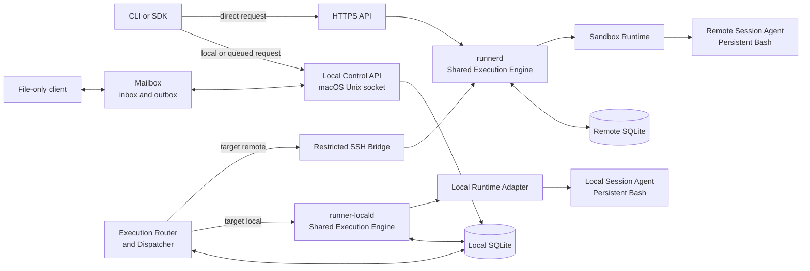

# Remote Session Runner Initial Design

**Status:** Initial design baseline  
**Source:** [Detailed design v2](../010-initial-idea/020-md/runner_remote_execution_detailed_design_v2.md)  
**Purpose:** Define the smallest practical architecture for safely running stateful commands through local macOS sessions and isolated remote Linux environments.

## 1. Summary

Remote Session Runner lets a developer use either a local macOS session or a remote Linux sandbox through one consistent command experience. A caller creates a session, selects its execution target, sends one or more commands, watches their output, and can reconnect later. Commands in the same session run in order in one long-lived shell, so the working directory, exported variables, functions, aliases, and activated environments can survive from one command to the next.

The design separates **how a request enters** from **where it executes**.

- **Queued local control plane:** a macOS-local API accepts work and records it locally. Its execution router sends the work either to the local execution service or to the remote host.
- **File mailbox:** a file-only client, including an LLM without shell or API tools, can place a request in an owner-only local inbox and read a matching response from an outbox. The Local Control API imports it through the same request path.
- **Direct remote API:** an authenticated client calls the remote HTTPS API for immediate execution in a remote sandbox.
- **Execution target:** a session is explicitly created for either `local` or `remote`; the target cannot change during that session.

Local and remote targets use the same session, command, event, state-machine, idempotency, and streaming contracts. They share one execution-engine code path, while using target-specific runtime adapters and service instances on their respective hosts.

## 2. Problem and outcome

### Problem

One-shot remote SSH commands are awkward for iterative work. They do not naturally preserve shell state, they make reconnecting and replaying output difficult, and they blur the distinction between a transport failure and a command failure. Developers also need occasional commands against their local tools or uncommitted files without switching to a different command interface.

### Intended outcome

The initial release provides a small Mac-plus-Linux-host system that:

- runs commands in an explicit local session or an isolated remote sandbox;
- supports delayed local submission, local execution, and direct remote submission;
- accepts structured file requests and returns correlated file responses for clients without CLI or API access;
- persists accepted commands before execution and stores output events before publishing them;
- keeps state within one session while its shell remains alive;
- lets clients disconnect and resume from an event sequence number; and
- gives operators clear control over identity, access, resource limits, retention, and failure recovery.

## 3. Scope

### Included in the initial release

- macOS-local queued submission through a Unix-domain socket;
- an owner-only macOS file mailbox for session, command, status, cancellation, and closure requests;
- local macOS sessions through the same CLI, session, command, event, and persistent-shell model as remote sessions;
- direct remote HTTPS submission;
- remote sessions, commands, and ordered events;
- one target runtime and one persistent Bash process per active session; remote sessions use an isolated sandbox;
- stdout, stderr, status, and completion-event streaming with replay;
- cancellation, command timeouts, idle timeouts, and maximum session lifetime;
- exact Git revision preparation on the remote host;
- SQLite persistence on the local and remote hosts;
- SSH bridge support for the local dispatcher; and
- basic health checks, structured logs, audit records, retention, and backup procedures.

### Deliberately not included

- interactive PTYs, full-screen terminal applications, or terminal resize;
- arbitrary long-running background services inside a session;
- shared control of one session by queued and direct clients;
- automatic fallback from a failed remote request to local execution, or the reverse;
- bidirectional synchronisation of uncommitted local files; an explicitly selected local worktree is supported only for a local session;
- port forwarding;
- multi-host scheduling; and
- a claim of hostile-code isolation beyond the selected sandbox runtime.

The initial remote container baseline isolates normal development workloads. The initial local target is explicitly a local-user execution profile, not a claim of equivalent container isolation. A VM or microVM runtime remains a future decision if the threat model requires stronger isolation.

## 4. Design principles

1. **One shared execution engine.** Local and remote targets use the same authorization model, state machine, scheduler rules, session-agent protocol, and event contract.
2. **Persist before execution.** A command is not eligible to run until its target authority has durably recorded the command and its accepted event.
3. **Session state is explicit.** A session owns exactly one target runtime and one shell state while it is alive.
4. **One controller per session.** The ingress identity that creates a session controls its mutable operations.
5. **Command order is deterministic.** Only one command may run in a session at a time.
6. **Output is a durable record.** Streaming is a view of persisted events, not the only copy of command output.
7. **Transport and command outcomes differ.** A command exit code is data; a TLS, SSH, service, or runtime failure is a distinct system error.
8. **Start small without blocking growth.** The first deployment is one Mac user and one Linux host, while resource and protocol boundaries allow later expansion.
9. **Select the target once.** `local` or `remote` is chosen at session creation, is visible in session metadata, and cannot be overridden by an individual command.
10. **Never surprise the operator.** Target selection is explicit. A remote failure never causes a command to execute on the local workstation without a new, explicit request.

## 5. Conceptual architecture



### Component responsibilities

| Component | Runs on | Main responsibility |
| --- | --- | --- |
| CLI / SDK | macOS or other client | Creates sessions and commands, follows output, and maps results for people or programs. |
| File Mailbox Adapter | macOS, inside Local Control API | Imports ready request files into local intent and writes correlated response and event files from SQLite state. It does not run commands or choose the target. |
| Local Control API | macOS | Validates local and queued requests and records local intent. It never directly starts a shell or contacts the remote host. |
| Execution Router and Dispatcher | macOS | Claims local work, selects the target driver, sends remote work through SSH, and mirrors remote events into the local database. |
| `runner-locald` | macOS | The local instance of the shared execution engine. It manages local-target session state, invokes the local runtime adapter, and publishes the same events as `runnerd`. |
| Local Runtime Adapter | macOS | Creates the local session workspace and process environment, starts the local session agent, and applies the limits macOS can enforce. |
| SSH Bridge | Linux host | A restricted forced-command adapter from the dispatcher to `runnerd`. |
| HTTPS API | Linux host | Authenticates direct clients and exposes the public remote API. |
| `runnerd` | Linux host | The remote instance of the shared execution engine: authorization, persistence, scheduling, session lifecycle, and event publication. |
| Sandbox Runtime | Linux host | Creates and removes the container or equivalent isolated environment and applies limits and mounts. |
| Session Agent | Local process or remote sandbox | Owns the long-lived Bash process, runs commands serially, and captures output. |

`runner-locald` and `runnerd` are separate service **instances** because they execute on different machines, but they are not separate execution implementations. They use the same shared `ExecutionService` and session-agent protocol, with a macOS process adapter or a Linux sandbox adapter. The macOS Execution Router is the single local worker that decides the path; a remote service never reaches back into the Mac.

## 6. Core model

The resource model is:

```text
Environment → Session → Command → Command Event
```

| Resource | Meaning |
| --- | --- |
| Environment | A named, approved runtime definition: image or base system, limits, mounts, repository policy, and allowed settings. |
| Session | A temporary workspace with one owner/controller, one immutable execution target, one runtime instance, and one shell state. |
| Command | A script submitted to a session. Commands receive an ordinal number and execute one at a time. |
| Command event | A durable, ordered record of acceptance, lifecycle changes, stdout, stderr, completion, or error details. |

### Execution target model

The target belongs to the session request, not to individual commands:

```json
{
  "execution_target": {
    "kind": "local",
    "profile": "mac-workstation"
  },
  "source": {
    "mode": "local_worktree",
    "path": "/absolute/approved/worktree"
  }
}
```

| Field | Rule |
| --- | --- |
| `execution_target.kind` | Required: `local` or `remote`. It is immutable after session creation. |
| `execution_target.profile` | Identifies the allowed target environment, such as `mac-workstation` or `linux-sandbox`. |
| `source.mode` | Optional: `empty`, a verified `git_revision`, or an explicitly selected `local_worktree`. The latter is local-only. |
| Effective capabilities | The created session returns its target, host class, isolation level, source mode, and enforced limits. |

Every command inherits its session target. The command API has no target override, and target selection is never inferred from command text, network availability, or a failure. A `local_worktree` session uses a policy-approved existing directory, can modify its uncommitted files, and records that it is non-portable. If a session requests a Git repository, the chosen revision is resolved and recorded as an exact commit. Local and remote sessions share API behavior, but the available programs and command results depend on macOS or Linux and the chosen environment.

### Session states

`creating → ready → busy → ready → closing → closed`

Exceptional terminal states are `failed`, `expired`, and `lost`. A service restart must not pretend that an in-memory shell state survived: affected sessions become `lost` unless the runtime can prove otherwise.

### Command states

`queued → running → succeeded | failed | cancelled | timed_out | lost | rejected`

Commands have a stable identifier and idempotency data. Repeating the same request must return the original accepted resource; reusing an identifier for a different request is a conflict.

## 7. Execution flows

### 7.1 Queued mode

1. The caller creates a session with an explicit target through the local Unix-socket API. Later command requests name that session and inherit its target.
2. The Local Control API validates each request and commits its intent to local SQLite. This acknowledges local receipt; execution acceptance is a separate state.
3. The Execution Router claims pending work under a lease and reads the session's immutable target.
4. For `local`, it calls `runner-locald` through a private local interface. For `remote`, it calls `runnerd` through the restricted SSH Bridge.
5. The selected executor uses the same execution contract. `runner-locald` turns the already stored local intent into an authoritative local acceptance and event in one transaction; `runnerd` durably accepts the remote request and event in remote SQLite. Both then schedule execution.
6. For remote sessions, the Router resumes from its last event sequence and mirrors remote events to local SQLite. For local sessions, `runner-locald` writes events directly to local SQLite.
7. Local clients use the same status and event interfaces for both targets. If the Mac disconnects after remote acceptance, the remote command may continue and will reconcile later.

### 7.2 Local execution target

The local target is useful when commands need low latency, local development tools, or an explicitly selected uncommitted working tree. It uses the same session model as remote execution:

1. The caller creates a `local` session through the local Unix-socket API.
2. `runner-locald` prepares an empty or exact-revision workspace, or validates the explicitly selected existing worktree, then starts a local session agent with one persistent Bash process.
3. Commands are accepted in the local database, ordered, and sourced by that shell using the same execution contract as a remote session.
4. Output and lifecycle events are stored in local SQLite and are replayed using the same sequence-cursor behavior.
5. Cancellation, timeout, shell death, and service restart use the same terminal-state semantics: the session is closed or marked lost rather than silently recreated.

Local execution is intentional, visible in the CLI and session metadata, and available only through the owner’s local control plane in the first version. It is not a way for a remote HTTPS caller to execute commands on the Mac.

### 7.3 Direct remote mode

1. The caller authenticates to the HTTPS API and creates a session.
2. `runnerd` authorizes the environment, creates the sandbox and persistent shell, and marks the session ready.
3. The caller submits a command. `runnerd` persists it before scheduling it.
4. The caller follows NDJSON events immediately or disconnects.
5. A later request resumes event delivery after a supplied sequence number.
6. The caller closes the session, or the service closes it at its idle or maximum-lifetime limit.

The direct HTTPS API accepts `remote` sessions only. This retains a clear network and ownership boundary while preserving the same CLI commands and resource semantics as local sessions.

### 7.4 File mailbox flow

1. A file-only client writes a request JSON file with a unique `request_id`, then writes a matching `.ready` marker last. The importer reads only marked requests.
2. The Mailbox Adapter validates the request and commits it through the Local Control API's ordinary local-intent path. It writes a response with the same `request_id`; `accepted` means the Mac recorded the request, not that the remote executor has accepted it.
3. The existing Execution Router sends the request to `runner-locald` or through SSH to `runnerd`, according to the target selected when the session was created.
4. The adapter refreshes the response from local SQLite as the session or command changes. A file-only client reads the response at a predictable path until the request is `complete` or `rejected`.
5. Optional per-command NDJSON event files expose persisted output and status events in sequence order. The response includes their path and the resulting `session_id` and `command_id`.

The mailbox is another local ingress, not another execution worker or source of truth. A direct remote HTTPS request never reaches the Mac inbox.

### 7.5 Persistent-shell behavior

A stateful command is written to a protected script and sourced by the existing Bash process. This is what lets a later command see changes made by an earlier one, including `cd`, `export`, shell functions, aliases, `umask`, and virtual-environment activation.

If cancellation, timeout, shell death, or runtime corruption leaves the process tree uncertain, the service may close the complete session rather than reuse an unsafe shell.

## 8. Persistence and consistency

Two SQLite databases have different roles. Execution authority is determined by the immutable session target:

| Store | Authority | Contents |
| --- | --- | --- |
| Local SQLite | Local-target execution; queued remote intent and projection | Authoritative local sessions, commands, events, and idempotency records; queued remote requests, dispatcher leases, mirrored remote events, and local audit data. |
| Remote SQLite | Remote execution | Authoritative sessions, commands, event sequence, idempotency records, controller ownership, and remote audit data. |

Each session has exactly one execution authority: local sessions use local SQLite through `runner-locald`; remote sessions use remote SQLite through `runnerd`. The local record of a remote session remains a projection, never a competing authority.

Within local SQLite, the Local Control API owns request-intent records, the Router owns leases and remote projection cursors, and `runner-locald` owns authoritative local execution transitions and events. The local executor accepts a routed request by its stable ID and request hash; a retry with the same data returns the existing resource. The API, Router, and executor may use the same database file, but each state transition has one writer role and one transaction boundary.

Both databases use WAL mode and transactional updates. The important atomic rule is: when a state change matters to a client, its corresponding event is committed in the same transaction.

Each command event has a monotonically increasing sequence number. Consumers store the last sequence they processed and ask for all later events when reconnecting. A slow event consumer must not stop command execution; storage and bounded subscriber buffers provide backpressure.

Mailbox responses and event files are read-only projections of these records. For local sessions, they come from authoritative local events; for remote sessions, they come from the local mirror after the Dispatcher has reconciled it. Responses for remote work show the last remote update and a stale/reconciling indicator when appropriate. A missing or deleted response file does not erase the underlying request or command.

## 9. Security and isolation baseline

Remote Session Runner is a privileged code-execution system. Local and remote targets share the same user experience, but they must not be described as equally isolated. The initial design therefore uses these boundaries:

| Area | Initial control |
| --- | --- |
| Local API | Owner-only Unix-domain socket in an owner-only directory. |
| File mailbox | Owner-only directory and files; accept regular files with validated safe names, reject symlinks and oversized requests, and bind every imported request to the local owner. Remote HTTPS clients have no access to this path. |
| Local target | Available only through the owner’s local control plane. It runs under the selected local user/profile and visibly reports its local-user isolation class. |
| Dispatcher transport | SSH public-key authentication, strict `known_hosts` verification, and a restricted forced command. |
| Direct API | TLS verification and mTLS by default on a private network; short-lived bearer tokens are a possible controlled alternative. It accepts remote targets only. |
| Authorization | The authenticated principal is checked against the requested environment and session controller. |
| Sandbox | Non-root, unprivileged runtime, no privileged mode, no container-runtime socket, explicit mounts, and CPU, memory, process, disk, network, output, and time limits. |
| Repository access | Remote-side, read-only credentials kept outside the command environment; exact commit verification before use. |
| Secrets | Pass approved just-in-time references or mounted values only when an environment policy permits them; never store secrets in command records or events. |
| Audit | Record principal, ingress, environment, resource identifiers, outcome, timestamps, and security-relevant actions; do not record secrets, raw scripts, or command output in audit logs. |

Direct exposure to the public internet is not part of this baseline. It requires a dedicated threat assessment and deployment decision.

The local profile must reject a requested policy it cannot enforce. It must not silently claim the remote sandbox’s mount, network, privilege, or resource restrictions.

The mailbox treats JSON as untrusted input. It validates its schema, target, session ownership, script size, and source paths before creating local intent. Response files may contain command output and therefore use the same owner-only permissions and retention controls as the local event store.

## 10. Operating baseline

The first deployment targets one trusted Mac user and one remote Linux host.

| Dimension | Initial baseline |
| --- | --- |
| Execution targets | `local` on the owner’s Mac through `runner-locald`; `remote` in a Linux sandbox through `runnerd` |
| Active sessions | Up to 20 per execution host, configurable |
| Concurrent commands | Maximum 4 per execution host by default; one per session |
| Idle timeout | 30 minutes |
| Maximum session lifetime | 4 hours |
| Command timeout | 30 minutes by default, configurable upper bound |
| Output limit | 100 MiB per command across stdout and stderr |
| Event availability | Persisted output normally visible within 500 ms under normal local load |
| Retention | Command metadata for 90 days; output for 30 days, both configurable |
| Mailbox files | Inbox pairs removed after durable import or rejection; outbox and event files have bounded configurable retention |

The Mac services are managed with `launchd`; they are the Local Control API (including the Mailbox Adapter), the Execution Router and Dispatcher, and `runner-locald`. The Linux service is managed with `systemd`. Both sides need structured logs, readiness/liveness checks, a doctor command, and documented backup and restore steps. The Mailbox Adapter cleans up abandoned drafts, limits inline output in response JSON, and serves full bounded output through per-command events.

## 11. Initial interface shape

The exact OpenAPI and bridge protocol are implementation artifacts, but the initial public model needs these operations:

| Operation | Purpose |
| --- | --- |
| Create session | Request the immutable execution target and profile, environment, limits, source mode/revision, and session policy. |
| Read session | Check its current state, effective revision, and lifecycle information. |
| Submit command | Add an ordered command with an idempotency key and optional timeout. |
| Read command | Check command state, exit code, timestamps, and output summary. |
| Stream events | Replay from `after_sequence` and optionally continue with live events. |
| Cancel command | Request cancellation through the session’s controlling ingress. |
| Close session | End the shell and sandbox with an explicit close policy. |
| One-off job | Compatibility operation that creates an ephemeral session, runs one command, and closes it. |

The local Unix-socket API and file mailbox expose local and queued-remote forms of these operations. The remote HTTPS API exposes the direct remote form. All three interfaces share the same resource names, state meanings, error codes, and event schema.

The target appears only in `Create session` or a one-off `run` request that creates an ephemeral session. `Submit command` inherits the target from its session. The local API may create `local` or `remote` sessions; the direct HTTPS API creates `remote` sessions only. A target is never inferred or automatically changed after creation.

The CLI connection profile selects the local Unix socket or remote HTTPS endpoint independently of the execution target. Local socket plus `remote` means queued remote execution; HTTPS plus `remote` means direct remote execution. Only the local socket can select `local`.

Illustrative CLI shape (names and flags are to be finalized with the API contract):

```text
runner --endpoint local session create --target local --profile mac-workstation
runner --endpoint local session create --target remote --profile linux-sandbox
runner --endpoint remote session create --target remote --profile linux-sandbox
runner exec SESSION_ID -- 'pwd'
runner events COMMAND_ID --follow
runner session close SESSION_ID
```

The same `exec`, `events`, and `close` operations work after either session-creation command. Status output always displays the session target, host class, source mode, and effective isolation policy.

### File mailbox contract

The first version also supports a file-only client on the Mac. The mailbox lives under one configured owner-only directory:

```text
mailbox/
├── inbox/
│   ├── req-42.json          # client writes the immutable request
│   └── req-42.ready         # client writes this last to publish it
├── outbox/
│   └── req-42.json          # Runner's response, matched by request_id
└── events/
    └── cmd-19.ndjson       # optional full events for a command
```

The caller supplies a unique `request_id` that matches the filename. A session-creation request includes the execution target; a later command request contains the returned `session_id` and no target override. For example:

```json
{
  "request_id": "req-session-41",
  "operation": "create_session",
  "execution_target": {"kind": "local", "profile": "mac-workstation"},
  "source": {"mode": "empty"}
}
```

```json
{
  "request_id": "req-42",
  "operation": "submit_command",
  "session_id": "session-7",
  "script": "pwd"
}
```

After the client writes `inbox/req-42.json`, it writes `inbox/req-42.ready`. The importer ignores JSON files without a matching marker, validates the filename and content, and records either accepted local intent or a rejection receipt in local SQLite before removing the inbox pair. The importer uses the same validation and local-intent path as the Unix-socket API. No new dispatcher or executor is created.

The client reads `outbox/req-42.json` until `request_state` is terminal. Each distinct operation uses a new ID; an identical retry reuses its original ID. Runner writes a temporary response and atomically replaces the visible file, so readers never see a partial JSON document. A completed command response has this shape:

```json
{
  "request_id": "req-42",
  "operation": "submit_command",
  "request_state": "complete",
  "session_id": "session-7",
  "command_id": "cmd-19",
  "command_state": "succeeded",
  "exit_code": 0,
  "stdout": "/workspace\n",
  "stderr": "",
  "events_file": "events/cmd-19.ndjson"
}
```

| File or state | Meaning |
| --- | --- |
| Request JSON without `.ready` | Draft; Runner does not read it. |
| Request JSON with `.ready` | Published and waiting for import. The JSON must not change after the marker is written. |
| `request_state: accepted` | The Mac has durably imported the request. A remote session or command may still be awaiting remote acceptance. |
| `request_state: complete` | This file operation has reached its result. For a command, inspect `command_state` and `exit_code`; for session creation, inspect `session_state` and `session_id`. |
| `request_state: rejected` | The file request failed validation, authorization, or an idempotency conflict; inspect the structured error. |
| `events/<command_id>.ndjson` | Optional, ordered command events derived from durable local or mirrored remote events. Each line carries `command_id` and `sequence`. |

`request_state` describes the mailbox exchange, while `session_state` and `command_state` describe execution. A shell command that exits with code 1 therefore has `request_state: complete` and `command_state: failed`. Session creation completes when the session becomes ready or reaches a creation failure; later session changes are read through a new `get_session` request. The mailbox also supports `get_command`, `cancel_command`, `close_session`, and a one-off `run` request that creates an ephemeral session with an explicit target.

Mailbox operations are limited to sessions controlled through the local control plane. They cannot attach to or mutate a session created through the direct remote HTTPS API.

The same `request_id` and identical canonical request must return the original resource and result. Reusing an ID with different content returns `request_state: rejected` and an `idempotency_conflict` error in the matching outbox file; it never submits a second command. The error identifies any original resource so it remains retrievable through a new status request. A crash after SQLite commit but before response publication must regenerate the response from SQLite without submitting a second command. Inbox files are transient; outbox and event files are bounded projections with configured retention. SQLite remains the lasting record, and a later status request can retrieve a retained session or command after its response file has been cleaned up. Request ID mappings remain valid for at least the documented retry window.

An event reader uses newline-terminated NDJSON records and the last `sequence` it has seen; it ignores an incomplete trailing line while the file is being updated. Small stdout and stderr values may appear inline in the response, while larger output is read from the bounded event file. An `output_truncated` field reports when the configured command output limit has been reached.

## 12. Delivery plan

The work should proceed in working vertical slices rather than build every layer at once.

| Phase | Deliverable | Exit evidence |
| --- | --- | --- |
| 0. Domain contracts | Shared environment, immutable execution-target, session, command, event, error, and idempotency types. | State-transition, target-immutability, and idempotency tests pass. |
| 1. Shared execution engine | Shared `ExecutionService`, local and remote stores, scheduler rules, event replay, and fake runtime. | Integration tests create either target, serialize commands, and replay events through the same contract suite. |
| 2. Local and remote runtimes | `runner-locald` with local session agent and workspace policy; remote sandbox adapter, repository preparation, and remote session agent. | The same two-command acceptance suite proves persistent variables and working directory for both targets. |
| 3. SSH bridge | Restricted bridge, embedded SSH client, strict host verification, and reconnect logic. | Local client creates a session, reconnects, and replays results over SSH. |
| 4. Local ingress and queued routing | Local API, file mailbox, local SQLite, Execution Router and Dispatcher, local routing, remote event mirroring, and compatible one-off jobs. | A file-only client creates a session, submits a command, and reads its correlated result; one Router routes explicit local and remote targets without fallback. |
| 5. Direct HTTPS | HTTPS adapter, identity mapping, authorization, NDJSON, and direct CLI profile. | Queued and direct clients pass the same contract suite. |
| 6. Operations | Recovery, retention, backups, metrics, alerts, and service hardening. | Failure scenarios have documented, tested outcomes without duplicate execution. |

## 13. Acceptance criteria for the first usable release

The initial release is ready for controlled use when it can demonstrate all of the following:

- local and remote sessions use the same CLI commands, resource model, states, events, idempotency, and persistent-shell behavior;
- the Mac Execution Router sends an explicit `local` target to `runner-locald` and an explicit `remote` target to the SSH bridge;
- the local API has no remote credential or network access;
- a file-only client can create a local or queued-remote session, submit a command using its `session_id`, and read a response matched by `request_id` with the resulting `command_id`;
- a repeated identical file request returns the same resource, while changed content under the same `request_id` is rejected without running a second command;
- the mailbox ignores unmarked or unsafe request files, publishes complete JSON responses atomically, and cleans up transient files under its retention policy;
- mailbox responses distinguish request acceptance from command success or failure, survive importer restarts, and never claim that queued remote work has already been accepted by `runnerd`;
- every command is durable in its target’s authoritative store before it starts;
- two sequential commands share variables, current directory, and virtual-environment state in a local session and in a remote session;
- only one command runs in a session at a time;
- client and dispatcher reconnects replay complete ordered events without duplicating execution;
- a direct client cannot mutate another controller’s session;
- the direct remote API cannot create or mutate a local Mac session;
- a session target cannot change, and a target failure never falls back to the other target;
- cancellation, timeout, output limit, shell death, and service restart have explicit, tested outcomes;
- a remote sandbox cannot access privileged runtime control interfaces, while local sessions accurately report their weaker local-user isolation; and
- the deployment has health checks, logs, auditable security events, retention, and recovery instructions.

## 14. Decisions to validate before implementation

| Decision | Candidate baseline | Evidence needed |
| --- | --- | --- |
| Isolation runtime | Rootless container first; VM or microVM if required | Threat model, platform support, and escape-risk review. |
| Local runtime policy | Dedicated local workspace and non-interactive per-user process in version 1 | macOS process, workspace, environment, cleanup, and limit-enforcement tests. |
| Local source mode | Empty workspace or exact Git commit; policy-approved `local_worktree` only when explicitly requested | Reproducibility, path allowlist, provenance, and cleanup tests. |
| Direct API identity | mTLS first; short-lived bearer token only where needed | Identity lifecycle, rotation, audit, and client usability review. |
| TLS termination | In-process Go TLS or trusted reverse proxy | Identity propagation and operational ownership. |
| Internal bridge protocol | HTTP over Unix socket or framed RPC | Streaming behavior, implementation simplicity, and testing results. |
| Persistent volumes | Named approved volumes only | Data retention, cleanup, backup, and cross-session safety. |
| Output storage evolution | SQLite first; files or object storage later | Volume, retention, query, and recovery measurements. |
| Public network exposure | Not in baseline | Dedicated threat assessment and operational controls. |

## 15. Main risks and mitigations

| Risk | Mitigation in the initial design |
| --- | --- |
| Remote execution is exposed too broadly | Restrict direct access to private networks, require verified identity, authorize every operation, and maintain audit records. |
| A reconnect repeats a command | Use stable IDs, request hashes, idempotency records, and durable event cursors. |
| A partial or repeated file request runs unexpectedly | Import only after the `.ready` marker, validate filenames and content, and commit the request ID before removing inbox files. Retry from SQLite after a crash. |
| Mailbox files become a second inconsistent history | Keep SQLite authoritative, regenerate responses from it, and clean up bounded outbox and event projections. |
| A timeout leaves shell state unsafe | Close the whole session when process state cannot be trusted. |
| A command runs on the wrong machine | Make the target immutable and visible, require explicit selection, and prohibit automatic fallback. |
| Local and remote views diverge | Make each target’s executor authoritative; reconcile the local projection only for remote sessions from remote event sequence numbers. |
| Local behavior silently weakens remote safeguards | Advertise target capabilities, reject unsupported local policies, and clearly report local-user isolation. |
| Slow log consumers consume unbounded memory | Persist events, use bounded subscriptions, enforce output limits, and apply retention. |
| Sandbox escape or host damage | Use an unprivileged runtime, controlled mounts, explicit resource policy, and choose a stronger runtime if the threat model needs it. |

## 16. Source material

This initial design condenses the detailed architecture proposal in [Runner Dual-Ingress Stateful Remote Execution System v2](../010-initial-idea/020-md/runner_remote_execution_detailed_design_v2.md). It extends that remote proposal with a first-version local execution target, one macOS Execution Router and Dispatcher, a local instance of the shared execution engine, and a file mailbox for clients without CLI or API access. The detailed source covers the remote protocol, schema, deployment, and tests; its remote-only details must be updated to include the local target and mailbox before implementation.
