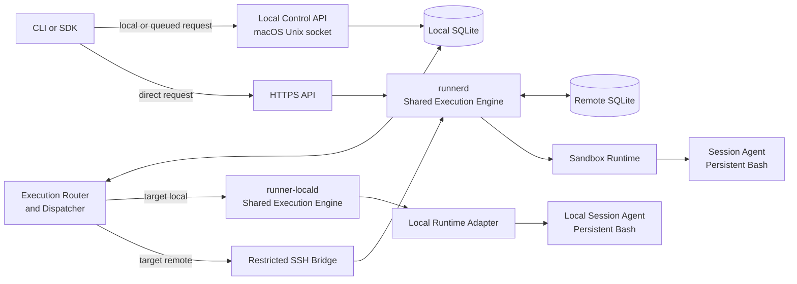

# Remote Session Runner Initial Design

**Status:** Initial design baseline  
**Source:** [Detailed design v2](../010-initial-idea/020-md/runner_remote_execution_detailed_design_v2.md)  
**Purpose:** Define the smallest practical architecture for safely running stateful commands in isolated remote Linux environments.

## 1. Summary

Remote Session Runner lets a developer use either a local macOS session or a remote Linux sandbox through one consistent command experience. A caller creates a session, selects its execution target, sends one or more commands, watches their output, and can reconnect later. Commands in the same session run in order in one long-lived shell, so the working directory, exported variables, functions, aliases, and activated environments can survive from one command to the next.

The design separates **how a request enters** from **where it executes**.

- **Queued local control plane:** a macOS-local API accepts work and records it locally. Its execution router sends the work either to the local execution service or to the remote host.
- **Direct remote API:** an authenticated client calls the remote HTTPS API for immediate execution in a remote sandbox.
- **Execution target:** a session is explicitly created for either `local` or `remote`; the target cannot change during that session.

Local and remote targets use the same session, command, event, state-machine, idempotency, and streaming contracts. They share one execution-engine code path, while using target-specific runtime adapters and service instances on their respective hosts.

## 2. Problem and outcome

### Problem

One-shot remote SSH commands are awkward for iterative work. They do not naturally preserve shell state, they make reconnecting and replaying output difficult, and they blur the distinction between a transport failure and a command failure. A local-only queue is useful for offline automation but is too indirect when a program needs an immediate remote result.

### Intended outcome

The initial release provides a small, single-host system that:

- runs commands in isolated remote sandboxes;
- supports both delayed local submission and direct remote submission;
- persists accepted commands and their ordered output before execution;
- keeps state within one session while its shell remains alive;
- lets clients disconnect and resume from an event sequence number; and
- gives operators clear control over identity, access, resource limits, retention, and failure recovery.

## 3. Scope

### Included in the initial release

- macOS-local queued submission through a Unix-domain socket;
- local macOS sessions through the same CLI, session, command, event, and persistent-shell model as remote sessions;
- direct remote HTTPS submission;
- remote sessions, commands, and ordered events;
- one isolated sandbox and one persistent Bash process per active session;
- stdout, stderr, status, and completion-event streaming with replay;
- cancellation, command timeouts, idle timeouts, and maximum session lifetime;
- exact Git revision preparation on the remote host;
- SQLite persistence on the local and remote hosts;
- SSH bridge support for the local dispatcher; and
- basic health checks, structured logs, audit records, retention, and backup procedures.

### Deliberately not included

- interactive PTYs, full-screen terminal applications, or terminal resize;
- arbitrary long-running background services inside a session;
- shared control of one session by queued and direct clients;
- automatic fallback from a failed remote request to local execution, or the reverse;
- bidirectional synchronisation of uncommitted local files;
- port forwarding;
- multi-host scheduling; and
- a claim of hostile-code isolation beyond the selected sandbox runtime.

The initial remote container baseline isolates normal development workloads. The initial local target is explicitly a local-user execution profile, not a claim of equivalent container isolation. A VM or microVM runtime remains a future decision if the threat model requires stronger isolation.

## 4. Design principles

1. **One shared execution engine.** Local and remote targets use the same authorization model, state machine, scheduler rules, session-agent protocol, and event contract.
2. **Persist before execution.** A command is not eligible to run until its remote record and accepted event are durable.
3. **Session state is explicit.** A session owns exactly one sandbox and one shell state while it is alive.
4. **One controller per session.** The ingress identity that creates a session controls its mutable operations.
5. **Command order is deterministic.** Only one command may run in a session at a time.
6. **Output is a durable record.** Streaming is a view of persisted events, not the only copy of command output.
7. **Transport and command outcomes differ.** A command exit code is data; a TLS, SSH, service, or runtime failure is a distinct system error.
8. **Start small without blocking growth.** The first deployment is one Mac user and one Linux host, while resource and protocol boundaries allow later expansion.
9. **Select the target once.** `local` or `remote` is chosen at session creation, is visible in session metadata, and cannot be overridden by an individual command.
10. **Never surprise the operator.** Target selection is explicit. A remote failure never causes a command to execute on the local workstation without a new, explicit request.

## 5. Conceptual architecture



### Component responsibilities

| Component | Runs on | Main responsibility |
| --- | --- | --- |
| CLI / SDK | macOS or other client | Creates sessions and commands, follows output, and maps results for people or programs. |
| Local Control API | macOS | Validates local and queued requests and records local intent. It never directly starts a shell or contacts the remote host. |
| Execution Router and Dispatcher | macOS | Claims local work, selects the target driver, sends remote work through SSH, and mirrors remote events into the local database. |
| `runner-locald` | macOS | The local instance of the shared execution engine. It manages local-target session state, invokes the local runtime adapter, and publishes the same events as `runnerd`. |
| Local Runtime Adapter | macOS | Creates the local session workspace and process environment, starts the local session agent, and applies the limits macOS can enforce. |
| SSH Bridge | Linux host | A restricted forced-command adapter from the dispatcher to `runnerd`. |
| HTTPS API | Linux host | Authenticates direct clients and exposes the public remote API. |
| `runnerd` | Linux host | The remote instance of the shared execution engine: authorization, persistence, scheduling, session lifecycle, and event publication. |
| Sandbox Runtime | Linux host | Creates and removes the container or equivalent isolated environment and applies limits and mounts. |
| Session Agent | Inside sandbox | Owns the long-lived Bash process, runs commands serially, and captures output. |

`runner-locald` and `runnerd` are separate service **instances** because they execute on different machines, but they are not separate execution implementations. They use the same shared `ExecutionService` and session-agent protocol with `LocalRuntimeAdapter` or `RemoteRuntimeAdapter` selected by the session target. The macOS Execution Router is the single local worker that decides the path; it must not make a remote service reach back into the Mac.

## 6. Core model

The resource model is:

```text
Environment → Session → Command → Command Event
```

| Resource | Meaning |
| --- | --- |
| Environment | A named, approved runtime definition: image or base system, limits, mounts, repository policy, and allowed settings. |
| Session | A temporary workspace with one owner/controller, one immutable execution target, one runtime instance, and one shell state. |
| Command | A script submitted to a session. Commands receive an ordinal number and execute one at a time. |
| Command event | A durable, ordered record of acceptance, lifecycle changes, stdout, stderr, completion, or error details. |

### Execution target model

The target belongs to the session request, not to individual commands:

```json
{
  "execution_target": {
    "kind": "local",
    "profile": "mac-workstation"
  },
  "source": {
    "mode": "local_worktree"
  }
}
```

| Field | Rule |
| --- | --- |
| `execution_target.kind` | Required: `local` or `remote`. It is immutable after session creation. |
| `execution_target.profile` | Identifies the allowed target environment, such as `mac-workstation` or `linux-sandbox`. |
| `source.mode` | `git_revision` is portable and reproducible. `local_worktree` is local-only and must be explicitly requested. |
| Effective capabilities | The created session returns its target, host class, isolation level, source mode, and enforced limits. |

Every command inherits its session target. The command API has no target override, and target selection is never inferred from command text, network availability, or a failure. A `local_worktree` session may use a policy-approved local workspace and records that it is non-portable; a remote session always uses a verified exact Git revision.

### Session states

`creating → ready → busy → ready → closing → closed`

Exceptional terminal states are `failed`, `expired`, and `lost`. A service restart must not pretend that an in-memory shell state survived: affected sessions become `lost` unless the runtime can prove otherwise.

### Command states

`queued → running → succeeded | failed | cancelled | timed_out | lost | rejected`

Commands have a stable identifier and idempotency data. Repeating the same request must return the original accepted resource; reusing an identifier for a different request is a conflict.

## 7. Execution flows

### 7.1 Queued mode

1. The caller sends a session or command request, including its explicit target, to the local Unix-socket API.
2. The Local Control API validates it and commits the desired state to local SQLite.
3. The Execution Router claims the work under a lease and chooses the target driver.
4. For `local`, it sends the request to `runner-locald`. For `remote`, it connects to the restricted SSH Bridge.
5. The selected execution-service instance persists the request, schedules it, and emits events.
6. For remote sessions, the Router resumes from its last event sequence and mirrors remote events to local SQLite.
7. Local clients use the same status and event interfaces for both targets. If the Mac disconnects after remote acceptance, the remote command may continue and will reconcile later.

### 7.2 Local execution target

The local target is useful when commands need low latency, local development tools, or an explicitly selected uncommitted working tree. It uses the same session model as remote execution:

1. The caller creates a `local` session through the local Unix-socket API.
2. `runner-locald` creates a dedicated workspace and starts a local session agent with one persistent Bash process.
3. Commands are persisted, ordered, and sourced by that shell exactly as for a remote session.
4. Output and lifecycle events are stored in local SQLite and are replayed using the same sequence-cursor behavior.
5. Cancellation, timeout, shell death, and service restart use the same terminal-state semantics: the session is closed or marked lost rather than silently recreated.

Local execution is intentional, visible in the CLI and session metadata, and available only through the owner’s local control plane in the first version. It is not a way for a remote HTTPS caller to execute commands on the Mac.

### 7.3 Direct remote mode

1. The caller authenticates to the HTTPS API and creates a session.
2. `runnerd` authorizes the environment, creates the sandbox and persistent shell, and marks the session ready.
3. The caller submits a command. `runnerd` persists it before scheduling it.
4. The caller follows NDJSON events immediately or disconnects.
5. A later request resumes event delivery after a supplied sequence number.
6. The caller closes the session, or the service closes it at its idle or maximum-lifetime limit.

The direct HTTPS API accepts `remote` sessions only. This retains a clear network and ownership boundary while preserving the same CLI commands and resource semantics as local sessions.

### 7.4 Persistent-shell behavior

A stateful command is written to a protected script and sourced by the existing Bash process. This is what lets a later command see changes made by an earlier one, including `cd`, `export`, shell functions, aliases, `umask`, and virtual-environment activation.

If cancellation, timeout, shell death, or runtime corruption leaves the process tree uncertain, the service may close the complete session rather than reuse an unsafe shell.

## 8. Persistence and consistency

Two SQLite databases have different roles. Execution authority is determined by the immutable session target:

| Store | Authority | Contents |
| --- | --- | --- |
| Local SQLite | Local-target execution; queued remote intent and projection | Authoritative local sessions, commands, events, and idempotency records; queued remote requests, dispatcher leases, mirrored remote events, and local audit data. |
| Remote SQLite | Remote execution | Authoritative sessions, commands, event sequence, idempotency records, controller ownership, and remote audit data. |

Each session has exactly one execution authority: local sessions use local SQLite through `runner-locald`; remote sessions use remote SQLite through `runnerd`. The local record of a remote session remains a projection, never a competing authority.

Both databases use WAL mode and transactional updates. The important atomic rule is: when a state change matters to a client, its corresponding event is committed in the same transaction.

Each command event has a monotonically increasing sequence number. Consumers store the last sequence they processed and ask for all later events when reconnecting. A slow event consumer must not stop command execution; storage and bounded subscriber buffers provide backpressure.

## 9. Security and isolation baseline

Remote Session Runner is a privileged remote code-execution system. The initial design therefore uses these boundaries:

| Area | Initial control |
| --- | --- |
| Local API | Owner-only Unix-domain socket in an owner-only directory. |
| Dispatcher transport | SSH public-key authentication, strict `known_hosts` verification, and a restricted forced command. |
| Direct API | TLS verification and mTLS by default on a private network; short-lived bearer tokens are a possible controlled alternative. |
| Authorization | The authenticated principal is checked against the requested environment and session controller. |
| Sandbox | Non-root, unprivileged runtime, no privileged mode, no container-runtime socket, explicit mounts, and CPU, memory, process, disk, network, output, and time limits. |
| Repository access | Remote-side, read-only credentials kept outside the command environment; exact commit verification before use. |
| Secrets | Pass approved just-in-time references or mounted values only when an environment policy permits them; never store secrets in command records or events. |
| Audit | Record principal, ingress, environment, resource identifiers, outcome, timestamps, and security-relevant actions; do not record secrets, raw scripts, or command output in audit logs. |

Direct exposure to the public internet is not part of this baseline. It requires a dedicated threat assessment and deployment decision.

## 10. Operating baseline

The first deployment targets one trusted Mac user and one remote Linux host.

| Dimension | Initial baseline |
| --- | --- |
| Active sessions | Up to 20, configurable |
| Concurrent commands | Global maximum 4; one per session |
| Idle timeout | 30 minutes |
| Maximum session lifetime | 4 hours |
| Command timeout | 30 minutes by default, configurable upper bound |
| Output limit | 100 MiB per command across stdout and stderr |
| Event availability | Persisted output normally visible within 500 ms under normal local load |
| Retention | Command metadata for 90 days; output for 30 days, both configurable |

The Mac services are managed with `launchd`; the Linux service is managed with `systemd`. Both sides need structured logs, readiness/liveness checks, a doctor command, and documented backup and restore steps.

## 11. Initial interface shape

The exact OpenAPI and bridge protocol are implementation artifacts, but the initial public model needs these operations:

| Operation | Purpose |
| --- | --- |
| Create session | Request an environment, limits, source revision, and session policy. |
| Read session | Check its current state, effective revision, and lifecycle information. |
| Submit command | Add an ordered command with an idempotency key and optional timeout. |
| Read command | Check command state, exit code, timestamps, and output summary. |
| Stream events | Replay from `after_sequence` and optionally continue with live events. |
| Cancel command | Request cancellation through the session’s controlling ingress. |
| Close session | End the shell and sandbox with an explicit close policy. |
| One-off job | Compatibility operation that creates an ephemeral session, runs one command, and closes it. |

The local Unix-socket API exposes the queued form of these operations. The remote HTTPS API exposes the direct form. Both share the same resource names, state meanings, error codes, and event schema.

## 12. Delivery plan

The work should proceed in working vertical slices rather than build every layer at once.

| Phase | Deliverable | Exit evidence |
| --- | --- | --- |
| 0. Domain contracts | Shared environment, session, command, event, error, and idempotency types. | State-transition and idempotency tests pass. |
| 1. Remote core | Remote SQLite, `runnerd`, scheduler, event replay, and fake runtime. | Integration tests create sessions, serialize commands, and replay events. |
| 2. Runtime | Sandbox adapter, repository preparation, session agent, persistent Bash, limits, cancellation, and cleanup. | Two commands prove that variables and working directory persist in one isolated session. |
| 3. SSH bridge | Restricted bridge, embedded SSH client, strict host verification, and reconnect logic. | Local client creates a session, reconnects, and replays results over SSH. |
| 4. Queued migration | Local API, local SQLite, dispatcher, event mirroring, and compatible one-off jobs. | Local API performs no remote I/O; accepted work survives CLI disconnect. |
| 5. Direct HTTPS | HTTPS adapter, identity mapping, authorization, NDJSON, and direct CLI profile. | Queued and direct clients pass the same contract suite. |
| 6. Operations | Recovery, retention, backups, metrics, alerts, and service hardening. | Failure scenarios have documented, tested outcomes without duplicate execution. |

## 13. Acceptance criteria for the first usable release

The initial release is ready for controlled use when it can demonstrate all of the following:

- a queued request and a direct request reach the same remote execution service;
- the local API has no remote credential or network access;
- a remote command is durable before it starts;
- two sequential commands share variables, current directory, and virtual-environment state in one session;
- only one command runs in a session at a time;
- client and dispatcher reconnects replay complete ordered events without duplicating execution;
- a direct client cannot mutate another controller’s session;
- cancellation, timeout, output limit, shell death, and service restart have explicit, tested outcomes;
- a sandbox cannot access privileged runtime control interfaces; and
- the deployment has health checks, logs, auditable security events, retention, and recovery instructions.

## 14. Decisions to validate before implementation

| Decision | Candidate baseline | Evidence needed |
| --- | --- | --- |
| Isolation runtime | Rootless container first; VM or microVM if required | Threat model, platform support, and escape-risk review. |
| Direct API identity | mTLS first; short-lived bearer token only where needed | Identity lifecycle, rotation, audit, and client usability review. |
| TLS termination | In-process Go TLS or trusted reverse proxy | Identity propagation and operational ownership. |
| Internal bridge protocol | HTTP over Unix socket or framed RPC | Streaming behavior, implementation simplicity, and testing results. |
| Persistent volumes | Named approved volumes only | Data retention, cleanup, backup, and cross-session safety. |
| Output storage evolution | SQLite first; files or object storage later | Volume, retention, query, and recovery measurements. |
| Public network exposure | Not in baseline | Dedicated threat assessment and operational controls. |

## 15. Main risks and mitigations

| Risk | Mitigation in the initial design |
| --- | --- |
| Remote execution is exposed too broadly | Restrict direct access to private networks, require verified identity, authorize every operation, and maintain audit records. |
| A reconnect repeats a command | Use stable IDs, request hashes, idempotency records, and durable event cursors. |
| A timeout leaves shell state unsafe | Close the whole session when process state cannot be trusted. |
| Local and remote views diverge | Make remote execution authoritative and reconcile the local projection from remote event sequence numbers. |
| Slow log consumers consume unbounded memory | Persist events, use bounded subscriptions, enforce output limits, and apply retention. |
| Sandbox escape or host damage | Use an unprivileged runtime, controlled mounts, explicit resource policy, and choose a stronger runtime if the threat model needs it. |

## 16. Source material

This initial design condenses the detailed architecture proposal in [Runner Dual-Ingress Stateful Remote Execution System v2](../010-initial-idea/020-md/runner_remote_execution_detailed_design_v2.md). The detailed design remains the source for protocol fields, database schemas, exact deployment configurations, and test matrices.
