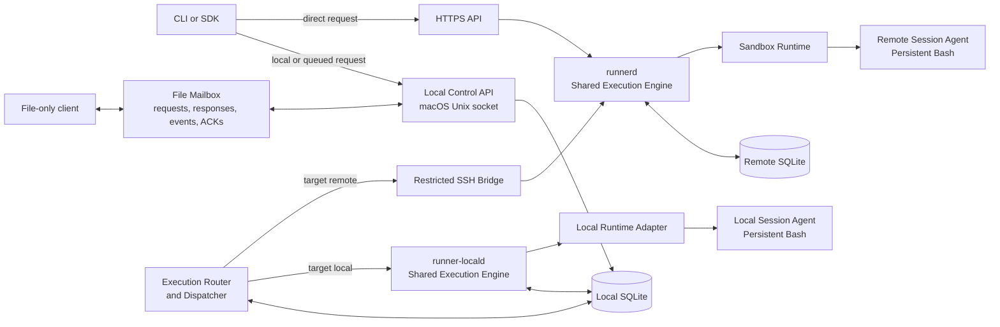

# Remote Session Runner Initial Design

**Status:** Proof-of-concept initial design baseline<br>
**Source:** [Detailed design v2](../010-initial-idea/020-md/runner_remote_execution_detailed_design_v2.md)  
**Purpose:** Define the smallest practical architecture for safely running stateful commands through local macOS sessions and isolated remote Linux environments.

## 1. Summary

Remote Session Runner lets a developer use either a local macOS session or a remote Linux sandbox through one consistent command experience. A caller creates a session, selects its execution target, sends one or more commands, watches their output, and can reconnect later. Commands in the same session run in order in one long-lived shell, so the working directory, exported variables, functions, aliases, and activated environments can survive from one command to the next.

The design separates **how a request enters** from **where it executes**.

- **Queued local control plane:** a macOS-local API accepts work and records it locally. Its execution router sends the work either to the local execution service or to the remote host.
- **File mailbox:** a file-only client, including an LLM without shell or API tools, can place a request in an owner-only local inbox and read a matching response from an outbox. The Local Control API imports it through the same request path.
- **Direct remote API:** an authenticated client calls the remote HTTPS API for immediate execution in a remote sandbox.
- **Execution target:** a session is explicitly created for either `local` or `remote`; the target cannot change during that session.

Local and remote targets use the same session, command, event, state-machine, idempotency, and streaming contracts. They share one execution-engine code path, while using target-specific runtime adapters and service instances on their respective hosts.

## 2. Problem and outcome

### Problem

One-shot remote SSH commands are awkward for iterative work. They do not naturally preserve shell state, they make reconnecting and replaying output difficult, and they blur the distinction between a transport failure and a command failure. Developers also need occasional commands against their local tools or uncommitted files without switching to a different command interface.

### Intended outcome

The PoC provides a small Mac-plus-Linux-host system that:

- runs commands in an explicit local session or an isolated remote sandbox;
- supports delayed local submission, local execution, and direct remote submission;
- accepts structured file requests and returns correlated file responses for clients without CLI or API access;
- persists accepted commands before execution and stores output events before publishing them;
- keeps state within one session while its shell remains alive;
- lets clients disconnect and resume from an event sequence number; and
- gives operators clear control over identity, access, resource limits, retention, and failure recovery.

## 3. Scope

### Included in the PoC

- macOS-local queued submission through a Unix-domain socket;
- an owner-only macOS file mailbox for session, command, status, cancellation, and closure requests;
- local macOS sessions through the same CLI, session, command, event, and persistent-shell model as remote sessions;
- direct remote HTTPS submission;
- remote sessions, commands, and ordered events;
- one target runtime and one persistent Bash process per active session; remote sessions use an isolated sandbox;
- command stdout, stderr, lifecycle, and completion-event streaming with replay; session status through snapshots;
- cancellation, command timeouts, idle timeouts, and maximum session lifetime;
- exact Git revision preparation on the selected local or remote host;
- SQLite persistence on the local and remote hosts;
- SSH bridge support for the local dispatcher; and
- basic health checks, structured logs, audit records, retention, and backup procedures.

### Deliberately not included

- interactive PTYs, full-screen terminal applications, or terminal resize;
- arbitrary long-running background services inside a session;
- shared control of one session by queued and direct clients;
- automatic fallback from a failed remote request to local execution, or the reverse;
- bidirectional synchronisation of uncommitted local files; an explicitly selected local worktree is supported only for a local session;
- port forwarding;
- multi-host scheduling; and
- a claim of hostile-code isolation beyond the selected sandbox runtime.

The initial remote container baseline isolates normal development workloads. The initial local target runs commands under a configured macOS execution account. Every local shell and child process has that account's operating-system permissions: a broadly privileged account permits broad access, while a restricted account limits access. Runner adds no second per-command filesystem permission layer, and selecting a workspace does not confine a command to it. A VM or microVM runtime remains a future decision if the threat model requires stronger isolation.

## 4. Design principles

1. **One shared execution engine.** Local and remote targets use the same authorization model, state machine, scheduler rules, session-agent protocol, and event contract.
2. **Persist before execution.** A command is not eligible to run until its target authority has durably recorded the command and its accepted event.
3. **Session state is explicit.** A session owns exactly one target runtime and one shell state while it is alive.
4. **One controller per session.** The ingress identity that creates a session controls its mutable operations.
5. **Command order is deterministic.** Only one command may run in a session at a time.
6. **Output is a durable record.** Streaming is a view of persisted events, not the only copy of command output.
7. **Transport and command outcomes differ.** A command exit code is data; a TLS, SSH, service, or runtime failure is a distinct system error.
8. **Start small without blocking growth.** The first deployment is one Mac user and one Linux host, while resource and protocol boundaries allow later expansion.
9. **Select the target once.** `local` or `remote` is chosen at session creation, is visible in session metadata, and cannot be overridden by an individual command.
10. **Never surprise the operator.** Target selection is explicit. A remote failure never causes a command to execute on the local workstation without a new, explicit request.

## 5. Conceptual architecture



### Component responsibilities

| Component | Runs on | Main responsibility |
| --- | --- | --- |
| CLI / SDK | macOS or other client | Creates sessions and commands, follows output, and maps results for people or programs. |
| File Mailbox Adapter | macOS, inside Local Control API | Imports ready request files into local intent and writes correlated response and event files from SQLite state. It does not run commands or choose the target. |
| Local Control API | macOS | Validates local and queued requests and records local intent. It never directly starts a shell or contacts the remote host. |
| Execution Router and Dispatcher | macOS | Claims local work, selects the target driver, sends remote work through SSH, and mirrors remote events into the local database. |
| `runner-locald` | macOS | The local instance of the shared execution engine. It runs under the configured macOS account, manages local-target session state, invokes the local runtime adapter, and publishes the same events as `runnerd`. |
| Local Runtime Adapter | macOS | Creates the local workspace and process environment, starts the session agent under the same configured account, and applies the limits macOS can enforce. Child processes inherit that account. |
| SSH Bridge | Linux host | A restricted forced-command adapter from the dispatcher to `runnerd`. |
| HTTPS API | Linux host | Authenticates direct clients and exposes the public remote API. |
| `runnerd` | Linux host | The remote instance of the shared execution engine: authorization, persistence, scheduling, session lifecycle, and event publication. |
| Sandbox Runtime | Linux host | Creates and removes the container or equivalent isolated environment and applies limits and mounts. |
| Session Agent | Local process or remote sandbox | Owns the long-lived Bash process, runs commands serially, and captures output. |

`runner-locald` and `runnerd` are separate service **instances** because they execute on different machines, but they are not separate execution implementations. They use the same shared `ExecutionService` and session-agent protocol, with a macOS process adapter or a Linux sandbox adapter. The macOS Execution Router is the single local worker that decides the path; a remote service never reaches back into the Mac.

## 6. Core model

The resource model is:

```text
Environment → Session → Command → Command Event
```

| Resource | Meaning |
| --- | --- |
| Environment | A named, approved runtime definition: image or base system, limits, mounts, repository policy, and allowed settings. |
| Session | A temporary workspace with one owner/controller, one immutable execution target, one runtime instance, and one shell state. |
| Command | A script submitted to a session. Commands receive an ordinal number and execute one at a time. |
| Command event | A durable, ordered record of acceptance, lifecycle changes, stdout, stderr, completion, or error details. |
| Session lifecycle record | A durable record of session creation, readiness, closure, expiration, failure, or loss. |

The PoC exposes a replayable command-event stream, with a sequence starting at 1 per command. Session lifecycle records are committed with session state, but clients read session status as snapshots; a separate replayable session-event stream is outside the PoC.

### Execution target model

The target belongs to the session request, not to individual commands:

```json
{
  "execution_target": {
    "kind": "local",
    "profile": "mac-workstation"
  },
  "source": {
    "mode": "local_worktree",
    "path": "/path/to/worktree"
  }
}
```

| Field | Rule |
| --- | --- |
| `execution_target.kind` | Required: `local` or `remote`. It is immutable after session creation. |
| `execution_target.profile` | Identifies the allowed target environment, such as `mac-workstation` or `linux-sandbox`. |
| `source.mode` | Optional: `empty`, a verified `git_revision`, or an explicitly selected `local_worktree`. The latter is local-only. |
| Effective capabilities | The created session returns its target, host class, isolation level, source mode, and enforced limits. |

Every command inherits its session target. The command API has no target override, and target selection is never inferred from command text, network availability, or a failure. A `local_worktree` session starts in an explicitly selected existing directory accessible to the execution account; it can modify uncommitted files only where that account has OS permission, and it records that it is non-portable. The selected directory is a starting location, not a filesystem boundary. If a session requests a Git repository, the chosen revision is resolved and recorded as an exact commit. Local and remote sessions share API behavior, but the available programs and command results depend on macOS or Linux and the chosen environment.

### Session states

`requested → creating → ready → busy → ready → closing → closed`

This is the normal path. `requested` means local intent is durable but the target executor has not accepted it; `creating` begins at target acceptance. Creation can end `failed`; ready or busy sessions can become `expired` or `lost`; closing ends `closed` or `lost` if cleanup fails. The PoC does not reattach an existing shell after an executor restart: previously ready or busy sessions become `lost`, and running commands become `lost` unless a terminal event was already committed. On restart, a session still `creating` has its partial runtime cleaned up and becomes `failed` if it never reached a usable shell; a session still `closing` resumes teardown and becomes `closed` only when cleanup is confirmed, otherwise `lost`. Runner attempts to stop known surviving session processes and reports cleanup failures. Work queued behind a lost session never runs in a replacement shell: undelivered local intent is rejected with reason `session_lost`, while an executor-accepted queued command gets its authoritative non-execution state.

### Command states

`queued → running → succeeded | failed`

Before execution, a queued command can become `cancelled` by cancellation or closure, or `rejected` if its session becomes unusable. A running command can enter `cancelling` and end `cancelled`, `timed_out`, or `lost`; a completion race can still produce its actual `succeeded` or `failed` result. These are terminal outcomes, not steps after `running` in every case.

Queued session and command resource IDs are allocated before the first dispatch and propagated unchanged to the authoritative executor. Direct clients use stable idempotency keys, whether the resource ID is caller-supplied or returned by `runnerd`. Commands also have idempotency data. Repeating the same mutation must return the original accepted resource; reusing an identifier for a different mutation is a conflict.

For a queued remote request, local intent has a separate `delivery_state`: `recorded`, `dispatching`, `uncertain`, `accepted`, `reconciled`, or terminal `not_delivered` with a reason. This is not the remote command's execution state. Until `runnerd` confirms acceptance, the local API reports `request_state: accepted` and the delivery state, but does not present a local `command_state: queued` as if it were authoritative remote acceptance. Once accepted, `command_state` comes from `runnerd` and may be marked stale while its events are mirrored. A definitely undelivered intent can be rejected or cancelled locally without inventing a remote command state; uncertain dispatch cannot. Local-target commands become authoritative when `runner-locald` commits their acceptance.

## 7. Execution flows

### 7.1 Queued mode

1. The caller creates a session with an explicit target through the local Unix-socket API. Later command requests name that session and inherit its target.
2. The Local Control API validates each request and commits its intent to local SQLite. This acknowledges local receipt; execution acceptance is a separate state.
3. The Execution Router claims pending work under a lease and reads the session's immutable target.
4. For `local`, it calls `runner-locald` through a private local interface. For `remote`, it calls `runnerd` through the restricted SSH Bridge.
5. The selected executor uses the same execution contract. `runner-locald` turns the already stored local intent into an authoritative local acceptance and event in one transaction; `runnerd` durably accepts the remote request and event in remote SQLite. Both then schedule execution.
6. For remote sessions, the Router resumes from its last event sequence and mirrors remote events to local SQLite. For local sessions, `runner-locald` writes events directly to local SQLite.
7. Local clients use the same status and event interfaces for both targets. If the Mac disconnects after remote acceptance, the remote command may continue and will reconcile later.

If SSH fails after a mutation may have reached `runnerd`, the Router keeps the same stable resource ID and idempotency key. It queries or retries that exact mutation, never creates a replacement command with a new ID, and does not dispatch the next command in the session until the remote state and event cursor are reconciled. The local view reports delivery uncertainty rather than a confirmed command failure.

### 7.2 Local execution target

The local target is useful when commands need low latency, local development tools, or an explicitly selected uncommitted working tree. It uses the same session model as remote execution:

1. The caller creates a `local` session through the local Unix-socket API.
2. `runner-locald` prepares an empty or exact-revision workspace, or validates the explicitly selected existing worktree, then starts a local session agent with one persistent Bash process.
3. Commands are accepted in the local database, ordered, and sourced by that shell using the same execution contract as a remote session.
4. Output and lifecycle events are stored in local SQLite and are replayed using the same sequence-cursor behavior.
5. Cancellation, timeout, shell death, and service restart use the same terminal-state semantics: the session is closed or marked lost rather than silently recreated, and known surviving descendants are stopped where possible.

Local execution is intentional, visible in the CLI and session metadata, and available only through the owner’s local control plane in the first version. It is not a way for a remote HTTPS caller to execute commands on the Mac.

### 7.3 Direct remote mode

1. The caller authenticates to the HTTPS API and creates a session.
2. `runnerd` authorizes the environment, creates the sandbox and persistent shell, and marks the session ready.
3. The caller submits a command. `runnerd` persists it before scheduling it.
4. The caller follows NDJSON events immediately or disconnects.
5. A later request resumes event delivery after a supplied sequence number.
6. The caller closes the session, or the service closes it at its idle or maximum-lifetime limit.

An accepted direct command continues after its client disconnects by default; the client can reconnect with its command ID and event cursor. The direct HTTPS API accepts `remote` sessions only. This retains a clear network and ownership boundary while preserving the same CLI commands and resource semantics as local sessions.

### 7.4 File mailbox flow

1. A file-only client writes a request JSON file with a unique `request_id` for this mailbox exchange and, for a mutation, a stable `idempotency_key`. It closes the JSON file, then writes a matching `.ready` marker last. The importer reads only marked, valid requests.
2. The Mailbox Adapter validates the request and commits it through the Local Control API's ordinary local-intent path. It writes a response with the same `request_id`; `accepted` means the Mac recorded the request, not that the remote executor has accepted it.
3. The existing Execution Router sends the request to `runner-locald` or through SSH to `runnerd`, according to the target selected when the session was created.
4. The adapter refreshes the response from local SQLite as the session or command changes. A `submit_command` or one-off `run` result becomes `complete` after the authoritative terminal outcome and retained output are available, or with an explicit incomplete-output reason if a remote event gap is irrecoverable. Status reads instead complete with a current snapshot.
5. A file-only client reads the response until `complete`, `rejected`, or `indeterminate`, then reads any event file through its advertised available sequence. After consuming the terminal result, it writes an ACK file identifying the exact response revision and available event sequence.
6. Runner records the ACK and later removes the response and event files under the mailbox retention policy. A missing ACK never delays command completion or keeps files forever.

The mailbox is another local ingress, not another execution worker or source of truth. A direct remote HTTPS request never reaches the Mac inbox.

### 7.5 Persistent-shell behavior

A stateful command is written to a protected script and sourced by the existing Bash process. This is what lets a later command see changes made by an earlier one, including `cd`, `export`, shell functions, aliases, `umask`, and virtual-environment activation. The agent uses a separate control channel for command boundaries; it never infers completion from a marker in stdout or stderr. `exit`, `exec`, damage to the reserved control channel, or background descendants that cannot be cleaned up make the shell unsafe for reuse.

If cancellation, timeout, shell death, or runtime corruption leaves the process tree uncertain, the service closes or marks the complete session lost rather than reusing an unsafe shell. It attempts to stop known descendants and reports any cleanup failure.

The PoC `close_session` default cancels queued commands without running them, requests cancellation of an active command, and waits for shell/runtime teardown. Undelivered local intents get a known `not_delivered` outcome; already accepted commands take their terminal state from the target executor. If an active command finishes during that race, its actual terminal result is preserved. The session becomes `closed` only after teardown is confirmed; an uncertain cleanup is reported as `lost`, or as an indeterminate mailbox result while remote authority cannot be reached.

## 8. Persistence and consistency

Two SQLite databases have different roles. Execution authority is determined by the immutable session target:

| Store | Authority | Contents |
| --- | --- | --- |
| Local SQLite | Local-target execution; queued remote intent and projection | Authoritative local sessions, commands, events, and idempotency records; queued remote requests, dispatcher leases, mirrored remote events, and local audit data. |
| Remote SQLite | Remote execution | Authoritative sessions, commands, event sequence, idempotency records, controller ownership, and remote audit data. |

Each session has exactly one execution authority: local sessions use local SQLite through `runner-locald`; remote sessions use remote SQLite through `runnerd`. The local record of a remote session remains a projection, never a competing authority.

Within local SQLite, the Local Control API owns request-intent records, the Router owns leases and remote projection cursors, and `runner-locald` owns authoritative local execution transitions and events. The local executor accepts a routed request by its stable ID and request hash; a retry with the same data returns the existing resource. The API, Router, and executor may use the same database file, but each state transition has one writer role and one transaction boundary.

Both databases use WAL mode and transactional updates. A command state transition and its command event are committed in the same transaction. A session state transition and its lifecycle record are likewise committed together, even though the PoC reads session status through snapshots rather than an event stream.

Each command-event sequence starts at 1 and increases monotonically within that command. Consumers store the last sequence they processed and ask for all later events when reconnecting. The remote command-event mirror de-duplicates by `(command_id, remote_sequence)` and advances its cursor in the same transaction as inserting a contiguous event; gaps are fetched before dispatching the next command in that session. A slow event consumer must not stop command execution; storage and bounded subscriber buffers provide backpressure.

Mailbox responses and event files are read-only projections of these records. For local sessions, they come from authoritative local events; for remote sessions, they come from the local mirror after the Dispatcher has reconciled it. Responses for remote work show the last remote update and a stale/reconciling indicator when appropriate. A missing or deleted response file does not erase the underlying request or command.

The mailbox records each terminal response revision, final and available event sequences, and client acknowledgment in local SQLite. On restart it can regenerate the same response or event projection. A queued remote command cannot claim complete output until the remote terminal event and every retained event through its final sequence have been mirrored and materialized locally. An irrecoverable gap is reported explicitly, never silently treated as output truncation or a complete log.

## 9. Security and isolation baseline

Remote Session Runner is a privileged code-execution system. Local and remote targets share the same user experience, but they must not be described as equally isolated. The initial design therefore uses these boundaries:

| Area | Initial control |
| --- | --- |
| Local API | Owner-only Unix-domain socket in an owner-only directory. |
| File mailbox | Owner-only directory and files; accept regular request and ACK files with validated safe names, reject symlinks and oversized input, and bind every imported request to the local owner. Remote HTTPS clients have no access to this path. |
| Local target | Available only through the owner's local control plane. For the PoC, the local services, shell, and descendants use one configured macOS account. Its OS permissions govern what commands can access. Runner adds no command-level filesystem allowlist or sandbox; the effective account and local-user isolation class are visible in session metadata. |
| Dispatcher transport | SSH public-key authentication, strict `known_hosts` verification, and a restricted forced command. |
| Direct API | TLS verification and mTLS by default on a private network; short-lived bearer tokens are a possible controlled alternative. It accepts remote targets only. |
| Authorization | The authenticated principal is checked against the requested environment and session controller. |
| Sandbox | Non-root, unprivileged runtime, no privileged mode, no container-runtime socket, explicit mounts, and CPU, memory, process, disk, network, output, and time limits. |
| Repository access | Remote-side, read-only credentials kept outside the command environment; exact commit verification before use. |
| Secrets and command data | Do not inject credential values into scripts or audit logs. Arbitrary caller scripts and stdout/stderr can nevertheless contain secrets, so command records, events, and mailbox responses are sensitive data protected by OS permissions and retention; Runner does not promise automatic redaction. |
| Audit | Record principal, ingress, environment, resource identifiers, outcome, timestamps, and security-relevant actions; do not record secrets, raw scripts, or command output in audit logs. |

Direct exposure to the public internet is not part of this baseline. It requires a dedicated threat assessment and deployment decision.

The local profile must reject a requested policy it cannot enforce. It must not silently claim the remote sandbox's mount, network, privilege, or resource restrictions. A `local_worktree` path sets the initial working directory; it neither grants access beyond the configured account's OS permissions nor confines a command to that directory. The PoC relies on that account's OS permissions and does not add a separate Runner permission model for local commands.

The mailbox treats JSON as untrusted input. It validates its schema, target, session ownership, script size, and source path shape before creating local intent; local filesystem access itself is decided by the execution account's OS permissions. Response files may contain command output and therefore use the same owner-only permissions and retention controls as the local event store.

## 10. Operating baseline

The PoC deployment targets one trusted Mac user and one remote Linux host.

| Dimension | Initial baseline |
| --- | --- |
| Execution targets | `local` on the owner’s Mac through `runner-locald`; `remote` in a Linux sandbox through `runnerd` |
| Active sessions | Up to 20 per execution host, configurable |
| Concurrent commands | Maximum 4 per execution host by default; one per session |
| Idle timeout | 30 minutes |
| Maximum session lifetime | 4 hours |
| Command timeout | 30 minutes by default, configurable upper bound |
| Output limit | 100 MiB per command across stdout and stderr |
| Event availability | Persisted output normally visible within 500 ms under normal local load |
| Uncertain remote delivery | Reconcile for up to 24 hours by default, configurable; then report an indeterminate mailbox outcome rather than assuming execution did or did not occur |
| Retention | Command metadata and idempotency records for at least 90 days on both authorities; output for 30 days on both, all configurable without shortening the retry-safety window |
| Mailbox files | Imported inbox and ACK pairs removed after durable recording; abandoned drafts after 24 hours; terminal responses 24 hours after ACK or 7 days without ACK, all configurable |

The Mac services are managed with `launchd`; they are the Local Control API (including the Mailbox Adapter), the Execution Router and Dispatcher, and `runner-locald`, all using the configured Mac account for the PoC. The Linux service is managed with `systemd`. Both sides need structured logs, readiness/liveness checks, a doctor command, and documented backup and restore steps. The Mailbox Adapter cleans up abandoned drafts, limits inline output in response JSON, and serves full bounded output through per-command events. Request-ID and idempotency-key mappings remain available for at least the 90-day command-metadata retention period on both hosts; the Router must not automatically resubmit a remote mutation after its remote idempotency record expires. The shorter remote retention defaults in the detailed v2 source are superseded by this baseline; a remote event lost before mirroring follows the incomplete-output rule.

## 11. Initial interface shape

The exact OpenAPI and bridge protocol are implementation artifacts, but the initial public model needs these operations:

| Operation | Purpose |
| --- | --- |
| Create session | Request the immutable execution target and profile, environment, limits, source mode/revision, and session policy. |
| Read session | Check its current state, effective revision, and lifecycle information. |
| Submit command | Add an ordered command with an idempotency key and optional timeout. |
| Read command | Check command state, exit code, timestamps, and output summary. |
| Stream events | Replay command events from that command's `after_sequence` and optionally continue with live events. |
| Cancel command | Request cancellation through the session’s controlling ingress. |
| Close session | End the shell and sandbox with an explicit close policy. |
| One-off job | Compatibility operation that creates an ephemeral session, runs one command, and closes it. |

The local Unix-socket API and file mailbox expose local and queued-remote forms of these operations. The remote HTTPS API exposes the direct remote form. All three interfaces share the same resource names, state meanings, error codes, and event schema.

The target appears only in `Create session` or a one-off `run` request that creates an ephemeral session. `Submit command` inherits the target from its session. The local API may create `local` or `remote` sessions; the direct HTTPS API creates `remote` sessions only. A target is never inferred or automatically changed after creation.

The CLI connection profile selects the local Unix socket or remote HTTPS endpoint independently of the execution target. Local socket plus `remote` means queued remote execution; HTTPS plus `remote` means direct remote execution. Only the local socket can select `local`.

Illustrative CLI shape (names and flags are to be finalized with the API contract):

```text
runner --endpoint local session create --target local --profile mac-workstation
runner --endpoint local session create --target remote --profile linux-sandbox
runner --endpoint remote session create --target remote --profile linux-sandbox
runner exec SESSION_ID -- 'pwd'
runner events COMMAND_ID --follow
runner session close SESSION_ID
```

The same `exec`, `events`, and `close` operations work after either session-creation command. Status output always displays the session target, host class, source mode, and effective isolation policy.

### File mailbox contract

The first version also supports a file-only client on the Mac. The mailbox lives under one configured owner-only directory:

```text
mailbox/
├── inbox/
│   ├── req-42.json          # client writes the immutable request
│   └── req-42.ready         # client writes this last to publish it
├── outbox/
│   └── req-42.json          # Runner's response, matched by request_id
├── events/
│   └── cmd-19.ndjson       # ordered retained events for the command
└── acks/
    ├── req-42.json          # client confirms reading the final response
    └── req-42.ready         # client writes this last to publish the ACK
```

The caller supplies a unique `request_id` for each file exchange, matching its inbox and outbox filenames. Every mutation also carries an `idempotency_key` that remains stable across retries with new request IDs. A session-creation request includes the execution target; a later command request contains the returned `session_id` and no target override. For example:

```json
{
  "request_id": "req-session-41",
  "idempotency_key": "create-session-41",
  "operation": "create_session",
  "execution_target": {"kind": "local", "profile": "mac-workstation"},
  "source": {"mode": "empty"}
}
```

```json
{
  "request_id": "req-42",
  "idempotency_key": "submit-cmd-42",
  "operation": "submit_command",
  "session_id": "session-7",
  "script": "pwd"
}
```

After the client has fully written and closed `inbox/req-42.json`, it writes `inbox/req-42.ready`; a client that can atomically rename a completed temporary JSON file should do so before writing the marker. The importer ignores JSON files without a matching marker, rejects partial or invalid JSON, validates the filename and content, and records either accepted local intent or a rejection receipt in local SQLite before removing the inbox pair. A safe filename supplies the response ID if malformed JSON has no readable `request_id`; an unsafe filename is quarantined and audited rather than used as an outbox path. The same close-before-marker rule applies to ACK files. The importer uses the same validation and local-intent path as the Unix-socket API. No new dispatcher or executor is created.

The client reads `outbox/req-42.json` until `request_state` is terminal. Each submission, including a retry, uses a new `request_id`; a retry of a mutation reuses its `idempotency_key`. Runner increases `response_revision` on each nonterminal update, stores the terminal revision, and writes a temporary response before atomically replacing the visible file, so readers never see a partial JSON document. A terminal response revision is immutable. A completed command response has this shape:

```json
{
  "request_id": "req-42",
  "idempotency_key": "submit-cmd-42",
  "operation": "submit_command",
  "request_state": "complete",
  "response_revision": 3,
  "session_id": "session-7",
  "command_id": "cmd-19",
  "command_state": "succeeded",
  "exit_code": 0,
  "final_event_sequence": 37,
  "available_event_sequence": 37,
  "output_complete": true,
  "output_truncated": false,
  "stdout": "/workspace\n",
  "stderr": "",
  "events_file": "events/cmd-19.ndjson"
}
```

| File or state | Meaning |
| --- | --- |
| Request JSON without `.ready` | Draft; Runner does not read it. |
| Request JSON with `.ready` | Published and waiting for import. The JSON must not change after the marker is written. |
| `request_state: accepted` | The Mac has durably imported the request. A remote session or command may still be awaiting remote acceptance. |
| `delivery_state` | For queued remote work, distinguishes local recording, dispatch, uncertain transport outcome, confirmed remote acceptance, and reconciliation; it never substitutes for authoritative `session_state` or `command_state`. |
| `request_state: complete` | This file operation has reached a known result. For a submitted command, inspect `command_state`, `exit_code`, and output-completeness fields; for session creation, inspect `session_state` and `session_id`. A status read can be complete while the resource remains active. |
| `request_state: rejected` | No execution was accepted: validation, authorization, idempotency conflict, or a known undelivered intent failure stopped the operation; inspect the structured reason. An uncertain remote outcome is never called rejected. |
| `request_state: indeterminate` | A previously accepted remote mutation cannot be reconciled within the configured deadline. Execution may have occurred; do not retry under a new idempotency key. A new status request may later reveal the outcome. |
| `events/<command_id>.ndjson` | Ordered command events derived from durable local or mirrored remote events. Present whenever a command response advertises `available_event_sequence > 0`, even when stdout/stderr fit inline. Each line carries `command_id` and a per-command `sequence`; output bytes are base64-encoded. |
| `acks/<request_id>.json` plus `.ready` | The client claims it read the exact terminal response revision and available projected output. Runner records the ACK, then removes the ACK pair. |

`final_event_sequence` is the known authoritative terminal cursor. `available_event_sequence` is the highest contiguous sequence actually present in the advertised event file; it is `0` when no events are available to this exchange and no event file is advertised. They match for a complete projection, but need not match after a gap or retention expiry. The ACK echoes `available_event_sequence` when it is advertised.

`request_state` describes the mailbox exchange, while `session_state` and `command_state` describe execution. A shell command that exits with code 1 therefore has `request_state: complete` and `command_state: failed`. An undelivered remote command intent that is cancelled before dispatch instead ends with `request_state: rejected`, `delivery_state: not_delivered`, and no authoritative `command_state`; the separate `cancel_command` exchange can still complete successfully. The mailbox operations become terminal at these boundaries:

| Operation | When its mailbox response becomes `complete` |
| --- | --- |
| `create_session` | The authoritative session is ready or has a known terminal creation failure. Later changes need a new `get_session` request. |
| `submit_command` | The authoritative command is terminal and retained output is materialized, or an irrecoverable output gap is explicitly reported. |
| `get_session`, `get_command` | One consistent as-of snapshot is returned, even if the session or command is still active. Both include `observed_at`; `get_command` also freezes its available event cursor. Later changes need another request ID. An active command snapshot has `output_complete: false` without an unavailable-output reason. A terminal command whose output has expired has `output_complete: false`, `output_unavailable_reason: retention_expired`, and `available_event_sequence: 0`, with no expired event file advertised. |
| `cancel_command` | An undelivered local intent is atomically cancelled before dispatch, or the authoritative executor confirms a cancellation request or already-terminal command after dispatch may have begun. Confirmation does not promise the eventual command state will be `cancelled`. |
| `close_session` | The authoritative terminal session state and teardown outcome are confirmed. A cleanup error is reported, not hidden as successful closure. |
| `run` | The one-off command has a known terminal outcome and output status, and the ephemeral session teardown outcome is reported. |

If a remote mutation remains ambiguous after the configured reconciliation deadline, its mailbox response becomes `indeterminate`, not `rejected` or a fabricated success/failure. The same stable idempotency key and resource ID remain the way to investigate it.

For the normal complete-output path of `submit_command` and `run`, Runner first persists the terminal event and all preceding output. The Mailbox Adapter then writes complete event records through `final_event_sequence` (including the terminal event), flushes the event file, and only then atomically publishes the final response with `request_state: complete`, `available_event_sequence` equal to `final_event_sequence`, and `output_complete: true`. For queued remote work, this waits for the remote terminal event and a contiguous event sequence to reach the local mirror. Until then the response stays nonterminal and may show a stale/reconciling indicator. If the authoritative command outcome is independently confirmed but remote events have been irrecoverably lost, Runner may instead record the gap and publish `complete` with `output_complete: false`, `available_event_sequence` set to the highest contiguous available event, and an `output_unavailable_reason` such as `remote_event_gap`. It must not invent a terminal event or missing bytes. `output_truncated: true` separately reports bytes intentionally discarded at the configured output cap; all retained output may still be complete. When that cap is reached, the agent continues draining and discarding output or terminates the command by policy, so a blocked pipe cannot hang the shell. `output_complete` covers retained output represented by the event file. Inline `stdout` and `stderr` are optional UTF-8 previews; the event file remains the lossless, ordered source even when all output fits inline. A response with `available_event_sequence: 0` has no event file and cannot claim complete command output.

The client reads the terminal response and all newline-terminated event records through its advertised `available_event_sequence` when an event file is present. To know the full, untruncated command output arrived, it needs `request_state: complete`, `output_complete: true`, and `output_truncated: false` after reading that range. Inline stdout/stderr alone never substitute for the ordered event file. A `get_command` snapshot freezes that cursor even if the shared event file later grows; its ACK covers only the frozen response and sequence, never later output. Output event payloads contain `encoding: "base64"`, `data_base64`, and a byte count so binary or invalid-UTF-8 output is not corrupted by JSON text handling. It then writes an ACK JSON file and publishes it with a matching `.ready` marker:

```json
{
  "request_id": "req-42",
  "response_revision": 3,
  "available_event_sequence": 37
}
```

For a response with no command-event cursor, such as session creation or a rejected request, the ACK omits `available_event_sequence`; if the response advertises `0` after output expiry, the ACK echoes `0`. Runner validates the ACK against the stored terminal response revision and advertised available sequence, records `acknowledged_at` durably, and removes the ACK pair. Duplicate ACKs are idempotent; a wrong revision or sequence cannot trigger cleanup, and a late ACK cannot resurrect an expired response. An ACK for `output_complete: false` confirms receipt of the incomplete-result warning and available output, not of missing bytes. An ACK is an assertion of receipt, not proof that the LLM understood the answer. It controls file cleanup only; it does not change command or session state.

Mailbox operations are limited to sessions controlled through the local control plane. They cannot attach to or mutate a session created through the direct remote HTTPS API.

For a mutation, the same `idempotency_key` and identical canonical payload must return the original resource and available retained result without rerunning it when the retry has a new `request_id`. If output retention has expired, that new exchange returns the original resource and terminal metadata with `output_complete: false` and `output_unavailable_reason: retention_expired`, not a new execution or a fabricated full log. The same key with changed payload returns `request_state: rejected` and `idempotency_conflict` in **that new request ID's** outbox file; it never submits a second command or overwrites the original response. A `request_id` is single-use: re-publishing it, whether with identical or changed content, is ignored or quarantined and cannot alter its immutable terminal response. A client whose original outbox file has expired retries with a fresh `request_id` and the same `idempotency_key`. Canonical mutation hashing excludes the per-exchange `request_id`. A crash after SQLite commit but before response publication must regenerate the original response from SQLite while its underlying result is retained, without submitting a second command. Inbox files are transient; outbox and event files are bounded projections. SQLite remains the lasting record, and a later status request can retrieve a retained session or command after its response file has been cleaned up. Request-ID and idempotency-key mappings remain valid for at least the documented retry window.

After a valid ACK, Runner removes the terminal outbox response after a 24-hour grace period. Without an ACK, it removes the response seven days after terminal publication. A per-command event file may be referenced by several request responses, including status snapshots of an active command, so one ACK cannot delete it while another response or the running command still needs it. Runner removes the event file only after the command is terminal and every referencing response has reached its cleanup deadline; a later status request may regenerate retained events from SQLite. These durations are configurable. Cleanup occurs only after the ACK has been committed to SQLite, and an importer restart safely reprocesses an unconsumed ACK pair.

An event reader uses newline-terminated NDJSON records and the last per-command `sequence` it has seen; it ignores an incomplete trailing line while the file is being updated and detects any missing sequence. Small valid-UTF-8 stdout and stderr values may additionally appear inline, but the event file is the ordered, lossless source for all retained command output. `output_truncated` reports a deliberate output cap; `output_complete: false` with `output_unavailable_reason` reports missing retained output. Neither is silently represented as a clean, full log.

## 12. Delivery plan

The work should proceed in working vertical slices rather than build every layer at once.

| Phase | Deliverable | Exit evidence |
| --- | --- | --- |
| 0. Domain contracts | Shared environment, immutable execution-target, session, command, event, error, and idempotency types. | State-transition, target-immutability, and idempotency tests pass. |
| 1. Shared execution engine | Shared `ExecutionService`, local and remote stores, scheduler rules, event replay, and fake runtime. | Integration tests create either target, serialize commands, and replay events through the same contract suite. |
| 2. Local and remote runtimes | `runner-locald` and local session agent under the configured Mac account; remote sandbox adapter, repository preparation, and remote session agent. | The same two-command suite proves persistent state on both targets; a permission test shows local children have the configured account's OS access. |
| 3. SSH bridge | Restricted bridge, embedded SSH client, strict host verification, and reconnect logic. | Local client creates a session, reconnects, and replays results over SSH. |
| 4. Local ingress and queued routing | Local API, file mailbox, local SQLite, Execution Router and Dispatcher, local routing, remote event mirroring, and compatible one-off jobs. | A file-only client creates a session, submits a command, distinguishes complete from incomplete output, and acknowledges the correlated terminal response; one Router routes explicit targets without fallback. |
| 5. Direct HTTPS | HTTPS adapter, identity mapping, authorization, NDJSON, and direct CLI profile. | Queued and direct clients pass the same contract suite. |
| 6. Operations | Recovery, retention, backups, metrics, alerts, and service hardening. | Failure scenarios have documented, tested outcomes without duplicate execution. |

## 13. PoC acceptance criteria

The PoC is ready for controlled demonstration when it can show all of the following:

- local and remote sessions use the same CLI commands, resource model, states, events, idempotency, and persistent-shell behavior;
- command events replay from a per-command sequence, while session lifecycle changes are durably recorded and read as session-status snapshots in the PoC;
- the Mac Execution Router sends an explicit `local` target to `runner-locald` and an explicit `remote` target to the SSH bridge;
- the local API has no remote credential or network access;
- a file-only client can create a local or queued-remote session, submit a command using its `session_id`, and read a response matched by `request_id` with the resulting `command_id`;
- a retry with a new `request_id` and the same `idempotency_key` and payload returns the original resource, while changed payload under that key is rejected in the new request's outbox without overwriting the original response or running a second command;
- remote idempotency records outlive the local retry window, and a retry after their expiry cannot silently create a second remote execution;
- the mailbox ignores unmarked or unsafe request files, publishes complete JSON responses atomically, and cleans up transient files under its retention policy;
- mailbox responses distinguish request acceptance from command success or failure, status snapshots from command completion, and an indeterminate remote mutation from a confirmed rejection; they survive importer restarts and never claim that queued remote work has already been accepted by `runnerd`;
- queued remote responses expose a separate delivery state and never label local intent as an authoritative remote `command_state`; definitely undelivered work has a terminal non-execution reason;
- a completed command response reports `output_complete: true` only after all retained events through `final_event_sequence` are available; irrecoverable gaps instead report `output_complete: false` and a reason, distinct from intentional `output_truncated`;
- every command response with `available_event_sequence > 0` advertises an event file, even when stdout/stderr fit inline; a status request after output expiry reports `retention_expired` rather than a full log;
- binary output survives event storage and mailbox projection without lossy text conversion, and the output cap cannot leave the shell blocked on an undrained pipe;
- a file-only client can acknowledge a terminal response revision; ACKs are idempotent, do not alter execution state, and trigger cleanup only after durable recording;
- acknowledged and unacknowledged responses follow their respective cleanup deadlines, while a shared command event file remains available to other active responses;
- every command is durable in its target’s authoritative store before it starts;
- two sequential commands share variables, current directory, and virtual-environment state in a local session and in a remote session;
- only one command runs in a session at a time;
- client and dispatcher reconnects replay complete ordered events without duplicating execution;
- a direct client cannot mutate another controller’s session;
- the direct remote API cannot create or mutate a local Mac session;
- a session target cannot change, and a target failure never falls back to the other target;
- cancellation, timeout, output limit, shell death, and service restart have explicit, tested outcomes; known surviving processes are stopped where possible, cleanup failures are reported, and queued commands do not run in a replacement shell;
- the PoC close default stops queued work without executing it, requests cancellation of active work, preserves a racing command's actual terminal result, and confirms teardown before reporting `closed`;
- a remote sandbox cannot access privileged runtime control interfaces, while local command processes run under the configured macOS account and accurately report that OS permissions, not a worktree path or Runner allowlist, are their access boundary; and
- the deployment has health checks, logs, auditable security events, retention, and recovery instructions.

## 14. Decisions to validate before implementation

| Decision | Candidate baseline | Evidence needed |
| --- | --- | --- |
| Isolation runtime | Rootless container first; VM or microVM if required | Threat model, platform support, and escape-risk review. |
| Local runtime policy | One configured macOS account for local services and commands in the PoC; OS permissions govern access, with no Runner-specific filesystem allowlist | Verify the daemon, shell, and descendants use the account and that commands observe its OS permissions. |
| Local source mode | Empty workspace or exact Git commit; explicitly selected existing `local_worktree` only when accessible to the execution account | Reproducibility, OS-permission, provenance, and cleanup tests. |
| Remote reconciliation deadline | 24 hours before an unresolved mailbox mutation becomes `indeterminate`, configurable | Disconnect and delayed-reconnect tests prove no false success, false rejection, or duplicate execution. |
| Direct API identity | mTLS first; short-lived bearer token only where needed | Identity lifecycle, rotation, audit, and client usability review. |
| TLS termination | In-process Go TLS or trusted reverse proxy | Identity propagation and operational ownership. |
| Internal bridge protocol | HTTP over Unix socket or framed RPC | Streaming behavior, implementation simplicity, and testing results. |
| Persistent volumes | Named approved volumes only | Data retention, cleanup, backup, and cross-session safety. |
| Output storage evolution | SQLite first; files or object storage later | Volume, retention, query, and recovery measurements. |
| Public network exposure | Not in baseline | Dedicated threat assessment and operational controls. |

## 15. Main risks and mitigations

| Risk | Mitigation in the initial design |
| --- | --- |
| Remote execution is exposed too broadly | Restrict direct access to private networks, require verified identity, authorize every operation, and maintain audit records. |
| A reconnect repeats a command | Use stable resource IDs, idempotency keys, request hashes, and durable event cursors; reconcile uncertain remote outcomes before submitting later session commands. |
| A late remote retry runs again after the remote idempotency record expires | Keep remote idempotency records through the Mac's retry window and stop automatic resubmission when that guarantee cannot be proven. |
| A partial or repeated file request runs unexpectedly | Import only after the completed JSON and `.ready` marker, validate filenames and content, and commit the request ID and idempotency key before removing inbox files. Retry from SQLite after a crash. |
| A conflicting retry overwrites the original mailbox result | Give each exchange a new `request_id` and retain one immutable terminal response per ID; reject a changed payload under the same idempotency key in the new exchange's outbox. |
| Mailbox files become a second inconsistent history | Keep SQLite authoritative, regenerate responses from it, and clean up bounded outbox and event projections. |
| A final response falsely claims full output | Materialize contiguous events through the terminal sequence before publishing `output_complete: true`; report an irrecoverable remote gap as incomplete output, never as truncation or a clean log. |
| An unread result is deleted or one ACK removes shared events | Require a matching final-revision ACK for early cleanup, retain unacknowledged results until their deadline, and account for all responses referencing a command event file. |
| A timeout or service crash leaves an unseen process running | Close or mark the session lost, stop known surviving session processes where possible, and report cleanup failures. |
| A command runs on the wrong machine | Make the target immutable and visible, require explicit selection, and prohibit automatic fallback. |
| Local and remote views diverge | Make each target’s executor authoritative; reconcile the local projection only for remote sessions from remote event sequence numbers. |
| Local behavior silently weakens remote safeguards | Advertise target capabilities, reject unsupported local policies, and report the configured execution account and its OS-permission boundary. A worktree selection is not confinement. |
| Scripts or output disclose secrets through retained records | Treat command payloads, events, and mailbox responses as sensitive, enforce OS permissions and retention, and never promise automatic redaction of arbitrary content. |
| Slow log consumers consume unbounded memory | Persist events, use bounded subscriptions, enforce output limits, and apply retention. |
| Sandbox escape or host damage | Use an unprivileged runtime, controlled mounts, explicit resource policy, and choose a stronger runtime if the threat model needs it. |

## 16. Source material

This initial design condenses the detailed architecture proposal in [Runner Dual-Ingress Stateful Remote Execution System v2](../010-initial-idea/020-md/runner_remote_execution_detailed_design_v2.md). It extends that remote proposal with a first-version local execution target, one macOS Execution Router and Dispatcher, a local instance of the shared execution engine, and a file mailbox for clients without CLI or API access. The detailed source covers the remote protocol, schema, deployment, and tests; its remote-only details must be updated to include the local target and mailbox before implementation.
