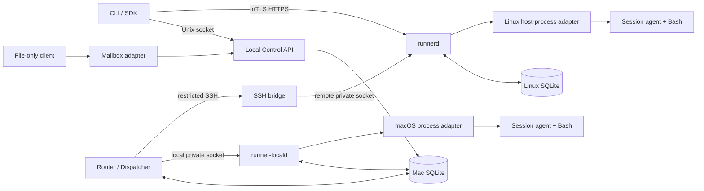

# Remote Session Runner — Detailed PoC Design

**Status:** Implementation design; proposed baselines require the validation gates in §17.<br>
**Authority:** [Initial design](../020-initial-design/010-remote-session-runner-initial-design.md) is authoritative for PoC scope and behavior. The [earlier detailed v2 proposal](../010-initial-idea/020-md/runner_remote_execution_detailed_design_v2.md) is reference material only where compatible.<br>
**Platforms:** one macOS workstation and one Linux execution host.<br>
**Language:** Go for services, CLI, bridge, and session agent; Bash is the persistent session shell.

## 1. Purpose and contract

A caller chooses `local` or `remote` when creating a session. Later commands inherit that immutable target. Both targets have the same resource and command-event semantics, but they run on different machines under different host accounts: local commands use `tomasz.walczuk`'s macOS permissions; remote commands run directly as `ubuntu` on Linux. Neither target has per-session filesystem, network, or resource isolation in this PoC. There is no automatic target fallback.

The three ingress paths are: the Mac's HTTP/JSON Unix-socket API (local or queued remote), a file mailbox imported through that API (local or queued remote), and the Linux host's direct HTTPS API (remote only). A CLI invocation selects its ingress through `--endpoint` or a configured connection profile; it never guesses from a resource ID. The Mac Router/Dispatcher chooses the execution driver after local intent is committed. It is distinct from the local execution service, but `runner-locald` and remote `runnerd` run the same shared execution-engine code with different runtime adapters.

Normative words **MUST**, **SHOULD**, and **MAY** describe the PoC contract. A choice marked **proposed baseline** is an implementation choice to validate on the actual hosts, not a claim that the host already supports it. The design does not promise exactly-once external side effects: idempotency prevents duplicate *resource submission* within the retention window, while a command can independently affect external systems.

### 1.1 Fixed PoC boundaries

| Area | Decision |
| --- | --- |
| Session | One target, one runtime, one long-lived Bash process, one controlling ingress identity. No shell reattachment after executor restart. |
| Execution | One running command per session, at most four running commands per execution host by default, at most 20 active sessions per host. |
| Durability | A command and its accepted event commit on its target authority before scheduling; events commit before streaming. |
| Local authority | Local SQLite is authoritative for local-target sessions and commands. It also stores queued-remote intent and a read-only remote projection. |
| Remote authority | Remote SQLite is authoritative for every remote-target session and command, whether queued or direct. |
| Source | `empty`, exact resolved `git_revision` on the selected host, or local-only `local_worktree`. No uncommitted-file synchronization. |
| Local permissions | Local services, shell, and child processes use one configured macOS account. OS permissions govern access; a worktree path is a starting directory, not confinement. |
| Remote permissions | `runnerd`, agent, shell, and children run as the existing `ubuntu` account on Linux. OS permissions, not a Runner sandbox or workspace path, define access. Only trusted development code is in scope. |
| Out of scope | PTY, arbitrary background services, port forwarding, multi-host scheduling, mixed queued/direct control, and automatic cross-target fallback. |

### 1.2 PoC implementation selections

| Decision | Proposed baseline and validation condition |
| --- | --- |
| Remote runtime | Linux host-process adapter: prepare a workspace, start an agent and persistent Bash as `ubuntu`, track their process group/known descendants and generation, and attempt bounded teardown/reconciliation. The `linux-host` profile MUST reject requested per-session CPU, memory, PID, disk, network, mount, or privilege restrictions it cannot enforce. It MUST advertise only verified service-level limits and the `os-user` boundary; no Podman/container prerequisite exists for this PoC. |
| Direct identity and TLS | In-process Go HTTPS listener exposed at public IP `129.151.232.40:8443` once deployed and tested. mTLS is mandatory: verify the server certificate's IP SAN at clients, validate trusted client certificates, and map each verified certificate identity to an authorized principal. No bearer-token or unauthenticated direct API in this PoC. Apply host/cloud source-address firewall restrictions where practical; they never replace mTLS. |
| Private remote bridge | Versioned NDJSON over an SSH forced-command channel; the bridge calls `runnerd` over an owner-restricted Unix socket using HTTP/JSON. The bridge is an adapter, never an executor. |
| Output store | SQLite event payloads first; 100 MiB combined stdout/stderr cap per command. File/object storage is deferred. |
| Named persistent volumes | Not supported by the host-process profiles in this PoC. Requests requiring mounts or persistent volumes reject before acceptance; later support needs a separate lifecycle and access design. |

## 2. Process and package architecture



| Executable / package | Responsibility and dependency boundary |
| --- | --- |
| `runner` | CLI and reusable client library; selects local Unix socket or remote HTTPS explicitly. It renders status/exit/output but never chooses a target from command text. |
| `runner-local` | Mac API, mailbox importer/projector, Router/Dispatcher, migrations, and doctor subcommands. API handlers write intent, never open SSH or start a shell. Router alone owns remote transport. |
| `runner-locald` | Mac instance of shared `ExecutionService`; owns authoritative local execution transitions, starts the local runtime adapter, and writes local command events. Private local interface only. |
| `runnerd` | Linux instance of the same `ExecutionService`; owns authoritative remote transitions, direct HTTPS, private bridge API, scheduler, and host-process adapter. |
| `runner-ssh-bridge` | SSH stdio adapter with fixed operations and protocol version. It authenticates the forced-command principal and forwards to the private `runnerd` interface. |
| `runner-session-agent` | Supervises one persistent Bash process, separate command/control channels, output readers, and child cleanup. It has no database or public API. |
| `internal/domain`, `internal/execution` | Shared types, validation, state transitions, scheduler rules, `ExecutionService`, event contract, and runtime/clock/store interfaces. No HTTP, SSH, SQLite, or host-specific process API imports in domain types. |
| `internal/{localapi,mailbox,dispatcher,httpsapi,sshbridge,store,runtime}` | Adapters around the shared core. An import-boundary test prevents ingress packages from bypassing their assigned store/transport interfaces. |

The Mac components use the same configured account for the PoC: `tomasz.walczuk`. Linux `runnerd`, its agent, Bash, and descendants all run directly as `ubuntu`. This is a behavior separation, not an OS-enforced credential boundary among same-account processes: the Mac API MUST not load SSH credentials or initiate remote connections, but a Mac command under that account may read same-user Dispatcher/SSH files. Likewise a Linux command as `ubuntu` may access host-readable `runnerd` TLS/bridge/Git credentials or service files; do not claim same-account secrets are inaccessible merely because they were omitted from its environment. Owner-only directories exclude other OS users, not commands under the owner. The Linux service does not call back into the Mac. With Go source under `src/`, the package paths shown above are relative to `src/`; `go.mod` remains at repository root so the plan's root-level Go test/vet commands work.

## 3. Domain model and identifiers

```text
Environment → Session → Command → Command Event
                         ↘ Session lifecycle record (snapshot read in PoC)
Local queued request → intent/delivery record → target authority
Mailbox request → response revision → optional event-file cursor → ACK
```

| Field | Contract |
| --- | --- |
| `session_id`, `command_id`, `job_id` | Opaque, deployment-unique, caller-visible IDs. The Mac allocates queued IDs before dispatch and sends the same IDs to the target executor; direct requests receive or supply stable IDs through the remote API. A one-off job binds one stable session ID and one stable command ID. IDs are never reused within metadata retention. |
| `ordinal` | Increasing integer allocated transactionally per session at authoritative command acceptance. It defines execution order, not wall-clock order. |
| `execution_target` | `{kind: local or remote, profile: string}`. Written at session creation; immutable thereafter. A command carries `session_id`, not a target override. |
| `environment` | Named approved runtime configuration. It declares compatible target kinds/profiles and effective capabilities. The executor rejects mismatches before authoritative acceptance with `environment_target_mismatch`; local ingress may reject known mismatches earlier. |
| `source` | `empty`, `git_revision` with configured repository alias and requested revision, or `local_worktree` with absolute existing path. The executor records the resolved commit or canonical local path and reports the effective source in session status. |
| `controller` | `(controller_type, controller_id)` fixed on session creation. Local Unix-socket and mailbox requests map to the local owner/controller. Direct HTTPS sessions map to the authenticated remote principal. Mutation through the other ingress is refused. |
| `idempotency_key` | Client-stable for every mutation. Unique within `(controller, operation, key)` while retained. A canonical request hash excludes mailbox `request_id` but includes target, environment, source, script bytes, policy, and all other behavior-changing fields. |
| `request_id` | Unique *mailbox exchange* ID and filename stem, single-use while its record is retained. Retrying a mutation uses a new `request_id` and the same idempotency key/payload. |

Use a versioned canonical JSON encoding for request hashing (fixed field names/order, normalized absent defaults, UTF-8 script bytes preserved), then SHA-256. Store the canonicalization version with each hash; reject same-key/different-hash as `idempotency_conflict`. Never compare raw JSON formatting. A successful duplicate returns the same resource and current retained result, not a second command. These guarantees hold for at least 90 days; after a key record expires, direct and file clients MUST NOT assume retry is deduplicated, and the Router MUST NOT automatically resubmit uncertain remote work.

### 3.1 Session and command states

| Resource | States | Transition rule |
| --- | --- | --- |
| Session | `requested`, `creating`, `ready`, `busy`, `closing`, `closed`, `expired`, `failed`, `lost` | `requested` is queued local intent before target acceptance; direct creation begins at `creating`. `ready ↔ busy` while shell is usable. `closing` blocks new commands. `closed`, `expired`, `failed`, and `lost` are terminal. |
| Command | `queued`, `running`, `cancelling`, `succeeded`, `failed`, `cancelled`, `timed_out`, `rejected`, `lost` | Queued commands run by ordinal or end without execution. `running` can finish normally or enter cancellation/timeout/loss. A completion racing cancellation keeps its observed normal terminal result. Terminal state is written once. |
| Queued-remote delivery | `recorded`, `dispatching`, `uncertain`, `accepted`, `reconciled`, `not_delivered` | This is local intent/transport state, **not** authoritative remote command state. Before remote acceptance, local responses omit authoritative `command_state`. |
| Mailbox exchange | `accepted`, `complete`, `rejected`, `indeterminate` | This describes the file operation, not shell success. `complete` can contain `command_state: failed`; `indeterminate` means a remote mutation may have happened. Terminal response revisions do not change. |

The common state-transition function rejects illegal edges and updates resource state with a lifecycle/command event in one database transaction. Session lifecycle records are durable but exposed as status snapshots, not a replayable session stream in this PoC. A command has a per-command event `sequence` starting at 1. Every accepted command begins with `command_queued`; `command_started`, stdout/stderr, truncation, and one terminal event follow in committed order. `dispatching` is a local *delivery* state, not a command state.

| Current state | Allowed next states | Additional condition |
| --- | --- | --- |
| Session `requested` (Mac intent) | `creating` or known `not_delivered` intent outcome | `creating` requires target acceptance; known non-delivery is not an authoritative target session state. |
| Session `creating` | `ready`, `failed`, `lost`, `closing` | `ready` needs live agent handshake; `failed` needs confirmed partial cleanup; `lost` means cleanup uncertain; explicit close may enter `closing`. |
| Session `ready` | `busy`, `closing`, `expired`, `lost` | `expired` is committed only after policy-driven teardown succeeds. |
| Session `busy` | `ready`, `closing`, `expired`, `lost` | `ready` needs a safe command boundary; `expired` needs confirmed policy teardown. |
| Session `closing` | `closed`, `lost` | Confirm teardown before `closed`. |
| Command `queued` | `running`, `cancelled`, `rejected` | `running` requires the start transaction; `cancelled`/`rejected` never source the script. |
| Command `running` | `succeeded`, `failed`, `cancelling`, `timed_out`, `lost` | Normal completion wins a race only if committed before cancellation/timeout terminal state; `timed_out` needs confirmed stop/output boundary. |
| Command `cancelling` | `cancelled`, `timed_out`, `succeeded`, `failed`, `lost` | Preserve an observed normal completion race; interruption outcomes need confirmed stop/output boundary, otherwise report `lost`. |

All other session/command states are terminal and have no outgoing transitions. The Mac `requested` state is durable local intent; `not_delivered` is a delivery outcome, not a new authoritative session state.

### 3.2 Response and error semantics

The common error envelope is `{code, message, retryable, resource_id?, details?}`; messages contain no raw script or secret. Required codes include `invalid_request`, `environment_target_mismatch`, `environment_forbidden`, `controller_mismatch`, `session_not_ready`, `idempotency_conflict`, `resource_not_found`, `quota_exceeded`, `runtime_unavailable`, `transport_uncertain`, `event_history_unavailable`, and `retention_expired`. A nonzero shell exit is **not** a transport error: command state is `failed`, exit code is returned, and a mailbox `submit_command` exchange is `complete`.

| Situation | Visible result |
| --- | --- |
| Local request committed, target not yet accepted | Local API/mailbox shows accepted *intent* and target-specific delivery/progress; no invented remote `command_state`. |
| Local mutation proven never delivered | Its create/submit/run exchange ends `request_state: rejected`, `delivery_state: not_delivered`, and a reason; allocated IDs remain for correlation but no authoritative session/command/job state or event file is invented. A close of such a never-created session can instead complete as a known no-op with `teardown_outcome: not_created`. |
| Authoritative command terminal with a proven capture boundary and contiguous retained events | Terminal command metadata and `output_complete: true` after the advertised event range is materialized. A contiguous loss-event prefix alone is not proof that all process output was captured. |
| Output cap reached but all retained events are available | `output_truncated: true`; `output_complete` may be true for retained output. Neither means full untruncated output. |
| Stop or output boundary cannot be proven | Command and session become `lost`; a terminal loss event closes the retained event prefix with `output_complete: false` and `output_unavailable_reason: capture_boundary_unconfirmed`. Host slots remain reserved until stop/teardown is confirmed. No later bytes are appended under that terminal command. |
| Remote terminal outcome known, events irrecoverably missing | Terminal command metadata, `output_complete: false`, `output_unavailable_reason: remote_event_gap`, and only the contiguous available event prefix. |
| Output retention expired while metadata remains | Same resource and terminal metadata, `output_complete: false`, `output_unavailable_reason: retention_expired`; do not fabricate a log. |
| Mutation sent over SSH, outcome not established | `delivery_state: uncertain` while reconciling; after configured deadline the mailbox response is `indeterminate`, never a fabricated reject or success. |

## 4. External and private interfaces

The public API uses HTTP/JSON v1 over a Mac Unix socket or Linux mTLS HTTPS. The local path returns accepted local intent for queued work; the direct path returns authoritative remote acceptance. The resource JSON always identifies its target, authority, controller, observed time, effective environment/source, capabilities, and (for a Mac projection) whether the remote view is stale. Mutations use `Idempotency-Key` or an equivalent request field; one-off `run` combines create/submit/close but retains the resulting session and command IDs.

The CLI verbs are identical after session creation; only the explicit endpoint changes the ingress. For example:

```text
runner --endpoint local session create --target local --profile mac-workstation --environment mac-dev
runner --endpoint local session create --target remote --profile linux-host --environment linux-dev
runner --endpoint remote session create --target remote --profile linux-host --environment linux-dev
runner --endpoint local exec SESSION_ID -- 'pwd'
runner --endpoint remote exec SESSION_ID -- 'pwd'
runner --endpoint local events COMMAND_ID --follow
runner --endpoint local session close SESSION_ID
```

The endpoint on `exec`, `events`, and `close` must match the creating ingress; an opaque ID never makes the CLI switch endpoint automatically. Status shows target, source, host class, and effective isolation/limits. API create is asynchronous: its `202` returns the stable `session_id` plus intent/authority scope before `ready`. The CLI `session create` waits and polls that same endpoint until `ready` or a terminal creation outcome by default; an explicit `--no-wait` returns the accepted ID immediately. If its bounded wait expires, the CLI reports the still-pending session ID without cancelling it. A CLI `exec` against a still-creating direct session reports `session_not_ready`, while the local queued API may durably accept and hold an early command intent as described in §6.2. File-mailbox `create_session` reaches its terminal response at readiness/failure.

| Operation | Proposed route | Local Unix socket | Direct HTTPS |
| --- | --- | --- | --- |
| Create session | `POST /v1/sessions` | `local` or queued `remote`; returns stable session ID, local intent ID, and acceptance scope | `remote` only; returns authoritative session ID |
| Read session | `GET /v1/sessions/{id}` | Local authority or remote projection, including staleness | Remote authoritative snapshot |
| Submit command | `POST /v1/sessions/{id}/commands` | Target inherited; returns intent ID/scope until target accepts | Durable remote command acceptance |
| Read command | `GET /v1/commands/{id}` | Target state/projection and output summary | Remote authoritative state/output summary |
| Replay/follow events | `GET /v1/commands/{id}/events?after=0&follow=true` | Local events or remote mirror | Remote retained NDJSON events |
| Cancel command | `POST /v1/commands/{id}/cancel` | Same controlling local ingress; may first cancel undelivered intent | Same direct controller |
| Close session | `DELETE /v1/sessions/{id}` | Propagates to target and waits/returns progress | Same direct controller |
| One-off run | `POST /v1/jobs` | Explicit target, environment, source, script; stable job/session/command IDs | Remote target only |
| Read one-off job | `GET /v1/jobs/{id}` | Local authority or remote projection, including phase/teardown | Remote authoritative job snapshot |

Creation and submit return an acceptance response only after the relevant local-intent or authoritative command transaction commits; they never wait for a command to finish. CLI `exec` can follow status/events until terminal. `GET` responses are as-of snapshots with `observed_at`. A direct event request whose requested range has expired or has an irrecoverable gap returns structured `event_history_unavailable` with `output_complete: false`, a reason, and `earliest_available_sequence` when known; it never silently starts a successful stream past missing records. If the command metadata is still retained, `GET /v1/commands/{id}` still exposes the terminal outcome and unavailable-output reason. A subscriber whose bounded buffer fills is disconnected with a resumable cursor; the command does not block on a slow reader. Replay/follow handoff MUST be gap-free: register the bounded subscriber before querying committed events, replay from the requested cursor, then deliver buffered live events with sequence-based de-duplication. Buffer overflow during replay disconnects with the last delivered cursor rather than silently skipping a commit. The same rule applies to the Mac mirror and Linux authority.

Direct HTTPS authenticates before calling `ExecutionService`, checks environment authorization and session controller for every operation, and rejects `local` target creation. The local API authenticates through the owner-only socket and account; file mailbox requests are attributed to the same local owner. The same `ExecutionService` contract suite runs against local and remote adapters; mailbox event bytes are a documented readable projection rather than an identical transport payload shape.

### 4.1 SSH bridge protocol

OpenSSH accepts only the dedicated dispatcher key and runs a fixed `runner-ssh-bridge --stdio` forced command. The bridge maps that authenticated key server-side to the queued Mac controller; `runnerd` never trusts a controller ID supplied in an NDJSON payload. PTY, shell, forwarding, and user startup files are disabled. The Go SSH client pins the host key from `known_hosts`; unknown or changed keys fail closed. The bridge's stdin/stdout carry versioned NDJSON with a maximum decoded record size of 1 MiB; stderr is diagnostic only and never carries user output. Command exit codes occur in event/command data, never as SSH exit status.

Each request includes `protocol_version`, `request_id`, `operation`, stable resource ID/idempotency key for mutations, and payload. Replies echo the correlation ID and return either a resource snapshot, a structured error, or an event stream. `hello` rejects an unsupported major version before mutations. Operations are `create_or_resume_session`, `get_session`, `submit_or_resume_command`, `get_command`, `stream_command_events`, `cancel_command`, `close_session`, `run_or_resume_job`, `get_job`, and `ping`. The bridge forwards to the private remote API; it has no scheduling, persistence, or shell logic. Output bytes on this transport are base64 encoded and chunked to at most 16 KiB raw bytes per event. Reconnect opens a new channel and resumes from durable IDs/cursors; SSH connection lifetime never owns command lifetime.

### 4.2 Required wire fields and status mapping

The versioned REST schema to be checked into code must encode these minimum obligations; additional optional fields require contract tests. HTTP mutation requests carry `Idempotency-Key`; mailbox/bridge mutations carry the same value in their JSON field. The local API allocates stable queued resource IDs before dispatch. A mutation-acceptance body includes `resource_id`, `acceptance_scope` (`local_intent` or `target_authority`), target, and current known state. It omits `command_state` for queued-remote intent until Linux confirms it. A read response includes `observed_at`, authoritative-vs-projection indicator, and stale flag where applicable.

| Result | HTTP status / required meaning |
| --- | --- |
| Local or direct create/submit accepted | `202 Accepted` after the corresponding local-intent or target-authority transaction; body distinguishes scope. Not proof of terminal execution. |
| Read/status or available event stream | `200 OK`, with resource snapshot or NDJSON sequence. |
| Same retained key, different canonical request | `409 Conflict`, code `idempotency_conflict`; no second resource. |
| Wrong controller | `403 Forbidden`, code `controller_mismatch`; no resource mutation or event disclosure. |
| Incompatible environment/target or invalid transition | `422 Unprocessable Entity`, structured reason; no authoritative acceptance. |
| Requested event range expired or irrecoverably gapped | `410 Gone`, code `event_history_unavailable`, `output_complete: false`, reason and earliest available cursor when known. |
| Runtime or durable store unavailable before acceptance | `503 Service Unavailable`, retryable only with the same key/ID and within its guarantee window. |

The command read body includes `command_id`, `session_id`, ordinal once authoritative, command state, exit code when known, `final_event_sequence` when terminal, output-complete/truncated flags, and unavailable reason when applicable. Output events include `command_id`, per-command `sequence`, `type`, timestamp, and for stdout/stderr `encoding: "base64"`, `data_base64`, and original byte count on HTTP/SSH transport. The mailbox projection changes only output payload rendering, not event identity/type/order. For example:

```json
{"command_id":"cmd-19","sequence":3,"type":"stdout","encoding":"base64","data_base64":"dGVzdAo=","byte_count":5}
```

The Mac private `runner-locald` interface is owner-only HTTP over a Unix socket. Its `POST /internal/v1/accept-intent` takes an `intent_id` and expected immutable request hash; `runner-locald` reloads the committed intent (including its Mac `intent_ordinal`) from SQLite, validates it, and returns the authoritative resource/status. The Router cannot pass arbitrary script bytes or a different target through this private call. Other private calls are read/cancel/close and event subscription by stable resource ID; they use the same shared execution contract.

A bridge submit frame has the same resource identity but no trusted caller-supplied controller field:

```json
{"protocol_version":1,"request_id":"bridge-42","operation":"submit_or_resume_command","resource_id":"cmd-19","idempotency_key":"submit-42","payload":{"session_id":"session-7","intent_ordinal":1,"script":"pwd"}}
```

The forced-command key supplies the queued controller identity server-side. Frame size limits apply before JSON decoding; `hello`/major-version checks happen before the bridge forwards this mutation. The exact checked-in OpenAPI, JSON schemas, and SQL migrations are implementation deliverables, and their generated fixtures must match the required fields and transaction rules here rather than copy the remote-only v2 appendices.

## 5. SQLite ownership, schema, and transactions

Both databases use WAL, foreign keys, a bounded busy timeout, and a durability setting sufficient to sync an accepted mutation/event before acknowledging it (proposed setting: `synchronous=FULL`). Software-crash/transaction tests check ordering and restart consistency; they do not by themselves prove physical power-loss durability, which needs storage/host validation. Migrations have a schema version and are applied before readiness. Store timestamps in UTC plus an injectable clock for expiry tests; use database transactions, not in-process mutexes, for resource uniqueness and transitions.

The *same* authoritative execution tables exist on both hosts. On the Mac, they contain only `local` executions; on Linux, only `remote` executions. Queued-remote intent and projection use different Mac tables so a projected state cannot accidentally become execution authority.

| Table (logical name) | Key columns and constraints | Writer / role |
| --- | --- | --- |
| `exec_sessions` | `session_id` PK; target kind/profile, environment, controller, source/effective revision, runtime generation, state, limits, created/updated/expiry timestamps; `target_kind` immutable. | `runner-locald` on Mac for local sessions; `runnerd` on Linux for remote sessions. |
| `exec_session_lifecycle` | `(session_id, lifecycle_sequence)` PK; previous/new state, reason, timestamp. | Same executor, in same transaction as session state. Read via status snapshots in PoC. |
| `exec_commands` | `command_id` PK; `session_id` FK, contiguous authoritative `ordinal`, optional source Mac `intent_ordinal`, request hash, immutable exact script bytes and script hash, state, timeout, exit code, final event sequence, truncation/completeness, timestamps; `UNIQUE(session_id, ordinal)`. | Target executor only. Script bytes commit with command acceptance. |
| `exec_jobs` | `job_id` PK; unique controller/one-off key/hash, stable `session_id` and `command_id`, immutable full one-off request including script bytes, durable phase, last confirmed command and teardown outcomes, timestamps. | Target executor; one-off coordinator checkpoints each step and resumes by these IDs after restart. |
| `exec_capacity_reservations` | `session_id` PK; reserved host slot and `cleanup_confirmed_at`/release time. A reservation is live until runtime teardown is confirmed, regardless of session state or ordinary metadata age. | Target executor; reserve with `creating`, release only with confirmed cleanup. |
| `exec_command_slots` | `command_id` PK; reserved host running slot and confirmed-stop/release time. A slot stays live through `running`, `cancelling`, timeout, or `lost` while a command/descendant may still execute. | Target executor; reserve with execution start, release only after a proven clean command boundary or confirmed runtime teardown. |
| `exec_command_events` | `(command_id, sequence)` PK; event type, raw output bytes or structured payload, original byte count, timestamp. Sequence begins at 1. | Target executor only; event and state transition commit together. |
| `exec_idempotency` | `(controller_type, controller_id, operation, idempotency_key)` PK; canonical hash/version, resource ID, expiry. | Target executor, same acceptance transaction as resource. |
| `local_intents` | `intent_id` PK; operation, resource ID/session ID, immutable target, canonical hash, idempotency key, immutable full request payload including exact script bytes when present, `intent_ordinal` for commands, stable job/session/command IDs for one-off `run`, acceptance/delivery state, lease owner/expiry, attempt count, timestamps; `UNIQUE(session_id, intent_ordinal)` for command intents. | Mac API writes payload/intent and allocates per-session command order; Router owns lease/delivery columns. Local executor consumes but does not rewrite request content. |
| `local_idempotency`, `local_intent_lifecycle` | Key `(controller_type, controller_id, operation, idempotency_key)` with hash/version, intent/resource ID, expiry; session-request lifecycle including `requested`/known non-delivery. | Mac API, in the same transaction as intent creation or requested-state transition. Distinct from the target executor's authoritative idempotency/lifecycle records. |
| `remote_session_views`, `remote_command_views`, `remote_job_views` | Remote IDs, last authoritative snapshot, observed time/stale flag; command terminal/output summary and one-off phase/teardown. No local execution transition API. | Mac Router from remote reads. |
| `remote_mirror_events`, `remote_mirror_cursors`, `remote_event_gaps` | `(command_id, remote_sequence)` unique; highest contiguous cursor; durable missing range and reason for irrecoverable gaps. | Mac Router; event insert and contiguous cursor advancement share a transaction. |
| `mailbox_exchanges` | `request_id` PK; operation, request hash, bound intent/resource, `request_state`, `response_revision`, immutable terminal response bytes/hash, frozen available event cursor, terminal/ACK/cleanup timestamps. | Mailbox adapter through Mac SQLite. |
| `audit_records` | Monotonic row ID, principal, ingress, environment, resource IDs, action, outcome, timestamp; no raw script or output. | Respective host's ingress/executor. |

Indexes cover pending intent by lease/time, executable command by `(session_id, ordinal, state)`, live session/command capacity reservations, mailbox terminal cleanup deadline, and remote mirror `(command_id, remote_sequence)`. Foreign keys prevent orphan command/event rows. The PoC limits script UTF-8 bytes to 128 KiB and the serialized request/bridge frame to 1 MiB, rejecting oversize input before intent or authority acceptance. Exact request/script bytes are stored in SQLite as immutable BLOBs in the same acceptance transaction as their IDs; a hash alone or a temporary script path is not durable payload storage. Script bytes and output events are sensitive: database, WAL, backups, temporary scripts, and mailbox files use owner-restricted permissions. An audit record may contain a script hash and size but not raw script or output. Retention deletes output payloads before metadata; it does not delete an active command's events, one-off payload before its coordinator finishes, or session/command rows with live runtime reservations whose cleanup remains unconfirmed.

At minimum, SQL migrations enforce the following keys (names may differ in code); application-level checks supplement, not replace, them:

```sql
CREATE UNIQUE INDEX ux_local_command_intent_order
  ON local_intents(session_id, intent_ordinal)
  WHERE operation = 'submit_command' AND intent_ordinal IS NOT NULL;
CREATE UNIQUE INDEX ux_local_idempotency_key
  ON local_idempotency(controller_type, controller_id, operation, idempotency_key);
CREATE UNIQUE INDEX ux_authoritative_command_order
  ON exec_commands(session_id, ordinal);
CREATE UNIQUE INDEX ux_mirrored_event
  ON remote_mirror_events(command_id, remote_sequence);
```

`exec_command_events` has primary key `(command_id, sequence)`, `mailbox_exchanges` has primary key `request_id`, and every command/intended command references its session. Migration tests create a prior-version database, apply migrations, verify these constraints and retained data, then reopen it with WAL. Do not copy the older remote-only DDL: local authority, local intent order, mailbox revisions/ACKs, and gap records require new tables/columns.

### 5.1 Required transaction boundaries

1. **Local ingress:** validate request shape/owner; insert or find `local_intents` (with immutable full payload) and `local_idempotency` in one transaction, plus a requested lifecycle record for session creation. For command submission, allocate `intent_ordinal` transactionally under that session's Mac sequence and keep it immutable. A queued-remote intent starts `delivery_state: recorded`. Replying at this point proves only Mac receipt.
2. **Authoritative session acceptance:** check controller/environment/target compatibility and idempotency; in one SQLite write transaction (`BEGIN IMMEDIATE`), count live host capacity reservations, reject at the 20-session limit, and insert `exec_sessions(state=creating)`, its lifecycle record, idempotency record, and capacity reservation. A duplicate with the same hash returns the existing resource without reserving twice; changed hash conflicts. Runtime creation happens *after* this commit. A slot is released only in the transaction recording confirmed runtime teardown, including a failed creation; `lost` with uncertain residual cleanup keeps its reservation until operator/reconciler confirmation.
3. **Authoritative command acceptance:** lock/check session state and allocate the authority's next contiguous `ordinal` for either ingress. For queued work, retain the Mac `intent_ordinal` as provenance, **not** as the authoritative ordinal: an earlier Mac intent may have been definitely cancelled before delivery, leaving an intentional gap in Mac intent numbers. Insert `exec_commands(state=queued)` with exact immutable script bytes/hash, `exec_command_events(sequence=1,type=command_queued)`, and idempotency record atomically. Only after commit may the scheduler see it.
   **One-off acceptance:** first insert/find `exec_jobs` with its immutable full request and idempotency record with stable job/session/command IDs in one transaction; Mac ingress has already committed those IDs and the full request with its `run` intent. The job coordinator uses stable derived step keys for session creation, command submission, and close. It checkpoints each phase after the underlying authoritative transaction and, after a crash, reads the IDs/resources and stored payload before resuming a missing step. It never submits a second command or creates a replacement shell because a checkpoint lagged.
4. **Execution start:** under scheduler ownership, verify the persisted script hash and prepare its protected temporary script before the start transaction; a missing/corrupt payload or failed preparation rejects the still-queued command without sourcing it. In one SQLite write transaction, assert session `ready`, command is lowest eligible ordinal and `queued`, and fewer than four host command slots are live; reserve a slot, set session `busy`, command `running`, and append `command_started` before asking the agent to source the prepared script. A crash after this commit but before actual source is conservatively recovered as `lost`, not retried under the same shell.
5. **Output and completion:** persist ordered raw output chunks before publishing them to streams. For normal completion or confirmed interruption, drain the command's output boundary and commit terminal state, terminal event/final sequence, session transition, audit summary, and command-slot release consistently. If stop/EOF cannot be proven, abandon further capture for that command, commit `lost` with one terminal loss event and `output_complete: false`/`capture_boundary_unconfirmed`, make the session `lost`, and keep its live slots until later teardown confirmation. No events append after the terminal loss event. Never free a slot merely because state changes to `cancelling`, `timed_out`, or `lost`; never commit a second terminal state. If storage fails while a command runs, stop accepting work, attempt to stop the runtime, and report conservatively; do not claim lost bytes are complete.
6. **Remote mirroring:** insert each remote event under `(command_id, sequence)` and advance only the highest contiguous cursor in the same Mac transaction. Duplicate delivery is harmless. A separately confirmed remote terminal result plus a durably recorded irrecoverable gap permits later queued commands, but does not advance the contiguous cursor across missing records or invent a terminal event.
7. **Mailbox publication:** store each response revision before writing its file projection. Store the exact terminal response bytes and its frozen cursor; a later process restart republishes those bytes, not a newly calculated answer that could change. Before republishing a response after crash, repair/rebuild its advertised event-file prefix from SQLite. An ACK transaction records `acknowledged_at` only after matching terminal revision and available cursor.

For local-target work, the Mac API's intent insert and `runner-locald`'s authoritative acceptance are distinct transactions in the same SQLite file; neither side treats the first as execution acceptance. A local executor retry consumes the same stable resource ID/hash. For remote-target work, only the Linux transaction is execution acceptance, and the Mac mirror is never allowed to assign authoritative command state before remote confirmation.

## 6. Shared execution service and scheduler

`ExecutionService` exposes create/read session, submit/read command, stream events, cancel, close, and one-off job operations. It depends on `AuthorityStore`, `SessionRuntime`, `Clock`, `EventPublisher`, and `EnvironmentResolver` interfaces. Both service instances run the same transition and scheduler code; only their store paths, runtime adapter, ingress authorization, and advertised capabilities differ.

### 6.1 Session creation

1. Validate principal/controller, immutable target, environment authorization and target/profile compatibility, source mode, and requested limits. Both host-process profiles reject any requested per-session isolation or resource policy they cannot enforce; neither advertises sandbox confinement. Service-level limits are validated separately and returned as effective capabilities.
2. Atomically reserve host capacity and persist authoritative `creating` and lifecycle record as §5.1 specifies. Queue mode has already persisted a Mac `requested` intent; direct mode begins here. A Mac intent is not itself a host-capacity reservation and may later receive a known quota rejection from its target.
3. Resolve the source on the selected host. `empty` creates a private ephemeral workspace; `git_revision` uses a configured repository alias/read-only host credential, resolves and verifies an exact commit, then prepares a session-specific worktree; `local_worktree` is accepted only locally, requires an existing accessible absolute directory, records its canonical path, and never confines the command to it.
4. Create the runtime, start the agent/Bash, obtain a ready handshake with session ID and generation, and record effective source/capabilities. Commit `ready` with lifecycle record before reporting readiness. If preparation fails, clean partial resources; commit `failed` after confirmed cleanup or `lost` when cleanup cannot be confirmed.

The effective environment name, target/profile, host class, isolation level, source revision/path, limits actually enforced, and runtime generation appear in session status. Configuration edits affect new sessions only; an active runtime retains the effective specification captured at creation. `local_worktree` is explicitly marked non-portable and potentially mutable by other processes under the same account.

### 6.2 Command dispatch and persistent state

The executor accepts commands in a ready or busy session and assigns contiguous authoritative ordinals as §5.1 specifies. The Mac API may durably accept a command intent for a locally controlled session still `requested` or `creating`; the Router holds it until that session is authoritatively `ready`, then dispatches in intent order. If creation becomes terminal, or close blocks dispatch first, the held intent ends `not_delivered` with that reason and is never sent. An uncertain already-sent intent must still be reconciled, not reclassified as unsent. Direct HTTPS command submission during `creating` returns `session_not_ready` without command acceptance. The Mac API allocates `intent_ordinal` at local submission; the Router dispatches that session's intents in that order. It may pass a definitely settled `not_delivered`/cancelled predecessor, but never sends a later intent while an earlier acceptance is uncertain. This keeps order without requiring identical Mac and target ordinal numbers. A fair host scheduler chooses the oldest eligible session/authoritative ordinal while respecting one command-runtime slot per session and four live slots per host by default, including commands being interrupted. It does not skip an earlier accepted command in that session. Commands submitted while busy wait durably. Closing/expired/lost/failed sessions reject new submissions, and already-accepted queued commands get an authoritative non-execution terminal state if the shell is lost.

The runtime materializes the accepted script bytes into a private mode-0600, synced temporary script and asks the *existing* Bash process to `source` it. This preserves shell variables, current directory, functions, aliases, `umask`, and activation state while Bash lives. A normal nonzero exit commits command `failed` but returns the session to `ready` if the agent proves a clean boundary. The agent uses a reserved control channel for command ID and exit status, not a marker in stdout/stderr. A command that calls `exit`/`exec`, corrupts reserved descriptors, or leaves an unclean process tree makes the session `lost` or safely closed; there is no silent replacement shell under the same session ID.

### 6.3 Cancellation, timeout, close, expiry

`cancel_command` is an idempotent *request*, not a promise that the final state will be `cancelled`. If the command is still queued at the authority, the executor atomically marks it `cancelled` without starting it. If running, it records `cancelling`, sends a graceful stop, waits a bounded grace period, then kills known descendants. Its host command slot remains reserved throughout grace/kill and any uncertain residual execution; cancellation is not extra host capacity. A normal completion committed first wins the race and keeps its actual `succeeded`/`failed` state. A running command becomes `cancelled` or `timed_out` only after the interruption wins **and** stop/output boundary is confirmed; otherwise it becomes `lost` with incomplete output and retained capacity as §5.1 describes. The default is to close/lose the stateful session after interruption unless a clean shell/process boundary can be proven; PoC may conservatively close every interrupted session.

For local ingress, the default `close_session` first durably blocks further dispatch for that session and marks *definitely undelivered* Mac intents `not_delivered` with a reason. If even the create intent was proven never delivered, no target session/runtime exists: close completes as a known local no-op with `teardown_outcome: not_created`, and the original create/submit/run exchanges reject as `not_delivered` without fabricated authoritative states. An in-flight mutation that may have reached either executor is **not** falsely cancelled as undelivered; it must be reconciled by stable ID and then closed/cancelled at the authority. The target executor marks the session `closing`, atomically cancels commands still queued when it processes the close, requests cancellation of any command already running, and tears down shell/runtime. A queued-remote command may begin before the close reaches Linux and may have side effects; it is then treated as active. Confirmed teardown commits `closed`; unconfirmed cleanup commits `lost` or leaves a queued-remote mailbox exchange `indeterminate` while remote authority is unreachable. Idle timeout (30 minutes) runs only while `ready` **and no authoritative command is queued**: it starts/resets on entering that idle condition, pauses while accepted commands await host capacity, and never expires a running command. The authority cannot account for an unaccepted Mac intent it has not seen. Maximum lifetime (4 hours) is an independent wall-clock cap even while busy. Both policies use the teardown machinery, ending `expired` only after cleanup is confirmed; a failure ends `lost`. A command timeout defaults to 30 minutes and has a configurable hard upper bound.

### 6.4 One-off job

`run`/`POST /v1/jobs` creates an ephemeral session with the explicit target/environment/source, submits exactly one command, follows its outcome, and requests close. The durable `exec_jobs` row binds the one-off key/hash to one `job_id`, `session_id`, and `command_id` before any runtime starts. The coordinator advances through session creation, command acceptance/terminal observation, and teardown, recording confirmed phases/outcomes; restart resumes from those IDs and target states, not by allocating a new session or command. If the executor restarts and loses the shell, the job records the resulting loss and teardown instead of rerunning the script. A changed payload with the same key conflicts. Its result carries job, session, and command IDs, actual command exit/state/output flags, and teardown state. A successful command with failed teardown is not mislabeled a wholly successful job. It uses the same command/event store as ordinary sessions, not a separate one-shot executor.

## 7. Runtime adapters and session-agent protocol

The `SessionRuntime` interface has `Prepare`, `StartAgent`, `Stop`, `Inspect`, and `Cleanup` operations keyed by session ID and generation. Runtime records retain the generation plus process identity (PID and start-time where available) so restart reconciliation does not mistake a reused PID for the old agent. The macOS adapter starts a process under the configured account in a private workspace or selected worktree. The Linux adapter starts the agent and its persistent Bash directly as `ubuntu` in a private workspace. Both use the account's OS permissions, report only verified capabilities, track process groups/known descendants, and attempt bounded stop/cleanup. A process group is for lifecycle tracking, not a security boundary: a command may spawn outside it or retain access to other `ubuntu` resources, and uncertain residual execution keeps capacity reserved and is reported as `lost`/degraded rather than claimed cleaned up. Neither adapter offers per-session filesystem, network, mount, CPU, memory, PID, disk, or privilege isolation.

The agent owns one Bash process and three logically separate paths: an agent-to-shell command channel, a shell-to-agent control channel, and command-scoped stdout/stderr byte streams. A shell wrapper redirects each `source` invocation to fresh stdout/stderr pipes without creating a replacement shell; source-driven shell state persists. Control frames contain command ID, completion code, and agent generation; they have strict framing and size limits. Scripts are never interpolated into control frames. The agent reads both output pipes concurrently and sends at most 16 KiB raw chunks (or after about 50 ms under normal load) to the executor. `ExecutionService` persists ordered events before publishing them to subscribers; the agent has no database. Reserved descriptors, agent-prefixed shell variables/functions, and the command channel are outside the user-command contract. The agent detects a broken control channel or unexpected Bash exit and reports loss rather than guessing completion from printed text.

The completion control frame alone is not a terminal-output barrier: bytes already written to the separate pipes may still be unread. Before normal completion or confirmed interruption, the agent must drain both command-scoped pipes through EOF, finish known descendant cleanup, and confirm restored shell/control descriptors; only then is full captured output known. If EOF or the clean boundary cannot be proven within a bounded grace period, the agent attempts teardown, then explicitly abandons capture and reports loss: `ExecutionService` writes one terminal `command_lost` event after the durable prefix, fixes `final_event_sequence`, marks output incomplete with `capture_boundary_unconfirmed`, and never attributes later bytes to another command. An unconfirmed residual process keeps its capacity slots; no next command uses that shell. In particular, arbitrary background services are unsupported. Process-tree controls on both hosts are best-effort under the account's OS permissions; neither host-process adapter claims hostile-code containment.

Raw stdout/stderr are stored without text conversion. The combined cap is 100 MiB per command. On reaching it, emit exactly one `output_truncated` event and either continue draining/discarding excess bytes (default) or terminate by an explicit profile policy. Draining is mandatory so a full pipe cannot deadlock Bash. Final command state reflects the actual exit/interruption; `output_truncated` is independent of missing stored events (`output_complete: false`). If the event writer cannot persist safely, stop/terminate the command rather than silently lose unbounded output.

## 8. Mac Router, delivery, and reconciliation

The Router claims Mac `local_intents` using a database lease and an instance ID. A claim transaction checks due time, lease expiry, target, and the immutable `intent_ordinal`; a worker renews its lease while operating. For each session, it dispatches command intents in ordinal order, passing only predecessors definitely settled without delivery, and never skips an earlier unknown/uncertain acceptance. Leases recover work after crashes but are **not** duplicate-execution protection. Stable IDs, canonical hashes, and the target executor's idempotency record provide that protection within retention. The first implementation can use event wakeups plus a bounded poll, one SSH connection per operation, and one synchronizer per active remote command; connection pooling is optional.

| Intent target | Driver | Acceptance and status rule |
| --- | --- | --- |
| `local` | Private `runner-locald` interface | Local executor consumes the stable intent ID and commits the authoritative local resource/event in Mac SQLite. Router records progress but does not itself start Bash. |
| `remote` | Restricted SSH bridge to `runnerd` | Linux executor commits acceptance. Mac `delivery_state` moves through recorded/dispatching/uncertain/accepted/reconciled; command/session state is copied only from confirmed remote authority. |

When SSH disconnects around a mutation, the Router queries by stable resource ID; if needed and still within the idempotency window, it repeats the **same** mutation with the **same** ID/key/hash. It never allocates a replacement resource on transport failure and never silently sends the command to the Mac. A definitely undelivered intent can become `not_delivered` with a reason; an outcome that may have reached Linux remains `uncertain`. The default reconciliation deadline is 24 hours, configurable. At the deadline the file response becomes immutable `indeterminate`; the durable intent remains marked unresolved for operator/status investigation, and later session commands remain blocked until authority is known. The Router does not retry after the remote idempotency record's guarantee expires.

For accepted remote work, the Router reads each command from its last *contiguous* mirrored event sequence. It writes event plus cursor atomically and de-duplicates by `(command_id, remote_sequence)`. It fetches missing sequence ranges before dispatching another command for that session. If the remote terminal state is independently confirmed but a gap is irrecoverable (for example, remote output retention expired before mirroring), it records the missing range and `remote_event_gap` in Mac SQLite, exposes only the contiguous available prefix, and may dispatch the next command; each command has its own cursor. It does not claim a complete log or synthesize terminal events. Projection snapshots carry `observed_at` and a stale/reconciling flag.

On restart, expired leases are reclaimed. Local session/command/job intent remains pending until the appropriate executor returns a known result. A Mac sleep/network outage does not stop a remotely accepted command or one-off job; the Router reconnects, reads authoritative session/command/job state, then replays events after its cursor. A remote generation change never implies a usable old shell. The Router mirrors `lost`/terminal outcomes and rejects or cancels work queued behind a terminal session; it never creates a replacement shell under the same session ID.

## 9. File mailbox protocol

The mailbox is an alternate **local ingress and projection**, not a worker or database. It resides in one configured owner-only root with `inbox/`, `outbox/`, `events/`, and `acks/`. Direct HTTPS clients have no mailbox access. Directory mode is 0700 and files are 0600 under the configured Mac account. The importer accepts regular files only, refuses symlinks, validates basename and embedded `request_id`, limits JSON/script sizes, and never uses untrusted paths as output paths. A safe filename can identify a rejection response when JSON lacks a readable ID; unsafe names are quarantined/audited.

### 9.1 Request submission and operation fields

The file-only client writes and closes `inbox/<request_id>.json`, then publishes `inbox/<request_id>.ready` last. A temporary file plus atomic rename is preferred when available. The importer ignores unmarked drafts. After seeing a marker, it reads a bounded immutable JSON request, verifies that the filename stem matches `request_id`, validates ownership/schema/controller/target, and commits accepted intent or a rejection receipt before deleting the inbox pair. A crash between commit and deletion replays through the stored request ID and cannot execute twice.

Every request contains `request_id` and `operation`. Every mutation also contains `idempotency_key`. Required additional fields are:

| Operation | Required input | Terminal response boundary |
| --- | --- | --- |
| `create_session` | `environment`, `execution_target.kind`, `execution_target.profile`; optional `source`/limits/policy | Authoritative `ready` or known terminal creation failure; a proven never-delivered create instead ends `rejected`/`not_delivered` without a `session_state`. |
| `get_session` | `session_id` | One as-of snapshot, even if session is active. |
| `submit_command` | `session_id`, `script`; optional timeout | Authoritative terminal command plus available/incomplete output status; a proven never-delivered intent instead ends `rejected`/`not_delivered` without a `command_state` or events. |
| `get_command` | `command_id` | One as-of snapshot and frozen available event cursor. |
| `cancel_command` | `command_id` | Intent atomically cancelled before dispatch, or target confirms cancellation *request* or already-terminal state. |
| `close_session` | `session_id`; optional close policy | Authoritative terminal teardown confirmed, or a proven never-created session closed locally as `complete` with `teardown_outcome: not_created`; uncertain acceptance still requires reconciliation. |
| `run` | `environment`, explicit target kind/profile, `script`; optional `source`/limits/policy | One-off command terminal/output status and ephemeral teardown outcome; a proven never-delivered job instead ends `rejected`/`not_delivered` with no authoritative job/command state. |

For a proven never-delivered resource, `get_session`, `get_command`, or `GET /v1/jobs/{id}` returns the retained local intent/outcome snapshot by its allocated ID, with `delivery_state: not_delivered` and no invented authoritative session, command, or job state; no command-event file is advertised. A possibly delivered remote mutation remains uncertain until reconciled and never takes this shortcut. Omitted `source` means `empty`. A `create_session` or `run` environment must be compatible with its target/profile. A command request never overrides the session target. For example, the following two files form a local-session create then submit sequence (the second is written only after the first response returns `session_id`):

```json
{"request_id":"req-101","idempotency_key":"create-101","operation":"create_session","environment":"mac-dev","execution_target":{"kind":"local","profile":"mac-workstation"},"source":{"mode":"empty"}}
```

```json
{"request_id":"req-102","idempotency_key":"submit-102","operation":"submit_command","session_id":"session-101","script":"pwd"}
```

Changing only the first request's target to `{ "kind": "remote", "profile": "linux-host" }` and selecting a compatible `linux-dev` environment creates a *queued remote* session through the same files. It does not create a direct-HTTPS session.

### 9.2 Response publication and output files

Each exchange has `outbox/<request_id>.json`. The importer/projector stores `response_revision` in SQLite and increments it for each published change, including the terminal transition. It writes a temporary file in the same directory, syncs it, atomically renames it over the visible response, and syncs the directory; readers see either the prior complete JSON or the next complete JSON. Terminal response bytes and revision are immutable in SQLite. `request_state: accepted` means Mac receipt only; `complete` means the operation's tabled boundary is known; `rejected` means no execution was accepted for that operation; `indeterminate` means remote execution may have occurred but cannot be reconciled by the deadline. A new status exchange, not mutation of an old terminal response, may later reveal a changed resource state.

An illustrative completed submit response is:

```json
{"request_id":"req-102","operation":"submit_command","request_state":"complete","response_revision":4,"session_id":"session-101","command_id":"cmd-102","command_state":"succeeded","exit_code":0,"final_event_sequence":4,"available_event_sequence":4,"output_complete":true,"output_truncated":false,"events_file":"events/cmd-102.ndjson"}
```

Every command response with `available_event_sequence > 0` names `events/<command_id>.ndjson`, including when its small stdout/stderr preview fits inline. The file contains newline-terminated, per-command-sequenced events. Non-output records retain event type/state metadata. For stdout/stderr, the mailbox projection uses `{ "encoding": "utf8", "text": "...", "byte_count": N }` only when that *whole stored chunk* is valid UTF-8; otherwise it uses `{ "encoding": "base64", "data_base64": "...", "byte_count": N }`. A multibyte character split between stored chunks may therefore yield base64 chunks; no bytes are dropped or replaced. Remote transport output may remain base64. Inline `stdout`/`stderr` are bounded UTF-8 previews only and never replace the event file as the lossless ordered source.

For example, one NDJSON output record (not the entire file) is:

```json
{"command_id":"cmd-102","sequence":3,"type":"stdout","encoding":"utf8","text":"/workspace\n","byte_count":11}
```

`available_event_sequence` is the highest contiguous sequence physically published in the file, or zero if no event file is advertised. `final_event_sequence` is the authoritative terminal sequence when known. Before `submit_command`/`run` publishes a normal `complete` response with `output_complete: true`, the projector must write every retained event through the terminal sequence, flush/sync the event file and directory, then publish the terminal response atomically with matching final/available cursors. If a terminal outcome is known but events are irrecoverably missing, it may publish `complete` with `output_complete: false`, the contiguous available prefix, and `output_unavailable_reason: remote_event_gap`; it must not invent missing bytes or a terminal event. A command `lost` because capture could not be safely finished can publish its actual retained prefix and terminal loss event with `output_complete: false` and `output_unavailable_reason: capture_boundary_unconfirmed`, even when its event sequences are contiguous; this does not claim all process output was captured. After retention expiry, `get_command` returns retained metadata with `output_complete: false`, reason `retention_expired`, `available_event_sequence: 0`, and no expired event file. An active `get_command` snapshot has `output_complete: false` without an unavailable reason.

On projector restart, validate each existing NDJSON file through its last complete line/sequence. An incomplete trailing line is truncated; the projector then rebuilds or appends the contiguous prefix from durable Mac SQLite events before advertising any cursor. A terminal response is republished only after its stored frozen cursor is again backed by a synced event file. A reader that holds an old file handle after atomic rebuild reopens the named event file when polling; it does not assume a file handle is the durable identity. Mac event payloads referenced by a published terminal response remain physically retained until that response's cleanup deadline, even if the normal 30-day output window passes; this also applies to remote events already mirrored on the Mac. A new exchange after normal expiry reports `retention_expired` rather than using payloads held solely to repair an older response.

A reader waits for a terminal `request_state`, reads complete NDJSON lines only through that response's advertised cursor, then tests three independent conditions for an untruncated full answer: `request_state: complete`, `output_complete: true`, and `output_truncated: false`. An active `get_command` response freezes its as-of cursor even while a shared event file grows later; its ACK covers only the frozen response and sequence. `output_complete` describes retained bytes represented by the event file; `output_truncated` describes intentional cap loss. A response advertising cursor zero cannot claim complete command output.

### 9.3 ACK, retry, and cleanup

After reading the terminal response and its advertised available events, the client closes `acks/<request_id>.json` and publishes `acks/<request_id>.ready` last. The ACK contains `request_id`, exact terminal `response_revision`, and the advertised `available_event_sequence` when present (including zero after expiry). The adapter checks the stored terminal response, revision, and cursor before committing `acknowledged_at`; it then removes the ACK pair. Wrong revision/cursor does not trigger cleanup. Duplicate ACKs are idempotent. An ACK of incomplete output acknowledges the warning and available bytes, not the missing bytes; it is an assertion of receipt, not proof of LLM understanding.

```json
{"request_id":"req-102","response_revision":4,"available_event_sequence":4}
```

Within the at-least-90-day idempotency window, a mutation retry uses a **new** `request_id` and the **same** key/canonical payload. It returns the original resource/result without rerunning. Same key with different payload rejects in the *new* outbox with `idempotency_conflict`; it never overwrites the old response. Re-publishing a used `request_id` is ignored/quarantined while the mapping is retained. A crash after SQLite import/acceptance but before file publication regenerates the stored result without resubmitting. After the idempotency record expires, clients must not assume a key prevents duplicate execution.

Imported request/ACK pairs are removed after durable recording; abandoned unmarked drafts are removed after 24 hours. A terminal response is removed 24 hours after valid ACK or seven days after publication without ACK, configurable. A per-command event file may be shared by multiple active responses: it is deleted only when the command is terminal and every referencing response has reached its cleanup deadline. A later status request can regenerate event files from SQLite while normal output retention lasts. Output events are normally available for 30 days after command termination on both authorities; Mac payloads needed to repair an already-published terminal response are pinned through its cleanup deadline, then garbage-collected. Metadata/idempotency mappings remain for at least 90 days by default; file cleanup does not erase underlying execution records. Cleanup is restart-safe and never changes session/command state.

## 10. Security and permission boundaries

| Boundary | PoC control and truthful limitation |
| --- | --- |
| Mac account and socket | One configured account runs Mac services and local commands. Unix socket and mailbox are owner-only against other users, not same-user commands. The local shell and descendants can access anything that account can access, potentially including Dispatcher/SSH keys; Runner adds no per-command filesystem allowlist. The API/Router/locald split is architectural, not an OS credential boundary. |
| Mailbox parser | Files are untrusted input even from the owner: regular-file/no-symlink checks, safe basename, bounded reads, schema/size validation, request-ID match, immutable marker protocol, and atomic responses. Command output in files and SQLite is sensitive data. |
| Remote direct API | Public PoC endpoint `129.151.232.40:8443` with mandatory mTLS, a verified server certificate whose IP SAN covers that address, mapped client-certificate principal, and per-operation environment/controller checks. No bearer-token or unauthenticated direct API. Restrict source IPs through host/cloud firewall where practical; source filtering never replaces mTLS. |
| SSH bridge | Dedicated key, pinned server host key, forced fixed command, no interactive shell/PTY/forwarding, bounded/versioned protocol, no command exit code in SSH process status. |
| Linux host process | `runnerd`, agent, Bash, and children run as `ubuntu` with that account's OS access. Workspace and process group aid lifecycle management but do not restrict filesystem, network, privilege, CPU, memory, PID, or disk access. Only trusted code is in scope; unsupported requested policies reject before acceptance. |
| Repository credentials | Prefer public/local Git aliases for the PoC. If a host-side read-only credential is configured for Git preparation, do not inject it into the script, shell environment, or workspace; nevertheless `ubuntu` command code may be able to read same-account host files, so this is not credential isolation. Exact commit is recorded before `ready`. |
| Logging and audit | Structured logs and audit records contain IDs, principal, ingress, timing, state, and reason codes; not raw scripts, credentials, or command output. At minimum, record allowed create/submit/cancel/close actions and authorization denials with action, principal, ingress, resource ID when known, outcome, and timestamp. Arbitrary scripts/output can themselves contain secrets, so event stores/mailbox/backup require OS protection and retention; no automatic redaction promise. |

The local `local_worktree` path and remote workspace are validated/recorded for provenance and startup; neither is a chroot or access limit. Both profiles reject requests requiring per-session mount, network, privilege, CPU, memory, PID, or disk controls absent from this PoC. Effective capabilities returned to the caller are the source of truth: `isolation: os-user`, effective account, enforced service-level quotas/time/output limits, and no advertised host-resource isolation. Permission tests run the shell and a child under each configured account and show their actual OS access, including any configured denial. The public mTLS boundary authenticates clients but does not protect `runnerd`'s same-`ubuntu` credentials/files from code deliberately executed as `ubuntu`. This public host-process arrangement is an explicit PoC risk acceptance, not a production security recommendation.

## 11. Recovery, ambiguity, and shutdown

| Failure point | Durable result and recovery |
| --- | --- |
| Mac API/mailbox process restarts | Committed intents/exchanges survive in Mac SQLite. Reopen WAL, replay importer safely by request ID, regenerate terminal response/event projections while retained. No command starts solely because an unmarked draft exists. |
| Router dies before/after target acceptance | Lease expires; next Router reclaims same intent and queries/retries *same* resource/key/hash within guarantee window. Remote command may continue without the Mac. Never infer execution failure from SSH failure. |
| SSH drops during mutation | Mark delivery uncertain unless non-delivery is proven. Reconcile by stable ID. While unresolved, later commands for that session do not dispatch. After 24 hours default, mailbox response becomes `indeterminate`; investigation continues without a fresh mutation ID. |
| Mac sleeps/network fails after remote acceptance | Linux remains authoritative and executes/durably records as allowed. After wake, Router fetches authoritative status, replays from its Mac cursor, and marks the projection fresh only after reconciliation. |
| `runner-locald` or `runnerd` restarts with `creating` session | Identify/stop partial runtime by session/generation. Confirmed cleanup ends `failed`; uncertain cleanup ends `lost`. Even a shell that started before an uncommitted `ready` transition is not reused. |
| Executor restarts with `ready`/`busy` session | PoC has no reattachment. Stop known surviving processes, mark session `lost`; running command becomes `lost` unless its terminal event was already committed. If capture boundary was unproven, its retained output is incomplete with `capture_boundary_unconfirmed`; residual execution retains slots. Accepted queued commands behind it become non-execution terminal, never run in a replacement shell. |
| Executor restarts with `closing` session | Resume teardown; commit `closed` only after confirmed cleanup, otherwise `lost`. Do not expose a usable old shell. |
| One-off coordinator restarts between phases | Read its durable job row and stable session/command IDs, reconcile each authoritative step, and resume only the missing phase. A lost shell records a lost job outcome; never rerun the script to fill a missing checkpoint. |
| Agent/Bash dies or reserved channel breaks | Preserve a previously committed terminal result if present; otherwise mark active command and session `lost`, report incomplete output when capture boundary is unproven, stop known descendants, and reject queued work behind the unusable session. |
| SQLite unavailable before acceptance | Return retryable storage/service error; execute nothing. No acceptance receipt without the command/event commit. |
| Event persistence fails after execution starts | Stop new acceptance, attempt bounded command/runtime shutdown, record what can be proven, and report incomplete/unknown output. Do not claim full output or recreate the command. |
| Output cap or slow reader | Emit one truncation event and keep draining/discarding or stop by explicit policy. Disconnect slow subscribers with a resumable cursor; they cannot block Bash. |
| Mirrored remote event gap | Retry missing range. If terminal state independently confirmed and gap irrecoverable, persist gap/reason, return incomplete output, and allow later queued work without falsely advancing contiguous cursor. |
| Runtime cleanup fails | Session is `lost`, not `closed`/`expired`; its session reservation and any command slots remain live until teardown is confirmed. Audit and health/reporting expose residual process risk. |

Startup reconciliation runs before readiness: open/migrate SQLite, allocate a new service generation, inspect runtime instances labeled with Runner IDs/generations, stop or quarantine orphans, settle previous-generation sessions under the table above, and preserve their live session/command slots until cleanup is confirmed. After inspection and state settlement, unrelated current-generation work may resume only within the remaining reserved-capacity limits; known unresolved runtimes keep their slots and make health degraded. An orphan whose capacity cannot be safely attributed/contained makes its execution profile unavailable for new work, or the whole host if its profile cannot be determined, until resolved. A restart never frees capacity merely by changing a command/session state to `lost`, and a lost session is never silently repaired. Graceful shutdown stops new acceptance/dispatch, allows a bounded drain, cancels remaining active work through normal state transitions, flushes events/audit, and closes streams with resumable cursors. An unclean termination takes the restart path.

## 12. Retention, backup, and operability

| Item | Default / handling |
| --- | --- |
| Active limits | 20 reserved session slots and four live command-runtime slots per execution host; one live command slot/session. Cancelling/timed-out work retains its slot until stop is confirmed. A failed/closed/expired session releases its slot only after confirmed cleanup; uncertain residual runtimes/commands keep their slots even when state is `lost`. |
| Time | 30-minute idle timeout, four-hour maximum session lifetime, 30-minute command timeout with configurable upper bound. |
| Output | 100 MiB combined stdout/stderr cap per command; normal persisted-output visibility target within 500 ms under local load. |
| Remote uncertainty | Reconcile up to 24 hours by default; then immutable indeterminate file result rather than guessed execution. |
| Metadata/idempotency | At least 90 days on both authorities, including job-to-session/command mappings and mailbox request mappings; no automatic remote retry after the guarantee expires. Live session or command slots pin their parent metadata beyond 90 days until teardown/stop is confirmed; ordinary retention cannot free uncertain residual runtime capacity. |
| Event payloads | Normally available for 30 days after command termination on both authorities, then new reads report `retention_expired`. Active command/session events are not expired. Mac payloads referenced by an already-published terminal mailbox response stay physically pinned until its cleanup deadline so a lost event file can be rebuilt; the pin does not extend availability for new reads. |
| Mailbox projections | Import/ACK pairs after durable recording, unmarked drafts after 24 hours, terminal response 24 hours after ACK or seven days without ACK; shared events wait for all referencing response deadlines. |

The Mac uses `launchd` for local API/mailbox/Router and `runner-locald`; Linux uses `systemd` for `runnerd`. Each exposes component-specific liveness/readiness, a `doctor` command, structured logs, and counters for active sessions, queued commands, dispatch attempts, reconciliation age, event lag/gaps, truncation, storage errors, cleanup failures, and mailbox backlog. The Mac ingress remains ready to **durably accept local and queued-remote intent** when its own socket/mailbox, migration, and SQLite writes work, even if Linux or SSH is down; Router status separately reports remote transport degraded and queued work pending/uncertain. `runner-locald` readiness depends on its local process adapter, and Linux `runnerd` readiness/profile availability depends on its store, host-process adapter, effective account, and mandatory direct-API TLS configuration. A host must not advertise a profile whose declared controls it cannot enforce. Alerts are initially log/metric thresholds, not another orchestration service.

Backups use SQLite's online backup API or an equivalent WAL-aware method, not a copy of only the main database file. Store backups with the same sensitive-data protections and retention as command records. The Mac and Linux databases have **no cross-host atomic snapshot**; each is backed up/restored per host. A restore is an operator-controlled procedure: stop affected services, restore that host's consistent snapshot, inspect/stop residual runtimes, bump generation, mark old live shells lost, and reconcile queued-remote IDs/state against Linux authority before resuming dispatch. Because a stale backup can omit accepted commands or idempotency records, a restore is **not** evidence of exactly-once side effects. Workspace/persistent-volume backup is separate from SQLite backup.

Migrations are forward-versioned and tested against a copy of the prior schema. Rolling cross-version behavior is limited to one Mac and one Linux host: protocol major mismatch rejects mutations; compatible additive fields can be ignored only where semantics are unchanged. The detailed v2 source's shorter remote retention values and remote-only tables are not imported unchanged.

## 13. Configuration contract

Keep one explicit config per host with owner-restricted permissions. The examples are *shape*, not proof that the target machines already support the proposed runtime. Fail startup for unknown/invalid fields that would change security or execution semantics.

```yaml
mac:
  account: tomasz.walczuk
  api_socket: /path/owned-by-runner/local.sock
  locald_socket: /path/owned-by-runner/locald.sock
  sqlite: /path/owned-by-runner/local.db
  mailbox_root: /path/owned-by-runner/mailbox
  remote_endpoint_profile: linux-poc
  ssh_known_hosts: /path/owned-by-runner/known_hosts
  ssh_key: /path/owned-by-runner/dispatcher_ed25519
  reconciliation_deadline: 24h
linux:
  account: ubuntu
  sqlite: /path/owned-by-runner/remote.db
  private_socket: /path/owned-by-runner/runnerd.sock
  direct_https_bind: ":8443"
  direct_public_endpoint: https://129.151.232.40:8443
  server_cert: /path/owned-by-runner/server.pem
  server_key: /path/owned-by-runner/server-key.pem
  client_ca: /path/owned-by-runner/client-ca.pem
  client_principal_map: /path/owned-by-runner/client-principals.yaml
  tls_min_version: "1.3"
  runtime_adapter: linux-host-process
limits:
  active_sessions_per_host: 20
  running_commands_per_host: 4
  script_bytes_per_request: 131072
  serialized_request_bytes: 1048576
  command_timeout: 30m
  idle_timeout: 30m
  session_max_lifetime: 4h
  output_bytes_per_command: 104857600
  subscriber_buffer_bytes: 1048576
  persistence_queue_bytes: 16777216
retention:
  metadata_and_idempotency: 90d
  output_events: 30d
  mailbox_ack_grace: 24h
  mailbox_unacked: 7d
```

The `environment` registry separately defines allowed target kind/profile pairs, base host system, repository aliases and permitted source modes, effective service-level limits, and controller authorization. The PoC `mac-workstation` and `linux-host` profiles do not support mounts, named volumes, or per-session CPU/memory/PID/disk/network/privilege limits, and reject requests requiring them. `mac-dev`/`linux-dev` are illustrative names, not implicit defaults. A create request must name an environment and a target/profile; incompatible pairs reject before execution. Secrets are references resolved by host-side adapters, not inline config or script values, but same-account shell code may access host-readable secrets. The public endpoint's certificate MUST contain `129.151.232.40` as an IP SAN, and a deployed client-cert-to-principal mapping and firewall/source policy must be validated before listening publicly. The direct listener refuses startup without the configured server key/certificate, trusted client CA, and nonempty explicit identity mapping; it permits TLS 1.3 only in this PoC.

## 14. Automated-test architecture

There is no Runner implementation in this repository yet; the tests below are **required executable tests to add with the code**, not tests claimed to have run today. Each implementation slice is incomplete until its associated tests are automated. Prefer hermetic tests for rules and transactions, then real-process and real-host suites for behavior a fake cannot prove. Assertions inspect both durable DB state and caller-visible API/mailbox output, not just mock call counts.

Test seams in shared code are `Clock`, `AuthorityStore`, `Runtime`, `RemoteTransport`, `Filesystem`, and a named `FaultInjector`. A test harness supplies a fake clock (no real-time 24-hour waits), temporary WAL SQLite databases, temporary mailbox roots, fake remote authority/transport, deterministic IDs, and failpoints at commit/flush/rename/SSH/runtime boundaries. The same language-neutral contract cases run against the macOS and Linux host-process adapters where the hosts permit. Test fixtures include command scripts with nonzero exits, binary bytes, multibyte UTF-8 split across chunks, long stdout/stderr, deliberate shell death, and child processes.

| Tier | Where it runs | Gate |
| --- | --- | --- |
| Unit, state, schema, parser, repository, and fake-runtime integration | Linux or macOS CI on every change | Required PR gate; no live SSH or real host process needed. |
| Real Bash/process adapter and race tests | CI worker with Bash; macOS runner for local-specific tests | Required for local-runtime changes and before PoC demo. |
| Linux host-process identity, actual OS permissions, service limits, Git preparation, and best-effort teardown | Designated Linux host/CI runner as `ubuntu` | Required before enabling `linux-host` profile or PoC demo; no Podman gate. Unsupported isolation-policy requests must reject and must not appear as enforced capabilities. |
| SSH forced command, host-key failure, public-IP mTLS, two-host reconnect/chaos | Mac + Linux test environment, including the actual public endpoint | Required before remote PoC demo; test certificate IP SAN, mTLS negative cases, principal mapping, and firewall/source policy from the intended client network. |
| Abrupt power-loss/storage durability | Disposable hosts representative of Mac and Linux storage; remotely controlled power cut where available | Required before claiming physical power-loss durability; VM hard-off alone proves only its virtualized storage path. Record any unvalidated host as a claim limitation. |
| Soak, 500 ms event-visibility target, and backup/restore rehearsal | Reference hardware | Release qualification; report measured evidence and environment. |

### 14.1 Deterministic unit and database tests (every-change CI)

| ID | Automated fixture/action | Required assertion |
| --- | --- | --- |
| `D-01` | Table-drive every session and command transition, including invalid edges. | Only allowed edges commit; terminal state never changes; state and lifecycle/command event are atomic; target is immutable. |
| `D-02` | Create compatible/incompatible environment-target pairs; request per-session mount, volume, network, privilege, CPU, memory, PID, or disk restrictions on either host-process profile. | Mismatch or unenforceable policy rejects before authoritative acceptance; neither profile falsely advertises host-resource isolation, while service-level quotas/time/output limits remain available. |
| `D-03` | Submit two Mac command intents concurrently, delay/retry the first, cancel another predecessor before delivery, and submit direct commands across sessions. | Mac `intent_ordinal` is unique/immutable; Router preserves unsettled intent order; target assigns contiguous authoritative ordinals even after a settled undelivered Mac gap; at most one running per session and four per host. |
| `D-04` | Stop process at acceptance transaction boundaries, then reopen WAL. | No execution without committed resource plus sequence-1 accepted event; committed duplicate returns same resource/hash. |
| `D-05` | Same key/same canonical payload with new mailbox request ID; change one semantic field; vary JSON whitespace/order. | Same semantic request maps to one resource; changed request conflicts; raw formatting alone does not. |
| `D-06` | Concurrent duplicate submit and two lease holders racing after expiry. | Exactly one command resource and one execution start; lease expiry alone cannot duplicate target work. |
| `D-07` | Insert repeated/out-of-order remote events and crash around cursor transaction. | `(command_id, sequence)` de-duplicates; cursor advances only with contiguous event insert; no missing sequence is reported as complete. |
| `D-08` | Confirm terminal remote outcome with irrecoverable gap, then queue next command. | Durable gap/reason exists; previous output incomplete; next command becomes eligible without invented events or cursor jump. An unconfirmed gap still blocks dispatch. |
| `D-09` | Fake-clock expiry at 30-day output and 90-day key boundaries. | Retained metadata shows `retention_expired`; automatic Router retry stops before key guarantee lapses; no claim of deduplication afterward. |
| `D-10` | Use fake target drivers; change target/transport availability. | `local` calls only locald, `remote` only SSH; no fallback, no inferred target or command override. |
| `D-11` | Kill or fail store during runtime create/start/terminal stages. | Persisted `creating`/`busy` recover conservatively; no false `ready`, complete output, or second terminal event. |
| `D-12` | Static import-boundary test on Go package graph. | Domain does not import transport/store/runtime; Local API does not import SSH or runtime; bridge does not import scheduler. |
| `D-13` | Fake-clock ready-idle, accepted-queued-waiting-for-host-capacity, active-command, and maximum-lifetime expiry with successful/failed cleanup. | Idle clock runs only when ready with no authoritative queued work, pauses while accepted work waits, and does not expire a busy command; lifetime cap still applies; only confirmed teardown is `expired`, failure is `lost`. |
| `D-14` | Migrate prior-schema SQLite copy; load unknown security-relevant config; send unsupported bridge major version/additive compatible field. | Migration preserves records/constraints and reopens WAL; unsafe unknown config fails; major mismatch rejects before mutation while permitted additive field preserves meaning. |
| `D-15` | Race more than 20 distinct session creates on one authority, restart during creation, fail cleanup for a `lost` runtime, advance a fake clock beyond 90-day metadata expiry, then confirm cleanup. | The creation transaction reserves at most 20 host slots; duplicates consume one; unresolved cleanup pins the session and slot across retention GC; only confirmed teardown releases it. |
| `D-16` | Stop/restart API, Router, job coordinator, and executor after intent/job/command acceptance but before dispatch; corrupt or remove a stored script in a fixture. | The exact immutable bytes survive each commit/restart and are executed once; changed bytes conflict with the hash; missing/corrupt bytes reject before source, never execute a different or empty script. |
| `D-17` | Fill four host command slots, request cancel/timeout on one while a fake runtime delays stop, and race a fifth start; crash/restart the executor with a surviving child, then advance retention beyond 90 days. | Fifth command cannot start during cancellation, timeout, or after restart while residual execution holds a durable slot; runtime inspection/confirmed stop releases it exactly once; live slot and parent command metadata survive GC. |

### 14.2 Interface, mailbox, and output contract tests (every-change CI)

| ID | Automated fixture/action | Required assertion |
| --- | --- | --- |
| `I-01` | Run shared create/submit/read/cancel/close/one-off contract fixtures through Unix socket and HTTPS adapters. | Common resource IDs/states/error meanings/event types; HTTPS rejects `local`; each ingress enforces its controller. |
| `I-02` | Submit shell exit code 1, then transport/service failure separately. | Exit 1 is command `failed` with mailbox operation `complete`; transport error is not a fake command exit. |
| `I-03` | Exercise replay/follow through direct HTTPS, Mac local-authority, and Mac queued-remote mirror; commit an event exactly between replay query and live delivery, reconnect from cursor, overflow a slow subscriber during replay, and request expired range. | Detached command continues; register-before-replay plus sequence de-duplication never misses or duplicates a handoff event on any path; overflow returns resumable cursor without blocking command; expired/gapped range yields `event_history_unavailable`, not a successful partial stream. |
| `I-04` | Run one-off job with command success and forced teardown failure; crash after job-row, session, command, and teardown commits; retry same/changed key; read a proven never-delivered queued job by `GET /v1/jobs/{id}`. | Response retains stable job/session/command IDs, command success/exit/output plus failed/lost teardown; each restart resumes one durable phase without second script execution or orphan session; changed payload conflicts; a never-delivered local job read exposes only its retained intent outcome, not a fabricated authoritative job state. |
| `I-05` | Submit local and queued-remote command intents immediately after asynchronous create, then race session readiness, creation failure, close before create delivery, and an uncertain create/submit send; submit directly to a `creating` session. | Early Mac intents wait in order and dispatch only after authoritative `ready`, or reject `not_delivered` without authoritative state when creation/close wins; close of a proven never-created session completes `not_created`; uncertain sends reconcile instead of being called unsent; direct pre-ready submit returns `session_not_ready` without acceptance. |
| `I-06` | Exercise every Mac Unix-API and mailbox handler with tripwire SSH-credential loader and remote dialer, then exercise Router dispatch with instrumented equivalents. | API/mailbox handlers never load dispatcher credentials or initiate remote connections, even through generic injected interfaces; only Router uses those dependencies for remote work. |
| `I-07` | Perform allowed local/queued/direct create, submit, cancel, and close plus denied environment/controller operations; inspect each authority's audit rows and ordinary logs. | Security actions and denials have correlated action/principal/ingress/resource ID when known/outcome/timestamp records; raw scripts, output, and credential values are absent from audit/log fields. |
| `M-01` | Place JSON without marker, then marker-last; include partial JSON, oversize, unsafe name, symlink, mismatched ID, and wrong directory/file modes. | Unmarked draft never imports; invalid files produce safe rejection/quarantine; no shell starts; owned mailbox dirs/files use 0700/0600. |
| `M-02` | Inject crash after inbox DB commit before pair deletion, and after target acceptance before outbox publication. | Restart regenerates response and does not rerun mutation; inbox pair is eventually removed. |
| `M-03` | Kill projector before/after event-file sync/response rename, including mid-NDJSON append; poll concurrently. | No partial JSON or malformed appended line survives repair; after restart the advertised cursor is backed by newline-terminated contiguous events; complete result waits for synced terminal range. |
| `M-04` | Poll nonterminal revisions, then terminal; change resource later and retry used request ID. | Revisions increase; terminal bytes/revision never mutate; new status needs a new request ID. |
| `M-05` | `get_command` during active output; append events later. | Snapshot `observed_at` and cursor stay frozen; ACK covers only frozen cursor and does not claim later events. |
| `M-06` | ACK correct, duplicate, wrong revision, wrong cursor, incomplete output, and expired response. | Only exact ACK records receipt/starts early cleanup; duplicate harmless; incomplete ACK never claims missing bytes; late ACK does not resurrect. |
| `M-07` | Two responses reference one command event file; advance fake clock through ACK/no-ACK deadlines and across normal 30-day output expiry, then delete/corrupt the event file and restart the projector. | One ACK never deletes shared file; Mac SQLite payloads remain pinned until every referencing terminal response's cleanup deadline and rebuild the frozen cursor after expiry; new reads still report `retention_expired`; physical cleanup follows the last deadline. |
| `M-08` | Retry with new request ID/same key and changed payload; expire event payload but retain key; republish old request ID. | Original resource reused, conflict only in new outbox, no overwrite/second run; after output expiry return old metadata plus `retention_expired`; request ID remains single-use while mapped. |
| `M-09` | Compare tiny fully-inline output, normal, active, truncated, capture-boundary-lost, irrecoverable-gap, and retention-expired responses. | Every response with available cursor > 0 advertises an event file, even tiny inline output; lines exist through frozen cursor; full-answer triple condition is true only when warranted; contiguous loss events do not imply complete output; gap is not mislabeled truncation. |
| `M-10` | Table-drive all seven mailbox operations (`create_session`, `get_session`, `submit_command`, `get_command`, `cancel_command`, `close_session`, `run`) for local and queued-remote sessions, including close/cancel before delivery, never-delivered one-off `run`, uncertain acceptance, and attempts against a direct-created session. | Each operation uses the same validation/controller rules as the local API and the §9.1 terminal boundary; direct-created resources are inaccessible, proven non-delivery never invents authority state, uncertain sends reconcile, and one-off reports command plus teardown when accepted—all without CLI/API calls by the file client. |
| `O-01` | Store valid UTF-8, split multibyte code point, arbitrary binary, NUL, and marker-looking text. | Each mailbox output chunk is readable UTF-8 only if valid; otherwise base64; decoding reproduces exact bytes/order; printed markers never terminate a command. |
| `O-02` | Run a producer beyond 100 MiB with a reader that stops consuming. | One truncation event; agent drains or terminates by policy; no full pipe hang; subscriber/persistence buffers stay within configured byte limits plus measured process overhead; exit semantics remain truthful. |
| `O-03` | Force an event gap and later terminal status independently; force capture-boundary loss; expire output while retaining metadata. | Advertised file contains only contiguous stored events; missing bytes/events are never invented; direct and mailbox status distinguish `remote_event_gap`, `capture_boundary_unconfirmed`, and `retention_expired`. |

### 14.3 Real runtime, transport, and fault tests

| ID | Automation target | Required assertion |
| --- | --- | --- |
| `R-01` | Real Bash shared two-command suite, macOS and Linux host processes. | `cd`, exported/non-exported variables, functions, aliases, `umask`, and virtual-environment activation survive within a session; second command has same shell generation. |
| `R-02` | Real Bash suite: nonzero exit, stdout/stderr interleave, delayed pipe readers around a two-command boundary, `exit`, `exec`, reserved-FD sabotage, and background child retaining a pipe. | Normal nonzero leaves safe session ready; completion control cannot outrun captured bytes, terminal event follows both pipe EOFs, and no bytes enter the next command; unsafe boundary loses/closes session without a replacement shell or later queued execution. |
| `R-03` | Cancel/timeout/close races with descendants and Mac intents pending/uncertain dispatch, including four occupied host command slots and a child that holds an output pipe past stop grace. | Definitely undelivered intents become `not_delivered`; uncertain remote send is never falsely rejected; queued-at-authority work never starts after close; racing running result preserved; a fifth command cannot start during delayed stop; unproven stop/EOF yields `lost`, one terminal loss event, incomplete output, and retained capacity rather than `cancelled`/`timed_out`. |
| `P-MAC-01` | macOS runner using the configured `tomasz.walczuk` account and a test worktree. | Daemon, shell, and child UID match account; filesystem access matches that account's OS permissions, including any configured denial; worktree is start directory, not claimed confinement. |
| `P-MAC-02` | macOS empty, exact Git revision, and local worktree source fixtures. | Correct effective source/path/provenance; selected worktree's uncommitted files are present at session start, but this does not confine same-user access to other paths; no remote sync. |
| `P-LNX-01` | Linux host-process test on the designated machine as `ubuntu`; start agent/Bash/child, request unsupported isolation policies, then close, kill, and restart with a known surviving child. | Actual UID matches `ubuntu`; shell and child have that account's OS access, and workspace is not claimed as confinement. Capabilities report `os-user` and only verified service limits. CPU/memory/PID/disk/network/mount/privilege-policy requests reject. Generation/process identity is recorded; known descendants are stopped where possible, while unconfirmed residuals yield `lost`, retained slots, and degraded health rather than a false cleanup claim. |
| `P-LNX-02` | Linux Git fixture with a moving branch using public/local alias, plus an optional host-side read-only credential fixture. | Resolved exact commit recorded before ready; no credential is injected into script, shell environment, or workspace, and Git prep does not run unintended hooks/write outside its declared workspace. Do not claim a host-readable credential is inaccessible to same-`ubuntu` command code. |
| `P-NET-01` | Two-host SSH fixture: wrong/changed host key, forced-command escape/PTY/forward attempts, alternate key identity, and forged controller field in a bridge frame. | Host verification fails closed; unauthorized SSH behavior denied; controller derives only from the authenticated server-side key mapping, not frame content; bridge stderr contains no user output. |
| `P-NET-02` | Public-IP mTLS fixture against `129.151.232.40:8443`: wrong/expired server certificate or missing/wrong IP SAN at client, TLS version below 1.3, untrusted/expired/missing client certificate, unmapped identity, and controller mismatch on read/events/mutation; inspect intended firewall/source policy. | Both TLS peers verified; only mapped principal accepted; older TLS, bearer-only, and unauthenticated access fail; direct API cannot create local session or disclose/control another controller's resource. Record externally observed reachability and source filtering, without treating filtering as a replacement for mTLS. |
| `P-NET-03` | Two-host direct disconnect and Mac SSH outage after remote acceptance; then reconnect. | Linux command continues detached; direct client replays ordered events without rerun; Mac projection changes from stale/uncertain to reconciled from its durable cursor. |
| `P-CLI-01` | CLI smoke suite across local, queued-remote, and direct-remote on configured hosts, including slow creation and `--no-wait`. | Same `session create`/`exec`/`events`/`close` verbs work with explicit endpoint; default create waits for ready/terminal while `--no-wait` returns the accepted ID; status displays target/isolation; wrong endpoint never inferred; nonzero exit and transport failure render distinctly. |
| `P-MBX-01` | Two-host file-only client that only creates JSON/`.ready`, polls outbox, reads events through cursor, and writes ACK; run local and queued remote. | IDs correlate across session/command/response, complete and incomplete output are distinguishable, exact ACK is recorded, and same-key retry never runs twice. No CLI/API call by client. |
| `P-STORE-01` | On disposable storage matching each authority host, automate repeated abrupt power cuts around acknowledged intent/command/event commits and reboot/reconciliation; record filesystem, SQLite sync setting, and power-control method. | Every acknowledged resource and event survives the tested failure model, no uncommitted command starts, and recovery does not rerun an already started command. A VM hard-off or software kill is labeled as such and cannot be reported as physical host power-loss proof. |
| `F-01` | Kill Mac API, Router, locald, runnerd, agent, or Bash at named phase barriers; restart with one known surviving child, with four occupied slots, and with an unattributed orphan. | Recovery matches §11: no duplicated execution, no false ready, correct `failed`/`lost`/`indeterminate`, no later command in replacement shell; known residuals retain slots but unrelated work uses only remaining capacity, a fifth start waits when all four are held, and an unattributed orphan blocks its profile or host when profile is unknown until resolved. |
| `F-02` | Hermetic fake transport drops before send, after remote commit before reply, during stream; advance fake clock past 24-hour deadline. | Known non-delivery distinct from uncertainty; same IDs/keys reconcile; deadline yields indeterminate file response, not guessed rejection. Real transport reconnect is `P-NET-03`. |
| `F-03` | Fill/lock local or remote SQLite and fail runtime cleanup. | No execution before durable acceptance; post-start failure is conservative; cleanup failure visible in session/health/audit. |
| `F-04` | WAL-aware backup, restore, generation bump, and orphan-runtime fixture. | Restore never reattaches old Bash; uncertain remote work is reconciled before dispatch; no orphan silently counted as ready. |
| `F-05` | Reference-hardware load and soak: 20 sessions/host, four active commands, bounded slow subscribers. | Quotas enforced; configured queue/buffer bounds and measured memory respected; persisted output visibility measured against 500 ms normal-load target with environment/results recorded. |
| `P-OPS-01` | Start with failed migration/DB writes/invalid host-process profile or missing required mTLS configuration, then simulate remote outage while Mac DB is healthy; run doctor. | Affected component/profile not ready and doctor reports reason without secret; Mac ingress remains ready for durable local/queued-remote intent during SSH/Linux outage, Router reports degraded. |

Parser fuzz/property tests cover JSON/NDJSON framing, IDs/path basenames, base64 round-trips, numeric bounds, cursor monotonicity, and canonical hashes. They must reject invalid inputs without panic, path traversal, or unbounded allocation. Race-enabled tests cover scheduler, subscriber fan-out, mailbox response replacement, and lease contention. Secret fixtures verify that credentials/raw scripts/output do not appear in normal structured logs or audit rows (while intentionally printed secrets remain sensitive event data, not falsely redacted).

## 15. Acceptance traceability and evidence

| Initial-design acceptance area | Automated evidence before PoC demo |
| --- | --- |
| Shared CLI/API behavior, one-off result, persistent shell | `I-01`, `I-04`, `I-05`, `R-01`, `R-02`, `P-CLI-01`, `P-MAC-01`, `P-LNX-01` on the actual target hosts. |
| Immutable target, environment compatibility, no fallback | `D-01`, `D-02`, `D-10`, `I-01`. |
| Authority, durable acceptance, idempotency, ordering | `D-03` through `D-08`, `D-15` through `D-17`, `I-05`, `M-08`, `F-01`, `F-02`; `P-STORE-01` for a physical power-loss claim. |
| File-only correlation, complete answer, ACK, retention | `M-01` through `M-10`, `O-01` through `O-03`, and two-host `P-MBX-01`. |
| Mac API credential separation, authorization audit, public direct security, reconnect, host-process permissions | `D-12`, `I-06`, `I-07`, `P-NET-01` through `P-NET-03`, `P-LNX-01`, `P-LNX-02`. |
| Restart, expiry, cancellation, cleanup, replay gaps and capture loss | `D-08`, `D-13`, `R-03`, `O-03`, `M-09`, `F-01` through `F-04`, `I-03`. |
| Limits, migrations/config, operations, backup, performance | `D-14` through `D-17`, `O-02`, `F-03` through `F-05`, `P-OPS-01`. |

The test report must identify execution machine, OS/runtime versions, target profile, command run, pass/fail, and any skipped host-dependent suite. Hermetic CI success does not prove macOS/Linux account permissions, process teardown, SSH/public-IP mTLS deployment, physical power-loss durability, or the 500 ms target. Those require their named host suites and measured evidence. No test in this PoC establishes sandbox confinement; none is designed. If `P-STORE-01` is unavailable, report software-crash durability evidence only and explicitly leave physical power-loss behavior unverified; do not infer it from `synchronous=FULL`. Failures at critical validated durability/security gates block the PoC demonstration; there is no “best-effort” claim of correctness based on documentation alone.

## 16. Implementation sequence

| Slice | Deliverable | Automated exit gate |
| --- | --- | --- |
| 0. Domain and harness | Shared types, canonical hashing, state machine, clock/fault seams, migration scaffolding. | `D-01`, `D-02`, `D-05`, `D-12`, `D-14`. |
| 1. Shared authority core | SQLite store, idempotent acceptance, session/command capacity reservations, durable scripts, scheduler, event replay, fake runtime. | `D-03`–`D-09`, `D-13`, `D-15`–`D-17`, `I-01` against fake adapters. |
| 2. Runtime adapters | `runner-locald`, local agent, Linux host-process adapter/agent, Git preparation. | `R-01`–`R-03`, `P-MAC-*`, `P-LNX-*`. |
| 3. SSH bridge | Forced command, versioned protocol, strict host key, remote reconnect. | `P-NET-01`, `F-02`, then `P-NET-03`; no transport/command-exit confusion. |
| 4. Mac ingress and mailbox | Unix API, Router, remote mirror/gap, file requests/responses/events/ACKs, one-off job. | `M-01`–`M-10`, `O-01`–`O-03`, `D-09`–`D-10`, `I-04`–`I-07`, then `P-MBX-01`. |
| 5. Direct HTTPS | mTLS adapter, controller mapping, direct stream and CLI profile. | `P-NET-02`, `I-01`–`I-03`, `I-07`, `P-NET-03`, `P-CLI-01` on actual hosts. |
| 6. Operations and failure recovery | Retention, migrations, doctor/health, backups, alerts, chaos runs. | `F-01`–`F-05`, `P-OPS-01`, restore rehearsal, complete §15 traceability. |

No slice may introduce an alternate execution core for local commands or move remote authority into the Mac database. API/protocol/schema examples from detailed v2 must be updated to this document's local target, mailbox, per-command sequence, output, retention, and recovery contracts before implementation.

## 17. Validation gates and remaining choices

1. **Host-process runtime feasibility:** verify direct `ubuntu` agent/Bash/child execution on the intended Linux host, process identity/generation tracking, requested-policy rejection, and best-effort teardown through `P-LNX-01`. No Podman installation or container sandbox gate applies. If a service-level control cannot be enforced, do not advertise the profile with that control; never substitute a claim of CPU/memory/PID/disk/network/mount isolation.
2. **Mac account and local profile:** use the selected `tomasz.walczuk` account, choose owner-only service paths, and determine which limits macOS can actually enforce. Run `P-MAC-01` and document effective capabilities; local commands inherit this account's full OS permissions and Runner adds no separate filesystem permission layer to this PoC.
3. **Public direct TLS/SSH deployment:** provision a server certificate with public IP `129.151.232.40` in its SAN, client CA/certificates and explicit controller mapping, dispatcher key, and pinned SSH host key; validate and record the host/cloud firewall and source-address policy (including a reason if no source allowlist is feasible) and run `P-NET-01`/`P-NET-02` from the intended client network before direct use. mTLS is mandatory; bearer-only or unauthenticated public access is forbidden. This PoC's public endpoint does not change the trusted-code-only host-process threat boundary.
4. **Environment registry:** name real `mac-dev`/`linux-dev` (or replacement) definitions, compatible target profiles, source policies, and authorization. The illustrative names in this document do not authorize a runtime by themselves.
5. **Protocol/schema freeze:** version the REST/bridge/mailbox schemas, error catalog, and canonical request hashing before implementation. Contract tests must include cross-version rejection/compatibility and the exact output/ACK fields.
6. **Storage durability:** run `P-STORE-01` on representative disposable storage before claiming physical power-loss survival. If automated power control is unavailable, state that limitation and claim only the software-crash behavior actually tested; VM hard-off is not equivalent to a physical host power cut.
7. **Evidence before claiming complete:** run all hermetic gates plus macOS, Linux host-process, public-mTLS, and two-host suites; record skips and reference-hardware measurements. This Markdown document has no executable implementation to test yet.
