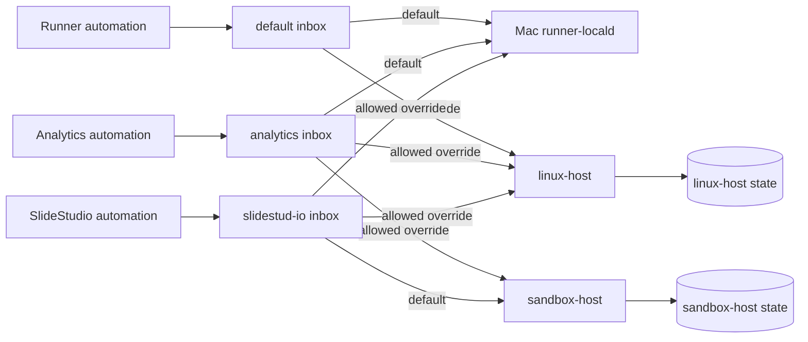

# Initial idea: multiple inboxes and remote machines

**Status:** implemented historical design. P150--P159 delivered the
configurable-inbox extension, and P157 separately accepted `sandbox-host`.
This document preserves the original decision record; current configuration,
paths, and operating rules are authoritative in
[the configuration reference](../../docs/configuration.md) and
[the mailbox guide](../../docs/mailbox.md).

## Goal

Allow one Mac installation to expose several named file-mailbox inboxes. Each
inbox is configured for one or more approved repositories and has a default
execution context. A request sent through that inbox can either use its default
or explicitly select another permitted context.

An execution context is the complete, trusted choice needed to run work:

- an environment;
- an execution target (`local` or `remote` plus its named profile); and
- for a remote target, the registered remote-machine route.

This makes it possible, for example, to keep an `analytics` inbox that normally
runs on a remote build machine, a `website` inbox that normally runs locally,
and a `shared-tools` inbox that can explicitly select one of several approved
remote machines.

## Historical planning baseline and delivered topology

At planning time the PoC had one mailbox root and one accepted Ubuntu host.
The delivered policy now has three active roots, one local context, and two
accepted remote contexts:

| Inbox | Default context | Allowed contexts |
| --- | --- | --- |
| `default` | `mac-local` | `mac-local`, `ubuntu-current` |
| `analytics` | `mac-local` | `mac-local`, `ubuntu-current`, `ubuntu-sandbox` |
| `slidestud-io` | `ubuntu-sandbox` | `ubuntu-sandbox`, `mac-local`, `ubuntu-current` |

`ubuntu-current` is `linux-dev` / `remote/linux-host`; `ubuntu-sandbox` is
`sandbox-dev` / `remote/sandbox-host`. `linux-poc` and `sandbox-poc` are
direct CLI endpoints only; mailbox remote work uses its configured restricted
queued bridge. For new `run` and `create_session` work, the current schema
accepts either no selection pair (use the inbox default) or one complete,
allowed environment/target pair (override).

The extension must retain the current safety properties:

- a mailbox remains a Mac file ingress and response projection, never an
  executor or a shell;
- a remote host remains an execution authority with its own account, state,
  credentials, and service configuration;
- the selected target of a created session remains immutable; and
- no request may supply a free-form hostname, account, endpoint, or repository
  path.

## Intended user experience

### Named inboxes

An automation publishes to a named inbox instead of a single global one. Each
named inbox owns its own `inbox`, `outbox`, `events`, `acks`, and `diagnostics`
directories. The output, acknowledgements, and safe ingress-validation
diagnostics stay in the same named inbox as the request.

Examples of useful inboxes:

| Inbox | Repository scope | Default execution | Allowed explicit selections |
| --- | --- | --- | --- |
| `default` | `remote-session-runner` | `mac-local` | `mac-local`, `ubuntu-current` |
| `analytics` | `analytics-dbt` | `mac-local` | `mac-local`, `ubuntu-current`, `ubuntu-sandbox` |
| `slidestud-io` | `slidestud-io` | `ubuntu-sandbox` | `ubuntu-sandbox`, `mac-local`, `ubuntu-current` |

The repository scope gives an automation an unambiguous home and audit label.
Initially it should be policy and routing metadata only. Materializing a
repository checkout on a target is a separate source-control feature with its
own allow-list and security design. In particular, the current remote host
allows the empty source mode only.

### Default execution and request override

For a new one-off job or session, an omitted execution selection means “use the
inbox default.” A request can override the default only by naming a complete
configured environment and target pair that is in that inbox's allow-list.

For example, `slidestud-io` defaults to `ubuntu-sandbox`, while an allowed
request can explicitly select `mac-local` or `ubuntu-current`. The response
records both the resolved target and whether it came from the inbox default or
the request override.

`submit_command`, `get_session`, `get_command`, `cancel_command`, and
`close_session` never select a new target. They act on an existing resource,
whose target is already immutable.



## Historical conceptual configuration

The following `ubuntu-build-*` illustration was the pre-delivery design
example. It is retained for design history only; it is not the active
configuration. The active names and paths are in the configuration reference.
All files remain outside the Git checkout and all secret values remain
owner-only file references.

```yaml
version: 2

execution_contexts:
  mac-local:
    environment: mac-dev
    execution_target:
      kind: local
      profile: mac-workstation
    route: local-unix-socket

  ubuntu-build-1:
    environment: ubuntu-build-1-dev
    execution_target:
      kind: remote
      profile: ubuntu-build-1-host
    queued_route: ubuntu-build-1-bridge
    direct_endpoint_profile: ubuntu-build-1-poc

  ubuntu-build-2:
    environment: ubuntu-build-2-dev
    execution_target:
      kind: remote
      profile: ubuntu-build-2-host
    queued_route: ubuntu-build-2-bridge
    direct_endpoint_profile: ubuntu-build-2-poc

mailboxes:
  website:
    root: /Users/tomasz.walczuk/Library/Application Support/RemoteSessionRunner/mailboxes/website
    repository_aliases: [website-ui, website-api]
    default_execution: mac-local
    allowed_execution: [mac-local, ubuntu-build-1]

  analytics:
    root: /Users/tomasz.walczuk/Library/Application Support/RemoteSessionRunner/mailboxes/analytics
    repository_aliases: [analytics-dbt]
    default_execution: ubuntu-build-1
    allowed_execution: [ubuntu-build-1, ubuntu-build-2]
```

Each remote-machine context needs its own host deployment and trusted route:

- the host's `runnerd` service, state database, workspace root, and execution
  account;
- a unique remote target profile and environment policy;
- for direct CLI access, its own mTLS endpoint and certificate/CA references;
- for mailbox-delivered remote work, its own pinned SSH host key, restricted
  bridge, and controller map.

The Mac mailbox remains a queued route. Selecting a remote context from an
inbox chooses its configured restricted bridge; it does not turn mailbox work
into direct mTLS traffic. Direct mTLS remains a separate CLI/client route to a
specific remote endpoint.

## Proposed request semantics

The existing request fields can provide the override. Under the new mailbox
configuration, `environment` and `execution_target` become optional together
for `run` and `create_session` only when the named inbox supplies a default.

### Use the inbox default

```json
{
  "request_id": "req-analytics-default-001",
  "idempotency_key": "analytics-default-001",
  "operation": "run",
  "repository_alias": "analytics-dbt",
  "script": "python3 --version"
}
```

The router resolves this to the `analytics` inbox's configured
`ubuntu-build-1` context.

### Override the inbox default

```json
{
  "request_id": "req-analytics-build-2-001",
  "idempotency_key": "analytics-build-2-001",
  "operation": "run",
  "repository_alias": "analytics-dbt",
  "environment": "ubuntu-build-2-dev",
  "execution_target": {
    "kind": "remote",
    "profile": "ubuntu-build-2-host"
  },
  "script": "python3 --version"
}
```

The router accepts this only if the exact environment and target pair resolves
to `ubuntu-build-2` and that context is allowed for the `analytics` inbox.

A terminal response and durable audit record should include:

```json
{
  "inbox_id": "analytics",
  "repository_alias": "analytics-dbt",
  "execution_selection_source": "request_override",
  "resolved_execution": {
    "context": "ubuntu-build-2",
    "environment": "ubuntu-build-2-dev",
    "execution_target": {
      "kind": "remote",
      "profile": "ubuntu-build-2-host"
    }
  }
}
```

`execution_selection_source` is `inbox_default` when the request omitted the
selection. This makes later investigation independent of changing defaults.

## Routing and isolation rules

1. Each inbox ID and root path is unique. Each root has owner-only `0700`
   directories and preserves the JSON-then-`.ready` marker-last protocol.
2. An inbox may reference only configured repository aliases and execution
   contexts. Unknown aliases, unknown contexts, incomplete overrides, and
   target/environment mismatches are rejected before dispatch.
3. A default execution context must also be in that inbox's allow-list.
4. A remote target is selected by a configured name, never by a hostname or
   account in the request. There is no automatic fallback from one remote host
   to another, or from remote to local.
5. Request, response, event, acknowledgement, idempotency, and audit identity
   must include an inbox namespace. An acknowledgement from one inbox must not
   affect another inbox, even if a request ID is reused.
6. A session stores its fully resolved context at creation. A later config
   change cannot retarget that session or its commands.
7. Direct and queued resources remain controller-owned as they are today. A
   queued mailbox resource is observed and managed through its inbox/queued
   route; it is not silently switched to a direct mTLS route.

## Compatibility and migration

The delivered V2 activation retained the mailbox at
`/Users/tomasz.walczuk/Library/Application Support/RemoteSessionRunner/mailbox`
as the configured `default` inbox without moving retained request or event
files. Additional service-root inboxes use
`.../RemoteSessionRunner/mailboxes/<inbox-id>/`; `slidestud-io` proves the
separate owner-safe external-root path.

Configuration needs an explicit versioned migration. An upgrade should reject
ambiguous or unsafe definitions before starting the router, including duplicate
paths, duplicate IDs, invalid owner/mode/symlink checks, defaults absent from
allow-lists, duplicate repository aliases where exclusivity is required, and
remote profiles without a verified route definition.

Existing clients that publish the current request shape to the present root
continue to use the `default` inbox. The default's configured execution should
match today's explicit behavior until users deliberately change it.

## Delivered acceptance summary

- Two inboxes can process independent work concurrently without sharing
  request, response, event, or acknowledgement files.
- An omitted selection resolves to the correct inbox default and the response
  reports `inbox_default`.
- An allowed explicit target override reaches the intended configured remote
  host and reports `request_override`.
- A disallowed, incomplete, free-form, or target/environment-mismatched
  override is rejected before dispatch and leaves no remote work.
- Repository aliases outside an inbox's scope are rejected and the accepted
  alias is included in durable audit data.
- Retrying a request preserves idempotency within its inbox and cannot collide
  with a similarly named request in another inbox.
- Session commands retain their original resolved target after a default is
  changed or a service restarts.
- Each configured remote route proves its own mTLS or restricted-SSH bridge
  readiness. A successful test against one host does not prove the others.
- The former single-inbox installation migrated to `default` without losing
  retained response, event, or acknowledgement state.

## Decisions resolved by implementation

1. A repository alias remains routing/audit metadata; it does not select or
   materialize a checkout.
2. Client request and idempotency identity is scoped by inbox, so independent
   roots retain their own durable audit identity.
3. The existing `environment` plus object `execution_target` fields are the
   override wire contract; both are omitted for an inbox default.
4. Each named remote host needs its own accepted bridge and, when direct CLI is
   enabled, its own mTLS definition and P157 evidence.
5. Configuration is validated as a complete owner-only candidate and activated
   by the documented service refresh; it is not hot-reloaded.
6. The registry is append-only in this PoC. Renaming, removing, or relocating
   a root requires a later explicit migration after durable work and files are
   retired.
