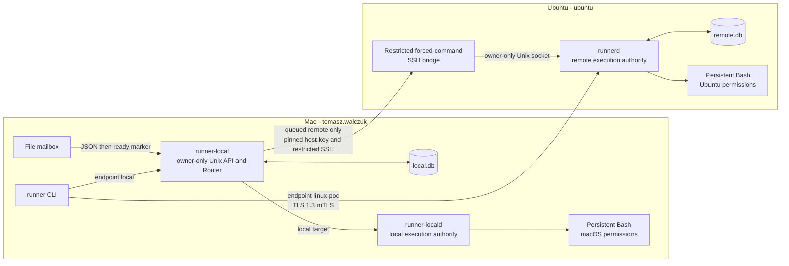
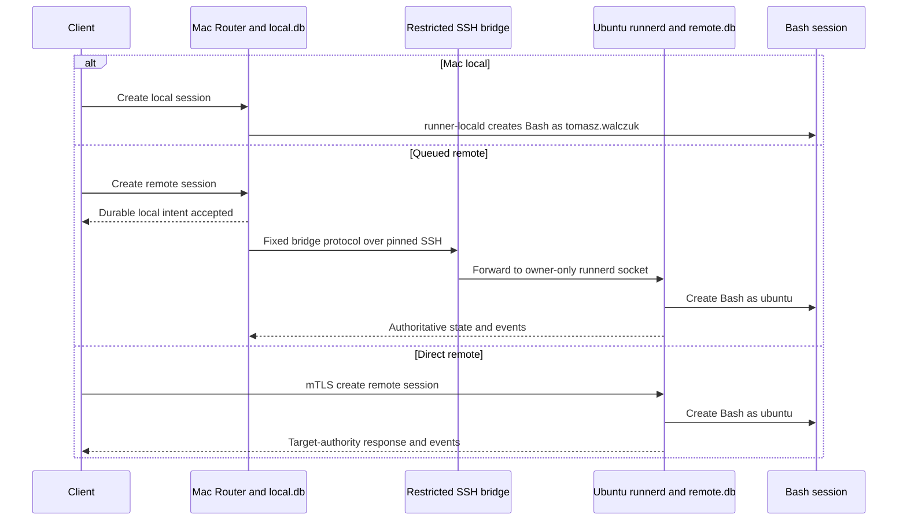

# Architecture

## Purpose and fixed topology

Remote Session Runner accepts a script request on a Mac and runs it on one of
two fixed targets:

- **Local target:** macOS as `tomasz.walczuk`.
- **Remote target:** Ubuntu as `ubuntu`.

The remote target uses a direct public HTTPS endpoint for mTLS clients. A
separate queued route can pass through the Mac Router and a restricted SSH
bridge, but that bridge must be explicitly installed and authorized on Ubuntu.
There is no automatic target fallback. No Podman container and no tunnel forms
part of this PoC.

`runner-local`, `runner-locald`, and `runnerd` persist durable metadata and
event records in their own SQLite database. A mailbox does not execute work or
become an authority; it is a Mac file ingress and response projection.

## Three access routes

| Route | CLI or client selection | Authority and execution | Availability and meaning |
| --- | --- | --- | --- |
| Mac local | `--endpoint local`, `mac-dev`, `local`, `mac-workstation` | `runner-locald` runs Bash as `tomasz.walczuk` | Normal local route. The local Unix socket authenticates the Mac OS user. |
| Queued remote | `--endpoint local`, `linux-dev`, `remote`, `linux-host` | Mac Router durably records an intent, then the restricted SSH bridge calls `runnerd`, which runs Bash as `ubuntu` | Requires the separate SSH bridge and controller-map host setup. It is deliberately not assumed to be available just because direct HTTPS works. |
| Direct remote | `--endpoint linux-poc`, `linux-dev`, `remote`, `linux-host` | Public mTLS HTTPS goes directly to `runnerd`, which runs Bash as `ubuntu` | Direct target authority. It requires the selected CA, client certificate, private key, and server-side certificate principal map. |

The session target is immutable. Commands do not include a target; they inherit
the session's target and profile.

## Authority and visibility

The controller identity differs by ingress:

| Ingress | Controller identity | Read view |
| --- | --- | --- |
| Mac local Unix socket | `local_user/tomasz.walczuk` | Local authority for Mac work; local intent or projection for queued work. |
| Queued remote through Mac | `queued_mac/tomasz.walczuk` | Mac may report `local_intent` or `projection`; `is_stale: true` means its view can lag Ubuntu. |
| Direct HTTPS | `direct_mtls/tomasz.walczuk` | Ubuntu target authority with `is_stale: false` when authoritative. |

Resources are controller-owned. A direct mTLS session cannot be managed from
the Mac mailbox or queued route, and a queued session cannot be managed through
the direct route. This stops one route from guessing or changing work owned by
another controller.

## Session and event lifecycle

A command produces ordered events beginning with `command_queued`, then
`command_started`, zero or more `stdout` or `stderr` events, and a terminal
event such as `command_succeeded`, `command_failed`, or `command_cancelled`.
Clients resume event reading from the last received sequence. A complete output
claim requires a complete retained event history and `output_complete: true`
without `output_truncated: true`.

A terminal event closes the command event history: no later event is valid.
For queued remote one-off work recovered after a Mac restart, the Mac Router
reads the remote job, command, and event state but never resends the accepted
run. It presents a terminal result only when the identity, target context,
teardown, and retained event boundary form one consistent snapshot.

## Security and operating boundaries

| Boundary | What enforces it | Practical consequence |
| --- | --- | --- |
| Mac local ingress | Owner-only Unix sockets and launchd services in the selected GUI user domain | Only the selected Mac account should operate local services. |
| Direct Ubuntu ingress | TLS 1.3 mTLS and the server certificate-principal map | The client key alone is insufficient; its certificate URI SAN must map to the selected controller. |
| Queued Ubuntu ingress | Pinned SSH host key, one restricted forced command, controller fingerprint map, owner-only runnerd socket | General SSH shell access is never part of the queued transport. |
| Script execution | OS account permissions | Workspaces are not containment. Review scripts before submitting them. |
| Persistent records | Separate SQLite state and retained event output | State can be recovered after a software process crash; physical power-cut behavior remains unverified. |

## Supported scope and limits

The PoC provides discrete script execution, persistent Bash session state,
event replay, cancellation requests, session close, one-off jobs, direct mTLS,
and the Mac mailbox protocol. It does not provide an interactive terminal,
arbitrary profile creation, arbitrary account selection, a web UI, container
isolation, or a public backup/restore command.

Software-crash recovery was exercised as the approved durability path. Do not
claim power-loss recovery until a coordinated physical power-cut test is run
and recorded.
