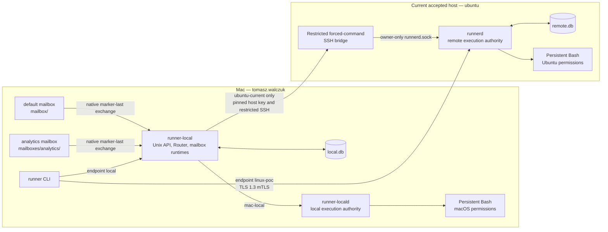
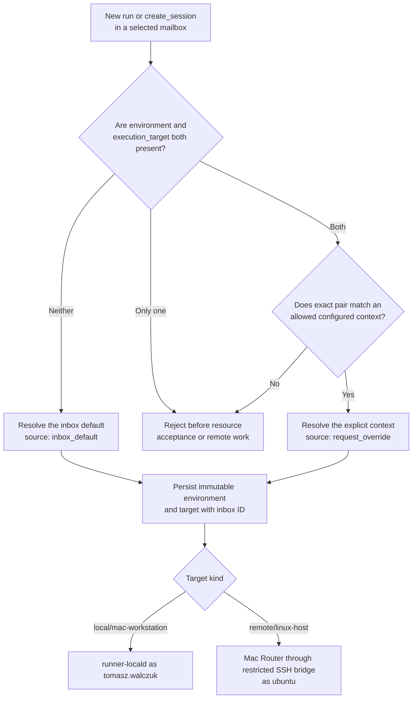
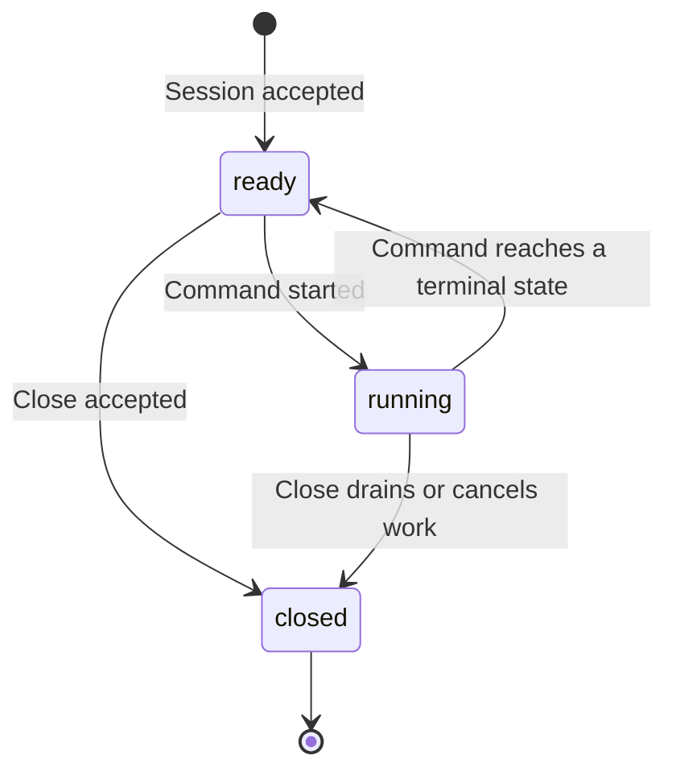

# Architecture

## Purpose and current topology

Remote Session Runner is a controlled two-target proof of concept. Scripts run
on the Mac as `tomasz.walczuk` or on the currently accepted Ubuntu host as
`ubuntu`. It has no containers, tunnels, browser terminal, interactive PTY,
automatic target fallback, arbitrary account selection, or free-form host
selection.

The installed Mac configuration uses version 2 and composes two file-mailbox
namespaces:

| Inbox ID | Root | Default context | Allowed contexts | Repository aliases |
| --- | --- | --- | --- | --- |
| `default` | `~/Library/Application Support/RemoteSessionRunner/mailbox` | `mac-local` | `mac-local`, `ubuntu-current` | `remote-session-runner` |
| `analytics` | `~/Library/Application Support/RemoteSessionRunner/mailboxes/analytics` | `mac-local` | `mac-local`, `ubuntu-current` | `analytics-dbt` |

`mac-local` means `mac-dev` and `local/mac-workstation`.
`ubuntu-current` means `linux-dev` and `remote/linux-host`. Both inboxes are
independent file ingress and response-projection namespaces. They share the
Mac Router and its local SQLite authority.



A mailbox is neither a shell nor an execution authority. It accepts a safely
published request, stores an auditable exchange in the Mac authority, projects
responses and events into the same mailbox root, and uses the configured route
only after policy resolution. Direct mTLS never passes through a mailbox.

## Context selection for mailbox work

The `environment` and `execution_target` fields are one pair for new
`run` and `create_session` mailbox requests. The configured inbox selects a
context before durable resource acceptance. A session stores the resolved
target; later `submit_command` requests inherit it and cannot override it.



`repository_alias` is optional policy and audit metadata. When supplied, it
must appear in the selected inbox's configured alias list. It does not select a
checkout, create a source tree, select a host, or permit source
materialization. The current remote context permits only the empty source
mode.

## Access routes and authority

| Route | Selection | Controller / execution account | Meaning |
| --- | --- | --- | --- |
| Mac local | `runner --endpoint local` or a mailbox resolved to `mac-local` | `local_user/tomasz.walczuk`; Bash as `tomasz.walczuk` | Local authority. |
| Queued remote | `runner --endpoint local` with `linux-dev` / `remote` / `linux-host`, or a mailbox resolved to `ubuntu-current` | `queued_mac/tomasz.walczuk`; Bash as `ubuntu` | Mac records local intent, then reaches Ubuntu only through the pinned restricted SSH bridge. |
| Direct remote | `runner --endpoint linux-poc --config <mac.yaml>` with `linux-dev` / `remote` / `linux-host` | `direct_mtls/tomasz.walczuk`; Bash as `ubuntu` | Public direct HTTPS at `https://129.151.232.40:8443` with TLS 1.3 mTLS. |

The queued and direct routes use different controller identities. Resources are
owned by the controller that created them, so status, events, cancellation, and
close use the same route. A queued view can be `local_intent` or `projection`
and report `is_stale: true`; direct mTLS reads target authority.

```mermaid
sequenceDiagram
  participant M as Mailbox client
  participant D as Direct mTLS client
  participant R as Mac Router and local.db
  participant L as runner-locald
  participant S as Restricted SSH bridge
  participant U as Ubuntu runnerd and remote.db

  alt Inbox default: mac-local
    M->>R: Marker-last request with no selection pair
    R->>L: Resolve mac-local; execute as tomasz.walczuk
    L-->>R: Events and terminal result
    R-->>M: Same-root outbox and events
  else Allowed remote override
    M->>R: Complete linux-dev + remote/linux-host pair
    R-->>M: Durable local acceptance
    R->>S: Fixed bridge protocol over pinned SSH
    S->>U: Owner-only Unix-socket call
    U-->>R: Authoritative state and events
    R-->>M: Same-root projection
  else Direct mTLS CLI
    D->>U: mTLS request to linux-poc
    U-->>D: Target-authority response and events
  end
```

## Session, event, and recovery lifecycle



A command publishes ordered events beginning with `command_queued`, then
`command_started`, zero or more `stdout` or `stderr` events, and one terminal
event. Event readers resume from their last validated sequence. Complete output
requires a read through the final sequence, `output_complete: true`, and
`output_truncated: false`.

For a queued one-off job after a Mac process restart, the Router reads the
already accepted remote job, command, and retained events. It does not resend
the mutation. It publishes a terminal response only when identity, target,
teardown, and event boundary agree. A missing or contradictory proof remains
incomplete or under investigation rather than being reported as successful.

## Security and operating boundaries

| Boundary | Enforcement | Practical result |
| --- | --- | --- |
| Mac ingress | Owner-only Unix sockets, `0700` mailbox trees, and GUI launchd services | Only `tomasz.walczuk` should operate the local services. |
| Mailbox publication | Native exclusive-create, file and directory sync, JSON then empty marker last | A terminal request is not produced by a partially written draft. |
| Direct Ubuntu ingress | TLS 1.3 mandatory mTLS and the certificate-principal map | A client certificate URI SAN must map to the selected controller. |
| Queued Ubuntu ingress | Pinned SSH host key, one forced command, controller fingerprint map, owner-only Runner socket | The bridge permits no general SSH shell. |
| Script execution | OS-account permissions | A workspace is a starting directory, not containment. |
| Durable state | Separate Mac and Ubuntu SQLite records plus retained events | Software-process-crash recovery is supported by evidence; physical power-cut recovery is unverified. |

## Named remote hosts and host evidence

The configuration model can contain more named remote profiles. A profile can
have a pinned queued bridge, a named direct mTLS endpoint, or both. Adding a
profile does not make a physical machine usable. Each host needs its own P157
onboarding: Ubuntu service, owner-only configuration, credentials and host-key
pin or mTLS materials, route validation, account proof, and an end-to-end
request to that exact profile.

`linux-host` is the only profile with current live acceptance evidence. The
user-supplied `sandbox.env` candidate (`ubuntu@132.226.205.205`) is **NOT RUN**
until its own P157 gate passes. See [current-host evidence](current-host-evidence.md).
