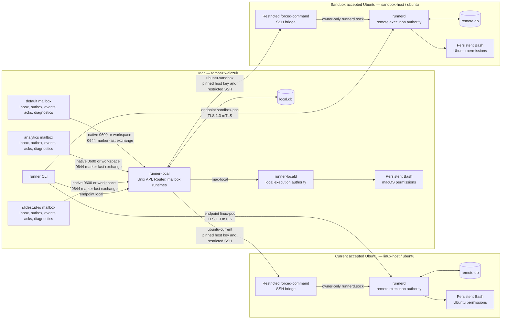
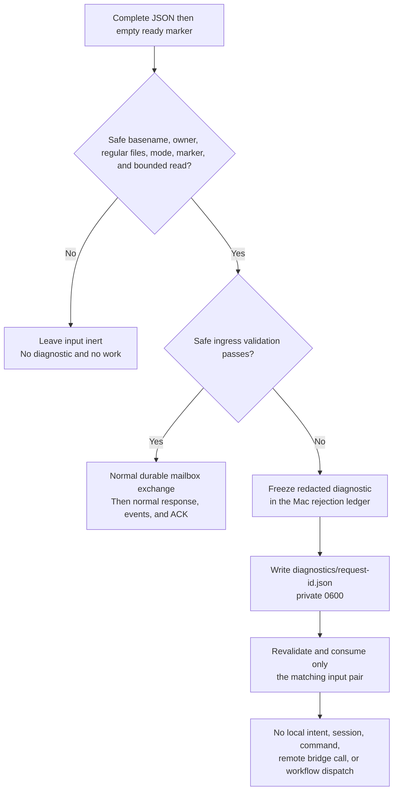
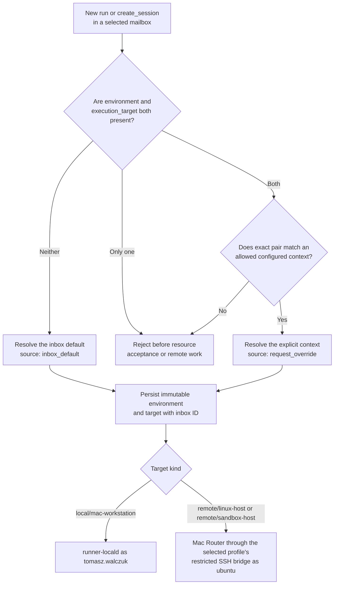
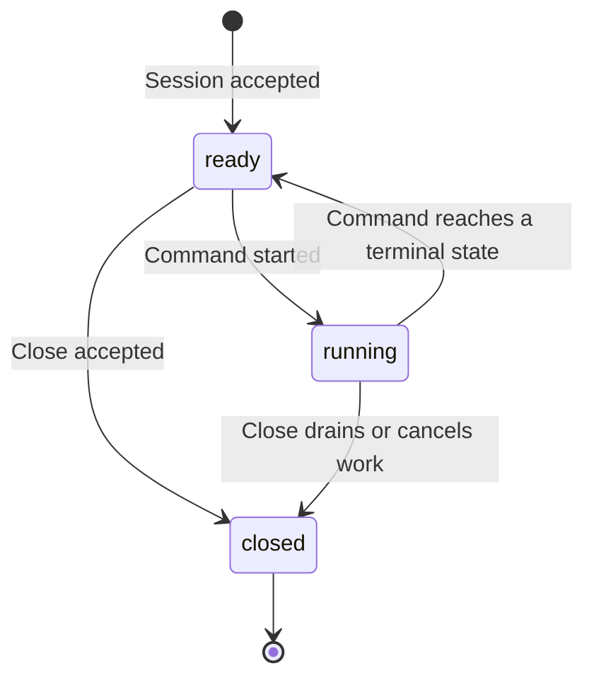

# Architecture

## Purpose and current topology

Remote Session Runner is a controlled multi-target proof of concept. Scripts
run on the Mac as `tomasz.walczuk` or on a named, accepted Ubuntu profile as
`ubuntu`. It has no containers, tunnels, browser terminal, interactive PTY,
automatic target fallback, arbitrary account selection, or free-form host
selection.

The installed Mac configuration uses version 2 and composes three file-mailbox
namespaces:

| Inbox ID | Root | Default context | Allowed contexts | Repository aliases |
| --- | --- | --- | --- | --- |
| `default` | `~/Library/Application Support/RemoteSessionRunner/mailbox` | `mac-local` | `mac-local`, `ubuntu-current` | `remote-session-runner` |
| `analytics` | `~/Library/Application Support/RemoteSessionRunner/mailboxes/analytics` | `mac-local` | `mac-local`, `ubuntu-current`, `ubuntu-sandbox` | `analytics-dbt` |
| `slidestud-io` | `/Users/tomasz.walczuk/projects/slidestud.io/tmp/mailbox-` | `ubuntu-sandbox` | `ubuntu-sandbox`, `mac-local`, `ubuntu-current` | `slidestud-io` |

`mac-local` means `mac-dev` and `local/mac-workstation`.
`ubuntu-current` means `linux-dev` and `remote/linux-host`.
`ubuntu-sandbox` means `sandbox-dev` and `remote/sandbox-host`. All three
inboxes are independent file ingress and response-projection namespaces. They
share the Mac Router and its local SQLite authority.



A mailbox is neither a shell nor an execution authority. It accepts a safely
published request, stores an auditable exchange in the Mac authority, projects
responses and events into the same mailbox root, and uses the configured route
only after policy resolution. Direct mTLS never passes through a mailbox.

## Safe ingress validation and diagnostics

Every configured mailbox has a fifth private child, `diagnostics/`. It is for
input that passed the filesystem safety boundary but failed safe ingress
validation: malformed JSON, v1 request schema, request identity, script
representation, or bounded-size validation. It is deliberately separate from
`outbox/`: no accepted exchange,
target selection, local intent, session, command, bridge call, or remote
workflow exists for this path.



The same safe invalid pair is handled on a later scan whether its empty marker
was newly created or replaced an earlier unsafe marker. A missing pair, nonempty
marker, unsafe path/mode/owner, symlink, or read race stays inert and produces
no diagnostic. A retained rejected request ID cannot later become accepted
work; correction uses a new request ID and idempotency key.

## Context selection for mailbox work

The `environment` and `execution_target` fields are one pair for new
`run` and `create_session` mailbox requests. The configured inbox selects a
context before durable resource acceptance. A session stores the resolved
target; later `submit_command` requests inherit it and cannot override it.



`repository_alias` is optional policy and audit metadata. When supplied, it
must appear in the selected inbox's configured alias list. It does not select a
checkout, create a source tree, select a host, or permit source
materialization. The current remote context permits only the empty source
mode.

## Access routes and authority

| Route | Selection | Controller / execution account | Meaning |
| --- | --- | --- | --- |
| Mac local | `runner --endpoint local` or a mailbox resolved to `mac-local` | `local_user/tomasz.walczuk`; Bash as `tomasz.walczuk` | Local authority. |
| Queued current remote | `runner --endpoint local` with `linux-dev` / `remote` / `linux-host`, or a mailbox resolved to `ubuntu-current` | `queued_mac/tomasz.walczuk`; Bash as `ubuntu` | Mac records local intent, then reaches the current Ubuntu host only through its pinned restricted SSH bridge. |
| Queued sandbox remote | `runner --endpoint local` with `sandbox-dev` / `remote` / `sandbox-host`, an `analytics` override, or a `slidestud-io` default | `queued_mac/tomasz.walczuk`; Bash as `ubuntu` | Mac records local intent, then reaches the sandbox Ubuntu host only through its separate pinned restricted SSH bridge. `default` does not permit this context. |
| Direct current remote | `runner --endpoint linux-poc --config <mac.yaml>` with `linux-dev` / `remote` / `linux-host` | `direct_mtls/tomasz.walczuk`; Bash as `ubuntu` | Public direct HTTPS at `https://129.151.232.40:8443` with TLS 1.3 mTLS. |
| Direct sandbox remote | `runner --endpoint sandbox-poc --config <mac.yaml>` with `sandbox-dev` / `remote` / `sandbox-host` | `direct_mtls/tomasz.walczuk`; Bash as `ubuntu` | Public direct HTTPS at `https://132.226.205.205:8443` with TLS 1.3 mTLS. |

The queued and direct routes use different controller identities. Resources are
owned by the controller that created them, so status, events, cancellation, and
close use the same route. A queued view can be `local_intent` or `projection`
and report `is_stale: true`; direct mTLS reads target authority.

```mermaid
sequenceDiagram
  participant M as Mailbox client
  participant D as Direct mTLS client
  participant R as Mac Router and local.db
  participant L as runner-locald
  participant S as Selected restricted SSH bridge
  participant U as Selected Ubuntu runnerd and remote.db

  alt Inbox default: mac-local
    M->>R: Marker-last request with no selection pair
    R->>L: Resolve mac-local; execute as tomasz.walczuk
    L-->>R: Events and terminal result
    R-->>M: Same-root outbox and events
  else Inbox slidestud-io: ubuntu-sandbox default
    M->>R: Marker-last request with no selection pair
    R-->>M: Durable local acceptance
    R->>S: Fixed sandbox-host bridge protocol over pinned SSH
    S->>U: Owner-only Unix-socket call
    U-->>R: Authoritative state and events
    R-->>M: Same-root projection
  else Allowed remote override
    M->>R: Complete configured remote environment and target pair
    R-->>M: Durable local acceptance
    R->>S: Fixed selected-profile bridge protocol over pinned SSH
    S->>U: Owner-only Unix-socket call
    U-->>R: Authoritative state and events
    R-->>M: Same-root projection
  else Direct mTLS CLI
    D->>U: mTLS request to the selected named endpoint
    U-->>D: Target-authority response and events
  end
```

## Mailbox response evidence for queued remote work

Each `outbox/<request_id>.json` file is a revision of one durable mailbox
exchange. For a queued remote `run`, three different boundaries deliberately
have different meanings:

| Boundary | What it proves | Safe information that may be shown | What it does not prove |
| --- | --- | --- | --- |
| Initial local admission | The Mac Router durably accepted and recorded the mailbox exchange. | `request_state: accepted`, the selected route, and durable resource IDs when they are known. | Target acceptance, command start, queue position, capacity, reachability, output, or an outcome. |
| Fresh active remote projection | A successful **read-only** target status query currently matches the local intent's job, session, command, controller, environment, source, target, and profile. The matching target work is still nonterminal. | The stable IDs, `delivery_state: accepted`, one safe nonterminal job phase (`creating_session`, `accepting_command`, `awaiting_command`, or `closing_session`), and optionally `command_state` (`queued`, `running`, or `cancelling`). The sole queue explanation is optional `queue_blocked_reason: lost_capacity_recovery_pending`, valid only for the strict queued retained-capacity condition. | A terminal result, a general explanation for why work is queued, event history, output, cursor, exit code, teardown result, process details, script, header, token, or private material. |
| Strict terminal proof | The Router has identity, target, teardown, and retained event-boundary evidence for a terminal response. | The terminal response and, where available, its validated event cursor and result fields. | That a failed command succeeded; callers must still inspect command state, exit code, output completeness, and truncation. |

The active projection is observational and is never a second dispatch path. If
the status becomes stale, mismatched, unavailable, or retryably unreadable, or
if the Router starts again, Runner withdraws any persisted active projection to
an identity-only `accepted` receipt. The target job is not changed and its
mutation is not replayed. A later fresh, identity-checked read may publish a
new active revision; strict terminal proof remains the only way to publish a
terminal result.

Only a terminal outbox response (`complete`, `rejected`, or `indeterminate`) is
eligible for the mailbox ACK protocol. An active `accepted` projection has no
terminal event boundary to acknowledge.

## Session, event, and recovery lifecycle



A command publishes ordered events beginning with `command_queued`, then
`command_started`, zero or more `stdout` or `stderr` events, and one terminal
event. Event readers resume from their last validated sequence. Complete output
requires a read through the final sequence, `output_complete: true`, and
`output_truncated: false`.

For a queued one-off job after a Mac process restart, the Router first treats
any previously stored active remote projection as stale. It then reads the
already accepted remote job, command, and retained events without resending the
mutation. A newly read nonterminal status can become an active projection only
after the full identity check. It publishes a terminal response only when
identity, target, teardown, and event boundary agree. A missing or
contradictory proof remains incomplete or under investigation rather than being
reported as successful.

## Security and operating boundaries

| Boundary | Enforcement | Practical result |
| --- | --- | --- |
| Mac ingress | Owner-only Unix sockets, `0700` mailbox trees, safe external ancestors, and GUI launchd services | Only `tomasz.walczuk` should operate the local services. |
| Mailbox publication | Native publisher: exclusive-create, no-follow, file and directory sync, JSON then empty marker last. Direct workspace publisher: complete exact-`0644` JSON then empty marker last inside a `0700` tree. | Both paths reject unsafe inputs; only the native publisher has the stronger publication and crash-durability properties. Runner response/event projections remain `0600`. |
| Direct Ubuntu ingress | TLS 1.3 mandatory mTLS and the certificate-principal map | A client certificate URI SAN must map to the selected controller. |
| Queued Ubuntu ingress | Pinned SSH host key, one forced command, controller fingerprint map, owner-only Runner socket | The bridge permits no general SSH shell. |
| Script execution | OS-account permissions | A workspace is a starting directory, not containment. |
| Durable state | Separate Mac and Ubuntu SQLite records plus retained events | Software-process-crash recovery is supported by evidence; physical power-cut recovery is unverified. |

## Named remote hosts and host evidence

The configuration model can contain more named remote profiles. A profile can
have a pinned queued bridge, a named direct mTLS endpoint, or both. Adding a
profile does not make a physical machine usable. Each host needs its own P157
onboarding: Ubuntu service, owner-only configuration, credentials and host-key
pin or mTLS materials, route validation, account proof, and an end-to-end
request to that exact profile.

`linux-host` is accepted through P155. `sandbox-host` is separately accepted
through P157 after repair on source revision
`8873852ddc9ab33093c105371de93a3695d99b89`: its bootstrap alias is
`sandbox.env` (`ubuntu@132.226.205.205`), its queued context is
`ubuntu-sandbox`, and its public direct endpoint is `sandbox-poc` at
`https://132.226.205.205:8443`. `analytics` permits the sandbox queued override,
while `slidestud-io` uses it as its default. Every other new profile remains
**NOT RUN** until it completes its own P157 gate. See
[current-host evidence](current-host-evidence.md).
