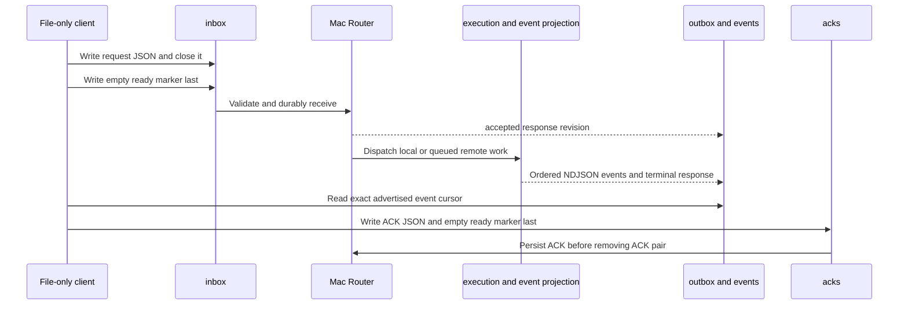

# File mailbox guide

The mailbox is an owner-only **Mac ingress and response projection** for
automation that cannot call the CLI or HTTP API. It is not a shell, an executor,
or the source of authoritative remote state.

Its selected root is:

```text
/Users/tomasz.walczuk/Library/Application Support/RemoteSessionRunner/mailbox
```

It can start Mac-local work and, after the restricted SSH bridge is installed,
queued Ubuntu work. It cannot see or manage resources created by direct mTLS
HTTPS. Direct HTTPS never passes through this directory.

## Directory layout and publication rule

```text
mailbox/
├── inbox/    <request_id>.json and <request_id>.ready written by the client
├── outbox/   <request_id>.json response projection written by Runner
├── events/   <command_id>.ndjson retained command events
└── acks/     <request_id>.json and <request_id>.ready written by the client
```

Every mailbox directory is mode `0700`; client JSON and marker files must be
regular non-symlink files at mode `0600`. Use `umask 077`. A request is
published only when its matching **empty** `.ready` marker is written last.
Writing a JSON draft alone is safe and inert.



Request IDs used in filenames must match
`[A-Za-z0-9][A-Za-z0-9._-]{0,127}`. The file stem and JSON `request_id` must
match exactly. Request and ACK JSON have a 1 MiB maximum; a script is valid
UTF-8 and at most 128 KiB.

## Supported operations

| Operation | Required fields after `request_id` and `operation` | Idempotency key | Purpose |
| --- | --- | --- | --- |
| `create_session` | `environment`, `execution_target.kind`, `execution_target.profile` | Required | Creates a persistent session. |
| `get_session` | `session_id` | No | Reads a session snapshot. |
| `submit_command` | `session_id`, `script` | Required | Adds a script to that immutable-target session. |
| `get_command` | `command_id` | No | Reads a command snapshot and frozen available-event cursor. |
| `cancel_command` | `command_id` | Required | Requests cancellation. |
| `close_session` | `session_id` | Required | Requests session close; optional `close_policy`. |
| `run` | `environment`, `execution_target.kind`, `execution_target.profile`, `script` | Required | Creates an ephemeral session, runs one script, and closes it. |

Mutations may also carry `source`, `limits`, or `policy` where the schema
allows them. Omit `source` for the selected empty source mode. `submit_command`
can carry `timeout_seconds`. The mailbox defaults an omitted or empty
`close_policy` to `cancel`; this differs from the CLI's default `graceful`
close policy.

### Minimal request shapes

Replace placeholders and add the normal JSON/marker publication pair described
below. Every mutation uses a fresh request ID and a stable idempotency key.

```json
{"request_id":"REQ","idempotency_key":"KEY","operation":"create_session","environment":"mac-dev","execution_target":{"kind":"local","profile":"mac-workstation"}}
{"request_id":"REQ","operation":"get_session","session_id":"SESSION"}
{"request_id":"REQ","idempotency_key":"KEY","operation":"submit_command","session_id":"SESSION","script":"id -un"}
{"request_id":"REQ","operation":"get_command","command_id":"COMMAND"}
{"request_id":"REQ","idempotency_key":"KEY","operation":"cancel_command","command_id":"COMMAND"}
{"request_id":"REQ","idempotency_key":"KEY","operation":"close_session","session_id":"SESSION","close_policy":{"policy":"graceful"}}
{"request_id":"REQ","idempotency_key":"KEY","operation":"run","environment":"mac-dev","execution_target":{"kind":"local","profile":"mac-workstation"},"script":"id -un"}
```

For queued Ubuntu work, change a create or run request to
`"environment":"linux-dev"` and
`"execution_target":{"kind":"remote","profile":"linux-host"}` only
after the permanent restricted SSH bridge has been installed and verified with
`deploy/ssh/install-queued-bridge.sh status` on Ubuntu. See the
[setup runbook](setup.md#optional-enable-the-queued-ssh-route).

## Simple local `run` request

Run the following on the **Mac** as `tomasz.walczuk`. It creates a one-off
local request and prints its ID:

```sh
mailbox='/Users/tomasz.walczuk/Library/Application Support/RemoteSessionRunner/mailbox'
(
  umask 077
  request_id="req-manual-$(/usr/bin/uuidgen | /usr/bin/tr -d '-')"
  cat > "$mailbox/inbox/$request_id.json" <<EOF
{"request_id":"$request_id","idempotency_key":"key-$request_id","operation":"run","environment":"mac-dev","execution_target":{"kind":"local","profile":"mac-workstation"},"script":"echo MAILBOX_TEST_OK"}
EOF
  : > "$mailbox/inbox/$request_id.ready"
  printf 'request_id=%s\n' "$request_id"
)
```

The JSON is written and closed before the empty marker. Do not use a marker
until the JSON is final.

Poll the response until it becomes terminal. Replace `REQUEST_ID`:

```sh
mailbox='/Users/tomasz.walczuk/Library/Application Support/RemoteSessionRunner/mailbox'
request_id='REQUEST_ID'
response="$mailbox/outbox/$request_id.json"
state=''
attempt=0
while [ "$attempt" -lt 60 ]; do
  attempt=$((attempt + 1))
  if [ -f "$response" ]; then
    state=$(/usr/bin/python3 -c 'import json,sys; print(json.load(open(sys.argv[1])).get("request_state", ""))' "$response")
    case "$state" in
      complete|rejected|indeterminate)
        /usr/bin/python3 -m json.tool "$response"
        break
        ;;
    esac
  fi
  /bin/sleep 1
done
printf 'latest request state: %s\n' "${state:-no response}"
```

A `complete` request can contain a failed command. Check `command_state`,
`exit_code`, output flags, and events before reporting success.

## Read the event file

A response with a positive `available_event_sequence` names an event file such
as `events/cmd-...ndjson`. Read it through the advertised cursor:

```sh
cat "$mailbox/events/COMMAND_ID.ndjson"
```

Events have increasing command sequence numbers. Valid UTF-8 chunks use
`encoding: "utf8"` and `text`; binary or invalid UTF-8 chunks use
`encoding: "base64"` and `data_base64`. Every output event has a raw
`byte_count`; raw event chunks are at most 16 KiB. Inline `stdout` or `stderr`
in a response is only a bounded UTF-8 preview, not the complete output source.

Call output fully received only when all of these hold:

- `request_state` is `complete`
- `output_complete` is `true`
- `output_truncated` is `false`
- you read the NDJSON through `available_event_sequence`

An incomplete result can carry `output_unavailable_reason`, such as
`remote_event_gap`, `capture_boundary_unconfirmed`, or `retention_expired`.
Do not invent the missing bytes.

## Acknowledge a terminal response

After reading the advertised event prefix, acknowledge the exact response
revision and cursor. Replace the values with those in the terminal response:

```sh
mailbox='/Users/tomasz.walczuk/Library/Application Support/RemoteSessionRunner/mailbox'
request_id='REQUEST_ID'
(
  umask 077
  cat > "$mailbox/acks/$request_id.json" <<EOF
{"request_id":"$request_id","response_revision":2,"available_event_sequence":4}
EOF
  : > "$mailbox/acks/$request_id.ready"
)
```

Runner validates and durably records a matching ACK before removing the ACK
pair. A wrong revision or cursor remains on disk for correction. An ACK for an
incomplete result acknowledges the available prefix and its warning; it does
not make missing output complete.

## Retry safely

For a mutation whose delivery is uncertain:

1. Create a **new** `request_id`.
2. Reuse the **same** `idempotency_key`.
3. Send the same canonical operation and payload.

The response should return the original resource and result without rerunning
it. Reusing an idempotency key with a changed payload produces
`idempotency_conflict`; never overwrite the original request. A request ID is
single-use while retained. After 90-day idempotency retention, a response may
warn `deduplication_not_guaranteed`; a new operation could then occur.

## Interpret mailbox states

| Field | Meaning |
| --- | --- |
| `request_state: accepted` | The Mac durably recorded the request. This is not target execution acceptance. |
| `request_state: complete` | The operation reached an outcome boundary. A command may still have failed. |
| `request_state: rejected` | A valid request was rejected by validation, authorization, or idempotency checks. |
| `request_state: indeterminate` | A queued remote mutation might have run but was not reconciled by the deadline. Preserve its idempotency key and investigate. |
| `delivery_state` | Separate queued-route progress such as `recorded`, `dispatching`, `uncertain`, `accepted`, `reconciled`, or `not_delivered`. |
| `command_state` and `session_state` | Resource state from the applicable authority or retained projection. |

Malformed or unsafe published pairs do not have a guaranteed outbox response:
the importer logs the rejection and leaves the pair. Well-formed requests that
fail semantic validation receive a terminal `rejected` response.

## Retention and current remote boundary

- Unmarked drafts are cleaned after 24 hours.
- A terminal response is eligible for cleanup 24 hours after a valid ACK or
  seven days after publication without one.
- Event output follows the 30-day output retention policy, subject to the
  response references that still need it.
- Mac local mailbox work is available with healthy Mac services.
- Queued remote mailbox work requires the optional permanent restricted SSH
  bridge and a successful Ubuntu `install-queued-bridge.sh status` check.
- A direct-mTLS resource must be operated through direct mTLS CLI/API, not
  this mailbox.
