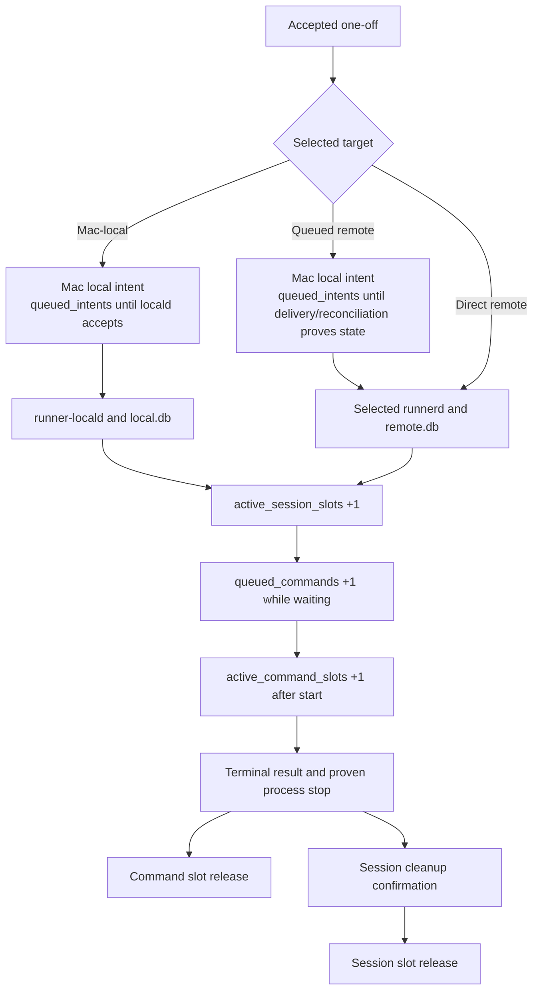

# Operations runbook

Run Mac commands as `tomasz.walczuk` and commands on either accepted Ubuntu
host as `ubuntu`. Do not print private keys, edit SQLite files, manufacture
mailbox input outside the documented publisher/integration path, or use
host-gate test scripts as everyday service controls.

## Current availability and evidence boundary

| Capability | Current state | What to verify before use |
| --- | --- | --- |
| Mac local execution | Route is health-addressable when both Mac LaunchAgents are healthy | Both private readiness endpoints, installed revision, and a current authority-capacity check; only then a safe local command. Health alone does not prove retained capacity is free. |
| Direct `linux-host` execution | Accepted on the current host | Public mTLS readiness, then a direct `linux-poc` command. |
| Queued `linux-host` execution | Permanent restricted bridge was accepted in P155 | Fresh bridge `status` at the deployed source revision, then a queued command. |
| Direct `sandbox-host` execution | Accepted in P157 | Public `sandbox-poc` mTLS Runner readiness. |
| Queued `sandbox-host` execution | Accepted in P157 | Fresh sandbox bridge `status`; `analytics` permits its explicit override and `slidestud-io` uses it as its default. |
| `default` mailbox | Installed and accepted in P155 | Mac readiness, configured root ownership, and native terminal response/event/ACK. |
| `analytics` mailbox | Installed in P155; `sandbox-host` override accepted in P157 | Same checks; each remote override additionally needs its selected bridge status. |
| `slidestud-io` mailbox | Native path accepted in P158; direct workspace-file path accepted in P159 | External owner-only tree, Mac readiness, no-selection request resolved to `sandbox-host`, complete event/ACK, and sandbox P128 zero-work status. |
| Any additional profile | **NOT RUN** | Its own P157 service, route, and end-to-end acceptance. |

P155 proved `default` local-default work and an `analytics` allowed queued
`linux-host` override. P157 independently proved the sandbox bridge, router
health, native mailbox request, event read, ACK, and zero-work state for
`sandbox-host`. P158 then proved the external `slidestud-io` inbox's sandbox
default with the same native request/event/ACK boundary. P159 added the
selected-user-owned exact-`0644` direct workspace-file request and ACK path,
with private `0600` response/event projections and a final zero-work check. A
successful direct mTLS request does not prove queued mailbox delivery. P166
then accepted safe malformed mailbox ingress on the Mac: it wrote a private
diagnostic and created no remote work. It did not run a new host, bridge, or
direct-mTLS gate.

BUG-008's queue-preserving recovery work and its fresh installed-service
regression (B008-P6) passed. The recovery and attestation procedures below are
operating instructions; following one does not prove a later Runner revision
is installed or that a separate incident is resolved.

The shared-worker source tests and installer-preflight tests are likewise not
live-host evidence. They do not prove that a particular LaunchAgent or
`runnerd.service` has the reviewed revision, owns the runtime records, or has
completed retained-capacity recovery. Check the running revision and the
selected authority's live status before drawing a conclusion about the Mac or
either Ubuntu host.

## Fast health checks

### Mac — `tomasz.walczuk`

```sh
root='/Users/tomasz.walczuk/Library/Application Support/RemoteSessionRunner'
launchctl print "gui/$(id -u)/com.remote-session-runner.local"
launchctl print "gui/$(id -u)/com.remote-session-runner.locald"
test -S "$root/run/local-api.sock"
test -S "$root/run/locald.sock"
curl --silent --show-error --fail --unix-socket "$root/run/local-api.sock" http://runner/health/ready
curl --silent --show-error --fail --unix-socket "$root/run/locald.sock" http://runner/health/ready
```

### Verify the running Mac build revision

Use the live `runner-local` health response to prove that the process accepting
mailbox work came from the synchronized source revision. Run this after an
installer refresh and before treating a Mac LaunchAgent as current:

```sh
# Mac — tomasz.walczuk
repo='/Users/tomasz.walczuk/projects/remote-session-runner'
root='/Users/tomasz.walczuk/Library/Application Support/RemoteSessionRunner'
expected="$(git -C "$repo" rev-parse HEAD)"
test "$(git -C "$repo" branch --show-current)" = dev
test -z "$(git -C "$repo" status --porcelain)"
test "$expected" = "$(git -C "$repo" rev-parse origin/dev)"
actual="$(
  curl --silent --show-error --fail \
    --unix-socket "$root/run/local-api.sock" \
    http://runner/health/ready |
    /usr/bin/python3 -c 'import json, sys; print(json.load(sys.stdin).get("build_revision", ""))'
)"
test "$actual" = "$expected"
printf 'runner-local live build_revision=%s\n' "$actual"
```

The Mac installer derives the full 40-character Git revision from a clean
`dev` checkout, embeds it in the installed binaries, and requires this live
socket check before it reports success. `build_revision: unattested` means the
binary was not installer-attested and must not be treated as the current
source. `runner-local --version`, a binary checksum, or a newly invoked
`doctor` command identify a file or a new diagnostic process; none identifies
the already-running LaunchAgent. `doctor` also writes a timestamp-only health
record. They are useful diagnostics, but not runtime provenance evidence.

The `runner-local` report contains a `remote_router` check for one queued
profile. With several queued profiles it reports `remote_router/<profile>` per
profile. `ready` means the periodic read-only bridge ping reached that
configured bridge and Runner service. `degraded` means local mailbox ingress
can still be ready, while that queued profile is not currently proven
routable.

Inspect active V2 policy without changing it:

```sh
# Mac — tomasz.walczuk
root='/Users/tomasz.walczuk/Library/Application Support/RemoteSessionRunner'
"$root/bin/runner-local" validate-config --config "$root/config/mac.yaml"
(
  set -e
  check_mailbox_tree() {
    mailbox=$1
    test -d "$mailbox/inbox"
    test -d "$mailbox/outbox"
    test -d "$mailbox/events"
    test -d "$mailbox/acks"
    test -d "$mailbox/diagnostics"
  }
  check_mailbox_tree "$root/mailbox"
  check_mailbox_tree "$root/mailboxes/analytics"
  check_mailbox_tree "/Users/tomasz.walczuk/projects/slidestud.io/tmp/mailbox-"
)
```

`validate-config` checks file safety and policy only when invoked without
activation flags. It does not make a candidate active. Use the V2 candidate
procedure in [setup](setup.md#3-upgrade-to-version-2-or-add-an-inbox) for a
policy change.

### Inspect mailbox lifecycle without writes

Use the owner-only local API only on the **Mac** as `tomasz.walczuk`. This is a
read-only status query; it does not run `doctor`, import a request, create an
audit row, change an inbox file, or contact a remote host.

```sh
# Mac — tomasz.walczuk
root='/Users/tomasz.walczuk/Library/Application Support/RemoteSessionRunner'
inbox_id='slidestud-io'
request_id='req-EXACT-ID'
curl --silent --show-error \
  --unix-socket "$root/run/local-api.sock" \
  --get --data-urlencode "request_id=$request_id" \
  "http://runner.local/v1/mailboxes/$inbox_id/lifecycle" |
  /usr/bin/python3 -m json.tool
```

The query accepts only an active configured `inbox_id` and an optional safe
`request_id`; it never accepts a mailbox path. `404 mailbox_not_found` means
the configured inbox name is unknown. `503` with `available: false` means the
configured tree or durable lifecycle source could not be read, so no lifecycle
state was inferred. See [mailbox lifecycle status](mailbox.md#read-only-lifecycle-status)
for its metadata-only contract and labels.

Mac logs:

```sh
# Mac — tomasz.walczuk
root='/Users/tomasz.walczuk/Library/Application Support/RemoteSessionRunner'
tail -n 200 "$root/logs/local.stderr.log"
tail -n 200 "$root/logs/locald.stderr.log"
```

For a new safe malformed ingress record, `runner-local` emits one sanitized
line with `mailbox`, `request_id`, `idempotency_key=unavailable`,
`execution_target=not_selected`, `remote_command_id=not_created`,
`lifecycle_phase=ingress_validation`, and a stable `failure_class`. It must
not include a request body, script, token, Authorization header, or private-key
material.

### Inspect a safe invalid-input diagnostic

Use this only with the trusted request ID you published to a configured
mailbox. It reads the private Runner-produced record and does not alter it.

```sh
# Mac — tomasz.walczuk
mailbox='/Users/tomasz.walczuk/projects/slidestud.io/tmp/mailbox-'
request_id='req-EXACT-ID'
/usr/bin/python3 -m json.tool "$mailbox/diagnostics/$request_id.json"
```

The record confirms `accepted: false`, `executed: false`, and the fixed
ingress-validation code. It has no ACK. Correct the source request, then
publish a new JSON/zero-byte-marker pair under a new request ID and idempotency
key. Do not reuse or edit the retained rejected identity.

### `linux-host` Ubuntu — `ubuntu`

```sh
root='/home/ubuntu/.local/share/remote-session-runner'
sudo systemctl is-active runnerd.service
curl --silent --show-error --fail --unix-socket "$root/run/runnerd.sock" http://runner/health/ready
ss -lntH | grep '10.0.0.200:8443'
sudo journalctl -u runnerd.service -n 200 --no-pager
```

Verify the permanent bridge separately:

```sh
# Current Ubuntu — ubuntu
cd /home/ubuntu/projects/remote-session-runner
deploy/ssh/install-queued-bridge.sh status
```

`status` checks account, enabled service, private socket, modes, pinned
identity, exact restricted authorization, controller map, wrapper, and checked
out source revision. It does not alter bridge authorization or durable
configuration. If the source revision advanced, use the normal Linux deployer
in a maintenance window so it refreshes the bridge artifact. Do not treat an
old `ready` result as evidence for a later checkout.

### `sandbox-host` Ubuntu — `ubuntu`

Run these commands through the selected bootstrap alias for the sandbox host:

```sh
# Sandbox Ubuntu — ubuntu
root='/home/ubuntu/.local/share/remote-session-runner'
sudo systemctl is-active runnerd.service
curl --silent --show-error --fail --unix-socket "$root/run/runnerd.sock" http://runner/health/ready
ss -lntH | grep '10.0.0.14:8443'
sudo journalctl -u runnerd.service -n 200 --no-pager
cd /home/ubuntu/projects/remote-session-runner
deploy/ssh/install-queued-bridge.sh status
```

### Verify a running Ubuntu service build revision

After `install-systemd-service.sh` completes on either accepted host, attest the
live `runnerd.service` process through its private Unix socket. This is the
Linux counterpart of the Mac LaunchAgent check and is required source evidence
for a later B008-P6 host regression; it is not that regression itself.

```sh
# Selected Ubuntu host — ubuntu
repo='/home/ubuntu/projects/remote-session-runner'
root='/home/ubuntu/.local/share/remote-session-runner'
expected="$(git -C "$repo" rev-parse HEAD)"
test "$(git -C "$repo" branch --show-current)" = dev
test -z "$(git -C "$repo" status --porcelain)"
test "$expected" = "$(git -C "$repo" rev-parse origin/dev)"
actual="$(
  curl --silent --show-error --fail \
    --unix-socket "$root/run/runnerd.sock" \
    http://runner/health/ready |
    /usr/bin/python3 -c 'import json, sys; print(json.load(sys.stdin).get("build_revision", ""))'
)"
test "$actual" = "$expected"
printf 'runnerd live build_revision=%s\n' "$actual"
```

As on the Mac, `--version`, a bridge manifest, and a freshly launched `doctor`
command do not attest the running `runnerd.service` process. The installer
requires the exact live `build_revision` after it builds and starts the
service. A matching field proves the service revision, not a mailbox terminal
result or a B008-P6 pass.

### Accepted public direct paths — Mac

```sh
root='/Users/tomasz.walczuk/Library/Application Support/RemoteSessionRunner'
curl --silent --show-error --fail --max-time 15 \
  --cacert "$root/secrets/poc-ca.pem" \
  --cert "$root/secrets/direct-client.pem" \
  --key "$root/secrets/direct-client.key" \
  https://129.151.232.40:8443/health/ready
```

For `sandbox-host`, substitute `sandbox-direct-client.pem`,
`sandbox-direct-client.key`, and `https://132.226.205.205:8443/health/ready`.
Each check covers its selected Runner application, public route, mTLS identity,
and readiness. The earlier temporary TLS probe was transport-only. Neither
check confirms a queued bridge or a mailbox request.

## Diagnostics and metrics

Use a doctor command for configuration, paths, or storage diagnosis:

```sh
# Mac — tomasz.walczuk
root='/Users/tomasz.walczuk/Library/Application Support/RemoteSessionRunner'
"$root/bin/runner-local" doctor --config "$root/config/mac.yaml"
"$root/bin/runner-locald" doctor --config "$root/config/mac.yaml"

# Selected Ubuntu host — ubuntu
root='/home/ubuntu/.local/share/remote-session-runner'
"$root/bin/runnerd" doctor --config "$root/config/linux.yaml"
```

A doctor writes a timestamp-only SQLite health record, so it is diagnostic and
not read-only. It starts the executable named on the command line; it does not
attest the revision of an already-running LaunchAgent or `runnerd.service`.
Use the live private-socket `build_revision` checks above for that purpose.

`/metrics` is available through each private socket and the mTLS HTTPS
listener. It includes bounded counters and no scripts, paths, output,
credentials, or resource IDs.

| Metric | Meaning | Warning threshold |
| --- | --- | ---: |
| `active_session_slots` | Session capacity reservations awaiting cleanup confirmation | 16 |
| `active_command_slots` | Command slots awaiting stop confirmation | 4 |
| `queued_commands` | Authoritative commands still queued | 16 |
| `queued_intents` | Local intents recorded, dispatching, or uncertain | 32 |
| `reconciliation_age_seconds` | Oldest uncertain intent | 300 seconds |
| `event_lag_events` | Remote final sequence minus locally mirrored sequence | 32 |
| `event_gaps_total`, `output_truncations_total` | Durable retained-output problems | 1 |
| `storage_errors_total`, `cleanup_failures_total` | Observed process/database cleanup errors | 1 |
| `mailbox_backlog` | Durable accepted exchanges plus safe complete zero-byte JSON/marker pairs with no durable exchange or diagnostic | 32 |
| `mailbox_backlog_by_inbox` | Same backlog, split by configured safe inbox IDs such as `default`, `analytics`, and `slidestud-io` | Inspect each nonzero value |

### How the four queue and slot gauges fit together

These are four durable state gauges, not four separate physical queues. Read
them from the Runner process that returned the health response; do not add a
Mac value to a Linux value.

The three execution gauges belong to one authority at a time: `local.db` for a
Mac-local one-off, or the selected host's `remote.db` for a remote one-off. Do
not add a Mac value to an Ubuntu value. A Mac Router request can also have a
separate delivery-tracking `queued_intents` count before its selected authority
accepts it; this applies to both Mac-local and queued remote requests.



| Gauge | Simple meaning | When it normally drops |
| --- | --- | --- |
| `queued_intents` | A Mac-side record whose delivery outcome is not yet proved. It can represent Mac-local or queued-remote `run`, session creation, command submission, cancellation, or session close. It is not an authority command queue. | A Mac-local authority accepts it, or a remote result is reconciled or conclusively not delivered. |
| `queued_commands` | A command accepted by its execution authority (`runner-locald` or the selected `runnerd`) but waiting for execution. It can wait for a free command slot, a ready session, or an earlier command in the same session. This count does not give a queue position or a general reason for the delay. | The scheduler starts it or it reaches a terminal pre-start outcome. |
| `active_command_slots` | A durable execution reservation for a command that has started on its authority. The current PoC permits four running commands per authority. | Runner has both a terminal command result and proof that the process stopped. |
| `active_session_slots` | A durable session-capacity reservation, normally held from session creation until workspace/runtime cleanup is confirmed on its authority. The current PoC permits 20 active sessions per authority. | The session is closed and cleanup is durably confirmed. |

A ready session with no running command still uses an `active_session_slots`
reservation. Likewise, a terminal `lost` command can continue to occupy an
`active_command_slots` reservation when Runner cannot prove that its process
stopped. That deliberately blocks further starts rather than risk running more
processes than the configured safety limit.

Mac-local and queued-remote requests first have a Mac local-intent delivery
record. Once a Mac-local request is accepted, `runner-locald` and `local.db`
own its `queued_commands` and slot gauges. Once a queued-remote request is
accepted, its selected Linux authority owns those gauges. Direct mTLS remote
requests go straight to the selected Linux authority and create no Mac
`queued_intents` record. The preceding numbers in the metrics table are
operational warning thresholds; the active policy's service limits control
admission and concurrent execution.

A zero backlog does not prove an importer, bridge, or request succeeded. It
only shows no current counted work. Process-local error counters reset after a
daemon restart; retained counters can fall after cleanup.

For a controlled accepted-host restart gate, run this on the selected Ubuntu
host:

```sh
# Selected Ubuntu host — ubuntu
cd /home/ubuntu/projects/remote-session-runner
make test-p128-host-status
```

This evidence test reports active sessions, running commands, unreleased slots,
and unfinished jobs. Use it in a maintenance plan; it is not a general
service-control command.

## Refresh services

### Mac — `tomasz.walczuk`

For an unchanged active policy:

```sh
cd /Users/tomasz.walczuk/projects/remote-session-runner
deploy/macos/install-launchagents.sh
```

The installer requires a clean synchronized `dev` revision and verifies the
live `runner-local` `build_revision` through `local-api.sock`. Preserve that
success output or repeat [the live Mac check](#verify-the-running-mac-build-revision)
before calling the running LaunchAgent current. Do not substitute `--version`
or `doctor` for the socket attestation.

After mailbox ingress is quiesced and before executor bootout, the installer
runs the staged `runner-locald preflight-restart` against the **active**
`mac.yaml` and its active `local.db`, never the candidate configuration. The
installer runs this guard even when launchd does not report a loaded locald,
because a stopped executor can still leave durable work behind. The
read-only gate requires all four durable counts to be zero: active session
slots, active command slots, queued commands, and resumable one-off jobs in
`creating_session`, `accepting_command`, `awaiting_command`, or
`closing_session`. It accepts only the supported pre-upgrade schema-24 or
current authority schema and does not migrate either one.

Any nonzero count, unreadable database, unsupported schema, or uncertain
database path aborts the refresh before `runner-locald` is stopped. The sole
missing-database exception is a true first local-executor install: no loaded
old locald, old locald binary, LaunchAgent plist, locald socket, database, or
SQLite sidecar may exist. The check does not use `doctor`, write health data,
recover capacity, clean up work, or release a slot. It is a restart safety gate,
not an online recovery path.

For mailbox, context, or route policy changes, use an owner-only V2 candidate
and `install-launchagents.sh --config <mac.next.yaml>` as described in
[setup](setup.md#3-upgrade-to-version-2-or-add-an-inbox). Do not modify active
`mac.yaml`, remove a registered inbox, or attempt a V1 rollback after a V2
activation boundary.

`durable_orphan_cleanup` is a separate per-inbox owner decision. Review its
lifecycle status output first. A candidate that enables it is activated through
the same V2 procedure and then requires this Mac service refresh; do not enable
it merely because `mailbox_backlog` is nonzero. The bounded pass removes only
durable-proven marker-only residue and never replays work.

To unload the services explicitly:

```sh
# Mac — tomasz.walczuk
launchctl bootout "gui/$(id -u)" "$HOME/Library/LaunchAgents/com.remote-session-runner.local.plist"
launchctl bootout "gui/$(id -u)" "$HOME/Library/LaunchAgents/com.remote-session-runner.locald.plist"
```

### Selected Ubuntu host — `ubuntu`

First prove its checkout is the pushed Mac commit, then deploy during a quiet
window:

```sh
cd /home/ubuntu/projects/remote-session-runner
deploy/linux/install-systemd-service.sh
sudo systemctl is-active runnerd.service
deploy/ssh/install-queued-bridge.sh status
```

The normal installer repeats the zero-active-work check before restart and
refreshes an already enabled permanent bridge after the new private socket is
ready. It also requires the live `runnerd` `build_revision` to equal the clean
checkout revision. It does not create or rotate dispatcher authorization. Do
not use this installer or a service restart as an attempt to clear retained
capacity while queued work must survive; use the online recovery procedure
below.

## Triage guide

| Symptom | Check | Correct response |
| --- | --- | --- |
| `runner endpoint profile is unavailable or invalid` | Active config, endpoint name, and V2 direct endpoint definition | Review the owner-only config and its secret paths; use candidate activation for changes. |
| `endpoint/target mismatch` | Direct endpoint's bound target profile | Choose the endpoint that is configured for that exact remote profile; do not retry a mutation with a changed target. |
| Partial mailbox selection | Request has only `environment` or `execution_target` | Submit neither to use the inbox default, or submit the complete allowed pair. |
| Mailbox selection or alias rejected | Root, context allow-list, repository alias, response `inbox_id` | Use the intended root and its configured policy; do not invent aliases or host names. |
| External mailbox preflight fails | Candidate root's real ancestor chain, owner, modes, and symlink state | Repair the external parent/path without changing its ancestors for Runner; rerun the candidate installer. If activation already began, repair the retained candidate instead of restoring an older policy. |
| No mailbox response | Read-only lifecycle status, then publisher type, root tree, JSON/marker order, owner/mode/path | Follow the deterministic [`request ID → outbox → command ID → events` lookup](mailbox.md#find-a-request-result). For a pair that passed safety but failed ingress validation, inspect `diagnostics/<request_id>.json`: it is private `0600`, has no ACK, and requires a new request ID/key for correction. `request_marker_only`, `ack_marker_only`, or `unsafe_inert` means a marker is not execution evidence; preserve `retain_unproven_inert` entries for review. |
| Lifecycle status is `terminal_unacknowledged` | The matching retained outbox, command ID, event prefix, and response revision | Preserve the terminal evidence, then publish a valid ACK pair. A terminal flag does not mean the command succeeded. |
| Lifecycle status is `terminal_acknowledged` | The durable acknowledgement flag and any retained outbox/event files | The durable record confirms the ACK. Do not recreate an ACK marker just because an old marker is absent. |
| Lifecycle status is `unsafe_inert` or action is `retain_unproven_inert` | The selected root and exact publisher rules | Do not edit, retry, ACK, replay, or enable cleanup from this inference. Correct work through a new complete marker-last pair under a new request ID when appropriate. |
| Direct HTTPS/mTLS failure | Public health, service journal, CA/certificate/principal map/bind | Repair host configuration without printing keys. |
| Queued remote remains recorded, uncertain, or stale | Selected bridge `status`, host-key pin, wrapper, controller map, `runnerd.service` | Preserve the idempotency key and observe the same route; do not resend with a new key. |
| Outbox is `accepted` with `delivery_state=accepted` and a safe nonterminal phase/state, without `queue_blocked_reason` | The same response's stable job/session/command IDs, selected target/profile, and response revision | Runner has a fresh identity-checked read-only authoritative status for accepted nonterminal work. Do not infer a queue blocker, command start, output, or terminal outcome; do not ACK or replay it. Continue observing the same request. |
| Outbox has `queue_blocked_reason=lost_capacity_recovery_pending` | The same response's stable request/job/session/command IDs and response revision | The guarded automatic retained-capacity recovery path is relevant to this queued one-off. It has not completed. Preserve the IDs and observe the same request; do not replay, cancel, restart, or manually alter capacity. |
| Earlier active phase/state disappeared and the outbox is now identity-only `accepted` | Router restart, `is_stale`, authority status/read error, or a strict identity mismatch | Runner withdrew an unsafe-to-repeat active status claim. It did not cancel, release, or replay the authority job. Preserve the request ID and idempotency key; wait for a fresh qualified read or terminal proof. |
| Remote one-off ends `indeterminate` with `delivery_state=accepted` and `remote_status_unavailable` | Stable job/session/command IDs, bridge/service journal, target SQLite status and retention | The target accepted the request but Runner could not prove its terminal result in 24 hours. Do not resubmit or release retained capacity manually. ACK the terminal response if it has been recorded, preserve the IDs and idempotency key, then investigate the target boundary. |
| Mac-local outbox has `queue_blocked_reason=lost_capacity_recovery_pending` | The same request/job/session/command IDs, response revision, and live Mac authority status | Preserve and keep observing the same request. `runner-locald` uses the shared worker, but the Linux recovery commands below do not apply to `local.db`. Do not restart or unload either Mac LaunchAgent, edit SQLite, cancel, replay, or manually release capacity. |
| Linux terminal `lost` capacity blocks ready sessions with queued commands that must survive | The same request/job/session/command IDs, current retained-lost inventory, owner-only markers, and live selected `runnerd.service` | On a `runnerd` revision containing B009-P2, preserve the original IDs and let its bounded dispatcher tick attempt proof-based automatic recovery. It runs only after a normal claim finds all slots full and only for the exact complete retained-lost set; it never replays a lost script. If proof remains unavailable, follow the guarded **Linux-only online** recovery below as the owner-only fallback. Keep the service running; do not restart it, run offline recovery, cancel queued commands, or replay work. |
| Linux P128 reports only one unreleased slot for a terminal lost command and no work must survive | Exact session and command IDs, owner-only runtime record, process-group state, and service cgroup | Preserve the lost result and use the explicit stopped-service recovery procedure below. It refuses any other active work and never replays the script. |
| Linux P128 reports several retained `lost` slots and only already-cancelled one-off jobs, with no queued work to preserve | Exact list of every retained `lost` session/command pair and every nonterminal job, owner-only markers, and the stopped service cgroup | Use `recover-stalled` below only after the complete inventory is known. It rejects extra work and never dispatches or replays a script. |
| New host has no route | Its P157 record and per-host service/materials | Keep it `NOT RUN`; accepted `linux-host` and `sandbox-host` evidence does not transfer. |
| Command output incomplete | Cursor, `output_complete`, `output_truncated`, `output_unavailable_reason` | Save the available prefix and do not call it complete. |

## Recovery boundaries

### Mac-local retained capacity: observe, do not remediate live

For a Mac-local one-off, `runner-locald` and `local.db` use the same shared
queue worker as `runnerd`, but runtime proof remains Mac-specific. The public
Linux `recover-retained-capacity`, `recover-lost`, and `recover-stalled`
procedures in this runbook apply only to `runnerd` and `remote.db`; they must
never be pointed at the Mac authority.

When a Mac-local response reports
`queue_blocked_reason=lost_capacity_recovery_pending`, preserve its request,
job, session, and command IDs and keep observing the same response revision
chain. Do not restart or unload the Mac Router or `runner-locald`, edit
`local.db`, cancel the queued work, run a Linux recovery command, manually
release a slot, or publish a replacement request. The field is nonterminal and
does not authorize a live repair. A separate approved Mac maintenance procedure
with fresh host-specific evidence is required before any action that could
change the retained work. In particular, installing or restarting a corrected
Mac executor can release proven capacity and start the original queued identity;
that requires explicit approval after a fresh read-only preflight records the
affected state and expected effect.

### Linux-only queue-preserving online retained-capacity recovery

This procedure is only for the selected Ubuntu `runnerd` authority and its
`remote.db`; it is not a Mac `runner-locald` procedure. On a `runnerd` revision
containing B009-P2, the normal first action is to preserve the original request,
job, session, and command IDs and let the bounded dispatcher tick try
proof-based recovery. It does this only after its normal scheduler claim sees
full command capacity and only for the complete, exact retained-lost inventory.
A successful proof releases paired capacity and wakes the existing dispatcher
to claim the original queued command. It never replays a terminal-lost script
or creates replacement work.

The same accepted mailbox response can expose
`queue_blocked_reason=lost_capacity_recovery_pending` while that exact
condition is freshly proven for either supported execution target. It is an
observation only. On Linux, B009-P2 performs the guarded recovery; on the Mac,
the observation does not make this Linux-only procedure applicable. The field
does not authorize a manual action and can disappear before a terminal result.

Use this owner-only local Ubuntu maintenance procedure only as a guarded
fallback when terminal `lost` capacity still blocks one or more
identity-checked ready sessions with queued commands that must remain queued.
Public HTTPS, the SSH bridge, the mailbox, and normal requester CLI routes
cannot invoke it. Before invoking it, record a complete
inventory of every retained `lost` session/command pair and every preserved
ready/queued session, command, and job. The selected lost pairs must account
for every live command slot; the service must be active; and there must be no
running or cancelling command. The command rejects a partial, extra,
nonterminal, or mismatched inventory.

While work is being preserved, do **not** stop or restart `runnerd.service`,
run `deploy/linux/install-systemd-service.sh`, use the offline `recover-lost`
or `recover-stalled` commands, cancel or close the queued session/command, edit
SQLite, release a slot manually, or publish a replacement/replay request. Each
of those actions changes or discards the work the online procedure is designed
to preserve.

```sh
# Selected Ubuntu host — ubuntu
(
  set -eu
  root='/home/ubuntu/.local/share/remote-session-runner'

  # This must remain active for the whole operation.
  sudo systemctl is-active --quiet runnerd.service

  "$root/bin/runnerd" recover-retained-capacity \
    --config "$root/config/linux.yaml" \
    --online \
    --apply \
    --lost-pair 'sess-EXACT-LOST-1:cmd-EXACT-LOST-1' \
    --lost-pair 'sess-EXACT-LOST-2:cmd-EXACT-LOST-2'
)
```

The explicit `--online --apply` flags and every `--lost-pair` are required. The
operation holds the exact selected capacity until each runtime cleanup proof is
complete, then releases the selected pairs in one authority transaction. It
does not execute a stored script. Only after that transaction can the normal
running dispatcher claim the **original** queued command ID in normal order.
If cleanup proof or inventory validation fails, capacity and preserved work
remain unchanged; stop and investigate the reported sanitized reason. Do not
try a different recovery mode to force progress.

After a successful release, observe the original request through its existing
outbox, event file, and terminal ACK sequence. A service revision match or a
successful capacity release is not command completion. B008-P6 is historical
evidence for BUG-008; it does not prove a later B009 revision is installed or
that this request reached a terminal outcome.

### Offline recovery only when no queued work must survive

The legacy stopped-service procedures below are intentionally stricter. They
are valid only when the complete inventory proves there is no queued work to
preserve, or when the work has already reached a separately authorized terminal
disposition. They are Linux `runnerd` procedures; the Mac has no equivalent
public retained-capacity command in this PoC. Never use them as a substitute for
the online procedure above.

- Do not manually edit `local.db` or `remote.db`, or copy a live SQLite file.
- `backups/` is reserved for the tested backup/restore implementation; this
  PoC has no public backup scheduler, backup CLI, or live-restore runbook.
- A restore does not reattach previous runtime processes. Lost work and
  reconciliation must finish before new dispatch.
- Graceful shutdown stops admission, drains for a bounded period, then uses
  normal cancellation/close cleanup. Clients resume retained events after
  their last validated sequence.
- After a Mac Router restart, a Mac-local one-off reads the shared Mac
  authority in `local.db` (its executor is `runner-locald`), and a queued
  remote one-off reads the selected remote authority state. Neither path resends
  the accepted mutation.
- A remote run that remains unreadable after target acceptance ends as a
  terminal `remote_status_unavailable` mailbox response after 24 hours. It
  carries stable IDs but no claimed target outcome; preserve its idempotency key
  and investigate rather than replaying its script.
- A private ingress diagnostic has no ACK and is eligible for cleanup seven
  days after observation. Its durable rejection-ledger identity remains through
  normal 90-day metadata retention; do not try to revive it by editing its old
  request files.
- A terminal `lost` command can retain capacity until the runtime process group
  is proven gone. Do not release that capacity with SQLite edits or a generic
  service restart. When P128 reports exactly one retained slot and no other
  active sessions, running commands, or unfinished jobs, use the narrow
  recovery command with the exact session and command IDs obtained during the
  investigation:

  ```sh
  # Selected Ubuntu host — ubuntu
  (
    set -eu
    cd /home/ubuntu/projects/remote-session-runner
    sudo systemctl stop runnerd.service
    state="$(sudo systemctl show --property=ActiveState --value runnerd.service)"
    test "$state" = inactive || test "$state" = failed

    root='/home/ubuntu/.local/share/remote-session-runner'
    GOTOOLCHAIN=local "$root/toolchains/go1.27.1/bin/go" run ./src/cmd/runnerd \
      recover-lost \
      --config "$root/config/linux.yaml" \
      --session-id 'sess-EXACT-ID' \
      --command-id 'cmd-EXACT-ID'

    make test-p128-host-status
    deploy/linux/install-systemd-service.sh
  )
  ```

  `recover-lost` requires an inactive or failed `runnerd.service` with no
  remaining cgroup processes. Its nonblocking lifecycle lock also makes a
  concurrent service start exit with status 78, so the explicit P128 check
  remains the gate before installation restarts the service. It validates one
  matching `lost` session/command with no other nonterminal command or retained
  capacity; it never executes or replays the stored script. It first records a
  synced owner-only process-cleanup proof while retaining the workspace and
  ownership marker, then atomically releases both capacity records, then removes
  that workspace and marker. It leaves the command/session state as `lost` and
  preserves the retained event and output prefix. If finalization fails after
  the paired release, leave the service stopped and rerun the exact command: it
  will finalize only the retained marker/workspace and will not signal a PID
  again. An unconfirmed pre-release cleanup is a failure; leave capacity
  retained and investigate the ownership boundary.
- When P128 reports a complete set of several terminal `lost` records plus
  stranded one-off jobs whose commands are already `cancelled`, use the batch
  repair only with **every** affected ID. It is for recovery records, not for
  a normal queued request or a way to bypass a host gate. The command rejects
  any active session or running command, any extra pending job, any extra
  retained slot/reservation, or an unknown ownership marker. It requires each
  listed job to prove the narrow pre-execution history
  `command_queued → command_cancelled`, with a closed session and released
  reservation. It never reads a request body for execution, starts a
  dispatcher, or sources a script.

  ```sh
  # Selected Ubuntu host — ubuntu
  (
    set -eu
    cd /home/ubuntu/projects/remote-session-runner
    sudo systemctl stop runnerd.service
    state="$(sudo systemctl show --property=ActiveState --value runnerd.service)"
    test "$state" = inactive || test "$state" = failed

    root='/home/ubuntu/.local/share/remote-session-runner'
    GOTOOLCHAIN=local "$root/toolchains/go1.27.1/bin/go" run ./src/cmd/runnerd \
      recover-stalled \
      --config "$root/config/linux.yaml" \
      --apply \
      --job-id 'job-EXACT-CANCELLED-JOB-1' \
      --job-id 'job-EXACT-CANCELLED-JOB-2' \
      --lost-pair 'sess-EXACT-LOST-1:cmd-EXACT-LOST-1' \
      --lost-pair 'sess-EXACT-LOST-2:cmd-EXACT-LOST-2'

    # Required before an installer can restart runnerd.
    make test-p128-host-status
    deploy/linux/install-systemd-service.sh
  )
  ```

  `recover-stalled` settles the proven cancelled jobs in one SQLite
  transaction. It then proves every listed lost process boundary while all
  capacity remains held, releases all listed slot/reservation pairs in one
  transaction, and only then removes proven owner markers and workspaces. If
  any proof or database write fails, it leaves lost capacity retained. If a
  final marker cleanup fails after release, leave the service stopped and run
  the identical command again; the retry finalizes only the retained marker
  and does not signal a PID or replay work. A successful command still needs
  the explicit P128 zero-work result before installation or service start.
- Software-crash recovery is evidenced. Physical power-loss survival remains
  unverified until a coordinated physical power-cut test passes.

See [current-host evidence](current-host-evidence.md) for exact P155/P157/P158/
P159/P166 scope and [setup](setup.md) for deployment steps.
